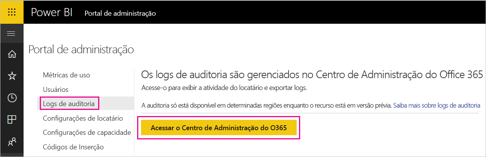

# <a name="track-user-activities-in-power-bi"></a>Acompanhar atividades do usuário no Power BI

Saber quem está executando uma ação em determinado item, em seu locatário do Power BI pode ser essencial para ajudar a organização a atender a seus requisitos, como gerenciamento de registros e conformidade regulamentar. Com o Power BI, você tem duas opções para acompanhar as atividades do usuário: O [log de atividades do Power BI](#use-the-activity-log) e o [log de auditoria unificado](#use-the-audit-log). Esses logs contêm uma cópia completa dos [dados de auditoria do Power BI](#operations-available-in-the-audit-and-activity-logs), mas há várias diferenças importantes, conforme resumido na tabela a seguir.

| **Log de auditoria unificado** | **Log de atividades Power BI** |
| --- | --- |
| Inclui eventos do SharePoint Online, do Exchange Online, do Dynamics 365 e de outros serviços além dos eventos de auditoria do Power BI. | Inclui apenas os eventos de auditoria do Power BI. |
| O acesso é permitido somente aos usuários com logs de auditoria somente exibição ou permissões de logs de auditoria, como administradores globais e auditores. | Administradores globais e administradores de serviço do Power BI têm acesso. |
| Os administradores globais e auditores podem pesquisar o log de auditoria unificado usando o Centro de Segurança do Microsoft 365 e o Centro de Conformidade do Microsoft 365. | Ainda não há nenhuma interface do usuário para pesquisar o log de atividades. |
| Administradores globais e auditores podem baixar entradas do log de auditoria usando cmdlets e APIs de Gerenciamento do Microsoft 365. | Administradores globais e administradores de serviço do Power BI podem baixar entradas do log de atividades usando uma API REST do Power BI e um cmdlet de gerenciamento. |
| Mantém os dados de auditoria por 90 dias | Mantém os dados de atividades por 30 dias (versão prévia pública). |
| Mantém os dados de auditoria, mesmo que o locatário seja movido para uma região diferente do Azure. | Não retém dados de atividade quando o locatário é movido para uma região diferente do Azure. |


## <a name="use-the-activity-log"></a>Usar o log de atividades

Como administrador de serviço do Power BI, você pode analisar o uso de todos os recursos de Power BI no nível do locatário, usando relatórios personalizados com base no log de atividades do Power BI. Você pode baixar as atividades usando uma API REST ou um cmdlet do PowerShell. Você também pode filtrar os dados de atividade por intervalo de datas, usuário e tipo de atividade.

### <a name="activity-log-requirements"></a>Requisitos do log de atividades

Você precisa atender a estes requisitos para acessar o log de atividades do Power BI:

- Você deve ser um administrador global ou um administrador de serviço do Power BI.
- Você instalou os [cmdlets de Gerenciamento do Power BI](https://www.powershellgallery.com/packages/MicrosoftPowerBIMgmt) localmente ou usa os cmdlets de Gerenciamento do Power BI no Azure Cloud Shell.

### <a name="activityevents-rest-api"></a>API REST ActivityEvents

Você pode usar um aplicativo administrativo com base nas APIs REST do Power BI para exportar eventos de atividade para um repositório de blob ou um banco de dados SQL. Em seguida, você pode criar um relatório de uso personalizado baseado nos dados exportados. Na chamada à API REST **ActivityEvents**, você deve especificar uma data de início e uma data de término e, opcionalmente, um filtro para selecionar atividades por tipo de atividade ou ID de usuário. Como o log de atividades pode conter uma grande quantidade de dados, a API **ActivityEvents** atualmente dá suporte a download, por solicitação, de dados equivalentes a até um dia. Em outras palavras, a data de início e a data de término devem especificar o mesmo dia, como no exemplo a seguir. Verifique se você especificou os valores de DateTime no formato UTC.

```
https://api.powerbi.com/v1.0/myorg/admin/activityevents?startDateTime='2019-08-31T00:00:00'&endDateTime='2019-08-31T23:59:59'
```

Se o número de entradas for grande, a API **ActivityEvents** retornará apenas cerca de 5.000 a 10.000 entradas e um token de continuação. Chame a API **ActivityEvents** novamente com o token de continuação para obter o próximo lote de entradas e assim por diante, até que você tenha recuperado todas as entradas e não receba mais um token de continuação. O exemplo a seguir mostra como usar o token de continuação.

```
https://api.powerbi.com/v1.0/myorg/admin/activityevents?continuationToken='%2BRID%3ARthsAIwfWGcVAAAAAAAAAA%3D%3D%23RT%3A4%23TRC%3A20%23FPC%3AARUAAAAAAAAAFwAAAAAAAAA%3D'
```

Independentemente do número de entradas retornadas, caso os resultados incluam um token de continuação, certifique-se de chamar a API novamente usando esse token para recuperar os dados restantes até que um token de continuação não retorne mais. É possível até mesmo que uma chamada retorne um token de continuação sem nenhuma entrada de evento. O exemplo a seguir mostra como executar um loop com um token de continuação retornado na resposta:

```
while(response.ContinuationToken != null)
{
   // Store the activity event results in a list for example
    completeListOfActivityEvents.AddRange(response.ActivityEventEntities);

    // Make another call to the API with continuation token
    response = GetPowerBIActivityEvents(response.ContinuationToken)
}
completeListOfActivityEvents.AddRange(response.ActivityEventEntities);
```
> [!NOTE]
> Pode levar até 24 horas para que todos os eventos sejam exibidos, embora os dados completos normalmente estejam disponíveis muito antes.
>
>
### <a name="get-powerbiactivityevent-cmdlet"></a>Cmdlet Get-PowerBIActivityEvent

Baixe eventos de atividade usando os cmdlets de Gerenciamento do Power BI para PowerShell. O cmdlet **Get-PowerBIActivityEvent** lida automaticamente com o token de continuação para você. O cmdlet **Get-PowerBIActivityEvent** usa um StartDateTime e um parâmetro EndDateTime com as mesmas restrições que a API REST **ActivityEvents**. Em outras palavras, a data de início e a data de término devem referenciar o mesmo valor de data, pois você só pode recuperar os dados da atividade referentes a um dia por vez.

O script a seguir demonstra como baixar todas as atividades do Power BI. O comando converte os resultados de JSON em objetos .NET para obter acesso direto a propriedades de atividade individuais. Esses exemplos mostram os menores e os maiores carimbos de data/hora possíveis para um dia com o objetivo de garantir que nenhum evento seja perdido.

```powershell
Login-PowerBI

$activities = Get-PowerBIActivityEvent -StartDateTime '2019-08-31T00:00:00' -EndDateTime '2019-08-31T23:59:59' | ConvertFrom-Json

$activities.Count
$activities[0]

```

### <a name="filter-activity-data"></a>Filtrar dados da atividade

Você pode filtrar eventos de atividade por tipo de atividade e ID de usuário. O script a seguir demonstra como baixar apenas os dados de evento para a atividade **ViewDashboard**. Para obter informações adicionais sobre os parâmetros com suporte, use o comando `Get-Help Get-PowerBIActivityEvent`.

```powershell
Login-PowerBI

$activities = Get-PowerBIActivityEvent -StartDateTime '2019-08-31T00:00:00' -EndDateTime '2019-08-31T23:59:59' -ActivityType 'ViewDashboard' | ConvertFrom-Json

$activities.Count
$activities[0]

```

## <a name="use-the-audit-log"></a>Usar o log de auditoria

Se a sua tarefa é controlar as atividades do usuário entre o Power BI e o Microsoft 365, você pode trabalhar com a auditoria no Centro de Segurança e Conformidade do Office 365 ou usar o PowerShell. A auditoria conta com a funcionalidade no Exchange Online, que é provisionado automaticamente para dar suporte ao Power BI.

Você pode filtrar os dados de auditoria por intervalo de datas, usuário, painel, tipo de relatório, conjunto de dados e tipo de atividade. Você pode também baixar as atividades em um arquivo CSV (valores separados por vírgula) para analisá-las offline.

### <a name="audit-log-requirements"></a>Requisitos do log de auditoria

Você precisa atender a estes requisitos para acessar os logs de auditoria:

- Para acessar o log de auditoria, é necessário ser um administrador global ou ser atribuído à função de Logs de Auditoria ou Logs de Auditoria Somente Exibição no Exchange Online. Por padrão, essas funções são atribuídas a grupos de funções de Gerenciamento de Conformidade e Gerenciamento de Organização, na página **Permissões**, no centro de administração do Exchange.

    Para fornecer contas que não sejam de administrador com acesso ao log de auditoria, adicione o usuário como membro de um desses grupos de função. Como alternativa, crie um grupo de função personalizado no Centro de administração do Exchange, atribua a função de Logs de Auditoria ou Logs de Auditoria Somente Exibição a esse grupo e adicione a conta não administrativa ao novo grupo de função. Para obter mais informações, veja [Gerenciar grupos de função no Exchange Online](/Exchange/permissions-exo/role-groups).

    Se você não conseguir acessar o Centro de administração do Exchange no Centro de administração do Microsoft 365, vá para https://outlook.office365.com/ecp e entre usando suas credenciais.

- Caso tenha acesso ao log de auditoria, mas não seja um administrador global ou administrador do Serviço do Power BI, você não poderá acessar o Portal de Administração do Power BI. Nesse caso, use um link direto para o [Centro de Segurança e Conformidade do Office 365](https://sip.protection.office.com/#/unifiedauditlog).

### <a name="access-your-audit-logs"></a>Acessar os logs de auditoria

Para acessar os logs, primeiro habilite o log no Power BI. Para saber mais, confira [Logs de auditoria](service-admin-portal.md#audit-logs) na documentação do portal do administrador. Pode haver um atraso de até 48 horas entre o horário de habilitação da auditoria e a possibilidade de exibir os dados de auditoria. Se os dados não forem exibidos imediatamente, verifique os logs de auditoria mais tarde. Pode haver um atraso semelhante entre a obtenção da permissão para exibir os logs de auditoria e a possibilidade de acessá-los.

Os logs de auditoria do Power BI estão disponíveis diretamente no [Centro de Conformidade e Segurança do Office 365](https://sip.protection.office.com/#/unifiedauditlog). Há também um link no portal de administração do Power BI:

1. No Power BI, selecione o **ícone de engrenagem**, no canto superior direito, e selecione **Portal de administração**.

   

1. Selecione **Logs de Auditoria**.

1. Selecione **Ir para o Centro de Administração do O365**.

   

### <a name="search-only-power-bi-activities"></a>Pesquisar somente as atividades do Power BI

Restrinja os resultados apenas para as atividades do Power BI fazendo o seguinte. Confira uma lista de atividades em [lista de atividades auditadas pelo Power BI](#operations-available-in-the-audit-and-activity-logs) mais adiante neste artigo.

1. Na página **Pesquisa de log de auditoria**, em **Pesquisar**, selecione o menu suspenso para **Atividades**.

2. Selecione **Atividades do Power BI**.

   

3. Selecione qualquer lugar fora da caixa de seleção para fechá-la.

As pesquisas retornarão apenas atividades do Power BI.

### <a name="search-the-audit-logs-by-date"></a>Pesquisar os logs de auditoria por data

Você pode pesquisar os logs por intervalo de datas usando os campos **Data de início** e **Data de término**. A seleção padrão nos últimos sete dias. A tela apresenta a data e a hora no formato UTC (Tempo Universal Coordenado). O intervalo de datas máximo que você pode especificar é de 90 dias. 

Você receberá um erro, se o intervalo de datas selecionado for maior que 90 dias. Se você estiver usando o intervalo de datas máximo de 90 dias, selecione a hora atual para a **Data de início**. Caso contrário, você receberá uma mensagem de erro informando que a data de início é anterior à data de término. Se você ativou a auditoria nos últimos 90 dias, o intervalo de datas não poderá começar antes da data na qual a auditoria foi ativada.


### <a name="search-the-audit-logs-by-users"></a>Pesquisar os logs de auditoria por usuários

Você pode procurar por entradas de log de auditoria das atividades realizadas por usuários específicos. Para fazer isso, insira um ou mais nomes de usuário no campo **Usuários**. O nome de usuário tem a aparência de um endereço de email. Trata-se da conta que o usuário utiliza para entrar no Power BI. Deixe esta caixa em branco para retornar as entradas para todos os usuários (e contas de serviço) em sua organização.


### <a name="view-search-results"></a>Exibir resultados da pesquisa

Após selecionar **Pesquisar**, o programa carregará os resultados da pesquisa. Depois de alguns instantes, eles serão exibidos em **Resultados**. Quando a pesquisa é concluída, a tela mostra o número de resultados encontrados. A **Pesquisa de log de auditoria** exibe no máximo mil eventos. Se os critérios da pesquisa gerarem mais de mil eventos, o aplicativo exibirá os mil eventos mais recentes.

#### <a name="view-the-main-results"></a>Exibir os resultados principais

A área **Resultados** inclui as seguintes informações sobre cada evento retornado pela pesquisa. Selecione um cabeçalho de coluna em **Resultados** para classificar os resultados.

| **Coluna** | **Definição** |
| --- | --- |
| Data |A data e a hora (no formato UTC) quando o evento ocorreu. |
| Endereço IP |O endereço IP do dispositivo usado para a atividade registrada. O aplicativo exibe o endereço IP no formato de endereço IPv4 ou IPv6. |
| Usuário |O usuário (ou a conta de serviço) que executou a ação que acionou o evento. |
| Atividade |A atividade executada pelo usuário. Esse valor corresponde às atividades que você selecionou na lista suspensa **Atividades**. Para um evento do log de auditoria de administrador do Exchange, o valor desta coluna é um cmdlet do Exchange. |
| Item |O objeto criado ou modificado devido à atividade correspondente. Por exemplo, o arquivo exibido ou modificado, ou a conta de usuário atualizada. Nem todas as atividades têm um valor nesta coluna. |
| Detalhe |Detalhes adicionais sobre uma atividade. Novamente, nem todas as atividades têm um valor. |

#### <a name="view-the-details-for-an-event"></a>Exibir os detalhes de um evento

Para exibir mais detalhes sobre um evento, selecione o registro do evento na lista de resultados da pesquisa. A página **Detalhes** é exibida contendo as propriedades detalhadas do registro do evento. As propriedades exibidas da página **Detalhes** dependem do serviço do Microsoft 365 em que o evento ocorre.

Para exibir esses detalhes, selecione **Mais informações**. Todas as entradas do Power BI têm um valor de 20 para a propriedade RecordType. Para saber mais sobre outras propriedades, confira [Propriedades detalhadas no log de auditoria](/office365/securitycompliance/detailed-properties-in-the-office-365-audit-log/).

   

### <a name="export-search-results"></a>Exportar resultados da pesquisa

Para exportar o log de auditoria do Power BI para um arquivo CSV, siga estas etapas.

1. Selecione **Exportar resultados**.

1. Selecione **Salvar resultados carregados** ou **Baixar todos os resultados**.

    

### <a name="use-powershell-to-search-audit-logs"></a>Usar o PowerShell para pesquisar logs de auditoria

Você também pode usar o PowerShell para acessar os logs de auditoria com base em seu logon. O exemplo a seguir mostra como conectar-se ao Exchange Online PowerShell e então usar o comando [Search-UnifiedAuditLog](/powershell/module/exchange/policy-and-compliance-audit/search-unifiedauditlog?view=exchange-ps/) para efetuar o pull de entradas de log de auditoria do Power BI. Para executar o script, o administrador deve atribuir a você as permissões apropriadas, conforme descrito na seção [Requisitos do log de auditoria](#audit-log-requirements).

```powershell
Set-ExecutionPolicy RemoteSigned

$UserCredential = Get-Credential

$Session = New-PSSession -ConfigurationName Microsoft.Exchange -ConnectionUri https://outlook.office365.com/powershell-liveid/ -Credential $UserCredential -Authentication Basic -AllowRedirection

Import-PSSession $Session
Search-UnifiedAuditLog -StartDate 9/11/2018 -EndDate 9/15/2018 -RecordType PowerBI -ResultSize 1000 | Format-Table | More
```

### <a name="use-powershell-to-export-audit-logs"></a>Usar o PowerShell para exportar logs de auditoria

Você também pode usar o PowerShell para exportar os resultados da pesquisa de logs de auditoria. O exemplo a seguir mostra como enviar usando o comando [Search-UnifiedAuditLog](/powershell/module/exchange/policy-and-compliance-audit/search-unifiedauditlog?view=exchange-ps/) e exportar os resultados usando o cmdlet [Export-Csv](/powershell/module/microsoft.powershell.utility/export-csv). Para executar o script, o administrador deve atribuir a você as permissões apropriadas, conforme descrito na seção [Requisitos do log de auditoria](#audit-log-requirements).

```powershell
$UserCredential = Get-Credential

$Session = New-PSSession -ConfigurationName Microsoft.Exchange -ConnectionUri https://outlook.office365.com/powershell-liveid/ -Credential $UserCredential -Authentication Basic -AllowRedirection

Import-PSSession $Session
Search-UnifiedAuditLog -StartDate 9/11/2019 -EndDate 9/15/2019 -RecordType PowerBI -ResultSize 5000 |
Export-Csv -Path "c:\temp\PowerBIAuditLog.csv" -NoTypeInformation

Remove-PSSession $Session
```

Para obter mais informações de como se conectar ao Exchange Online, confira [Conectar-se ao Exchange Online PowerShell](/powershell/exchange/exchange-online/connect-to-exchange-online-powershell/connect-to-exchange-online-powershell/). Para ver outro exemplo de como usar o PowerShell com os logs de auditoria, confira [Usar o log de auditoria do Power BI e o PowerShell para atribuir licenças do Power BI Pro](https://powerbi.microsoft.com/blog/using-power-bi-audit-log-and-powershell-to-assign-power-bi-pro-licenses/).

## <a name="operations-available-in-the-audit-and-activity-logs"></a>Operações disponíveis nos logs de auditoria e de atividades

As operações a seguir estão disponíveis nos logs de auditoria e de atividades.

| Nome amigável                                     | Nome da operação                              | Observações                                  |
|---------------------------------------------------|---------------------------------------------|------------------------------------------|
| Tabelas em destaque do Power BI acessadas no Excel | AnalyzedByExternalApplication |    |
| Fonte de dados adicionada ao gateway do Power BI             | AddDatasourceToGateway                      |                                          |
| Acesso à pasta do Power BI adicionado                      | AddFolderAccess                             | Atualmente não usado                       |
| Adicionados membros de grupo do Power BI                      | AddGroupMembers                             |                                          |
| Administrador anexou conta de armazenamento de fluxo de dados ao locatário | AdminAttachedDataflowStorageAccountToTenant | Atualmente não usado                       |
| Conjunto de dados do Power BI analisado                         | AnalyzedByExternalApplication               |                                          |
| Relatório do Power BI analisado                          | AnalyzeInExcel                              | Gerado quando os usuários interagem com o serviço. O download do arquivo `*.odc` não cria um evento de auditoria                                         |
| Conta de armazenamento de fluxo de dados anexada                 | AttachedDataflowStorageAccount              |                                          |
| Conjunto de dados do Power BI associado ao gateway                | BindToGateway                               |                                          |
| Atualização de fluxo de dados cancelada                        | CancelDataflowRefresh                       |                                          |
| Estado da capacidade alterado                            | ChangeCapacityState                         |                                          |
| Atribuição de usuário da capacidade alterado                  | UpdateCapacityUsersAssignment               |                                          |
| Conexões de conjunto de dados do Power BI alteradas              | SetAllConnections                           |                                          |
| Administradores de gateway do Power BI alterados                   | ChangeGatewayAdministrators                 |                                          |
| Usuários da fonte de dados de gateway do Power BI alterados        | ChangeGatewayDatasourceUsers                |                                          |
| Pacote de conteúdo organizacional do Power BI criado      | CreateOrgApp                                |                                          |
| Aplicativo do Power BI criado                              | CreateApp                                   |                                          |
| Dashboard do Power BI criado                        | CreateDashboard                             |                                          |
| Fluxo de dados do Power BI criado                         | CreateDataflow                              |                                          |
| Conjunto de dados do Power BI criado                          | CreateDataset                               |                                          |
| Assinatura de email do Power BI criada               | CreateEmailSubscription                     |                                          |
| Pasta do Power BI criada                           | CreateFolder                                |                                          |
| Gateway do Power BI criado                          | CreateGateway                               |                                          |
| Grupo do Power BI criado                            | CreateGroup                                 |                                          |
| Relatório do Power BI criado                           | CreateReport <sup>1</sup>                                |                                          |
| Fluxo de dados migrado para conta de armazenamento externa     | DataflowMigratedToExternalStorageAccount    | Atualmente não usado                       |
| Permissões de fluxo de dados adicionadas                        | DataflowPermissionsAdded                    | Atualmente não usado                       |
| Permissões de fluxo de dados removidas                      | DataflowPermissionsRemoved                  | Atualmente não usado                       |
| Pacote de conteúdo organizacional do Power BI excluído      | DeleteOrgApp                                |                                          |
| Comentário do Power BI excluído                          | DeleteComment                               |                                          |
| Dashboard do Power BI excluído                        | DeleteDashboard                             | Atualmente não usado                       |
| Fluxo de dados do Power BI excluído                         | DeleteDataflow                              | Atualmente não usado                       |
| Conjunto de dados do Power BI excluído                          | DeleteDataset                               |                                          |
| Assinatura de email do Power BI excluída               | DeleteEmailSubscription                     |                                          |
| Pasta do Power BI excluída                           | DeleteFolder                                |                                          |
| Acesso à pasta do Power BI excluído                    | DeleteFolderAccess                          | Atualmente não usado                       |
| Gateway do Power BI excluído                          | DeleteGateway                               |                                          |
| Grupo do Power BI excluído                            | DeleteGroup                                 |                                          |
| Relatório do Power BI excluído                           | DeleteReport                                |                                          |
| Fontes de dados de conjunto de dados do Power BI descobertas          | GetDatasources                              |                                          |
| Relatório do Power BI baixado                        | DownloadReport                              |                                          |
| Propriedades de fluxo de dados editadas                        | EditDataflowProperties                      |                                          |
| Permissão de certificação do Power BI editada          | EditCertificationPermission                 | Atualmente não usado                       |
| Dashboard do Power BI editado                         | EditDashboard                               | Atualmente não usado                       |
| Conjunto de dados do Power BI editado                           | EditDataset                                 |                                          |
| Propriedades do conjunto de dados do Power BI editadas                | EditDatasetProperties                       | Atualmente não usado                       |
| Relatório do Power BI editado                            | EditReport                                  |                                          |
| Fluxo de dados do Power BI exportado                        | ExportDataflow                              |                                          |
| Dados visuais de relatório do Power BI exportados              | ExportReport                                |                                          |
| Dados de bloco do Power BI exportados                       | ExportTile                                  |                                          |
| Falha ao adicionar permissões de fluxo de dados                | FailedToAddDataflowPermissions              | Atualmente não usado                       |
| Falha ao remover permissões de fluxo de dados             | FailedToRemoveDataflowPermissions           | Atualmente não usado                       |
| Token SAS de fluxo de dados do Power BI gerado             | GenerateDataflowSasToken                    |                                          |
| Token de inserção do Power BI gerado                    | GenerateEmbedToken                          |                                          |
| Arquivo importado para o Power BI                         | Importar                                      |                                          |
| Aplicativo do Power BI instalado                            | InstallApp                                  |                                          |
| Workspace migrado para uma capacidade                  | MigrateWorkspaceIntoCapacity                |                                          |
| Comentário do Power BI postado                           | PostComment                                 |                                          |
| Dashboard do Power BI impresso                        | PrintDashboard                              |                                          |
| Página de relatório do Power BI impressa                      | PrintReport                                 |                                          |
| Relatório do Power BI publicado na Web                  | PublishToWebReport <sup>2</sup>                         |                                          |
| Tabelas em destaque publicadas ou atualizadas | UpdateFeaturedTables <sup>3</sup>   | |
| Segredo de fluxo de dados do Power BI recebido do Key Vault  | ReceiveDataflowSecretFromKeyVault           |                                          |
| Fonte de dados removida do gateway do Power BI         | RemoveDatasourceFromGateway                 |                                          |
| Membros de grupo do Power BI removidos                    | DeleteGroupMembers                          |                                          |
| Workspace removido de uma capacidade                 | RemoveWorkspacesFromCapacity                |                                          |
| Dashboard do Power BI renomeado                        | RenameDashboard                             |                                          |
| Atualização de fluxo de dados do Power BI solicitada               | RequestDataflowRefresh                      | Atualmente não usado                       |
| Atualização de conjunto de dados do Power BI solicitada                | RefreshDataset                              |                                          |
| Workspaces do Power BI recuperados                     | GetWorkspaces                               |                                          |
| Definir o local de armazenamento do fluxo de dados como um workspace     | SetDataflowStorageLocationForWorkspace      |                                          |
| Definir atualização agendada no fluxo de dados do Power BI        | SetScheduledRefreshOnDataflow               |                                          |
| Definir atualização agendada no conjunto de dados do Power BI         | SetScheduledRefresh                         |                                          |
| Dashboard do Power BI compartilhado                         | ShareDashboard                              |                                          |
| Relatório do Power BI compartilhado                            | ShareReport                                 |                                          |
| Avaliação estendida do Power BI iniciada                   | OptInForExtendedProTrial                    | Atualmente não usado                       |
| Avaliação do Power BI iniciada                            | OptInForProTrial                            |                                          |
| Assumiu uma fonte de dados do Power BI                   | TakeOverDatasource                          |                                          |
| Assumiu um conjunto de dados do Power BI                        | TakeOverDataset                             |                                          |
| Assumiu um fluxo de dados do Power BI                     | TookOverDataflow                             |                                          |
| Aplicativo do Power BI não publicado                          | UnpublishApp                                |                                          |
| Atualizar configurações de governança de recursos de capacidade      | UpdateCapacityResourceGovernanceSettings    | Atualmente não está no Centro de administração do Microsoft 365 |
| Administrador de capacidade atualizado                            | UpdateCapacityAdmins                        |                                          |
| Nome de exibição de capacidade atualizado                     | UpdateCapacityDisplayName                   |                                          |
| Permissões de atribuição de armazenamento de fluxo de dados atualizadas   | UpdatedDataflowStorageAssignmentPermissions |                                          |
| Configurações do Power BI da organização atualizadas          | UpdatedAdminFeatureSwitch                   |                                          |
| Aplicativo do Power BI atualizado                              | UpdateApp                                   |                                          |
| Fluxo de dados do Power BI atualizado                         | UpdateDataflow                              |                                          |
| Fontes de dados de conjunto de dados do Power BI atualizadas             | UpdateDatasources                           |                                          |
| Parâmetros de conjunto de dados do Power BI atualizados               | UpdateDatasetParameters                     |                                          |
| Assinatura de email do Power BI atualizada               | UpdateEmailSubscription                     |                                          |
| Pasta do Power BI atualizada                           | UpdateFolder                                |                                          |
| Acesso à pasta do Power BI atualizado                    | UpdateFolderAccess                          |                                          |
| Credenciais da fonte de dados de gateway do Power BI atualizadas  | UpdateDatasourceCredentials                 |                                          |
| Dashboard do Power BI exibido                         | ViewDashboard                               |                                          |
| Fluxo de dados do Power BI exibido                          | ViewDataflow                                |                                          |
| Relatório do Power BI exibido                            | ViewReport                                  |                                          |
| Bloco do Power BI exibido                              | ViewTile                                    |                                          |
| Métricas de uso do Power BI exibidas                     | ViewUsageMetrics                            |                                          |
|                                                   |                                             |                                          |

<sup>1</sup> Publicar do Power BI Desktop para o serviço é um evento CreateReport no serviço.

<sup>2</sup> PublishtoWebReport se refere ao recurso [Publicar na Web](../collaborate-share/service-publish-to-web.md).

<sup>3</sup> UpdateFeaturedTables refere-se a [tabelas em destaque do Power BI no Excel](../collaborate-share/service-excel-featured-tables.md).

## <a name="next-steps"></a>Próximas etapas

[O que é administração do Power BI?](service-admin-administering-power-bi-in-your-organization.md)  

[Portal de administração do Power BI](service-admin-portal.md)  

Mais perguntas? [Experimente perguntar à Comunidade do Power BI](https://community.powerbi.com/)
