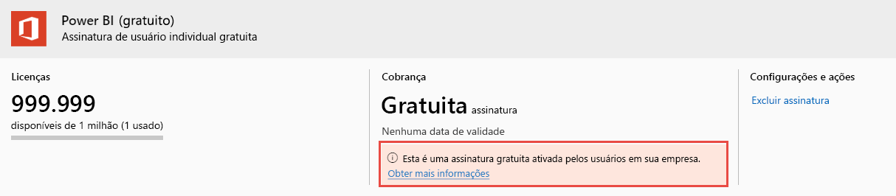

# Exibir e gerenciar licenças do usuário do Power BI

Este artigo explica como os administradores podem usar o centro de administração do Microsoft 365 ou o portal do Azure para exibir e gerenciar licenças de usuário para o serviço do Power BI.

> [!NOTE]
>
>É possível que uma licença do Power BI (Gratuito) e uma licença do Power BI Pro estejam ambas atribuídas a um mesmo usuário. Isso pode acontecer quando um usuário se inscreve em uma licença gratuita e, posteriormente, uma licença do Power BI Pro é atribuída a ele. Nesse caso, o nível de licenciamento mais alto entra em vigor.
>

## Exibir suas assinaturas

Para ver quais assinaturas do Power BI sua organização tem, siga estas etapas.

1. Entre no [centro de administração do Microsoft 365](https://admin.microsoft.com).
2. No menu de navegação, selecione **Cobrança** > **Produtos e serviços**.

Suas assinaturas ativas do Power BI são listadas junto com as outras assinaturas que você tem. Você pode ver uma assinatura inesperada para Power BI (gratuito), conforme mostrado aqui.

  

Esse tipo de assinatura é criado para você quando os usuários aproveitam a inscrição por autoatendimento. Para ler mais a respeito, confira [Power BI em sua organização](https://docs.microsoft.com/microsoft-365/admin/misc/power-bi-in-your-organization?view=o365-worldwide).

## Gerenciar licenças do usuário no Microsoft 365

Para usar o centro de administração do Microsoft 365 para gerenciar licenças de usuário, consulte a [Documentação de assinaturas e de cobrança para empresas](https://docs.microsoft.com/microsoft-365/commerce/?view=o365-worldwide).

## Gerenciar licenças do usuário no portal do Azure

Siga estas etapas para exibir e atribuir licenças do Power BI usando o portal do Azure.

1. Entre no [portal do Azure](https://portal.azure.com).

2. Pesquise **Azure Active Directory** e selecione-o.

3. Em **Gerenciar**, no menu de recursos do Azure Active Directory, selecione **Licenças**.

4. Selecione **Todos os produtos** no menu de recursos, depois selecione um tipo de licença do Power BI para exibir a lista de usuários licenciados.

5. Para atribuir uma licença, na barra de comandos, selecione **+ Atribuir**. Na página **Atribuir licença**, escolha um usuário e depois selecione **Opções de atribuição** para ativar uma licença do Power BI para a conta de usuário selecionada.

6. Para remover uma licença, marque a caixa de seleção ao lado do nome do usuário e, em seguida, selecione **Remover licença**.

## Próximas etapas

- [Comprar o Power BI Pro](service-admin-purchasing-power-bi-pro.md)
- [Licenciamento para sua organização](service-admin-licensing-organization.md)
