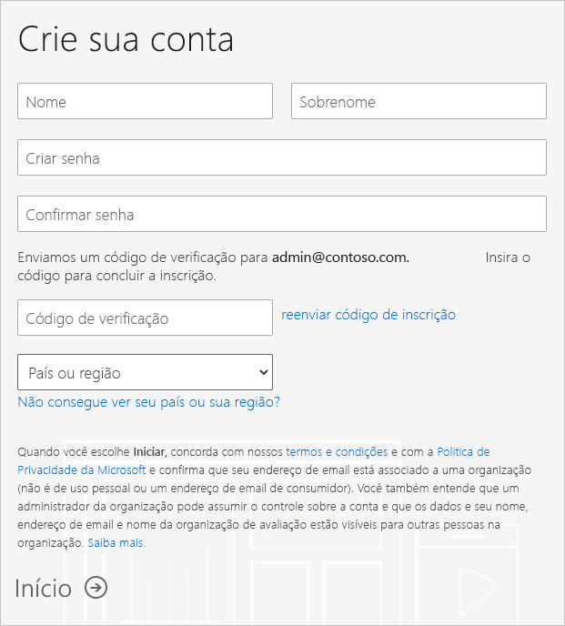
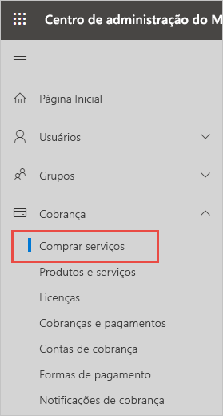
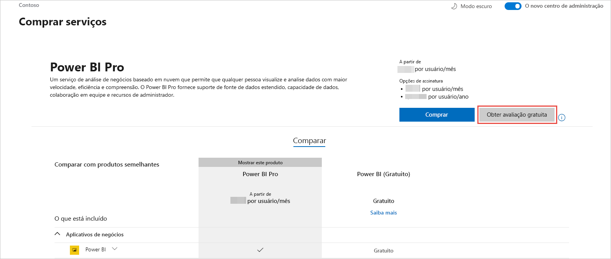

# Obter uma assinatura do Power BI para sua organização

Como um administrador, você pode se inscrever para o Power BI pelo [site do Power BI](https://powerbi.microsoft.com). Você também pode se inscrever na página de serviços de compra no centro de administração do Microsoft 365. Quando um administrador se inscreve para o Power BI, ele pode atribuir licenças para usuários que devem ter acesso.

Além disso, usuários individuais em sua organização poderão se inscrever no Power BI por meio do site do Power BI. Quando um usuário de sua organização se inscreve para o Power BI, ele recebe automaticamente uma licença do Power BI. Se você quiser desativar essa funcionalidade, siga as etapas em [Habilitar ou desabilitar a inscrição e compra por autoatendimento](service-admin-disable-self-service.md).

## Inscreva-se por meio do Power BI

Você precisará de uma conta corporativa ou de estudante para se inscrever para uma assinatura do Power BI. Não damos suporte a endereços de email fornecidos por provedores de telecomunicações e serviços de email para consumidores.

Siga estas etapas para se inscrever:

1. Acesse o [site do Power BI](https://powerbi.microsoft.com). Selecione **Experimentar gratuitamente**.
2. Insira seu email de trabalho e selecione **Inscrever-se**.

   

3. Verifique a sua identidade. Enviaremos, por chamada ou mensagem de texto, um código de verificação a ser usado.
4. Selecione **Sim** para confirmar que você está usando um endereço de email que obteve da sua empresa.
5. Crie sua conta. Enviaremos um código de verificação para seu endereço de email a fim de concluir a inscrição.

   

## Inscrever-se por meio do Microsoft 365

Se você for um administrador global ou administrador de cobrança do Microsoft 365, poderá obter uma assinatura do Power BI para sua organização. Para obter mais informações, confira [Quem pode comprar e atribuir licenças do Power BI Pro?](../service-admin-licensing-organization.md#who-can-purchase-and-assign-licenses).

> [!NOTE]
>
> Uma assinatura do Microsoft 365 E5 já inclui licenças do Power BI Pro. Para saber como gerenciar licenças, confira [Exibir e gerenciar licenças do usuário](service-admin-manage-licenses.md).
>
>

Siga estas etapas para comprar licenças do Power BI Pro no centro de administração do Microsoft 365:

1. Entre no [centro de administração do Microsoft 365](https://admin.microsoft.com).

2. No menu de navegação, selecione **Cobrança** > **Serviços de compra**.
  
   

3. Pesquise ou role a tela para encontrar a assinatura que deseja comprar. Você verá **Power BI** em **Outras categorias que podem lhe interessar** próximo à parte inferior da página. Selecione o link para exibir as assinaturas do Power BI disponíveis para sua organização.

4. Selecione uma oferta, como o Power BI Pro.

5. Na página **Serviços de compra**, selecione **Comprar**. Se você ainda não tiver usado uma assinatura de avaliação gratuita do Power BI Pro, poderá iniciar uma. Ele inclui 25 licenças e expira em um mês.

   

6. Escolha **Pagar mensalmente** ou **Pagar por um ano inteiro**, de acordo com sua preferência de pagamento.

7. Em **Quantos usuários você deseja?** , insira a quantidade de licenças a comprar e selecione **Pagar agora** para concluir a transação.

8. Verifique sua compra acessando **Cobrança** > **Produtos e serviços** e procure **Power BI Pro**.

Para saber mais sobre como sua organização adquire o serviço do Power BI, confira [Power BI em sua organização](https://docs.microsoft.com/microsoft-365/admin/misc/power-bi-in-your-organization?view=o365-worldwide).

## Próximas etapas

- [Exibir e gerenciar licenças do usuário](service-admin-manage-licenses.md)
- [Habilitar ou desabilitar a inscrição e a compra por autoatendimento](service-admin-disable-self-service.md)
- [Documentação de assinaturas e de cobrança empresariais](https://docs.microsoft.com/microsoft-365/commerce/?view=o365-worldwide)
