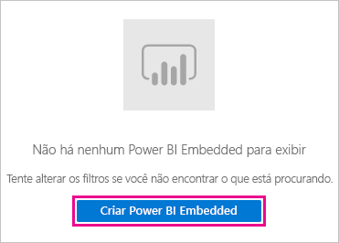
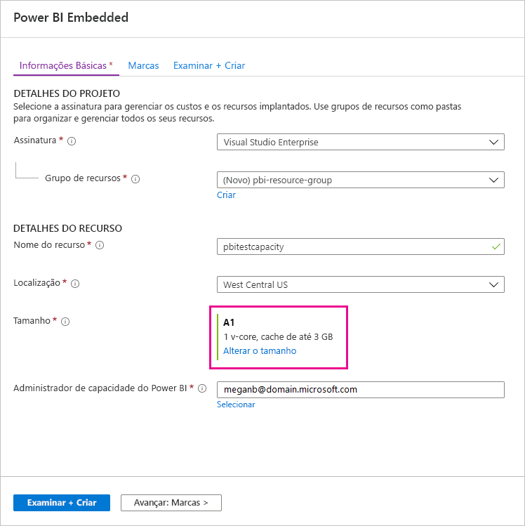
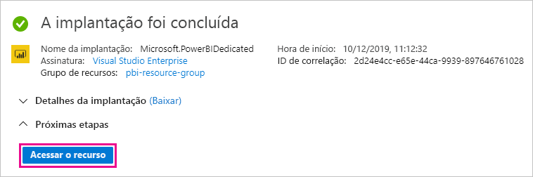
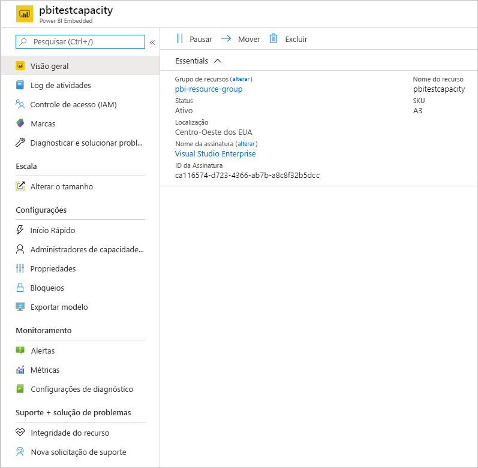

# Como comprar o Power BI Premium

Este artigo descreve como comprar capacidade do Power BI Premium para sua organização. O artigo aborda dois cenários:

- Uso de SKUs P para cenários de produção típicos. Os SKUs P exigem um compromisso mensal ou anual e são cobrados mensalmente.

- Uso de SKUs A para cenários de teste e para casos em que você não tenha as permissões necessárias para comprar SKUs P (função Administrador de cobrança ou Administrador global do Microsoft 365). Os SKUs A não exigem um compromisso de tempo e são cobrados por hora. Compre SKUs A no [portal do Azure](https://portal.azure.com).

Para obter mais informações sobre o Power BI Premium, confira [O que é o Power BI Premium?](service-premium-what-is.md). Para obter informações atualizadas sobre preço e planejamento, confira a [Página de preços do Power BI](https://powerbi.microsoft.com/pricing/) e a [Calculadora Power BI Premium](https://powerbi.microsoft.com/calculator/). Os criadores de conteúdo ainda precisam ter uma [licença do Power BI Pro](service-admin-purchasing-power-bi-pro.md), mesmo que a sua organização use o Power BI Premium. Compre pelo menos uma licença do Power BI Pro para sua organização. Com SKUs A, _todos os usuários_ que consomem o conteúdo também precisam ter licenças Pro.

> [!NOTE]
> Se uma assinatura Premium expirar, você terá 30 dias de acesso completo à sua capacidade. Depois disso, seu conteúdo é revertido para uma capacidade compartilhada. Não há suporte para modelos maiores que 1 GB na capacidade compartilhada.

## Comprar SKUs P para cenários de produção típicos

Crie um locatário com um SKU do Power BI Premium P1 configurado ou compre uma capacidade do Power BI Premium para uma organização existente. Em ambos os casos, você poderá adicionar capacidade, se necessário.

### Criar um novo locatário com o Power BI Premium P1

Caso você não tenha um locatário e deseje criar um, poderá comprar o Power BI Premium ao mesmo tempo. O link a seguir orienta você pelo processo de criação de um novo locatário e permite que você compre o Power BI Premium: [oferta do Power BI Premium P1](https://signup.microsoft.com/Signup?OfferId=b3ec5615-cc11-48de-967d-8d79f7cb0af1). Quando você cria seu locatário, recebe automaticamente a função de Administrador Global do Microsoft 365 para esse locatário.

Depois de comprar a capacidade, saiba como [gerenciar capacidades](service-admin-premium-manage.md#manage-capacity) e [atribuir workspaces](service-admin-premium-manage.md#assign-a-workspace-to-a-capacity) a uma capacidade.

### Comprar uma capacidade do Power BI Premium para uma organização existente

Se tiver uma organização (locatário) existente, você deverá estar na função de Administrador Global do Microsoft 365 ou na função de Administrador de Cobrança para comprar licenças e assinaturas. Para obter mais informações, consulte [Sobre funções de administrador do Microsoft 365](https://support.office.com/article/About-Office-365-admin-roles-da585eea-f576-4f55-a1e0-87090b6aaa9d).

Para comprar capacidade Premium, siga estas etapas.

1. No serviço do Power BI, escolha o seletor de aplicativo do Microsoft 365 e, em seguida **Admin**.

    

    Como alternativa, é possível navegar até o Centro de administração do Microsoft 365.

1. Selecione **Cobrança** > **Serviços de compra**.

1. Em **Outros planos**, procure ofertas do Power BI Premium. Isso listará como P1 até o P3, EM3 e P1 (mês a mês).

1. Passe o mouse sobre as reticências ( **…** ) e, em seguida, selecione **Comprar agora**.

    

1. Siga as etapas para concluir a compra.

Depois de concluir a compra, a página **Serviços de compra** mostrará que o item foi comprado e está ativo.

Depois de comprar a capacidade, saiba como [gerenciar capacidades](service-admin-premium-manage.md#manage-capacity) e [atribuir workspaces](service-admin-premium-manage.md#assign-a-workspace-to-a-capacity) a uma capacidade.

### Capacidades adicionais de compra

Agora que você tem uma capacidade, pode adicionar mais conforme suas necessidades. Você pode usar qualquer combinação de SKUs de capacidade Premium (P1 até P3) dentro de sua organização. As diferentes SKUs fornecem funcionalidades de recurso diferentes.

1. No Centro de administração do Microsoft 365, selecione **Cobrança** > **Comprar Serviços**.

1. Localize o item do Power BI Premium do qual você deseja adquirir mais em **Outros planos**.

1. Passe o mouse sobre **Mais opções** (...) e, em seguida, selecione **Alterar quantidade de licenças**.

    

1. Altere o número de instâncias que você deseja ter para esse item. Em seguida, selecione **Enviar** quando terminar.

   > [!IMPORTANT]
   > Selecionar **Enviar** cobra do cartão de crédito no arquivo.

Em seguida, a página **Serviços de compra** indicará o número de instâncias que você tem. No portal de administração do Power BI, nas **Configurações de capacidade**, os núcleos virtuais disponíveis correspondem à nova capacidade comprada.

### Cancelar sua assinatura

Cancele sua assinatura no Centro de administração do Microsoft 365. Para cancelar sua assinatura Premium, faça o seguinte.

1. Navegue até o Centro de administração do Microsoft 365.

1. Selecione **Cobrança** > **Assinaturas**.

1. Selecione sua assinatura do Power BI Premium na lista.

1. Selecione **Mais ações** > **Cancelar assinatura**.

1. A página **Cancelar assinatura** indicará se você é responsável ou não por uma [taxa de término antecipado](https://support.office.com/article/early-termination-fees-6487d4de-401a-466f-8bc3-c0beb5cc40d3). Essa página também permitirá saber quando os dados serão excluídos da assinatura.

1. Leia as informações e, caso deseje continuar, selecione **Cancelar assinatura**.

#### No cancelamento ou expiração da assinatura

Ao cancelar sua assinatura Premium ou se sua licença de capacidade expirar, você poderá continuar acessando as capacidades Premium por um período de 30 dias a partir da data do cancelamento ou da expiração da licença. Após 30 dias, você já não poderá acessar suas capacidades ou workspaces Premium nelas.

## Comprar SKUs A para teste e outros cenários

Os SKUs são disponibilizados por meio do serviço do Azure Power BI Embedded. Você pode usar SKUs A das seguintes maneiras:

- Habilitar a inserção do Power BI em aplicativos de terceiros. Para obter mais informações, confira [Power BI Embedded](../developer/embedded/azure-pbie-what-is-power-bi-embedded.md).

- Testar a funcionalidade Premium antes de comprar um SKU P.

- Criar ambientes de desenvolvimento e teste junto com um ambiente de produção que usa SKUs P.

- Compre o Power BI Premium mesmo que você não tenha uma função Administrador de cobrança ou Administrador global do Microsoft 365.

> [!NOTE]
> Se você comprar um SKU A4 ou superior, poderá aproveitar todos os recursos Premium, exceto o compartilhamento ilimitado de conteúdo. Com SKUs A, _todos os usuários_ que consomem o conteúdo precisam ter licenças Pro.

Siga estas etapas para comprar SKUs A no portal do Azure:

1. Entre no [portal do Azure](https://portal.azure.com) com uma conta que tenha, pelo menos, permissões de administrador de capacidade no Power BI.

1. Pesquise _Power BI Embedded_ e selecione o serviço nos resultados da pesquisa.

    

1. Selecione **Criar Power BI Embedded**.

    

1. Na tela de criação do **Power BI Embedded**, especifique as seguintes informações:

    - A **Assinatura** na qual o serviço do Power BI Embedded será criado.

    - A **Localização** física na qual o grupo de recursos que contém o serviço será criado. Para obter um melhor desempenho, essa localização deve estar próxima da localização do seu locatário do Azure Active Directory para Power BI.

    - O **Grupo de recursos** existente a ser usado ou crie outro, conforme mostrado no exemplo.

    - O **administrador de capacidade do Power BI**. O administrador de capacidade precisa ser um usuário membro ou uma entidade de serviço em seu locatário do Azure AD.

    

1. Caso você deseje usar todos os recursos do Power BI Premium (exceto o compartilhamento ilimitado), precisará de, pelo menos, um SKU A4. Selecione **Alterar tamanho**.

    

1. Selecione um tamanho de capacidade A4, A5 ou A6, que corresponde a P1, P2 e P3.

    

1. Selecione **Examinar + Criar**, examine as opções escolhidas e, em seguida, selecione **Criar**.

    

1. A implantação pode levar alguns minutos para ser concluída. Quando ela estiver pronta, selecione **Ir para o recurso**.

    

1. Na tela de gerenciamento, examine as opções disponíveis para gerenciar o serviço, incluindo pausar o serviço quando você não o estiver usando.

    

Depois de comprar a capacidade, saiba como [gerenciar capacidades](service-admin-premium-manage.md#manage-capacity) e [atribuir workspaces](service-admin-premium-manage.md#assign-a-workspace-to-a-capacity) a uma capacidade.

## Próximas etapas

[Configurar e gerenciar capacidades no Power BI Premium](service-admin-premium-manage.md)\
[Página de preços do Power BI](https://powerbi.microsoft.com/pricing/)\
[Calculadora Power BI Premium](https://powerbi.microsoft.com/calculator/)\
[Perguntas frequentes sobre o Power BI Premium](service-premium-faq.md)\
[Planejando um white paper de implantação do Power BI Enterprise](https://aka.ms/pbienterprisedeploy)

Mais perguntas? [Experimente perguntar à Comunidade do Power BI](https://community.powerbi.com/)
