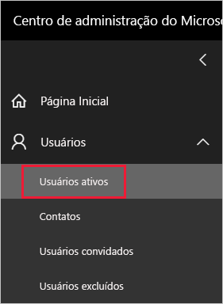
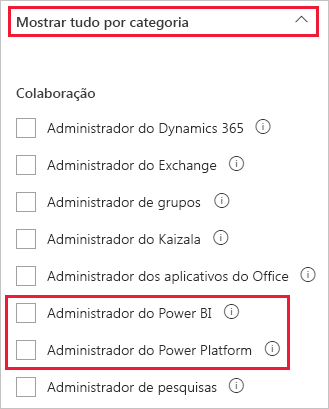

# <a name="understanding-power-bi-service-administrator-roles"></a>Noções básicas sobre as funções de Administrador de serviços do Power BI

Para administrar um locatário do Power BI, você deve ter uma das seguintes funções: Administrador do Power BI, administrador do Power Platform ou administrador global do Microsoft 365. Os administradores de gerenciamento de usuário do Microsoft 365 atribuem usuários às funções de administrador do Power BI ou administrador do Power Platform no Centro de administração do Microsoft 365, ou usando um script do PowerShell. Para saber mais, confira [Atribuir funções a contas de usuário com o PowerShell do Office 365](/office365/enterprise/powershell/assign-roles-to-user-accounts-with-office-365-powershell).

Os usuários nas funções de administrador do Power BI e administrador do Power Platform têm controle total sobre um locatário do Power BI e seus recursos administrativos, com exceção de licenciamento. Quando um usuário for atribuído, ele poderá acessar o [Portal de administração do Power BI](service-admin-portal.md). Lá, ele terá acesso às métricas de uso de todo o locatário e poderá controlar todo o uso que o locatário faz dos recursos do Power BI. Essas funções de administrador são ideais para usuários que precisam de acesso ao portal do administrador do Power BI, sem conceder a esses usuários acesso administrativo do Microsoft 365.

> [!NOTE]
> Na documentação do Power BI, "administrador do Power BI" refere-se aos usuários nas funções de administrador do Power BI ou administrador do Power Platform. A documentação deixa claro quando a função de administrador global do Microsoft 365 é necessária para uma tarefa.

## <a name="limitations-and-considerations"></a>Limitações e considerações

As funções de administrador de serviços do Power BI e administrador do Power Platform não fornecem as seguintes capacidades:

* Capacidade de modificar usuários e licenças no Centro de administração do Microsoft 365.

* Acesso aos logs de auditoria. Para obter mais informações, confira [Acompanhar as atividades do usuário no Power BI](service-admin-auditing.md).

Essas capacidades exigem a função de administrador global do Microsoft 365.

## <a name="assign-users-to-an-admin-role-in-the-microsoft-365-admin-center"></a>Atribuir usuários a uma função de administrador no Centro de Administração Microsoft 365

Para atribuir usuários a uma função de administrador no Centro de administração do Microsoft 365, siga estas etapas.

1. No [Centro de administração do Microsoft 365](https://portal.office.com/adminportal/home#/homepage), selecione **Usuários** > **Usuários Ativos**.

    

1. Selecione o usuário ao qual deseja atribuir a função.

1. Em **Funções**, selecione **Gerenciar Funções**.

    

1. Expanda **Mostrar tudo por categoria** e, em seguida, selecione **Administrador do Power BI** ou **Administrador do Power Platform**.

    

1. Selecione **Salvar alterações**.

## <a name="assign-users-to-the-admin-role-with-powershell"></a>Atribuir usuários à função de administrador com o PowerShell

Você também pode atribuir usuários a funções usando o PowerShell. Os usuários são gerenciados no Azure Active Directory (Microsoft Azure AD). Se você ainda não tiver o módulo PowerShell do Azure AD, [baixe e instale a versão mais recente](https://www.powershellgallery.com/packages/AzureAD/).

1. Primeiro, conecte-se ao Microsoft Azure AD:
   ```
   PS C:\Windows\system32> Connect-AzureAD
   ```

1. Em seguida, obtenha a **ObjectId** da função **Administrador de serviços do Power BI**. Você pode executar [Get-AzureADDirectoryRole](/powershell/module/azuread/get-azureaddirectoryrole) para obter a **ObjectId**

    ```
    PS C:\Windows\system32> Get-AzureADDirectoryRole

    ObjectId                             DisplayName                        Description
    --------                             -----------                        -----------
    00f79122-c45d-436d-8d4a-2c0c6ca246bf Power BI Service Administrator     Full access in the Power BI Service.
    250d1222-4bc0-4b4b-8466-5d5765d14af9 Helpdesk Administrator             Helpdesk Administrator has access to perform..
    3ddec257-efdc-423d-9d24-b7cf29e0c86b Directory Synchronization Accounts Directory Synchronization Accounts
    50daa576-896c-4bf3-a84e-1d9d1875c7a7 Company Administrator              Company Administrator role has full access t..
    6a452384-6eb9-4793-8782-f4e7313b4dfd Device Administrators              Device Administrators
    9900b7db-35d9-4e56-a8e3-c5026cac3a11 AdHoc License Administrator        Allows access manage AdHoc license.
    a3631cce-16ce-47a3-bbe1-79b9774a0570 Directory Readers                  Allows access to various read only tasks in ..
    f727e2f3-0829-41a7-8c5c-5af83c37f57b Email Verified User Creator        Allows creation of new email verified users.
    ```

    Nesse caso, a **ObjectId** da função é 00f79122-c45d-436d-8d4a-2c0c6ca246bf.

1. Em seguida, obtenha o **ObjectId** do usuário. Ele pode ser descoberto executando [Get-AzureADUser](/powershell/module/azuread/get-azureaduser).

    ```
    PS C:\Windows\system32> Get-AzureADUser -ObjectId 'tim@contoso.com'

    ObjectId                             DisplayName UserPrincipalName      UserType
    --------                             ----------- -----------------      --------
    6a2bfca2-98ba-413a-be61-6e4bbb8b8a4c Tim         tim@contoso.com        Member
    ```

1. Para adicionar o membro à função, execute [Add-AzureADDirectoryRoleMember](/powershell/module/azuread/add-azureaddirectoryrolemember).

    | Parâmetro | Descrição |
    | --- | --- |
    | ObjectId |A ObjectId da função. |
    | RefObjectId |A ObjectId dos membros. |

    ```powershell
    Add-AzureADDirectoryRoleMember -ObjectId 00f79122-c45d-436d-8d4a-2c0c6ca246bf -RefObjectId 6a2bfca2-98ba-413a-be61-6e4bbb8b8a4c
    ```

## <a name="next-steps"></a>Próximas etapas

[Administração do Power BI em sua organização](service-admin-administering-power-bi-in-your-organization.md)  
[Portal de administração do Power BI](service-admin-portal.md)  

Mais perguntas? [Experimente perguntar à Comunidade do Power BI](https://community.powerbi.com/)