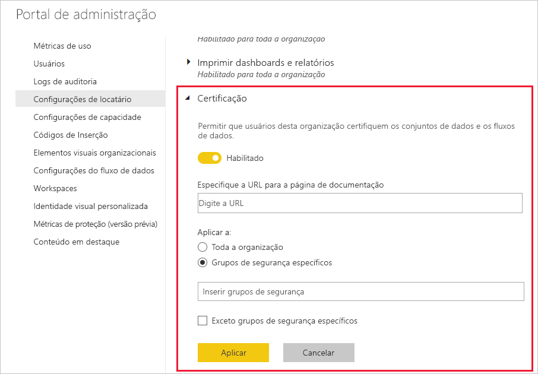

# Configurar a certificação de fluxos de dados e conjuntos de dados (versão prévia)

Sua organização pode certificar conjuntos de dados e fluxos de dados que são a fonte autorizada de informações críticas.

Como administrador de locatários do Power BI, você é responsável por configurar o processo de certificação da sua organização. Isso significa que:
* Habilitar a certificação no seu locatário.
* Definir uma lista de grupos e usuários que estão autorizados a certificar conjuntos de dados e fluxos de dados.
* Para conjuntos de dados, fornecer a URL da política de certificação de conjuntos de dados da organização, se houver.

A certificação de fluxos de dados e conjuntos de dados faz parte do *endosso* de fluxos de dados e conjuntos de dados. Confira [Endosso de conjuntos de dados](../service-datasets-promote.md) e [Endosso de fluxos de dados](../transform-model/service-dataflows-promote-certify.md) para obter mais informações.

## Configurar a certificação

1. No portal de administração, acesse Configurações do locatário.
1. Na seção Configurações de exportação e compartilhamento, expanda a seção Certificação.

   

1. Defina a alternância como **Habilitado**.
1. Para a certificação de conjuntos de dados, se a sua organização tiver uma política de certificação publicada, forneça a URL dela aqui. Isso se tornará o link **Saiba mais** na seção de certificação da [caixa de diálogo das configurações do endosso de fluxos de dados](../service-datasets-promote.md#request-dataset-certification) 
1. Especifique os usuários ou os grupos que estão autorizados a certificar fluxos de dados e conjuntos de dados. Esses certificadores autorizados poderão usar o botão Certificação na seção de certificação da caixa de diálogo das configurações do endosso de [conjuntos de dados](../service-datasets-promote.md#request-dataset-certification) ou [fluxos de dados](../transform-model/service-dataflows-promote-certify.md#certify-a-dataflow).
1. Clique em **Aplicar**.

## Próximas etapas
* [Promover conjuntos de dados](../service-datasets-promote.md)
* [Certificar conjuntos de dados](../service-datasets-certify.md)
* [Promover fluxos de dados](../transform-model/service-dataflows-promote-certify.md#promote-a-dataflow)
* [Certificar fluxos de dados](../transform-model/service-dataflows-promote-certify.md#certify-a-dataflow)
* Dúvidas? [Experimente perguntar à Comunidade do Power BI](https://community.powerbi.com/)
