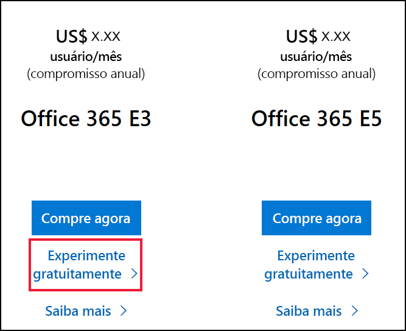
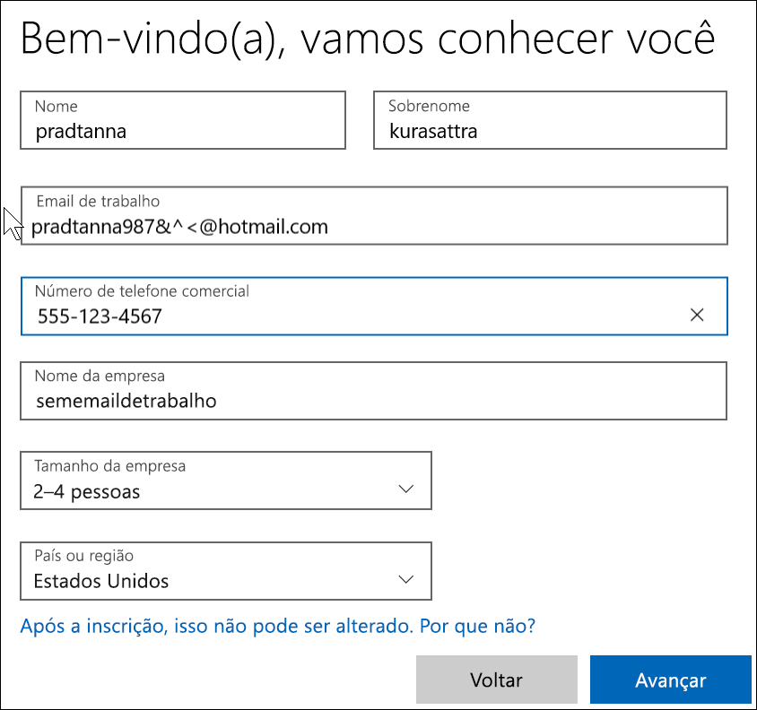

# Como se inscrever no Power BI com uma nova avaliação do Microsoft 365

Este artigo descreve uma forma alternativa de se inscrever no Power BI, caso você ainda não tenha uma conta de email corporativo ou de estudante. 

Se você tiver problemas durante a inscrição no Power BI com o seu endereço de email, verifique se ele é um [endereço de email que pode ser usado com o Power BI](../fundamentals/service-self-service-signup-for-power-bi.md#supported-email-addresses). Se isso não for bem-sucedido, inscreva-se para obter uma avaliação do Microsoft 365 e crie uma conta corporativa. Em seguida, use essa nova conta de trabalho para se inscrever no serviço do Power BI. Você poderá usar o Power BI mesmo após o vencimento da avaliação do Microsoft 365.

> [!NOTE]
> Recentemente, o Office 365 passou a se chamar Microsoft 365. Até que todos os nossos artigos sejam atualizados, você ainda poderá vê-lo sendo chamado de Office 365.

1. Inscreva-se para obter uma avaliação do Microsoft 365 no [site do Microsoft 365](https://www.microsoft.com/en-us/microsoft-365/business/compare-more-office-365-for-business-plans).

    

    

    

    

    

    

1. Crie um nome de entrada corporativa que seja parecido com you@yourcompany.onmicrosoft.com. Essa é a entrada que você usará com o Power BI.

    

        

1. Talvez seja necessário aguardar enquanto o locatário é criado. 

Pronto!  Agora você tem um endereço de email que poderá usar para se inscrever no Power BI. Acesse [Inscrever-se no serviço do Power BI como indivíduo](../fundamentals/service-self-service-signup-for-power-bi.md)

## Considerações importantes
Se você tiver problemas para entrar na nova conta, tente usar uma sessão privada do navegador.    

Usando esse método de inscrição, você está criando um novo locatário organizacional e se tornará o administrador do locatário. Para saber mais, confira [O que é a administração do Power BI?](service-admin-administering-power-bi-in-your-organization.md). Adicione novos usuários ao seu locatário e compartilhe o conteúdo com eles, conforme descrito na [documentação do administrador do Microsoft 365](https://support.office.com/en-sg/article/Add-users-individually-to-Office-365---Admin-Help-1970f7d6-03b5-442f-b385-5880b9c256ec).

## Próximas etapas

[O que é administração do Power BI?](service-admin-administering-power-bi-in-your-organization.md)  
[Licenciamento do Power BI na sua organização](service-admin-licensing-organization.md)  
[Inscrever-se no Power BI como indivíduo](../fundamentals/service-self-service-signup-for-power-bi.md)

Mais perguntas? [Experimente perguntar à Comunidade do Power BI](https://community.powerbi.com/)