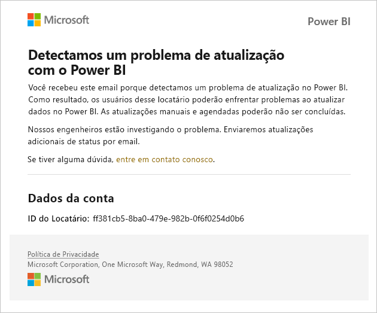
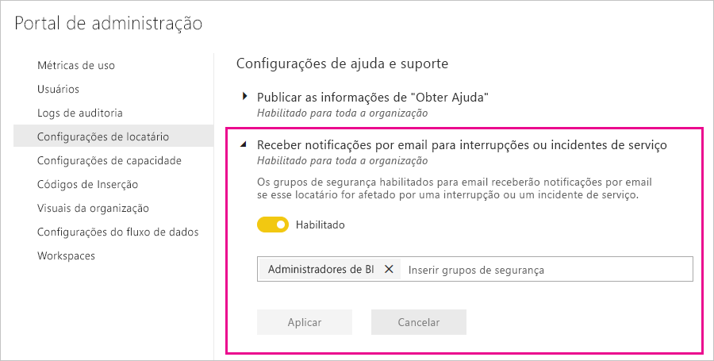

# Notificações de interrupção de serviço

É crucial ter informações sobre a disponibilidade de seus aplicativos de negócios críticos. O Power BI fornece notificação de incidente para que você possa, opcionalmente, receber emails se houver uma interrupção ou degradação do serviço. Embora o SLA (contrato de nível de serviço) de 99,9% do Power BI torne raras essas ocorrências, queremos que você fique informado. A captura de tela a seguir mostra o tipo de email que você receberá se habilitar notificações:

Neste momento, enviamos emails para os seguintes _cenários de confiabilidade_:

- Confiabilidade de relatório aberto
- Confiabilidade de atualização do modelo
- Confiabilidade de atualização de consulta

Notificações são enviadas quando há um _atraso estendido_ em operações como abertura de relatórios, atualização de conjuntos de dados ou execuções de consultas. Depois que um incidente é resolvido, você recebe um email de acompanhamento.

> [!NOTE]
> Este recurso no momento está disponível apenas para capacidades dedicadas no Power BI Premium. Ele não está disponível para capacidade compartilhada ou inserida.

## Notificações de capacidade e confiabilidade

Quando uma capacidade do Power BI Premium está enfrentando períodos estendidos de alto uso de recursos que potencialmente afetem a confiabilidade, um email de notificação é enviado. Exemplos de impactos desse tipo incluem atrasos estendidos em operações como abrir um relatório, atualização do conjunto de dados e execuções de consulta. 

O email de notificação fornece informações sobre o motivo do alto uso de recursos, incluindo o seguinte:

* ID do conjunto de dados responsável
* Tipo de operação
* Tempo de CPU associado ao alto uso de recursos

O Power BI também envia notificações por email quando uma sobrecarga em uma capacidade do Power BI Premium é detectada. O email explica o motivo provável da sobrecarga, quais operações geraram a carga nos últimos 10 minutos e a quantidade de carga gerada por operação. 

Se você tiver mais de uma capacidade Premium, o email incluirá informações sobre essas capacidades durante o período sobrecarregado, de modo que possa considerar a possibilidade de mover os workspaces que contêm itens com uso intensivo de recursos para capacidades com a menor carga.

As notificações por email da sobrecarga são enviadas somente quando um limite de sobrecarga é disparado. Você não receberá um segundo email quando a carga dessa capacidade Premium retornar a níveis não sobrecarregados.

A seguinte imagem mostra um exemplo de email de notificação:

## Habilitar notificações

Um administrador de locatário do Power BI habilita as notificações no portal de administração:

1. Identifique ou crie um grupo de segurança habilitado para email que deva receber notificações.

1. No portal de administração, selecione **Configurações do locatário**. Em **Configurações de ajuda e suporte**, expanda **Receber notificações por email para interrupções ou incidentes de serviço**.

1. Habilite as notificações, insira um grupo de segurança e selecione **Aplicar**.

    

> [!NOTE]
> O Power BI envia notificações da conta no-reply-powerbi@microsoft.com. Verifique se essa conta está adicionada à sua lista de remetentes seguros para que as notificações não acabem em uma pasta de lixo eletrônico.

## Próximas etapas

[Opções de suporte do Power BI Pro e do Power BI Premium](service-support-options.md)

Mais perguntas? [Experimente a Comunidade do Power BI](https://community.powerbi.com/)
