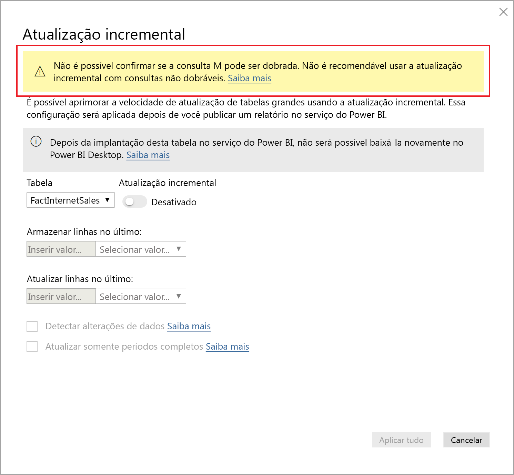
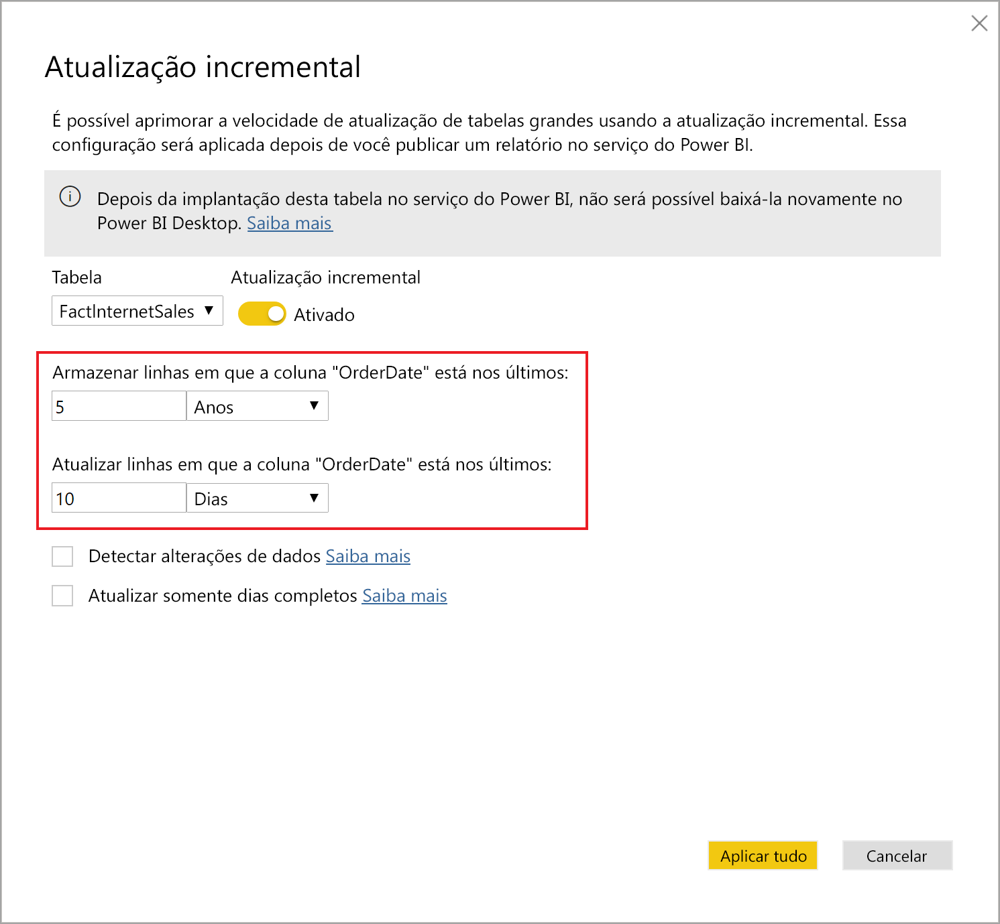
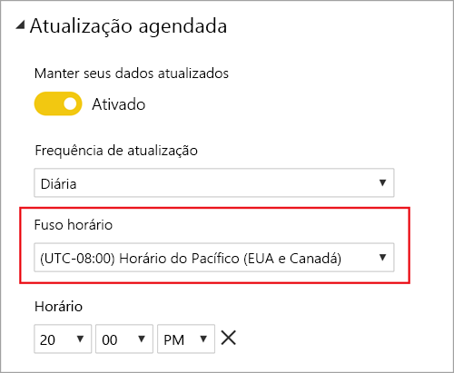
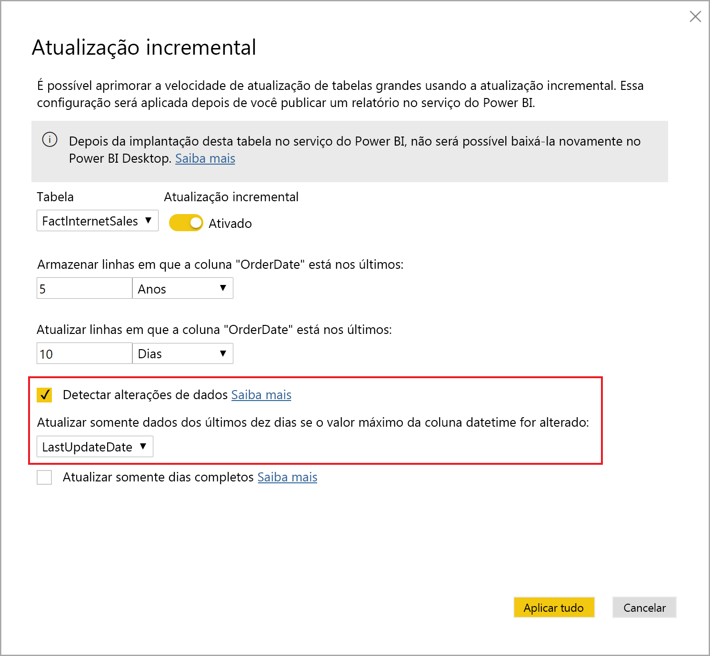
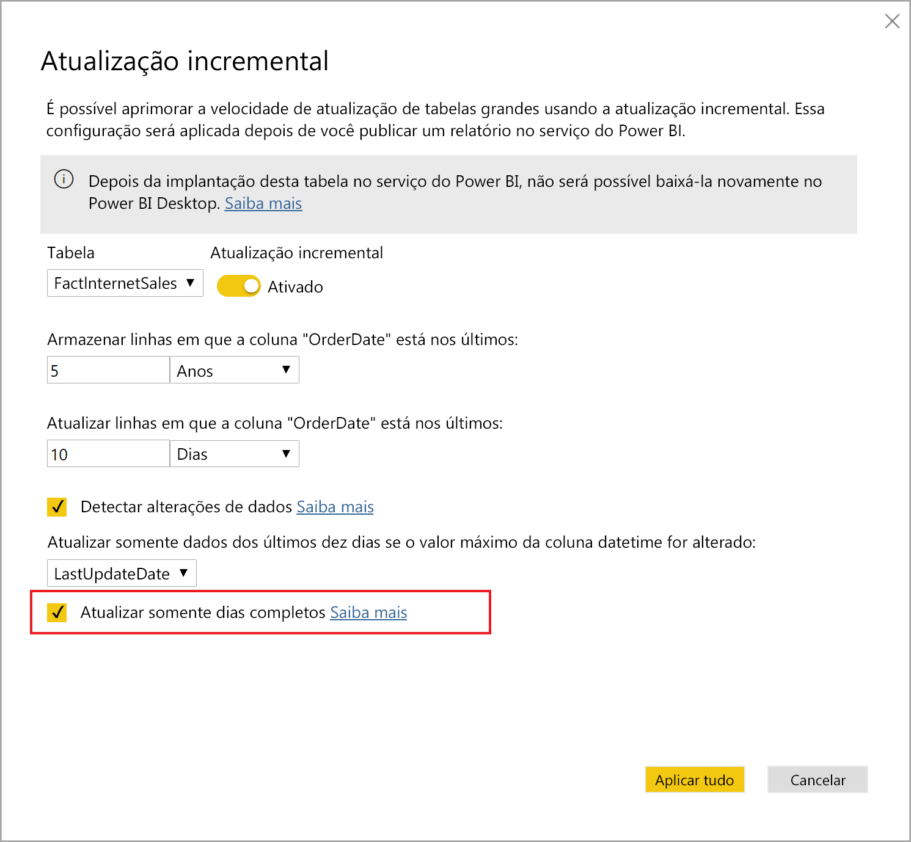

# <a name="incremental-refresh-in-power-bi"></a>Atualização incremental no Power BI

A atualização incremental permite conjuntos de dados muito grandes no Power BI com os seguintes benefícios:

> [!div class="checklist"]
> * **As atualizações são mais rápidas** – somente os dados alterados precisam ser atualizados. Por exemplo, a atualização somente dos últimos cinco dias de um conjunto de dados de dez anos.
> * **As atualizações são mais confiáveis** – não é mais necessário manter conexões longas com sistemas de origem voláteis.
> * **O consumo de recursos é reduzido** – um número menor de dados para atualização reduz o consumo geral da memória e de outros recursos.

> [!NOTE]
> A atualização incremental agora está disponível para as assinaturas e os conjuntos do Power BI Pro, Premium e Shared. 

## <a name="configure-incremental-refresh"></a>Configurar a atualização incremental

As políticas de atualização incremental são definidas no Power BI Desktop e aplicadas quando publicadas no serviço do Power BI.


### <a name="filter-large-datasets-in-power-bi-desktop"></a>Filtrar conjuntos de dados grandes no Power BI Desktop

Os conjuntos de dados grandes, com potencialmente bilhões de linhas, podem não caber em um modelo do Power BI Desktop porque o arquivo PBIX é limitado pelos recursos da memória disponíveis no computador desktop. Portanto, esses conjuntos de dados normalmente são filtrados após a importação. Esse tipo de filtragem é aplicável se a atualização incremental é usada ou não. Para a atualização incremental, realize a filtragem usando parâmetros de data/hora do Power Query.

#### <a name="rangestart-and-rangeend-parameters"></a>Parâmetros RangeStart e RangeEnd

Para a atualização incremental, os conjuntos de dados são filtrados usando parâmetros de data/hora do Power Query com os nomes reservados que diferenciam maiúsculas de minúsculas **RangeStart** e **RangeEnd**. Esses parâmetros são usados para filtrar os dados importados para o Power BI Desktop e também para particionar dinamicamente os dados em intervalos, depois de publicados no serviço do Power BI. Os valores de parâmetro são substituídos pelo serviço para filtragem de cada partição. Não é necessário defini-los nas configurações do conjunto de dados no serviço. Depois de publicado, os valores de parâmetro serão substituídos automaticamente pelo serviço do Power BI.

Para definir os parâmetros com valores padrão, no Editor do Power Query, selecione **Gerenciar Parâmetros**.


Com os parâmetros definidos, em seguida, você poderá aplicar o filtro selecionando a opção de menu **Filtro Personalizado** para uma coluna.


Verifique se as linhas são filtradas em que o valor da coluna *é após ou igual a* **RangeStart** e *antes de* **RangeEnd**. Outras combinações de filtro podem resultar em uma contagem dupla de linhas.


> [!IMPORTANT]
> Verifique se as consultas têm um sinal de igual a (=) em **RangeStart** ou em **RangeEnd**, mas não em ambos. Se o sinal de igual a (=) existir em ambos os parâmetros, uma linha poderá atender às condições para duas partições, o que poderá levar a dados duplicados no modelo. Por exemplo,  
> \#"Filtered Rows" = Table.SelectRows(dbo_Fact, each [OrderDate] **>= RangeStart** e [OrderDate] **<= RangeEnd**) pode resultar em dados duplicados.

> [!TIP]
> Embora o tipo de dados dos parâmetros precise ser data/hora, é possível convertê-los para que correspondam aos requisitos da fonte de dados. Por exemplo, a função do Power Query a seguir converte um valor de data/hora para se parecer com uma chave alternativa de inteiro no formato *aaaammdd*, que é comum para data warehouses. A função pode ser chamada pela etapa de filtro.
>
> `(x as datetime) => Date.Year(x)*10000 + Date.Month(x)*100 + Date.Day(x)`

Selecione **Fechar e Aplicar** no Editor Power Query. Um subconjunto do conjunto de dados estará presente no Power BI Desktop.

#### <a name="filter-date-column-updates"></a>Filtrar as atualizações da coluna de data

O filtro na coluna de data é usado para particionar dinamicamente os dados em intervalos no serviço do Power BI. A atualização incremental não foi projetada para dar suporte a casos em que a coluna de data filtrada é atualizada no sistema de origem. Uma atualização é interpretada como uma inserção e uma exclusão, não como uma atualização real. Se a exclusão ocorrer no intervalo histórico, e não no intervalo incremental, ela não será selecionada. Isso pode causar falhas de atualização de dados devido a conflitos de chave de partição.

#### <a name="query-folding"></a>Partição de consulta

É importante que os filtros de partição sejam enviados por push para o sistema de origem quando as consultas forem enviadas para operações de atualização. A aplicação da filtragem significa que a fonte de dados deve dar suporte à partição de consulta. A maioria das fontes de dados compatíveis com consultas SQL é compatível com a partição de consulta. No entanto, fontes de dados como arquivos simples, blobs e feeds da Web normalmente não fazem isso. Nos casos em que o filtro não é compatível com o back-end da fonte de dados, ele não pode ser aplicado. Nesses casos, o mecanismo de mashup compensa e aplica o filtro localmente, o que pode exigir a recuperação do conjunto de dados completo da fonte de dados. Isso pode fazer com que a atualização incremental seja muito lenta e o processo pode ficar sem recursos no serviço do Power BI ou no gateway de dados local se usado.

Considerando os vários níveis de suporte da partição de consulta para cada fonte de dados, é recomendável realizar a verificação para garantir que a lógica do filtro seja incluída nas consultas de origem. Para facilitar essa tarefa, o Power BI Desktop tenta realizar essa verificação para você. Se não for possível realizar a verificação, um aviso será exibido na caixa de diálogo da atualização incremental ao definir a política de atualização incremental. Fontes de dados baseadas em SQL, como Oracle e Teradata, podem depender desse aviso. Outras fontes de dados talvez não consigam realizar a verificação sem o rastreamento de consultas. Se não for possível que o Power BI Desktop confirme isso, o aviso a seguir será exibido. Se você vir esse aviso e desejar verificar se a dobragem de consultas necessária está ocorrendo, poderá usar o recurso Diagnóstico de Consulta ou as consultas de rastreamento recebidas pelo banco de dados de origem.

 

### <a name="define-the-refresh-policy"></a>Definir a política de atualização

A atualização incremental está disponível no menu de contexto das tabelas, exceto para modelos de conexão dinâmica.


#### <a name="incremental-refresh-dialog"></a>Caixa de diálogo de atualização incremental

A caixa de diálogo de atualização incremental é exibida. Use o botão de alternância para habilitar a caixa de diálogo.


> [!NOTE]
> Se a expressão do Power Query para a tabela não se referir aos parâmetros com nomes reservados, o botão de alternância estará desabilitado.

O texto do cabeçalho explica o seguinte:

- As políticas de atualização são definidas no Power BI Desktop e são aplicadas por operações de atualização no serviço.

- Se você puder baixar o arquivo PBIX que contém uma política de atualização incremental no serviço do Power BI, ele não poderá ser aberto no Power BI Desktop. Embora isso possa ter suporte no futuro, tenha em mente que esses conjuntos de dados podem ficar tão grandes a ponto de não poderem ser baixados e abertos em um computador desktop comum.

#### <a name="refresh-ranges"></a>Intervalos de atualização

O exemplo a seguir define uma política de atualização para armazenar dados por cinco anos civis completos, mais os dados para o ano atual até a data atual, e atualizar de forma incremental dez dias de dados. A primeira operação de atualização carrega os dados históricos. As atualizações seguintes são incrementais e (se agendadas para serem executadas diariamente) realizam as seguintes operações:

- Adicione um novo dia de dados.

- Atualizar dez dias até a data atual.

- Remover os anos civis com mais de cinco anos antes da data atual. Por exemplo, se a data atual for 1º de janeiro de 2019, o ano de 2013 será removido.

A primeira atualização no serviço do Power BI pode demorar mais para importar todos os cinco anos civis. As próximas atualizações podem ser concluídas em uma fração desse tempo.




#### <a name="current-date"></a>Data atual

A *data atual* é baseada na data do sistema no momento da atualização. Se a atualização agendada estiver habilitada para o conjunto de dados no serviço do Power BI, o fuso horário especificado será levado em conta ao determinar a data atual. As atualizações invocadas e agendadas manualmente por meio do serviço do Power BI levam em conta o fuso horário, se disponível. Por exemplo, uma atualização que ocorre às 20h, Hora do Pacífico (EUA e Canadá), com o fuso horário especificado determinará a data atual com base na Hora do Pacífico, não GMT (que seria o dia seguinte). As operações de atualização não invocadas por meio do serviço do Power BI, como o [comando de atualização TMSL](https://docs.microsoft.com/analysis-services/tmsl/refresh-command-tmsl?view=power-bi-premium-current), não consideram o fuso horário das atualizações agendadas



> [!NOTE]
> Talvez você precise apenas da definição desses intervalos e, nesse caso, poderá ir diretamente para a etapa de publicação abaixo. As listas suspensas adicionais destinam-se aos recursos avançados.

### <a name="advanced-policy-options"></a>Opções avançadas de política

#### <a name="detect-data-changes"></a>Detectar alterações nos dados

A atualização incremental de dez dias é muito mais eficiente do que a atualização completa de cinco anos. No entanto, é possível obter um resultado ainda melhor. Se você marcar a caixa de seleção **Detectar alterações nos dados**, será possível selecionar uma coluna de data/hora usada para identificar e atualizar somente os dias em que os dados foram alterados. Isso pressupõe que uma coluna dessa exista no sistema de origem, normalmente para fins de auditoria. **Essa não deve ser a mesma coluna usada para particionar os dados com os parâmetros RangeStart/RangeEnd.** O valor máximo dessa coluna é avaliado para cada um dos períodos no intervalo incremental. Se ele não foi alterado desde a última atualização, não é necessário atualizar o período. No exemplo, isso pode reduzir ainda mais os dias atualizados de forma incremental de dez para cerca de dois.



> [!TIP]
> O projeto atual requer que a coluna que detecta alterações nos dados seja persistente e fique armazenada em cache na memória. É interessante considerar uma das técnicas a seguir para reduzir a cardinalidade e o consumo de memória.
>
> Persista apenas o valor máximo dessa coluna no momento da atualização, talvez usando uma função do Power Query.
>
> Reduza a precisão a um nível aceitável considerando seus requisitos de frequência de atualização.
>
> Defina uma consulta personalizada para detectar alterações de dados usando o ponto de extremidade XMLA e evite manter o valor da coluna inteiramente. Veja as consultas personalizadas para detectar alterações nos dados abaixo para obter mais informações.

#### <a name="only-refresh-complete-periods"></a>Atualizar somente períodos concluídos

Digamos que sua atualização esteja agendada para ser executada às 4h, todas as manhãs. Se os dados aparecerem no sistema de origem durante essas 4 horas, não será necessário considerá-los. Algumas métricas de negócios, como barris por dia no setor de petróleo e gás, não fazem sentido com partes de dias.

Outro exemplo é a atualização de dados de um sistema financeiro no qual os dados do mês anterior são aprovados no dia 12 do mês. Você pode definir o intervalo incremental para um mês e agendar a atualização para ser executada no dia 12 do mês. Com essa opção marcada, os dados de janeiro seriam atualizados em 12 de fevereiro.



> [!NOTE]
> As operações de atualização no serviço são executadas em hora UTC. Assim, é possível determinar a data de efetivação e afetar períodos concluídos. Estamos planejando adicionar a capacidade de substituir a data de efetivação de uma operação de atualização.

## <a name="publish-to-the-service"></a>Publicar no serviço

Agora você pode atualizar o modelo. A primeira atualização pode demorar mais para importar os dados históricos. As próximas atualizações poderão ser muito mais rápidas porque elas usarão a atualização incremental.

## <a name="query-timeouts"></a>Tempos limite de consulta

O artigo [Solucionando problemas de atualização](../connect-data/refresh-troubleshooting-refresh-scenarios.md) explica que as operações de atualização no serviço do Power BI estão sujeitas a tempos limite. As consultas também podem ser limitadas pelo tempo limite padrão da fonte de dados. A maioria das fontes relacionais permitem a substituição de tempos limite na expressão M. Por exemplo, a expressão abaixo usa a [função de acesso a dados do SQL Server](https://docs.microsoft.com/powerquery-m/sql-database) para defini-lo para 2 horas. Cada período definido pelos intervalos de política envia uma consulta observando a configuração de tempo limite do comando.

```powerquery-m
let
    Source = Sql.Database("myserver.database.windows.net", "AdventureWorks", [CommandTimeout=#duration(0, 2, 0, 0)]),
    dbo_Fact = Source{[Schema="dbo",Item="FactInternetSales"]}[Data],
    #"Filtered Rows" = Table.SelectRows(dbo_Fact, each [OrderDate] >= RangeStart and [OrderDate] < RangeEnd)
in
    #"Filtered Rows"
```

## <a name="xmla-endpoint-benefits-for-incremental-refresh"></a>Benefícios do ponto de extremidade XMLA para atualização incremental

O [ponto de extremidade XMLA](service-premium-connect-tools.md) para conjuntos de valores em uma capacidade Premium pode ser habilitado para operações de leitura/gravação, o que pode fornecer benefícios consideráveis para a atualização incremental. As operações de atualização feitas por meio do ponto de extremidade XMLA não têm um limite de [48 atualizações por dia](../connect-data/refresh-data.md#data-refresh), e o [tempo limite de atualização planejada](../connect-data/refresh-troubleshooting-refresh-scenarios.md#scheduled-refresh-timeout) não é imposto, o que pode ser útil em cenários de atualização incremental.

### <a name="refresh-management-with-sql-server-management-studio-ssms"></a>Gerenciamento de atualizações com o SSMS (SQL Server Management Studio)

Com o ponto de extremidade XMLA habilitado para leitura/gravação, o SSMS pode ser usado para exibir e gerenciar partições geradas pelo aplicativo de políticas de atualização incremental. Isso permite, por exemplo, atualizar uma partição histórica específica que não esteja no intervalo incremental de modo a executar uma atualização retroativa sem precisar atualizar todos os dados. Você também pode usar o SSMS para carregar os dados históricos em conjuntos muito grandes, adicionando/atualizando de forma incremental as partições históricas em lotes.


#### <a name="override-incremental-refresh-behavior"></a>Substituir comportamento de atualização incremental

Com o SSMS, você também tem mais controle sobre como invocar atualizações incrementais usando a [TMSL (Linguagem de Scripts do Modelo Tabular)](https://docs.microsoft.com/analysis-services/tmsl/tabular-model-scripting-language-tmsl-reference?view=power-bi-premium-current) e o [TOM (Modelo de Objeto Tabular)](https://docs.microsoft.com/analysis-services/tom/introduction-to-the-tabular-object-model-tom-in-analysis-services-amo?view=power-bi-premium-current). Por exemplo, no Pesquisador de Objetos do SSMS, clique com o botão direito do mouse sobre uma tabela e selecione no menu a opção **Processar Tabela**. Em seguida, clique no botão **Script** para gerar um comando de atualização de TMSL.


Os parâmetros a seguir podem ser inseridos no comando de atualização de TMSL para substituir o comportamento de atualização incremental padrão.

- **applyRefreshPolicy** – se uma tabela tiver uma política de atualização incremental definida, applyRefreshPolicy determinará se a política será aplicada ou não. Se a política não for aplicada, uma operação de processo completa deixará as definições de partição inalteradas e todas as partições na tabela serão totalmente atualizadas. O valor padrão é true.

- **effectiveDate** – se uma política de atualização incremental estiver sendo aplicada, ela precisará saber a data atual para determinar os intervalos de janela sem interrupção para o intervalo histórico e o intervalo incremental. O parâmetro effectiveDate permite que você substitua a data atual. Isso é útil para testes, demonstrações e cenários de negócios em que os dados são atualizados incrementalmente em datas passados ou futuras (por exemplo, orçamentos futuros). O valor padrão é a data atual.

```json
{ 
  "refresh": {
    "type": "full",

    "applyRefreshPolicy": true,
    "effectiveDate": "12/31/2013",

    "objects": [
      {
        "database": "IR_AdventureWorks", 
        "table": "FactInternetSales" 
      }
    ]
  }
}
```

Para saber mais sobre como substituir o comportamento de atualização incremental padrão por TMSL, confira [Comando de atualização](https://docs.microsoft.com/analysis-services/tmsl/refresh-command-tmsl?view=power-bi-premium-current).

### <a name="custom-queries-for-detect-data-changes"></a>Personalizar consultas para detectar alterações de dados

Você pode usar TMSL e/ou TOM para substituir o comportamento de alterações de dados detectados. Isso não só pode ser usado para evitar manter a coluna da última atualização no cache da memória, como também permite cenários em que uma tabela de configuração/instrução é preparada por processos ETL com o objetivo de sinalizar apenas as partições que precisam ser atualizadas. Isso permite criar um processo de atualização incremental mais eficiente, onde apenas os períodos necessários são atualizados, independentemente do tempo durante o qual as atualizações de dados ocorreram.

O pollingExpression deve ser uma expressão M leve ou nome de outra consulta M. Ele deve retornar um valor escalar e ser executado em cada partição. Se o valor retornado for diferente do apresentado na última atualização incremental, a partição será sinalizada para processamento completo.

O exemplo a seguir abrange todos os 120 meses no intervalo histórico para alterações retroativas. Especificar 120 meses em vez de 10 anos pode significar uma compactação de dados não eficiente, mas que evita a necessidade de atualizar o histórico de um ano inteiro, o que seria mais caro, quando fazer a alteração retroativa de um mês é suficiente.

```json
"refreshPolicy": {
    "policyType": "basic",
    "rollingWindowGranularity": "month",
    "rollingWindowPeriods": 120,
    "incrementalGranularity": "month",
    "incrementalPeriods": 120,
    "pollingExpression": "<M expression or name of custom polling query>",
    "sourceExpression": [
    "let ..."
    ]
}
```

## <a name="metadata-only-deployment"></a>Implantação somente de metadados

Ao publicar uma nova versão de um arquivo PBIX por meio do Power BI Desktop para um workspace no Power BI Premium, caso um conjunto de dados com o mesmo nome já exista, será necessário substituir o conjunto de dados existente.


Em alguns casos, talvez não convenha substituir o conjunto de dados, principalmente pela atualização incremental. O conjunto de dados no Power BI Desktop pode ser muito menor que o de serviços. Se o conjunto de dados de serviços tiver uma política de atualização incremental aplicada, poderá haver vários anos de dados históricos que serão perdidos caso o conjunto de dados seja substituído. Atualizar todos os dados históricos pode levar horas e resultar em tempo de inatividade do sistema para os usuários.

Em vez disso, é melhor executar uma implantação somente de metadados. Isso permite a implantação de novos objetos sem perder os dados históricos. Por exemplo, se você adicionou algumas medidas, poderá implantá-las independentemente, sem precisar atualizar os dados, economizando muito tempo.

Quando configurado para leitura e gravação, o ponto de extremidade XMLA fornece compatibilidade com as ferramentas que fazem isso acontecer. Por exemplo, o kit de ferramentas ALM é um recurso de diferença de esquema para conjuntos de dados do Power BI e pode ser usado para executar apenas a implantação de metadados.

Baixe e instale a versão mais recente do kit de ferramentas ALM por meio do [Repositório Git do Analysis Services](https://github.com/microsoft/Analysis-Services/releases). Links de documentação e informações sobre suporte estão disponíveis na faixa de opções Ajuda. Para executar uma implantação somente de metadados, faça uma comparação e selecione a instância do Power BI Desktop em execução como fonte e o conjunto de dados existente no serviço como destino. Observe as diferenças exibidas e ignore a atualização da tabela com partições de atualização incremental, ou use a caixa de diálogo Opções para reter partições para atualizações da tabela. Valide a seleção para garantir a integridade do modelo de destino e realize a atualização.


## <a name="see-also"></a>Consulte também

[Conectividade do conjunto de dados com o ponto de extremidade XMLA](service-premium-connect-tools.md)   
[Solucionar problemas de atualização](../connect-data/refresh-troubleshooting-refresh-scenarios.md)   
