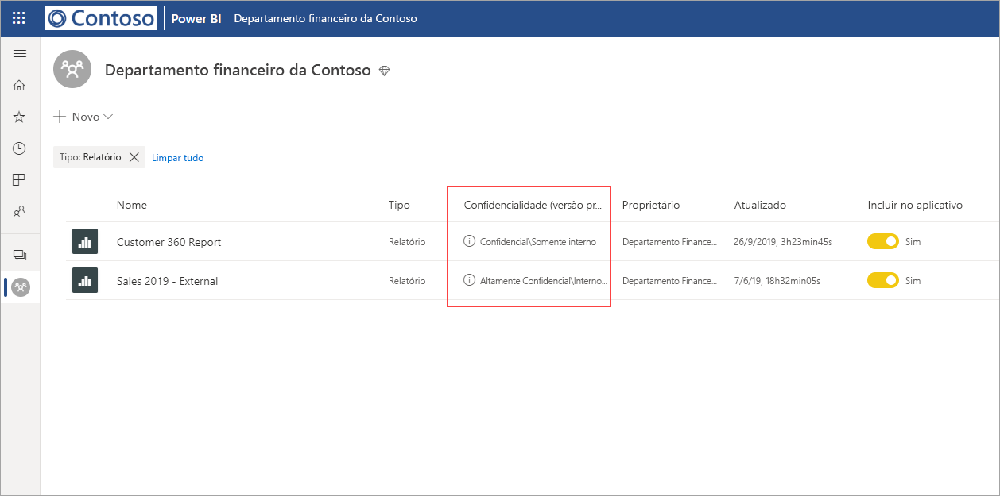
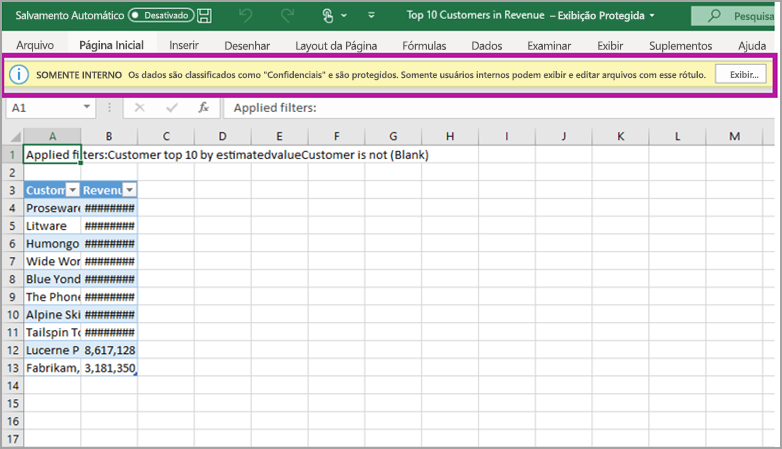

# Proteção de dados no Power BI (versão prévia)

Empresas modernas têm regulamentações e requisitos de negócios restritivos sobre como manusear e proteger dados confidenciais. O Power BI pode ser integrado à Proteção de Informações da Microsoft e ao Microsoft Cloud App Security para fornecer maior controle e visibilidade sobre dados confidenciais no Power BI. 

Com a proteção de dados para o Power BI, você pode fazer o seguinte:

* usar os rótulos de confidencialidade da Microsoft para classificar e rotular conteúdos no serviço do Power BI (dashboards, relatórios, conjuntos de dados e fluxos de dados), usando a mesma taxonomia usada para classificar e proteger arquivos no Office 365. 

* impor as configurações de proteção, como criptografia ou marcas d'água, ao exportar dados do serviço do Power BI para arquivos aplicando o rótulo de confidencialidade e a proteção do conteúdo (Excel, PowerPoint e PDF). 

  Por exemplo, os usuários podem aplicar o rótulo Confidencial a um relatório no Power BI. Em seguida, quando os dados forem exportados para um arquivo do Excel, o Power BI aplicará o rótulo Confidencial ao arquivo. O rótulo poderá criptografar o conteúdo e aplicar uma marca-d'água Confidencial.

* usar o Microsoft Cloud App Security para monitorar atividades no Power BI, investigar problemas de segurança e proteger conteúdo no Power BI com o Controle de Aplicativo de Acesso Condicional do Microsoft Cloud App Security. 

## Rótulos de confidencialidade no Power BI

Os rótulos de confidencialidade são criados e gerenciados na [central de segurança do Microsoft 365](https://security.microsoft.com/) ou na [central de conformidade do Microsoft 365](https://compliance.microsoft.com/).

Para acessar os rótulos de confidencialidade em qualquer uma dessas centrais, navegue para **Classificação > Rótulos de confidencialidade**. Esses rótulos de confidencialidade podem ser usados por vários serviços da Microsoft, como a Proteção de Informações do Azure, os aplicativos do Office e os serviços do Office 365.

> [!IMPORTANT]
> Os clientes da Proteção de Informações do Azure precisarão migrar os rótulos para um dos serviços listados anteriormente para que eles sejam usados no Power BI. Além disso, os rótulos de confidencialidade têm suporte apenas em nuvens públicas e não têm suporte para locatários em nuvens, como em nuvens soberanas.
>
> Saiba mais sobre como [migrar rótulos de confidencialidade para a Proteção de Informações da Microsoft](https://docs.microsoft.com/azure/information-protection/configure-policy-migrate-labels).

## Como os rótulos de confidencialidade funcionam

Quando você aplica um rótulo de confidencialidade a um dashboard, relatório, conjunto de dados ou fluxo de dados do Power BI, o processo é semelhante a aplicar uma *marca* a esse recurso, o que traz os seguintes benefícios:
* **Personalizável** – você pode criar categorias para diferentes níveis de conteúdo confidencial em sua organização, como Pessoal, Público, Geral, Confidencial e Altamente Confidencial.
* **Texto não criptografado** – como o rótulo está em texto não criptografado, é fácil para os usuários entenderem como tratar o conteúdo de acordo com as diretrizes dos rótulos de confidencialidade.
* **Persistente** – após um rótulo de confidencialidade ser aplicado ao conteúdo, ele acompanha esse conteúdo quando é exportado para os seguintes tipos de arquivo com suporte: Excel, PowerPoint e PDF. 

  Isso significa que o rótulo de confidencialidade segue o conteúdo, incluindo suas configurações de proteção, e se torna a base para aplicar e impor políticas. 

## Exemplo de rótulo de confidencialidade 

Veja um exemplo rápido de como um rótulo de confidencialidade no Power BI pode funcionar.

1. No serviço do Power BI, o rótulo **Altamente Confidencial – Somente Interno** é aplicado a um relatório.

   

2. Quando dados desse relatório são exportados para um arquivo do Excel, o rótulo de confidencialidade e a proteção são aplicados ao arquivo do Excel exportado.

   

Em aplicativos do Microsoft Office, um rótulo de confidencialidade aparece como uma marca no email ou no documento, semelhante à imagem acima.

Você também pode atribuir uma classificação (como um adesivo) ao conteúdo, que persiste e acompanha o conteúdo conforme ele é usado e compartilhado. Você pode usar essa classificação para gerar relatórios de uso e ver dados de atividade relacionados ao seu conteúdo confidencial. Com base nessas informações, você sempre pode optar mais tarde por aplicar as configurações de proteção.

## Usando rótulos de confidencialidade no Power BI

Antes que os rótulos de confidencialidade possam ser habilitados no Power BI, você precisará concluir os seguintes pré-requisitos: 

* garantir que os rótulos de confidencialidade tenham sido definidos na [central de segurança do Microsoft 365](https://security.microsoft.com/) ou na [central de conformidade do Microsoft 365](https://compliance.microsoft.com/). 
* [habilitar rótulos de confidencialidade](service-security-enable-data-sensitivity-labels.md) (versão prévia) no Power BI.
* garantir que os usuários tenham a licença apropriada;
  * Para aplicar ou exibir rótulos no Power BI, os usuários precisam ter uma licença Premium P1 ou Premium P2 da Proteção de Informações do Azure. A Proteção de Informações do Microsoft Azure pode ser adquirida de forma independente ou por meio de um dos pacotes de licenciamento da Microsoft. Confira [preço da Proteção de Informações do Azure](https://azure.microsoft.com/pricing/details/information-protection/) para obter detalhes.
  * Para aplicar rótulos a recursos do Power BI, o usuário precisa ter uma licença do Power BI Pro, além de uma das licenças da Proteção de Informações do Azure mencionadas acima. 

## Proteger o conteúdo usando o Microsoft Cloud App Security

Você pode proteger o conteúdo no Power BI contra vazamentos ou violações indesejadas usando o Microsoft Cloud App Security. Após o Microsoft Cloud App Security ser definido e configurado, os administradores de segurança poderão monitorar o acesso e a atividade do usuário, executar a análise de risco em tempo real e definir controles específicos do rótulo.

Por exemplo, as organizações podem usar o Microsoft Cloud App Security para configurar uma política que impede que os usuários baixem dados confidenciais do Power BI para dispositivos não gerenciados. Essa configuração permite que os usuários permaneçam produtivos e se conectem ao Power BI de qualquer lugar, enquanto usam o Microsoft Cloud App Security para evitar ações do usuário comprometedoras, tudo isso em tempo real. 

### Requisitos

Antes que seus rótulos de confidencialidade possam usar o Microsoft Cloud App Security, os seguintes pré-requisitos precisarão ser atendidos: 

* O Cloud App Security e a Proteção de Informações do Azure [precisam estar habilitados para o locatário](https://docs.microsoft.com/cloud-app-security/azip-integration).
* O aplicativo [precisa estar conectado ao Microsoft Cloud App Security](https://docs.microsoft.com/cloud-app-security/enable-instant-visibility-protection-and-governance-actions-for-your-apps).

## Considerações e limitações

A lista a seguir fornece algumas limitações dos rótulos de confidencialidade no Power BI:

* Aplicar e exibir os rótulos de confidencialidade da Proteção de Informações da Microsoft no Power BI exige uma licença Premium P1 ou Premium P2 da Proteção de Informações do Azure. A Proteção de Informações do Microsoft Azure pode ser adquirida de forma independente ou por meio de um dos pacotes de licenciamento da Microsoft. Confira [preço da Proteção de Informações do Azure](https://azure.microsoft.com/pricing/details/information-protection/) para obter detalhes.
* Os rótulos de confidencialidade podem ser aplicados apenas a dashboards, relatórios, conjuntos de dados e fluxos de dados.
* A imposição de controles de proteção e rótulo em arquivos exportados tem suporte apenas para arquivos do Excel, do PowerPoint e PDF. O rótulo e a proteção não são impostos quando os dados são exportados para arquivos .CSV, Assinaturas de email, Visuais incorporados e impressões.
* Um usuário que exporta um arquivo do Power BI tem permissões para acessar e editar esse arquivo de acordo com as configurações do rótulo de confidencialidade. O usuário que exporta os dados não obtém permissões de proprietário para o arquivo. 
* Atualmente, os rótulos de confidencialidade não estão disponíveis para [relatórios paginados]( https://docs.microsoft.com/power-bi/paginated-reports-report-builder-power-bi) e pastas de trabalho. 
* No momento, não é possível excluir um rótulo de um ativo do Power BI após ele ter sido aplicado.
* Os rótulos de confidencialidade em ativos do Power BI ficam visíveis apenas na lista do workspace e nas exibições de linhagem; atualmente, os rótulos não ficam visíveis nas exibições favoritos, compartilhados comigo, recentes ou de aplicativo. Observe, no entanto, que um rótulo aplicado a um ativo do Power BI, mesmo que não esteja visível, sempre persistirá em dados exportados para arquivos do Excel, do PowerPoint e PDF.
* O rótulo de confidencialidade *Configuração de criptografia de arquivo*, configurado na [central de segurança do Microsoft 365](https://security.microsoft.com/) ou na [central de conformidade do Microsoft 365](https://compliance.microsoft.com/), aplica-se somente a arquivos *exportados do* Power BI; ele não é imposto *dentro* do Power BI.
* A [proteção de HYOK](https://docs.microsoft.com/azure/information-protection/configure-adrms-restrictions) não tem suporte para rótulos aplicados no Power BI.
* A exibição e a aplicação de rótulos em aplicativos do Office têm [requisitos de licenciamento](https://docs.microsoft.com/microsoft-365/compliance/sensitivity-labels-office-apps#common-requirements).
* Os rótulos de confidencialidade têm suporte apenas para locatários na nuvem global (pública). Os rótulos de confidencialidade não têm suporte para locatários em outras nuvens.

## Próximas etapas

Este artigo forneceu uma visão geral da proteção de dados no Power BI. Os artigos a seguir fornecem mais detalhes sobre a proteção de dados no Power BI. 

* [Habilitar rótulos de confidencialidade de dados no Power BI](service-security-enable-data-sensitivity-labels.md)
* [Aplicar rótulos de confidencialidade de dados no Power BI](../designer/service-security-apply-data-sensitivity-labels.md)
* [Usando controles do Microsoft Cloud App Security no Power BI](service-security-using-microsoft-cloud-app-security-controls.md)