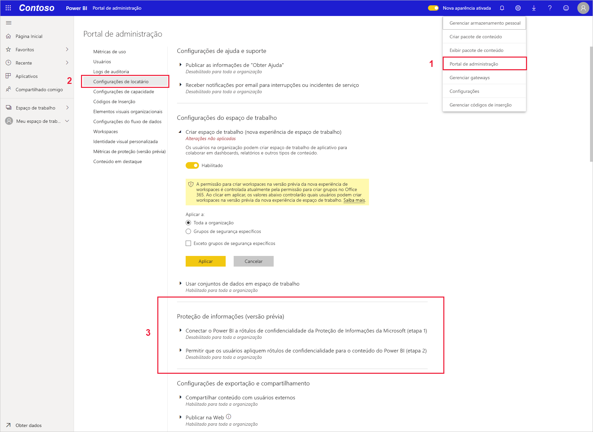
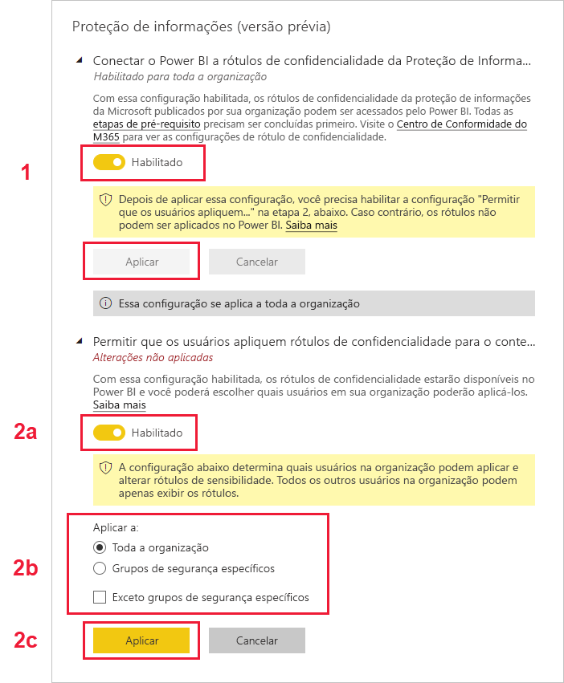

# Habilitar rótulos de confidencialidade de dados no Power BI (versão prévia)

Quando [rótulos de confidencialidade de dados da Proteção de Informações da Microsoft](https://docs.microsoft.com/microsoft-365/compliance/sensitivity-labels) são habilitados no Power BI, o seguinte se aplica:

* Certos usuários e grupos de segurança em uma organização podem classificar e [aplicar rótulos de confidencialidade](../designer/service-security-apply-data-sensitivity-labels.md) a seus painéis, relatórios, conjuntos de dados e fluxos de dados do Power BI (daqui em diante, chamados de *ativos*).
* Todos os membros da organização podem ver esses rótulos.

Os rótulos de confidencialidade de dados promovem a proteção de dados ao fazer com que autores e consumidores do Power BI saibam da confidencialidade dos dados, ao informar o que significa a classificação e como estes dados devem ser tratados.

Quando dados do Power BI que têm rótulo de confidencialidade de dados são exportados para um arquivo do Excel, PowerPoint ou PDF, este rótulo também vai para o novo arquivo. Isso significa que um usuário sem permissão de acesso aos dados rotulados devido às políticas de rótulos de confidencialidade não conseguirá abrir os arquivos *fora* do Power BI (em aplicativos Excel, PowerPoint ou PDF).

Habilitar rótulos de confidencialidade de dados requer uma licença da Proteção de Informações do Azure. Veja [Licenciamento](#licensing) para obter mais detalhes.

## Habilitar rótulos de confidencialidade de dados

Para habilitar o uso dos rótulos de confidencialidade de dados da Proteção de Informações da Microsoft no Power BI, vá para o portal de administração do Power BI, abra o painel Configurações de locatário e encontre a seção Proteção de Informações.

Na seção **Proteção de Informações**, execute as seguintes etapas:
1.  Habilite o botão de alternância **Habilitar Rótulos de Confidencialidade da Proteção de Informações da Microsoft** e pressione **Aplicar**. Esta etapa *somente* torna os rótulos de confidencialidade visíveis para toda a sua organização; ela não aplica nenhum rótulo. Para definir quem pode aplicar esses rótulos no Power BI, você precisa concluir a Etapa 2.
2.  Defina quem pode aplicar e alterar rótulos de confidencialidade em ativos do Power BI. Esta etapa envolve três ações:
    1.  Habilitar o botão de alternância **Definir rótulos de confidencialidade para conteúdos e dados do Power BI**.
    2.  Escolher o(s) grupo(s) de segurança relevante(s). Por padrão, todos em sua organização poderão aplicar rótulos de confidencialidade. No entanto, você pode optar por habilitar a configuração de rótulos de confidencialidade somente para usuários ou grupos de segurança específicos. Com toda a organização ou grupos de segurança específicos selecionados, você pode excluir subconjuntos de usuários ou grupos de segurança específicos.
    * Quando os rótulos de confidencialidade são habilitados para toda a organização, as exceções normalmente são grupos de segurança.
    * Quando os rótulos de confidencialidade são habilitados somente para usuários ou grupos de segurança específicos, as exceções normalmente são usuários específicos.  
    Essa abordagem possibilita impedir que determinados usuários apliquem rótulos de confidencialidade no Power BI, mesmo que eles pertençam a um grupo que tenha permissões para fazer isso.
    
    3. Pressione **Aplicar**.

> [!IMPORTANT]
> Somente usuários do Power BI Pro que têm permissões para *criar* e *editar* no ativo e que fazem parte do grupo de segurança que foi definido nesta seção poderão definir e editar os rótulos de confidencialidade. Os usuários que não fazem parte desse grupo não poderão definir ou editar o rótulo. 

## Considerações e limitações

O Power BI usa rótulos de confidencialidade da Proteção de Informações da Microsoft. Portanto, se você encontrar uma mensagem de erro ao tentar habilitar rótulos de confidencialidade, pode ser devido aos seguintes motivos:

* Você não tem uma [licença](#licensing) da Proteção de Informações do Azure.
* Os rótulos de confidencialidade não foram migrados para a versão da Proteção de Informações da Microsoft compatível com o Power BI. Saiba mais sobre [migrar rótulos de confidencialidade](https://docs.microsoft.com/azure/information-protection/configure-policy-migrate-labels).
* Nenhum rótulo de confidencialidade da Proteção de Informações da Microsoft foi definido na organização. Além disso, para ser utilizável, um rótulo deve fazer parte de uma política publicada. [Saiba mais sobre os rótulos de confidencialidade](https://docs.microsoft.com/Office365/SecurityCompliance/sensitivity-labels) ou visite o [centro de conformidade e segurança da Microsoft](https://sip.protection.office.com/sensitivity?flight=EnableMIPLabels) para ler sobre como definir rótulos e publicar políticas para sua organização.

## Licenças

* Para exibir os rótulos da Proteção de Informações da Microsoft no Power BI, os usuários devem ter uma licença Premium P1 ou Premium P2 da Proteção de Informações do Azure. A Proteção de Informações do Microsoft Azure pode ser adquirida de forma independente ou por meio de um dos pacotes de licenciamento da Microsoft. Confira [preço da Proteção de Informações do Azure](https://azure.microsoft.com/pricing/details/information-protection/) para obter detalhes.
* Os usuários que precisam aplicar rótulos em ativos do Power BI devem ter uma licença Power BI Pro.

## Próximas etapas

Este artigo descreveu como habilitar rótulos de confidencialidade de dados no Power BI. Os artigos a seguir fornecem mais detalhes sobre a proteção de dados no Power BI. 

* [Visão geral da proteção de dados no Power BI](service-security-data-protection-overview.md)
* [Aplicar rótulos de confidencialidade de dados no Power BI](../designer/service-security-apply-data-sensitivity-labels.md)
* [Usando controles do Microsoft Cloud App Security no Power BI](service-security-using-microsoft-cloud-app-security-controls.md)