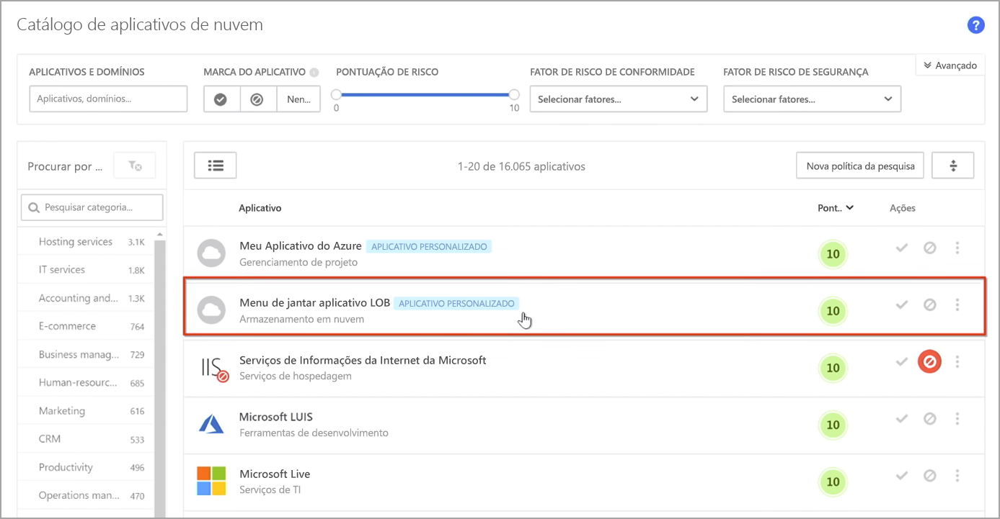
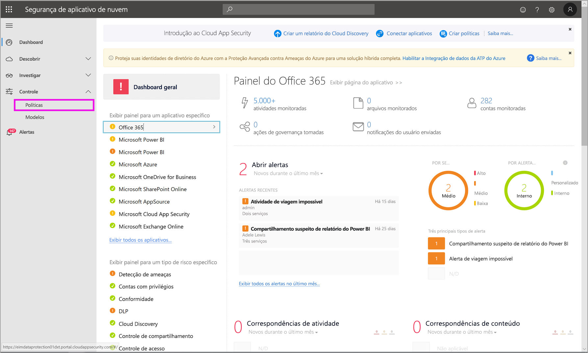
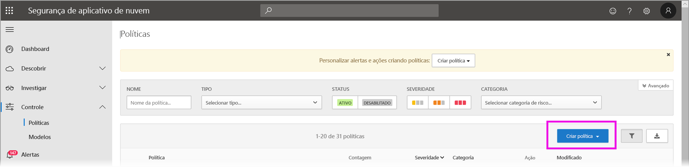
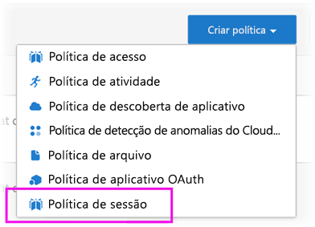
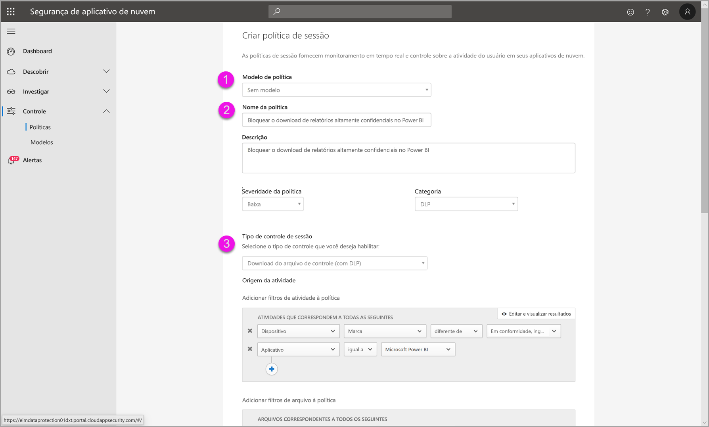
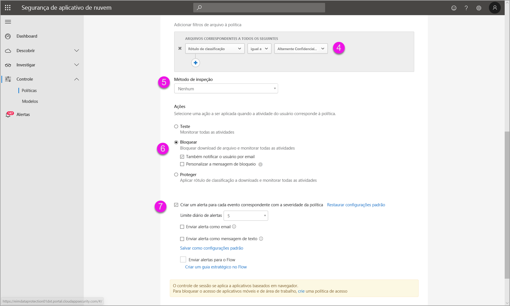
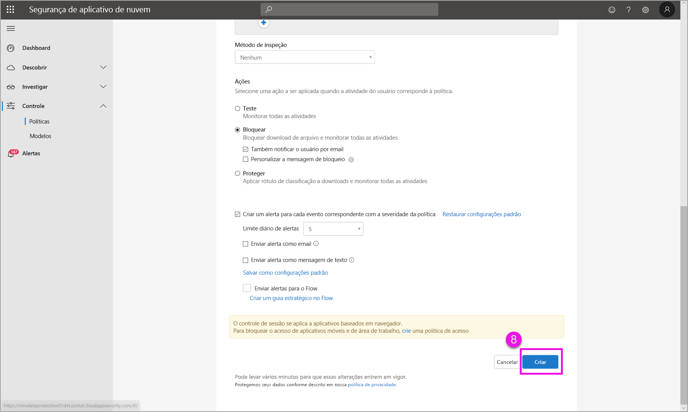

# Usando controles do Microsoft Cloud App Security no Power BI (versão prévia)

Usando o Microsoft Cloud App Security com o Power BI, você pode ajudar a proteger seus relatórios, dados e serviços do Power BI contra vazamentos ou violações indesejadas. Com o Cloud App Security, você cria políticas de acesso condicional para os dados de sua organização usando controles de sessão em tempo real no Azure AD (Azure Active Directory), que ajudam a garantir que suas análises do Power BI sejam seguras. Após essas políticas terem sido definidas, os administradores poderão monitorar o acesso e a atividade do usuário, executar a análise de risco em tempo real e definir controles específicos do rótulo. 

Você pode configurar o Microsoft Cloud App Security para todo tipo de aplicativo e serviço, não apenas para o Power BI. O Cloud App Security é um serviço da Microsoft que protege aplicativos e dispositivos e é gerenciado em seu próprio dashboard. Você precisará configurar o Cloud App Security para trabalhar com o Power BI para se beneficiar das proteções do Cloud App Security para seus dados e análises do Power BI. Para obter mais informações sobre o Cloud App Security, incluindo uma visão geral de como ele funciona, do dashboard e das pontuações de risco do aplicativo, confira a documentação do [Microsoft Cloud App Security](https://docs.microsoft.com/cloud-app-security/).

## Usando o Microsoft Cloud App Security com o Power BI

Para usar o Microsoft Cloud App Security com o Power BI, você precisa usar e configurar os serviços de segurança da Microsoft relevantes, alguns dos quais são definidos fora do Power BI.

### Licenciamento do Microsoft Cloud App Security

Para ter o Microsoft Cloud App Security em seu locatário, você precisa ter uma das seguintes licenças:
* MCAS: fornece recursos de OCAS para todos os aplicativos com suporte, parte dos pacotes EMS E5 e M365 E5.
* CAS-D: fornece apenas a Descoberta de MCAS.
* OCAS: fornece recursos de MCAS apenas para o Office 365, parte do pacote do Office E5.
* Opcional: AAD P1 e AIP P1 para se beneficiar das principais funcionalidades do Microsoft Cloud App Security.

As seções a seguir descrevem as etapas para usar o Microsoft Cloud App Security no Power BI.

### Definir políticas de sessão no Azure Active Directory (obrigatório)
As etapas necessárias para definir os controles de sessão são concluídas nos portais do Azure AD e do Microsoft Cloud App Security. No portal do Azure AD, você cria uma política de acesso condicional para o Power BI e encaminha as sessões usadas no Power BI por meio do serviço do Microsoft Cloud App Security. 

O Microsoft Cloud App Security opera usando uma arquitetura de proxy reverso e é integrado ao acesso condicional do Azure AD para monitorar a atividade do usuário do Power BI em tempo real. As etapas a seguir são fornecidas para ajudar você a entender o processo, e instruções passo a passo detalhadas são fornecidas no conteúdo vinculado em cada uma delas. Leia também este [artigo sobre o Cloud App Security](https://docs.microsoft.com/cloud-app-security/proxy-deployment-aad) que descreve o processo completo.

1.  [Criar uma política de teste de acesso condicional do Azure AD](https://docs.microsoft.com/cloud-app-security/proxy-deployment-aad#add-azure-ad)
2.  [Entrar em cada aplicativo usando um usuário com escopo para a política](https://docs.microsoft.com/cloud-app-security/proxy-deployment-aad#sign-in-scoped)
3.  [Verificar se os aplicativos estão configurados para usar controles de acesso e de sessão](https://docs.microsoft.com/cloud-app-security/proxy-deployment-aad#portal)
4.  [Testar a implantação](https://docs.microsoft.com/cloud-app-security/proxy-deployment-aad#step-4-test-the-deployment)

O processo de configuração das políticas de sessão é descrito em detalhes no artigo [Políticas de sessão](https://docs.microsoft.com/cloud-app-security/session-policy-aad). 

### Definir políticas de detecção de anomalias para monitorar atividades do PBI (recomendado)
Você pode definir políticas de detecção de anomalias no Power BI que podem ter escopo independente, para que sejam aplicadas apenas aos usuários e grupos que você deseja incluir na política ou excluir dela. [Saiba mais](https://docs.microsoft.com/cloud-app-security/anomaly-detection-policy#scope-anomaly-detection-policies).

O Cloud App Security também tem duas detecções internas e dedicadas para o Power BI. [Confira a seção mais adiante neste documento para obter detalhes](#built-in-microsoft-cloud-app-security-detections-for-power-bi).

### Usar rótulos de confidencialidade da Proteção de Informações da Microsoft (recomendado)

Os rótulos de confidencialidade permitem que você classifique e ajude a proteger conteúdos confidenciais, para que as pessoas de sua organização possam colaborar com parceiros fora dela e, ainda assim, serem cuidadosas e permanecerem cientes quanto a conteúdos e dados confidenciais. 

Leia o artigo sobre [rótulos de confidencialidade no Power BI](../designer/service-security-apply-data-sensitivity-labels.md), que descreve os detalhes do processo de uso de rótulos de confidencialidade para o Power BI. Veja abaixo um [exemplo de política do Power BI baseada em rótulos de confidencialidade](#example).

## Detecções internas do Microsoft Cloud App Security para o Power BI

As detecções do Microsoft Cloud App Security permitem que os administradores monitorem atividades específicas de um aplicativo monitorado. Para o Power BI, atualmente há duas detecções internas dedicadas do Cloud App Security: 

* **Compartilhamento suspeito** – detecta quando um usuário compartilha um relatório confidencial com um email desconhecido (externo à organização). Um relatório confidencial é um relatório cujo rótulo de confidencialidade está definido como **SOMENTE INTERNO** ou superior. 

* **Compartilhamento em massa de relatórios** – detecta quando um usuário compartilha muitos relatórios diferentes em uma única sessão.

As configurações dessas detecções são definidas no portal do Cloud App Security. [Saiba mais](https://docs.microsoft.com/cloud-app-security/anomaly-detection-policy#unusual-activities-by-user). 

## Função de administrador do Power BI no Microsoft Cloud App Security

Uma nova função é criada para administradores do Power BI ao usar o Microsoft Cloud App Security com o Power BI. Quando faz logon como administrador do Power BI no [portal do Cloud App Security](https://portal.cloudappsecurity.com/), você tem acesso limitado a dados relevantes do Power BI, bem como a alertas, usuários em risco, logs de atividades e outras informações.

## Considerações e limitações 
O uso do Cloud App Security com o Power BI tem a finalidade de ajudar a proteger o conteúdo e os dados de sua organização, com detecções que monitoram as sessões do usuário e suas atividades. Ao usar o Cloud App Security com o Power BI, há algumas considerações e limitações que você deve ter em mente:

* O Microsoft Cloud App Security pode operar apenas em arquivos do Excel, do PowerPoint e PDF.
* Se quiser usar as funcionalidades de rótulos de confidencialidade em suas políticas de sessão para o Power BI, você precisará ter uma licença Premium P1 ou Premium P2 da Proteção de Informações do Azure. A Proteção de Informações do Microsoft Azure pode ser adquirida de forma independente ou por meio de um dos pacotes de licenciamento da Microsoft. Confira [preço da Proteção de Informações do Azure](https://azure.microsoft.com/pricing/details/information-protection/) para obter detalhes. Além disso, os rótulos de confidencialidade precisam ter sido aplicados a seus ativos do Power BI.
* O controle de sessão está disponível para qualquer navegador, em qualquer plataforma principal e em qualquer sistema operacional. Recomendamos usar o Internet Explorer 11, o Microsoft Edge mais recente, o Google Chrome mais recente, o Mozilla Firefox mais recente ou o Apple Safari mais recente. As chamadas à API pública do Power BI e outras sessões não baseadas em navegador não têm suporte como parte do controle de sessão do Microsoft Cloud App Security. [Veja mais detalhes aqui](https://docs.microsoft.com/cloud-app-security/proxy-intro-aad#supported-apps-and-clients).

> [!CAUTION]
> * Atualmente, a política de *inspeção de conteúdo* do Microsoft Cloud App Security não está disponível no Power BI ao aplicar uma política de arquivo do Excel, portanto, não configure essa política para Power BI.
> * Na política da sessão, na parte "Ação", a funcionalidade de "proteger" só funcionará se não houver nenhum rótulo no item. Se já houver um rótulo, a ação de "proteger" não se aplicará; não é possível substituir um rótulo existente que já foi aplicado a um item no Power BI.

## Exemplo

O exemplo a seguir mostra como criar uma nova política de sessão usando o Microsoft Cloud App Security com o Power BI.

Primeiro, crie uma nova política de sessão. Selecione **Políticas** no menu à esquerda no **portal do Cloud App Security**.

Na janela exibida, selecione a lista suspensa **Criar Política**.

Na lista suspensa de opções, selecione **Política de sessão**.

Na janela que aparece, crie a política de sessão. As etapas numeradas descrevem as configurações da imagem a seguir.

  1. Na lista suspensa **Modelo de política**, escolha *Nenhum modelo*.
  2. Na caixa **Nome da política**, forneça um nome relevante para sua política de sessão.
  3. Para **Tipo de controle de sessão**, selecione *Arquivo de controle baixado (com DLP)* .

      Para a seção **Origem da atividade**, escolha as políticas de bloqueio relevantes. Recomendamos bloquear dispositivos não gerenciados e não compatíveis. Opte por bloquear downloads quando a sessão estiver no Power BI.

        

        Ao rolar para baixo, você verá mais opções. A imagem a seguir mostra essas opções, com exemplos adicionais. 

  4. Escolha o *Rótulo de confidencialidade* como *altamente confidencial* ou o que for mais adequado à sua organização.
  5. Altere o **Método de inspeção** para *nenhum*.
  6. Escolha a opção **Bloquear** que atende às suas necessidades.
  7. Certifique-se de criar um alerta para tal ação.

        

        

  8. Por fim, certifique-se de selecionar o botão **Criar** para criar a política de sessão.

        

> [!CAUTION]
> Não crie uma política de **Inspeção de Conteúdo** para arquivos Excel do Power BI. Esta é uma limitação conhecida desta *versão prévia*.

## Próximas etapas
Este artigo descreveu como o Microsoft Cloud App Security pode fornecer proteção de dados e conteúdo para o Power BI. Você também pode ter interesse nos artigos a seguir, que descrevem a Proteção de Dados para o Power BI e fornecem conteúdo de suporte sobre os serviços do Azure que a habilitam.

* [Visão geral da proteção de dados no Power BI](service-security-data-protection-overview.md)
* [Habilitar rótulos de confidencialidade de dados no Power BI](service-security-enable-data-sensitivity-labels.md)
* [Aplicar rótulos de confidencialidade de dados no Power BI](../designer/service-security-apply-data-sensitivity-labels.md)

Você também pode estar interessado nos seguintes artigos sobre o Azure e sobre segurança:

* [Proteger aplicativos com o Controle de Aplicativo de Acesso Condicional do Microsoft Cloud App Security](https://docs.microsoft.com/cloud-app-security/proxy-intro-aad)
* [Implantar o Controle de Aplicativo de Acesso Condicional para aplicativos em destaque](https://docs.microsoft.com/cloud-app-security/proxy-deployment-aad)
* [Políticas de sessão](https://docs.microsoft.com/cloud-app-security/session-policy-aad)
* [Visão geral dos rótulos de confidencialidade](https://docs.microsoft.com/microsoft-365/compliance/sensitivity-labels)
* [Relatório de métricas de proteção de dados](service-security-data-protection-metrics-report.md)