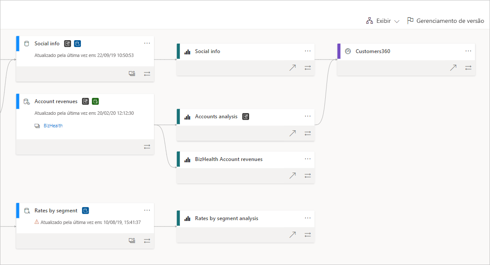
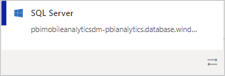
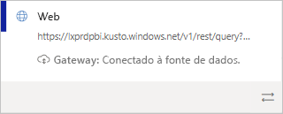
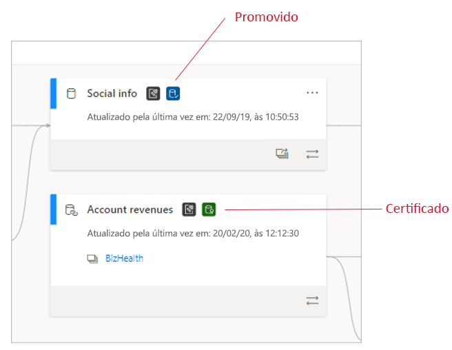
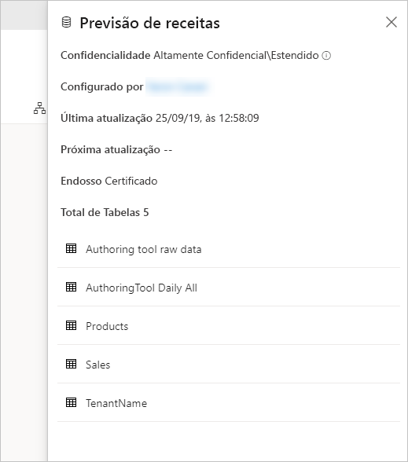
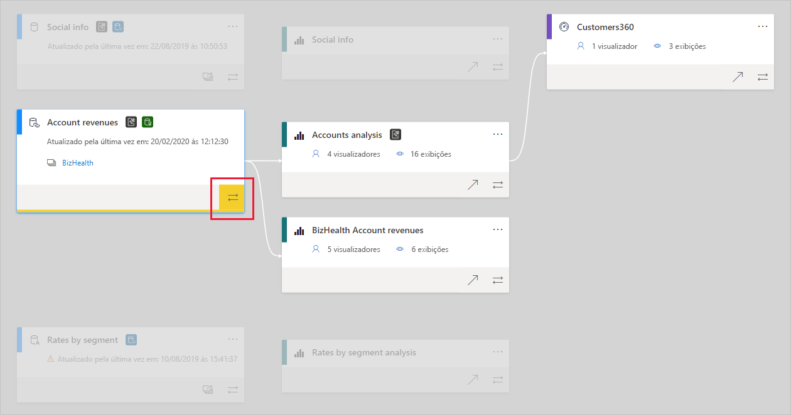

# Linhagem de dados
Em projetos modernos de BI (business intelligence), entender o fluxo de dados da fonte de dados para o destino pode ser um desafio. O desafio será ainda maior se você tiver criado projetos analíticos avançados que abrangem uma variedade de fontes de dados, artefatos e dependências. Perguntas como "o que acontecerá se eu alterar esses dados?" ou "por que este relatório não está atualizado?" podem ser difíceis de responder. Elas podem exigir uma equipe de especialistas ou uma investigação profunda para serem entendidas. Desenvolvemos uma exibição de linhagem de dados para ajudar você a responder a essas perguntas.

 
O Power BI tem vários tipos de artefatos, como dashboards, relatórios, conjuntos de dados e fluxos de dados. Muitos conjuntos de dados e fluxos de dados se conectam a fontes de dados externas, como o SQL Server, e a conjuntos de dados externos em outros workspaces. Quando um conjunto de dados é externo a um workspace do qual você é proprietário, ele pode estar em um workspace que seja propriedade de uma pessoa na TI ou de outro analista. Em última análise, as fontes de dados e os conjuntos de dados externos dificultam saber a origem dos dados. Para projetos complexos e para aqueles mais simples, apresentamos a exibição de linhagem.

Na exibição de linhagem, você vê as relações de linhagem entre todos os artefatos de um workspace e todas as dependências externas. Ela mostra as conexões entre todos os artefatos do workspace, incluindo conexões a fluxos de dados, upstream e downstream.

## Explorar a exibição de linhagem

Todo workspace, seja novo ou clássico, tem automaticamente uma exibição de linhagem. Você precisa, no mínimo, de uma função Colaborador no workspace para exibi-la. Confira [Permissões](#permissions) neste artigo para obter detalhes.

* Para acessar a exibição de linhagem, acesse a exibição de lista do workspace. Toque na seta ao lado de **Exibição de lista** e selecione **Exibição de linhagem**.

   

Nessa exibição, você vê todos os artefatos do workspace e como os dados fluem de um artefato para outro.

**Fontes de dados**

Você vê as fontes de dados das quais os conjuntos de dados e os fluxos de dados obtêm os dados. Nos cartões da fonte de dados, você vê mais informações que podem ajudar a identificar a origem. Por exemplo, para o Azure SQL Server, você também vê o nome do banco de dados.

 
**Gateways**

Se uma fonte de dados estiver conectada por meio de um gateway local, as informações do gateway serão adicionadas ao cartão da fonte de dados. Caso tenha permissões, seja como administrador do gateway ou como um usuário da fonte de dados, você verá mais informações, como o nome do gateway.

**Conjuntos de dados e fluxos de dados**
 
Em conjuntos de dados e fluxos de dados, você pode se eles foram certificados ou promovidos e a hora da última atualização.

 
Se um relatório no workspace for criado em um conjunto de dados ou fluxo de dados que esteja localizado em outro workspace, você verá o nome do workspace de origem no cartão do conjunto ou fluxo de dados. Selecione o nome do workspace de origem para acessá-lo.

* Em qualquer artefato, selecione **Mais opções (...)** para exibir o menu de opções. Ele apresenta todas as mesmas ações disponíveis na exibição de lista.

Para ver mais metadados em qualquer artefato, selecione o próprio cartão do artefato. Informações adicionais sobre o artefato são exibidas em um painel lateral. Na imagem a seguir, o painel lateral exibe os metadados de um conjunto de dados selecionado.

 
## Mostrar a linhagem de qualquer artefato 

Digamos que você deseje ver a linhagem de um artefato específico.

* Selecione as setas duplas abaixo do artefato.

   

   O Power BI realça todos os artefatos relacionados a esse artefato e esmaece o restante. 

## Navegação e tela inteira 

A exibição de linhagem é uma tela interativa. Use o mouse e o touchpad para navegar na tela e ampliá-la ou reduzi-la.

* Para ampliá-la e reduzi-la, use o menu no canto inferior direito, o mouse ou o touchpad.
* Para ter mais espaço para o próprio grafo, use a opção de tela inteira no canto inferior direito. 

    

## Permissões

* Você precisa de uma licença do Power BI Pro para ver a exibição de linhagem.
* A exibição de linhagem só está disponível para os usuários com acesso ao workspace.
* Os usuários precisam ter uma função de Administrador, Membro ou Colaborador no workspace. Usuários com a função Espectador não podem alternar para a exibição de linhagem.

## Considerações e limitações

- A exibição de linhagem não está disponível no Internet Explorer. Confira [Navegadores compatíveis com o Power BI](../power-bi-browsers.md) para obter detalhes.

## Próximas etapas

* [Introdução aos conjuntos de dados entre workspaces (versão prévia)](../service-datasets-across-workspaces.md)
* [Análise do impacto do conjunto de dados](service-dataset-impact-analysis.md)
