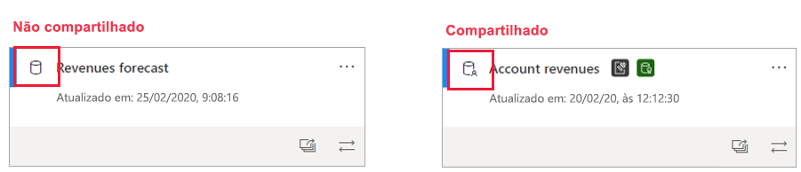
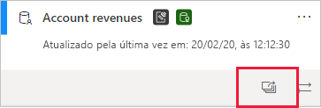
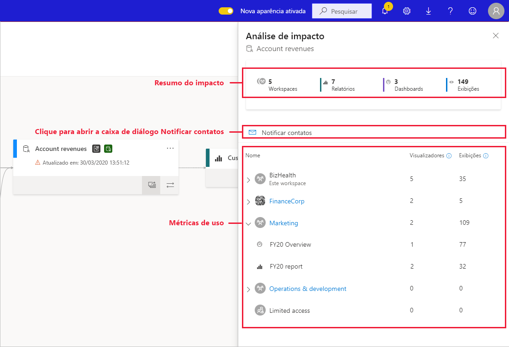
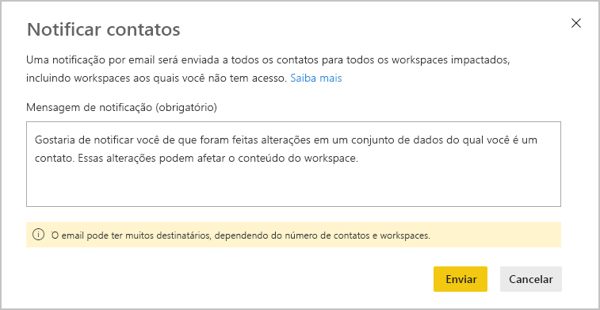
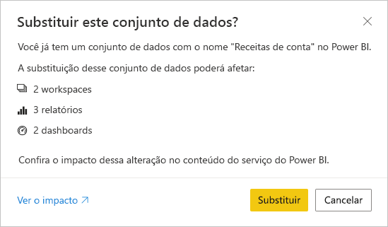

# Análise do impacto do conjunto de dados

Quando você faz alterações em um conjunto de dados ou está considerando fazer alterações, é importante poder avaliar o impacto que essas alterações terão nos relatórios e dashboards downstream que dependem desse conjunto de dados. A **análise de impacto do conjunto de dados** fornece informações que podem ajudar você a fazer essa avaliação.
* Ela mostra quantos workspaces, relatórios e dashboards podem ser afetados por sua alteração e proporciona uma navegação fácil para os workspaces nos quais os relatórios e dashboards afetados estão localizados para você poder investigar ainda mais.
* Ela mostra o número de visitantes únicos e o número de exibições que existem nos itens potencialmente afetados. Isso ajuda a determinar o impacto geral da alteração para o item downstream. Por exemplo, é provável que seja mais importante investigar o efeito de uma alteração em um relatório que tenha 20.000 visualizadores únicos do que investigar o efeito da alteração em um relatório com três visualizadores.
* Ela oferece uma forma fácil de notificar as pessoas relevantes sobre uma alteração que você fez ou que está pensando em fazer.

A análise de impacto do conjunto de dados é facilmente iniciada na [exibição de linhagem de dados](service-data-lineage.md).

## Identificar conjuntos de dados compartilhados

Você pode executar a análise de impacto do conjunto de dados em conjuntos de dados compartilhados e não compartilhados. No entanto, ela é particularmente útil para conjuntos de dados compartilhados entre workspaces, em que é muito mais complicado obter uma visão clara das dependências downstream do que com conjuntos de dados não compartilhados, cujas dependências estão todas localizadas no mesmo workspace que o próprio conjunto de dados.

Na exibição de linhagem, você pode informar a diferença entre conjuntos de dados compartilhados e não compartilhados pelo ícone exibido no canto superior esquerdo do cartão do conjunto de dados.

## Executar a análise de impacto do conjunto de dados

Você pode executar a análise de impacto em qualquer conjunto de dados no workspace, seja ele compartilhado ou não. Não é possível executar a análise de impacto em conjuntos de dados externos mostrados na exibição de linhagem, mas que estão, na verdade, localizados em outro workspace. Para executar a análise de impacto em um conjunto de dados externo, é necessário navegar até o workspace de origem.

Para executar a análise de impacto do conjunto de dados, clique no botão de análise de impacto no cartão do conjunto de dados.

O painel lateral da análise de impacto é aberto.

* O **resumo do impacto** mostra o número de workspaces, relatórios e dashboards potencialmente afetados, além do número total de exibições para todos os relatórios e dashboards downstream conectados ao conjunto de dados.
* O link **notificar contatos** abre uma caixa de diálogo em que você pode criar e enviar uma mensagem sobre alterações do conjunto de dados feitas nas listas de contatos dos workspaces afetados. 
* O **detalhamento de uso** que mostra, para cada workspace, o número total de exibições para os relatórios e dashboards potencialmente afetados que ele contém e para cada relatório e, para cada relatório e dashboard, o número total de visualizadores e de exibições, em que
   * Visualizadores: o número de usuários diferentes que exibiram um relatório ou dashboard.
   * Exibições: o número de exibições de um relatório ou dashboard

As métricas de uso estão relacionadas aos últimos 30 dias, exceto o dia atual. A contagem inclui o uso proveniente de aplicativos relacionados. As métricas ajudam você a entender o uso do conjunto de dados em todo o locatário, bem como avaliar o impacto que as alterações no seu conjunto de dados podem ter.

## Notificar contatos

Se você fez uma alteração em um conjunto de dados ou está pensando em fazer uma alteração, talvez seja interessante entrar em contato com os usuários relevantes para informá-los sobre isso. Quando você notifica os contatos, um email é enviado para as [listas de contatos](../service-create-the-new-workspaces.md#workspace-contact-list) de todos os workspaces afetados. Seu nome é exibido no email para que os contatos possam encontrá-lo e responder de volta em um novo thread de email. 

1. Clique em **Notificar contatos** no painel lateral da análise de impacto. A caixa de diálogo notificar contatos será exibida.

   

1. Na caixa de texto, forneça alguns detalhes sobre a alteração.
1. Quando a mensagem estiver pronta, clique em **Enviar**.

> [!NOTE]
> A opção Notificar contatos não estará disponível se o conjunto de dados no qual você estiver executando a análise de impacto estiver localizado em um workspace clássico.

## Privacidade

Para executar a análise de impacto em um conjunto de dados, é necessário ter permissões de gravação nele. No painel lateral da análise de impacto, só é possível ver nomes reais para workspaces, relatórios e dashboards aos quais você tem acesso. Os itens aos quais você não tem acesso estão listados como **Acesso limitado**. Isso ocorre porque alguns nomes de item podem conter informações pessoais.

Mesmo que você não tenha acesso a alguns workspaces, você ainda verá métricas de uso resumidas para esses workspaces, e suas mensagens para notificar contatos chegarão às listas de contatos desses workspaces.

## Análise de impacto do Power BI Desktop

Quando você faz uma alteração em um conjunto de dados no Power BI Desktop e o publica novamente no serviço do Power BI, uma mensagem mostra quantos workspaces, relatórios e dashboards são potencialmente afetados pela alteração e solicita que você confirme que deseja substituir o conjunto de dados atualmente publicado pelo que você modificou. A mensagem também fornece um link para a análise de impacto completa do conjunto de dados no serviço do Power BI, em que você pode ver mais informações e tomar medidas para atenuar os riscos de sua alteração.

> [!NOTE]
> As informações mostradas na mensagem somente indicam o potencial de impacto; elas não indicam necessariamente que algo apresenta problemas. Geralmente, as alterações do conjunto de dados não têm efeito negativo sobre os relatórios e dashboards downstream; ainda assim, você receberá essa mensagem que esclarece sobre o impacto potencial.
>
>Na mensagem, o número de workspaces só será mostrado se mais de um workspace contiver relatórios e dashboards afetados.

## Limitações

* No momento, não há suporte para métricas de uso em workspaces clássicos e pessoais.

## Próximas etapas

* [Introdução aos conjuntos de dados entre workspaces (versão prévia)](../service-datasets-across-workspaces.md)
* [Linhagem de dados](service-data-lineage.md)
