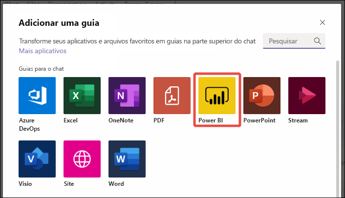
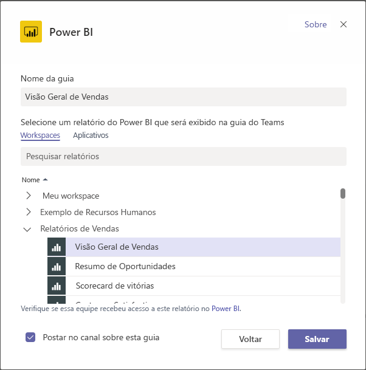
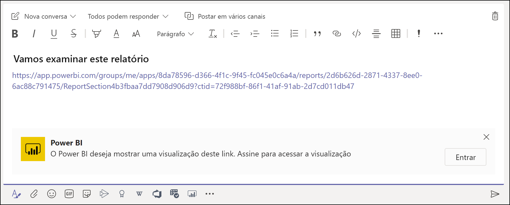
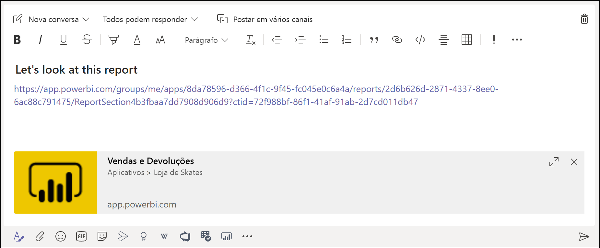

# Inserir relatórios no Microsoft Teams com a guia do Power BI

Com a guia Power BI atualizada para o Microsoft Teams, você pode facilmente inserir relatórios interativos em canais e chats do Microsoft Teams. Use a guia Power BI para o Microsoft Teams para ajudar seus colegas a localizar os dados que sua equipe usa e discutir os dados nos canais da equipe.  Quando você cola um link para relatórios, dashboards e aplicativos na caixa de mensagem do Microsoft Teams, a visualização do link mostra informações sobre eles. Os usuários podem entender com mais facilidade a qual item o link os levará.

## Requisitos

Para que a **guia do Power BI para o Microsoft Teams** funcione, verifique se:

- Os usuários têm uma licença do Power BI Pro ou se o relatório está contido em uma [capacidade do Power BI Premium (SKU P ou EM)](../admin/service-premium-what-is.md) com uma licença do Power BI.
- O Microsoft Teams tem a guia do Power BI.
- O usuário entrou no serviço do Power BI para ativar a licença do Power BI a fim de consumir o relatório.
- Os usuários precisam ter permissão para ver o relatório.

Além disso, para que as **visualizações de link** funcionem, verifique se:
- Os usuários atendem aos requisitos de uso da guia do Power BI para o Microsoft Teams.
- Os usuários entraram no serviço de bot do Power BI. 

## Insira seu relatório

Siga estas etapas para inserir seu relatório em um canal ou um chat do Microsoft Teams.

1. Abra um canal ou um chat no Microsoft Teams e selecione o ícone **+** .

    

2. Selecione a guia Power BI.

    

3. Use as opções fornecidas para escolher um relatório em um workspace, na seção Compartilhado comigo ou em um aplicativo do Power BI.

    

4. O nome da guia é atualizado automaticamente para corresponder ao nome do relatório, mas você pode alterá-lo. 

5. Pressione **Salvar**.

## Relatórios compatíveis para inserção da guia do Power BI
Você pode inserir os seguintes tipos de relatórios na guia do Power BI:

- Relatórios interativos e paginados.
- Relatórios em Meu workspace, novas experiências de workspace e workspaces clássicos.
- Relatórios em aplicativos do Power BI.

## Obter uma visualização de link

Siga estas etapas para obter uma visualização de link para o conteúdo no serviço do Power BI.

1. Copie um link para um relatório, um dashboard ou um aplicativo no serviço do Power BI. Por exemplo, copie o link da barra de endereços do navegador.

2. Cole o link na caixa de mensagem do Microsoft Teams. Entre no serviço de visualização de link, se solicitado. Talvez seja necessário aguardar alguns segundos para que a visualização do link seja carregada.

    

3. A visualização de link básica é mostrada após a entrada bem-sucedida.

    

4. Selecione o ícone de expansão para mostrar o cartão de visualização avançada.

    

5. O cartão de visualização de link avançada mostra o link e os botões de ação relevantes

    

6. Envie a mensagem.

## Conceder acesso aos relatórios

A inserção de um relatório no Microsoft Teams ou o envio de um link a um item não concede automaticamente aos usuários a permissão para ver o relatório. É necessário [permitir que os usuários vejam o relatório no Power BI](service-share-dashboards.md). Você pode usar um grupo do Office 365 para sua equipe para facilitar. 

> [!IMPORTANT]
> Certifique-se de examinar quem pode ver o relatório dentro do serviço do Power BI e de conceder acesso aos que não aparecem na lista.

Uma forma de garantir que todos da sua equipe tenham acesso aos relatórios é colocar os relatórios em um só workspace no Power BI e fornecer à sua equipe o acesso ao workspace no Grupo do Office 365.

## Visualizações de link 

As visualizações de link são fornecidas para os seguintes itens no Power BI:
- Relatórios
- Dashboards
- Aplicativos

O serviço de visualização de link exige a entrada dos usuários. Para sair do serviço, selecione o ícone do Power BI na parte inferior da caixa de mensagem e selecione Sair.

## Iniciar uma conversa

Quando você adiciona uma guia de relatório do Power BI ao Teams, o Teams automaticamente cria uma conversa da guia para o relatório. 

- Selecione **Mostrar conversa de guia** no canto superior direito.

    

    O primeiro comentário é um link para o relatório. Todos no canal do Teams podem ver e discutir o relatório na conversa.

    

## Limitações e problemas conhecidos

- O Power BI não dá suporte aos mesmos idiomas localizados que o Microsoft Teams. Como resultado, você não verá a localização correta no relatório inserido.
- Os dashboards do Power BI não podem ser inseridos na guia do Power BI para o Microsoft Teams.
- Um usuário sem uma licença do Power BI ou uma permissão no relatório verá uma mensagem "O conteúdo não está disponível".
- Você poderá ter problemas se usar o Internet Explorer 10. <!--You can look at the [browsers support for Power BI](../consumer/end-user-browsers.md) and for [Office 365](https://products.office.com/office-system-requirements#Browsers-section). -->
- Não há suporte para os [filtros de URL](service-url-filters.md) na guia do Power BI para o Microsoft Teams.
- Em nuvens nacionais, a nova guia do Power BI não está disponível. Pode estar disponível uma versão mais antiga que não dá suporte à nova experiência de workspace nem a relatórios em aplicativos do Power BI. 
- Depois de salvar a guia, você não poderá alterar o nome da guia por meio das configurações dela. Use a opção de renomear para alterá-lo.
- Não há suporte para logon único no serviço de visualização de link.
- As visualizações de link não funcionam em chat de reuniões ou canais privados.

## Próximas etapas
- [Compartilhar um painel com seus colegas e com outras pessoas](service-share-dashboards.md)  
- [Criar e distribuir um aplicativo no Power BI](service-create-distribute-apps.md)  
- [O que é o Power BI Premium?](../admin/service-premium-what-is.md)

Mais perguntas? [Experimente perguntar à Comunidade do Power BI](https://community.powerbi.com/)
