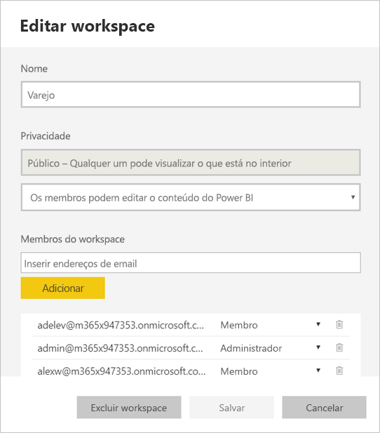
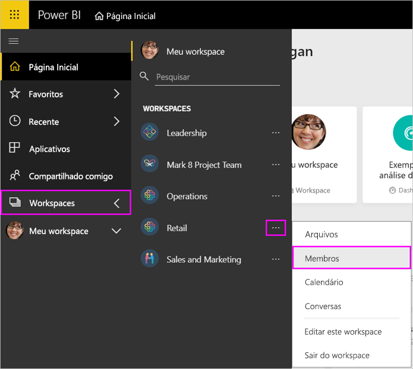
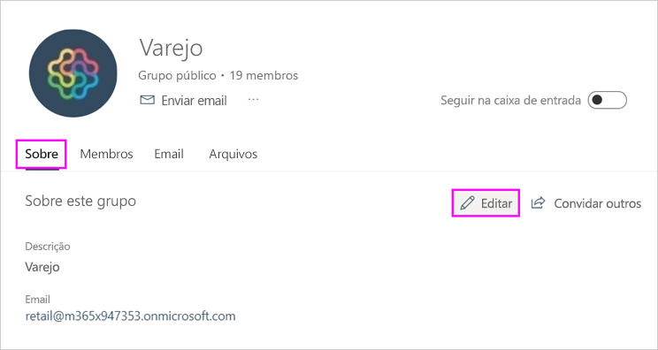

# Gerenciar seu workspace no Power BI e no Microsoft 365

Como criador ou administrador de um [workspace no Power BI](service-create-distribute-apps.md) ou no Microsoft 365, você gerencia alguns aspectos do seu workspace no Power BI. Outros aspectos que você gerencia no Microsoft 365.

> [!NOTE]
> A nova experiência de workspace mudará a relação entre os workspaces do Power BI e os grupos do Microsoft 365. Você não cria automaticamente um grupo do Microsoft 365 sempre que cria um dos workspaces. Leia sobre [criar os workspaces](service-create-the-new-workspaces.md).

No **Power BI**, você pode:

* Adicionar ou remover membros do workspace, incluindo tornar um membro do workspace um administrador.
* Edite o nome do workspace.
* Excluir o workspace, o que também exclui o grupo do Microsoft 365.

No **Microsoft 365** é possível:

* Adicionar ou remover membros do grupo do workspace e também fazer com que um membro seja o proprietário.
* Edite o nome do grupo, a imagem, a descrição e outras configurações.
* Ver o endereço de email do grupo.
* Excluir o grupo.

Você precisa de uma licença do [Power BI Pro](../fundamentals/service-features-license-type.md) para ser um administrador ou um membro de um workspace. Os usuários de seu aplicativo também precisam de uma licença do Power BI Pro, a menos que seu workspace esteja em uma capacidade do Power BI Premium. Leia [O que é o Power BI Premium?](../admin/service-premium-what-is.md) para obter detalhes.

## Editar seu workspace no Power BI

1. No serviço do Power BI, selecione a seta ao lado de **Workspaces** > selecione **Mais opções** (...) ao lado do nome do workspace > **Editar este workspace**.

   

   > [!NOTE]
   > Você só verá **Editar este workspace** se você for um administrador de workspace.

1. Aqui você pode renomear o workspace, adicionar ou remover membros ou excluir o workspace.

   

1. Selecione **Salvar** ou **Cancelar**.

## Editar as propriedades do workspace do Power BI no Microsoft 365

Você também pode editar aspectos de um workspace diretamente no Outlook para Microsoft 365.

### Editar os membros do grupo de workspaces

1. No serviço do Power BI, selecione a seta ao lado de **Workspaces** > selecione **Mais opções** (...) ao lado do nome do workspace > **Membros**.

   

   Isso abre a exibição de grupo do Outlook para Microsoft 365 do seu workspace. Talvez seja necessário entrar em sua conta corporativa.

1. Selecione a função ao lado do nome de um colega da equipe para tornar a pessoa um **Membro** ou um **Proprietário**. Selecione o **X** para remover a pessoa do grupo.

   

### Adicionar uma imagem e definir outras propriedades do workspace

Quando você distribuir seu aplicativo do workspace, a imagem que você adicionar aqui será a imagem de seu aplicativo. Confira [Adicionar uma imagem ao workspace do Microsoft 365](service-create-workspaces.md#add-an-image-to-your-microsoft-365-workspace-optional) do artigo **Criar workspaces**.

1. Na exibição do Outlook para Microsoft 365 do seu workspace, acesse a guia **Sobre** e selecione **Editar**.

    
1. Você pode editar o nome, a descrição e o idioma de notificações relacionadas ao grupo. Você pode adicionar uma imagem e definir outras propriedades aqui.

   

1. Selecionar **Salvar** ou **Descartar**.

## Próximas etapas

* [Publicar um aplicativo no Power BI](service-create-distribute-apps.md)

* Mais perguntas? [Experimente a Comunidade do Power BI](https://community.powerbi.com/)
