# Monitorar métricas de uso na nova experiência de workspace

Saber como seu conteúdo está sendo usado ajuda a demonstrar seu impacto e priorizar esforços. As métricas de uso podem mostrar que um dos relatórios é usado diariamente por um grande segmento da organização e pode mostrar que um dashboard criado não está sendo exibido. Esse tipo de comentário é imprescindível para orientar seus esforços de trabalho.

Ao criar relatórios em workspaces modernos, você terá acesso a relatórios de métricas de uso aprimorados que permitem descobrir como os relatórios estão sendo usados em toda a organização e quem os está usando. Você também pode identificar problemas de desempenho de alto nível. Os relatórios de uso aprimorados da experiência moderna do Workspace substituem os relatórios de métricas de uso existentes documentados em [Monitorar as métricas de uso em dashboards e relatórios do Power BI](service-usage-metrics.md).

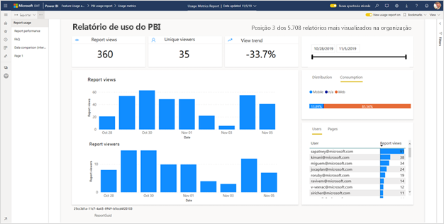

> [!NOTE]
> Você só pode executar relatórios de métricas de uso no serviço do Power BI. No entanto, se salvar um relatório de métricas de uso ou fixá-lo em um dashboard, você poderá abrir e interagir com ele em dispositivos móveis.

## Pré-requisitos

- É necessária uma licença do Power BI Pro para executar e acessar os dados de métricas de uso. Entretanto, o recurso de métricas de uso captura informações de uso de todos os usuários, independentemente da licença.
- Para acessar as métricas de uso aprimoradas de um relatório, este deve estar em um workspace moderno, e você deve ter acesso de edição a ele.
- O administrador do Power BI precisa habilitar as métricas de uso para criadores de conteúdo. O administrador do Power BI também precisa habilitar a coleta de dados por usuário nas métricas de uso. Leia sobre como [habilitar essas opções no portal de administração](../admin/service-admin-portal.md#control-usage-metrics).

## Criar e exibir um relatório de métricas de uso aprimorado

Somente usuários com permissões de administrador, membro ou colaborador podem visualizar o relatório de métricas de uso aprimorado. As permissões de visualizador não são suficientes. Se você tem permissão de colaborador em um workspace moderno no qual um relatório está, use o seguinte procedimento para exibir as métricas de uso aprimoradas:

1. Abra o workspace que contém o relatório sobre o qual você deseja analisar as métricas de uso.
2. Na lista de conteúdo do workspace, abra o menu de contexto do relatório e selecione **Exibir relatório de métricas de uso**. Você também pode abrir o relatório acessando o menu de contexto na barra de comandos e selecionando **Métricas de uso**.

    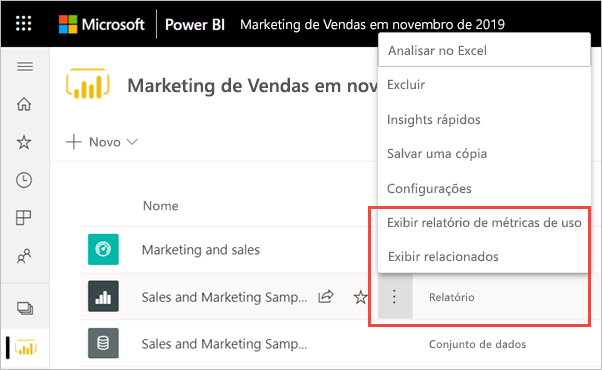

1. Na primeira vez que você fizer isso, o Power BI criará o relatório de métricas de uso e lhe informará quando ele estiver pronto.

    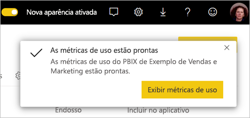

1. Para conferir os resultados, selecione **Exibir métricas de uso**.
2. Caso esta seja a primeira vez que você está fazendo isso, é possível que o Power BI abra o relatório de métricas de uso antigo. Para exibir o relatório de métricas de uso aprimorado, no canto superior direito, alterne a opção Novo relatório de uso para o modo **Ativado**.

    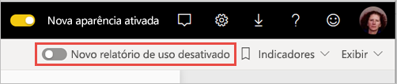

    > [!NOTE]
    > Você só poderá ver a opção Novo relatório de uso se o relatório residir em um workspace moderno. Os workspaces herdados não oferecem relatórios aprimorados de métricas de uso.

## Sobre o relatório de métricas de uso aprimorado

Quando você exibe o relatório de métricas de uso aprimorado seguindo o procedimento acima, o Power BI gera um relatório predefinido com métricas de uso desse conteúdo para os últimos 30 dias. O relatório é semelhante aos relatórios do Power BI que você já conhece. Você pode fatiar com base em como seus usuários finais tiveram acesso – se eles acessaram pela Web, por um aplicativo móvel etc. Conforme seus relatórios evoluem, as métricas também evoluem, sendo atualizadas diariamente com novos dados.

> [!NOTE]
> Os relatórios de métricas de uso não são exibidos nas listas Recente, Workspaces, Favoritos nem em outras listas de conteúdo. Eles não podem ser adicionados a um aplicativo. Se você fixar um bloco de um relatório de métricas de uso em um painel, não será possível adicionar esse painel a um aplicativo.

### Conjunto de dados do relatório de métricas de uso

O relatório de métricas de uso aprimorado baseia-se em um conjunto de dados de um relatório que o Power BI cria automaticamente quando você inicializa o relatório de métricas de uso aprimorado pela primeira vez. O Power BI atualiza esse conjunto de dados diariamente. Embora não seja possível alterar a programação de atualização, você pode atualizar as credenciais que o Power BI usa para introduzir novos dados de métricas de uso. Poderá ser necessário retomar a atualização programada se as credenciais expirarem ou se você remover o usuário que inicializou o relatório de métricas de uso pela primeira vez a partir de um workspace em que o conjunto de dados está.

### Páginas de relatório de métricas de uso

O relatório de métricas de uso aprimorado inclui as seguintes páginas:

- **Uso do relatório**: fornece informações de visualização e dos visualizadores do relatório, como quantos usuários o acessaram em determinada data.
- **Desempenho do relatório**: mostra os horários de abertura típicos do relatório, divididos por método de consumo e tipos de navegador.
- **Perguntas frequentes**: fornece respostas para perguntas frequentes, como "O que é um 'Visualizador' e o que é uma 'Visualização'?".

### Quais métricas são relatadas?

| **Página** | **Métrica** | **Descrição** |
| --- | --- | --- |
| Uso de relatórios | Visualizações do relatório | Uma visualização do relatório é registrada sempre que alguém o abre. Observe que a definição de visualização é diferente nos relatórios de métricas de uso anteriores. A alteração de páginas do relatório não é mais considerada uma visualização adicional. |
| Uso de relatórios | Visualizadores únicos | Um visualizador é alguém que abriu o relatório pelo menos uma vez durante determinado período (com base na conta de usuário do Azure Active Directory). |
| Uso de relatórios | Tendência de visualização | A tendência da visualização reflete as alterações na contagem de visualizações ao longo do tempo. Ela compara a primeira metade do período selecionado com a segunda metade. |
| Uso de relatórios | Segmentação de datas | Você pode alterar os períodos na página de uso do Relatório, por exemplo, para calcular as tendências semanal ou quinzenalmente. No canto inferior esquerdo da página de Uso do relatório, é possível determinar as datas mais antiga e mais recente entre as quais os dados de uso estarão disponíveis no relatório selecionado. |
| Uso de relatórios | Classificação | Com base na contagem de visualizações, a classificação mostra a popularidade de um relatório em comparação com todos os outros relatórios da organização.   |
| Uso de relatórios | Visualizações do relatório por dia | Número total de visualizações por dia. |
| Uso de relatórios | Visualizadores diários do relatório | Número total de usuários diferentes que visualizaram o relatório (com base na conta de usuário do Azure Active Directory). |
| Uso de relatórios | Método de distribuição | Forma como os usuários obtêm acesso ao relatório, por exemplo, na condição de membros de um workspace, ao ter o relatório compartilhado com eles ou ao instalar um aplicativo. |
| Uso de relatórios | Segmentação de plataforma | Se o relatório foi acessado por meio do serviço do Power BI (powerbi.com), do Power BI Embedded ou de um dispositivo móvel. |
| Uso de relatórios | Usuários com visualizações do relatório | Mostra a lista de usuários que abriram o relatório classificada por contagem de visualizações. |
| Uso de relatórios | Páginas | Se o relatório tiver mais de uma página, segmente o relatório por página(s) que foi exibido. Se houver uma opção de lista "Em Branco", isso significará que uma página de relatório foi adicionada recentemente (em até 24 horas, o nome real da nova página será exibido na lista de segmentação) e/ou que páginas do relatório foram excluídas. "Em branco" captura esses tipos de situações. |
| Desempenho do relatório | Horário de abertura típico | O horário de abertura típico do relatório corresponde ao 50º percentil do tempo necessário para abri-lo. Em outras palavras, é o tempo abaixo do qual 50% das ações de abertura do relatório são concluídas. A página Desempenho do relatório também divide o horário de abertura típico do relatório por método de consumo e tipo de navegador.   |
| Desempenho do relatório | Tendência de horário de abertura | A tendência de horário de abertura reflete as alterações no desempenho de abertura do relatório ao longo do tempo. Ela compara os horários de abertura do relatório da primeira metade do período selecionado com os horários de abertura da segunda metade. |
| Desempenho do relatório | Segmentação de datas | Você pode alterar o período na página de Desempenho do relatório, por exemplo, para calcular tendências semanal ou quinzenalmente. No canto inferior esquerdo da página de Desempenho do relatório, é possível determinar as datas mais antiga e mais recente entre as quais os dados de uso estarão disponíveis no relatório selecionado. |
| Desempenho do relatório | Desempenho diário | O desempenho de 10%, 50% e 90% das ações de abertura do relatório, calculadas por dia. |
| Desempenho do relatório | Desempenho de 7 dias | O desempenho de 10%, 50% e 90% das ações de abertura do relatório, calculadas por dia nos últimos 7 dias. |
| Desempenho do relatório | Método de consumo | Forma como os usuários abriram o relatório, como por meio do serviço do Power BI (powerbi.com), do Power BI Embedded ou de um dispositivo móvel. |
| Desempenho do relatório | Navegadores | Qual navegador os usuários usaram para abrir o relatório, como Firefox, Microsoft Edge e Chrome. |

## Atualizar credenciais do relatório de métricas de uso

Use o procedimento a seguir para assumir o controle de um conjunto de dados do Relatório de Métricas de Uso e atualizar as credenciais.

1. Abra o workspace que contém o relatório para o qual você deseja atualizar o conjunto de dados do Relatório de Métricas de Uso.
2. Na barra de cabeçalho preta na parte superior, selecione o ícone **Configurações** e selecione **Configurações**.

    

3. Alterne para a guia **Conjuntos de dados**.

1. Selecione o conjunto de dados do Relatório de Métricas de Uso. 

    
    
    Se você não é o proprietário atual do conjunto de dados, deve assumir a propriedade antes de atualizar as credenciais da fonte de dados. 
    
5. Selecione o botão **Assumir o controle** para exibir a caixa de diálogo **Assumir o controle das configurações do conjunto de dados**. Agora, selecione **Assumir o controle** novamente.

1. Em **Credenciais da fonte de dados**, selecione **Editar credenciais**.

    

2. Na caixa de diálogo **Configurar Relatório de Métricas de Uso**, selecione **Entrar**.

    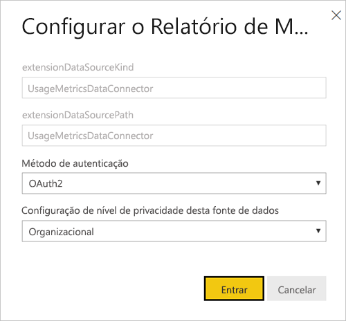

1. Conclua a sequência de entrada e observe a notificação de que a fonte de dados foi atualizada com sucesso.

    > [!NOTE]
    > O conjunto de dados do Relatório de Métricas de Uso contém dados de uso dos últimos 30 dias. Pode levar até 24 horas para que novos dados sejam importados. Não é possível disparar uma atualização manual usando a interface do usuário do Power BI.

## Desabilitar relatórios de métricas de uso

Os relatórios de métricas de uso são um recurso que o administrador global ou do Power BI pode ativar ou desativar. Os administradores têm controle granular sobre quais usuários terão acesso às métricas de uso. Elas são ativadas por padrão para todos os usuários na organização. Confira [Controlar métricas de uso](../admin/service-admin-portal.md#control-usage-metrics) no artigo do portal de administração para obter detalhes sobre essas configurações.

> [!NOTE]
> Somente administradores do locatário do Power BI podem ver o portal do administrador e editar as configurações.

## Excluir informações do usuário dos relatórios de métricas de uso

Por padrão, os dados por usuário estão habilitados para as métricas de uso e as informações de conta do consumidor do conteúdo estão incluídas no relatório de métricas. Se os administradores não quiserem expor essas informações para alguns ou todos os usuários, eles poderão excluir as informações de usuário do relatório de uso. Para isso, basta desabilitar os dados por usuário nas métricas de uso de criadores de conteúdo nas configurações de locatário do portal de administração do Power BI para grupos de segurança especificados ou para toda a organização.

1. Na guia **Configurações do locatário** do portal de administração, em **Configurações de auditoria e uso**, expanda **Dados por usuário em métricas de criadores de conteúdo** e selecione **Desabilitado**.

2. Decida se deseja **Excluir todos os dados existentes por usuário no conteúdo atual de métricas de uso** e selecione **Aplicar**.

    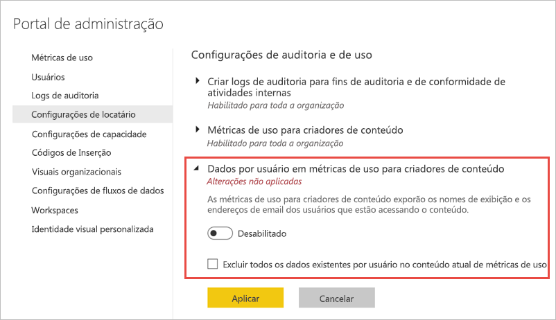

Se as informações do usuário forem excluídas, ele será indicado no relatório de uso como Sem nome.

Ao desabilitar as métricas de uso para toda a organização, os administradores podem usar a opção Excluir todo o conteúdo existente de métricas de uso, para excluir todos os relatórios e blocos de dashboard existentes que foram criados usando os relatórios de métricas de uso. Esta opção remove todo o acesso aos dados de métricas de uso para todos os usuários da organização que já podem estar usando esses dados. A exclusão do conteúdo de métricas de uso existente é irreversível.

> [!NOTE]
> Somente administradores do locatário do Power BI podem ver o portal de administração e configurar os dados por usuário em métricas de uso da configuração de criadores de conteúdo.

## Personalizar o relatório de métricas de uso

Para pesquisar os dados do relatório ou criar seus próprios relatórios no conjunto de dados subjacente, você tem várias opções:

- **[Fazer uma cópia do relatório](#create-a-copy-of-the-usage-report) no serviço do Power BI.**   Use a opção **Salvar uma cópia** para criar uma instância separada do relatório de métricas de uso, que você pode personalizar para atender às suas necessidades específicas.
- **[Conectar-se ao conjunto de dados](#create-a-new-usage-report-in-power-bi-desktop) com um novo relatório.**   Em cada workspace, o conjunto de dados é nomeado como "Relatório de Métricas de Uso", conforme explicado anteriormente na seção [Conjunto de dados do relatório de métricas de uso](#usage-metrics-report-dataset). Você pode usar o Power BI Desktop para criar relatórios de métricas de uso personalizados com base no conjunto de dados subjacente.
- **[Usar Analisar no Excel](#analyze-usage-data-in-excel).**   Você também pode aproveitar os recursos de segmentação, Tabelas Dinâmicas e gráficos do Microsoft Excel 2010 SP1 ou posterior para analisar os dados de uso do Power BI. Leia mais sobre o recurso [Analisar no Excel](service-analyze-in-excel.md).

### Criar uma cópia do relatório de uso

Quando você cria uma cópia do relatório de uso somente leitura predefinido, o Power BI cria uma instância editável do relatório. À primeira vista, ele parece ser o mesmo relatório. No entanto, agora você pode abrir o relatório no Modo de Exibição de Edição, adicionar novas visualizações, filtros e páginas, modificar ou excluir visualizações existentes e mais. O Power BI salva o novo relatório no workspace atual.

1. No novo relatório de métricas de uso, selecione o menu **Mais opções** (...) e escolha **Salvar uma cópia**.

    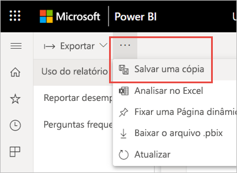

2. Na caixa de diálogo **Salvar seu relatório**, digite um nome e selecione **Salvar**.

    O Power BI cria um relatório editável do Power BI, salvo no workspace atual, e abre a cópia do relatório. 

3. Selecione o menu **Mais opções** (…) e, em seguida, selecione **Editar** para alternar para a visualização de Edição. 

    Por exemplo, você pode alterar os filtros, adicionar novas páginas e criar novas visualizações, formatar as fontes e cores etc.

1. O novo relatório é salvo na guia Relatórios do workspace atual, além de ser adicionado à lista de conteúdo Recente.

    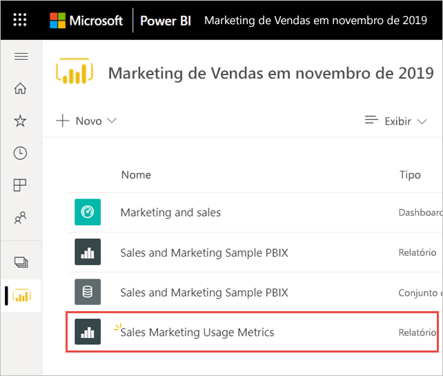

### Criar um novo relatório de uso no Power BI Desktop

Você pode criar um novo relatório de uso no Power BI Desktop com base no conjunto de dados do Relatório de Métricas de Uso. Para estabelecer uma conexão com o conjunto de dados do Relatório de Métricas de Uso e criar seu próprio relatório, você deve estar conectado ao serviço do Power BI no Power BI Desktop. 

1. Abra o Power BI Desktop.

2. Se você não estiver conectado ao serviço do Power BI, no menu **Arquivo**, selecione **Entrar**.

1. Para se conectar ao conjunto de dados do Relatório de Métricas de Uso, na faixa de opções da **Página Inicial**, selecione **Obter dados**.

4. No painel esquerdo, selecione **Power Platform** e **Conjuntos de dados do Power BI** > **Conectar**.

    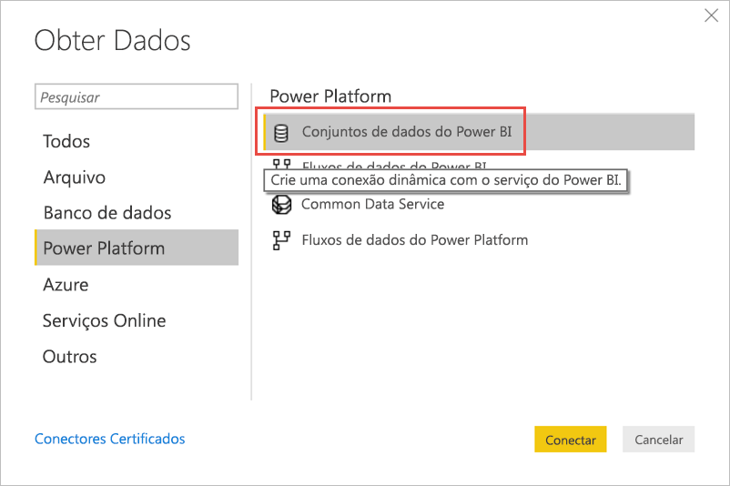

1. Encontre o conjunto de dados desejado ou digite *Relatório de Métricas de Uso* na caixa de pesquisa. 

6. Verifique, na coluna Workspace, se você está selecionando o conjunto de dados correto e selecione **Criar**. 

    

7. Observe a lista de Campos no Power BI Desktop, que fornece acesso às tabelas, colunas e medidas no conjunto de dados selecionado.

    

1. Agora você pode criar e compartilhar relatórios de uso personalizados, todos do mesmo conjunto de dados do Relatório de Métricas de Uso.

### Analisar dados de uso no Excel

Quando você se conecta aos dados de uso no Excel, pode criar Tabelas Dinâmicas que usam as medidas predefinidas. Observe que as Tabelas Dinâmicas do Excel não dão suporte à agregação do tipo "arrastar e soltar" de campos numéricos ao se conectar a um conjunto de dados do Power BI.

1. Primeiro, [crie uma cópia do relatório de métricas de uso](#create-a-copy-of-the-usage-report), se ainda não tiver feito isso. 

2. Abra o novo relatório de métricas de uso, selecione o menu **Mais opções** (…) e escolha **Analisar no Excel**.

    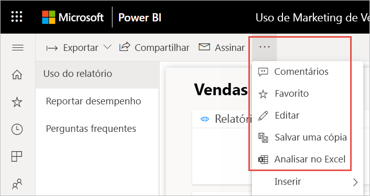

1. Se você vir a caixa de diálogo **Primeiro, você precisa de algumas atualizações do Excel**, selecione **Baixar** e instale as atualizações mais recentes de conectividade do Power BI ou selecione **Já instalei essas atualizações**.

    

    > [!NOTE]
    > Algumas empresas podem ter regras de Política de Grupo que impedem a instalação no Excel das atualizações necessárias do recurso Analisar no Excel. Se você não conseguir instalar as atualizações, entre em contato com seu administrador.

1. Na caixa de diálogo do navegador perguntando o que você deseja fazer com o arquivo report.odc das Métricas de Uso, selecione **Abrir**.

    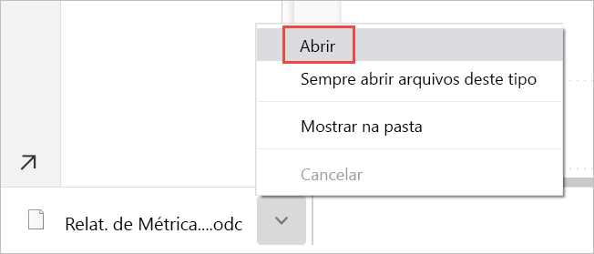

1. O Power BI inicializa o Excel. Verifique o nome e o caminho do arquivo .odc e selecione **Ativar**.

    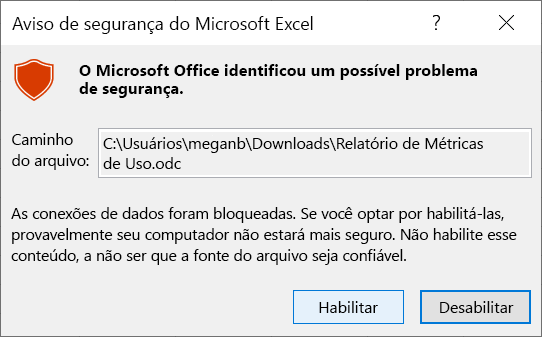

1. Agora que o Excel foi aberto e você tem uma Tabela Dinâmica vazia, pode arrastar campos para as caixas de Linhas, Colunas, Filtros e Valores e criar visualizações personalizadas dos dados de uso.

    

## Métricas de uso em nuvens nacionais

O Power BI está disponível em nuvens nacionais separadas. Essas nuvens oferecem os mesmos níveis de segurança, privacidade, conformidade e transparência que a versão global do Power BI, combinados com um modelo exclusivo para regulamentos locais sobre entrega de serviço, residência de dados, acesso e controle. Devido a esse modelo exclusivo para regulamentações locais, as métricas de uso não estão disponíveis em nuvens nacionais. Para obter mais informações, confira [nuvens nacionais](https://powerbi.microsoft.com/clouds/).

## Considerações e limitações

É importante entender que podem ocorrer diferenças ao comparar o relatório de métricas de uso aprimorado com seu relatório anterior. Mais especificamente em relação às métricas de uso de relatório, que agora são baseadas em dados de atividades coletados do serviço do Power BI. As versões anteriores do relatório de métricas de uso dependiam da telemetria do cliente, que nem sempre corresponde às métricas de uso coletadas do serviço. Além disso, o relatório de métricas de uso aprimorado usa uma definição diferente de "Visualização". Uma visualização é um evento de abertura de relatório, conforme registrado no serviço sempre que alguém abre um relatório. A alteração de páginas do relatório não é mais considerada uma visualização adicional.

> [!NOTE]
> Como o relatório de métricas de uso aprimorado depende de dados de atividades coletados do serviço do Power BI, as métricas de uso agora correspondem às contagens agregadas de atividades nos logs de auditoria e logs de atividade. A contagem insuficiente e excessiva de atividades devido a conexões de rede inconsistentes, bloqueadores de anúncios ou outros problemas do lado do cliente não confunde mais a contagem de visualizadores e de visualizações.

Além das diferenças acima entre os relatórios de métricas de uso anteriores e aprimorados, a versão prévia também tem as seguintes limitações:

- As métricas de uso do dashboard ainda dependem da versão anterior dos relatórios de métricas de uso.
- Os relatórios de métricas de uso aprimorados estão disponíveis apenas para relatórios em workspaces modernos. Os relatórios em workspaces herdados dão suporte apenas para a versão anterior dos relatórios de métricas de uso.
- As métricas de desempenho do relatório são baseadas na telemetria do cliente. Certos tipos de visualizações não estão incluídos nas medições de desempenho. Por exemplo, quando um usuário seleciona um link para visualizar um relatório em uma mensagem de email, a visualização é contabilizada no uso do relatório, mas o evento não é computado nas métricas de desempenho.
- As métricas de desempenho de relatório não estão disponíveis para relatórios paginados. A guia Páginas na página de Uso do relatório e os gráficos na página Desempenho do relatório não mostram dados para esses tipos de relatórios.
- O mascaramento do usuário não funciona conforme o esperado ao usar grupos aninhados. Se a sua organização tiver desabilitado os dados por usuário nas métricas de uso de criadores de conteúdo nas configurações de locatário do portal de administração do Power BI, apenas os membros no nível superior serão mascarados. Membros de subgrupos ainda ficarão visíveis.
- A inicialização do conjunto de dados do Relatório de Métricas de Uso pode levar alguns minutos, resultando na exibição de um relatório de métricas de uso em branco porque a interface do usuário do Power BI não aguarda o término da atualização. Verifique o histórico de atualização nas configurações do conjunto de dados do Relatório de Métricas de Uso para verificar se a operação de atualização foi bem-sucedida.
- A inicialização do conjunto de dados do Relatório de Métricas de Uso pode falhar por tempo limite esgotado durante a atualização. Confira a seção Solução de problemas abaixo para resolver esse problema.
- O compartilhamento é desabilitado para o relatório de métricas de uso. Para dar às pessoas acesso de leitura ao relatório, primeiro você precisa dar a elas acesso ao workspace.

## Perguntas frequentes

Além das considerações e limitações acima, as seguintes perguntas e respostas sobre métricas de uso podem ser úteis para usuários e administradores:

**P:** Não consigo executar as métricas de uso em um relatório.

**R:** Você só consegue ver as métricas de uso de relatórios que possui ou tem permissões para editar.

**P:** Por que não consigo ver o Novo relatório de uso na alternância no canto superior direito do meu relatório de métricas de uso existente?

**R:** O relatório de métricas de uso aprimorado está disponível apenas para relatórios em workspaces modernos.

**P:** Qual período o relatório abrange?

**R:** O relatório de uso é baseado em dados de atividades dos últimos 30 dias, excluindo as atividades do dia atual. Você pode restringir esse período usando a segmentação de datas na página de uso do relatório para, por exemplo, analisar apenas os dados da semana passada.

**P:** Quando verei os dados mais recentes de atividades?

**R:** O relatório de uso inclui dados de atividades até o último dia completo, com base no fuso horário UTC. Os dados mostrados no relatório também dependem do tempo de atualização do conjunto de dados. O Power BI atualiza o conjunto de dados uma vez por dia.

**P:** Os dados não parecem atualizados.

**R:** Observe que pode levar até 24 horas para que novos dados de atividades apareçam no relatório de uso.

**P:** Qual é a fonte dos dados de uso?

**R:** O conjunto de dados do Relatório de Métricas de Uso importa dados de um repositório de métricas de uso interno do Power BI usando um Conector de Dados de Métricas de Uso personalizado. Você pode atualizar as credenciais do Conector de Dados de Métricas de Uso na página de configurações do conjunto de dados do Relatório de Métricas de Uso.

**P:** Como posso me conectar aos dados? Ou alterar o relatório padrão?

**R:** Você pode criar uma cópia do relatório de uso predefinido e somente leitura. A cópia do relatório se conecta ao mesmo conjunto de dados do Relatório de Métricas de Uso e permite editar os detalhes do relatório.

**P:** O que é um "Visualizador" e o que é uma "Visualização"?

**R:** Um visualizador é alguém que abriu o relatório pelo menos uma vez durante o período. Uma visualização é um evento de abertura do relatório. Uma visualização do relatório é registrada sempre que alguém o abre.

Observe que a definição de visualização é diferente nos relatórios de métricas de uso anteriores. A alteração de páginas do relatório não é mais considerada uma visualização adicional.

**P:** Como é calculada a "Tendência de visualização"?

**R:** A tendência da visualização reflete as alterações na contagem de visualizações ao longo do tempo. Ela compara a primeira metade do período selecionado com a segunda metade. Você pode alterar o período usando a segmentação de datas na página de uso do relatório para, por exemplo, para calcular tendências semanal ou quinzenalmente.

**P:** O que significam "Distribuição" e "Plataforma"?

**R:** A distribuição mostra como os visualizadores obtiveram acesso a um relatório: compartilhado diretamente, por meio do acesso ao workspace ou em um aplicativo.

A plataforma indica a tecnologia que um visualizador usou para abrir um relatório: via PowerBI.com, Mobile ou Embedded.

**P:** Como funciona a classificação de relatórios?

**R:** Com base na contagem de visualizações, a classificação mostra a popularidade de um relatório em comparação com todos os outros relatórios da organização.

**P:** O que são "usuários sem nome"?

**R:** Sua organização pode decidir excluir informações do usuário do seu relatório de uso. Se elas forem excluídas, o relatório de uso indicará os usuários como Sem nome.

**P:** Qual é o "Horário típico de abertura do relatório"?

**R:** O horário de abertura típico do relatório corresponde ao 50º percentil do tempo necessário para abri-lo. Em outras palavras, é o tempo abaixo do qual 50% das ações de abertura do relatório são concluídas. A página Desempenho do relatório também divide o tempo de abertura típico do relatório por método de consumo e tipo de navegador.

**P:** Como é calculada a "Tendência de horário de abertura"?

**R:** A tendência de horário de abertura reflete as alterações no desempenho de abertura do relatório ao longo do tempo. Ela compara os horários de abertura do relatório da primeira metade do período selecionado com os horários de abertura da segunda metade. Você pode alterar o período usando a segmentação de datas na página de Desempenho do relatório para, por exemplo, calcular tendências semanal ou quinzenalmente.

**P:**  Existem quatro relatórios na versão anterior do relatório de métricas de uso, mas a versão aprimorada exibe apenas três.

**R:**  O relatório de métricas de uso aprimorado inclui apenas relatórios que foram abertos nos últimos 30 dias, enquanto a versão anterior abrange os últimos 90 dias. Se um relatório não for incluído no relatório de métricas de uso aprimorado, provavelmente ele não será usado em mais de 30 dias.

## Solução de problemas: Exclua o conjunto de dados

Se você suspeitar de problemas de consistência ou atualização de dados, talvez seja necessário excluir o conjunto de dados do Relatório de Métricas de Uso existente. Em seguida, você pode executar a opção Exibir Métricas de Uso novamente para gerar um novo conjunto de dados com seus relatórios de métricas de uso aprimorados associados. Siga estas etapas.

### Exclua o conjunto de dados

1. Abra o workspace que contém o relatório para o qual você deseja redefinir o conjunto de dados do Relatório de Métricas de Uso.

2. Na barra de cabeçalho preta na parte superior, selecione o ícone **Configurações** e selecione **Configurações**.

    

3. Alterne para a guia **Conjuntos de dados** e selecione o conjunto de dados Relatório de Métricas de Uso. 

    

5. Copie as IDs do workspace e do conjunto de dados da URL exibida na barra de endereços do navegador.

    

1. No seu navegador, vá para [https://docs.microsoft.com/rest/api/power-bi/datasets/deletedatasetingroup](https://docs.microsoft.com/rest/api/power-bi/datasets/deletedatasetingroup) e selecione o botão **Experimentar**.

    

1. Entre no Power BI, cole a ID do Workspace na caixa de texto **groupId**, a ID do conjunto de dados na caixa de texto **datasetId** e selecione **Executar**. 

    

1. No botão **Executar**, verifique se o serviço retorna um código de resposta **200**. Esse código indica que o conjunto de dados e seus relatórios de métricas de uso associados foram excluídos com êxito.

    

### Criar um novo relatório de métricas de uso

1. De volta ao serviço do Power BI, você verá que o conjunto de dados sumiu.

    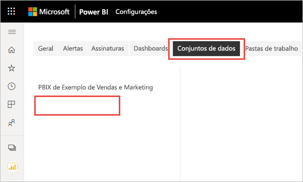

2. Se você ainda vir o relatório de Métricas de Uso na lista Relatórios, atualize o navegador.

3. [Criar um novo relatório de métricas de uso](#create--view-an-improved-usage-metrics-report).

## Próximas etapas

[Como administrar o Power BI no portal de administração](../admin/service-admin-portal.md)

Mais perguntas? [Experimente a Comunidade do Power BI](https://community.powerbi.com/)
