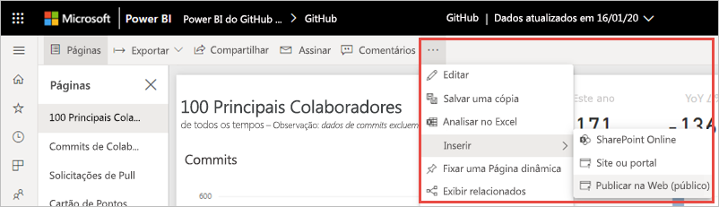

# Publicar na Web por meio do Power BI

Com a recurso **Publicar na Web** do Power BI, você pode inserir conteúdo interativo do Power BI com facilidade em postagens no blog, sites, emails ou mídia social. Você também pode editar, atualizar ou interromper o compartilhamento dos seus visuais publicados com facilidade.

> [!WARNING]
> Quando você usa **Publicar na Web**, qualquer pessoa na Internet pode exibir seu relatório ou visual publicado. A exibição não exige nenhuma autenticação. Ela inclui a exibição de dados no nível de detalhes que os relatórios agregam. Antes de publicar um relatório, verifique se não há nenhum problema em compartilhar os dados e as visualizações publicamente. Não publique informações confidenciais nem proprietárias. Em caso de dúvida, verifique as políticas de sua organização antes da publicação.

>[!Note]
>Você pode inserir o conteúdo com segurança em um site ou um portal interno. Use as opções [Inserir](service-embed-secure.md) ou [Inserir no SharePoint Online](service-embed-report-spo.md). Essas opções verificam se todas as permissões e a segurança de dados são aplicadas quando os usuários veem seus dados internos.

## Criar códigos de inserção com o recurso Publicar na Web

**Publicar na Web** está disponível para relatórios que podem ser editados em seus workspaces pessoais e de grupo.  Ele não está disponível para relatórios compartilhados com você ou para aqueles que dependem da Segurança em Nível de Linha para proteger os dados. Confira a seção [**Limitações**](#limitations) abaixo para ver uma lista completa de casos em que o recurso **Publicar na Web** não é compatível. Leia o **Aviso** indicado anteriormente neste artigo antes de usar o recurso **Publicar na Web**.

O breve vídeo a seguir mostra como esse recurso funciona. Em seguida, experimente você mesmo nas etapas abaixo.

<iframe width="560" height="315" src="https://www.youtube.com/embed/UF9QtqE7s4Y" frameborder="0" allowfullscreen></iframe>

As etapas a seguir descrevem como usar o recurso **Publicar na Web**.

1. Abra um relatório em um workspace que você possa editar e selecione **Mais opções (...)**   > **Inserir** > **Publicar na Web (público)** .

   
   
2. Se o administrador do Power BI não tiver concedido a você a permissão de criar códigos de inserção, você poderá precisar entrar em contato com ele.

   
   
   Para obter ajuda e encontrar a pessoa que pode habilitar o recurso Publicar na Web na sua organização, confira [Como encontrar o Administrador do Power BI](#find-your-power-bi-administrator) mais adiante neste artigo.

3. Examine o conteúdo da caixa de diálogo e selecione **Criar um código de inserção**.

   

4. Leia o aviso, conforme mostrado aqui, e confirme se os dados estão corretos para ser inseridos em um site público. Em caso afirmativo, selecione **Publicar**.

   

5. Uma caixa de diálogo é exibida com um link. Selecione o link para enviá-lo por email ou copie o HTML. Insira-o em um código como um iFrame ou cole-o diretamente em uma página da Web ou um blog.

   

6. Se anteriormente você tiver criado um código de inserção para um relatório e selecionar o recurso **Publicar na Web**, você não verá as caixas de diálogo nas etapas 2 a 4. Em vez disso, a caixa de diálogo **Código de inserção** será exibida:

   

   Você pode criar apenas um código de inserção para cada relatório.

### Dicas para modos de exibição

Quando você insere conteúdo em uma postagem no blog, normalmente é necessário ajustá-lo em um tamanho específico da tela.  É possível ajustar a altura e a largura na marca iFrame conforme necessário. No entanto, é necessário verificar se seu relatório se encaixa na área fornecida do iFrame; portanto, também é necessário definir um Modo de Exibição ao editar o relatório.

A tabela a seguir fornece diretrizes sobre o Modo de Exibição e como ele aparecerá quando for inserido.

| Modo de Exibição | Sua aparência quando inserido |
| --- | --- |
|  |**Ajustar à página** respeita a altura e a largura da página de seu relatório. Se você definir sua página para proporções *dinâmicas* como 16:9 ou 4:3, seu conteúdo será ajustado para caber no iFrame. Quando inserido em um iFrame, o uso de **Ajustar à página** pode resultar na *aplicação do formato letterbox*, no qual uma tela de fundo cinza é mostrada nas áreas do iFrame depois que o conteúdo é ajustado para caber no iFrame. Para minimizar a aplicação do formato letterbox, defina a altura e a largura do iFrame de modo condizente. |
|  |**Tamanho real** verifica se o relatório preserva seu tamanho, conforme definido na página do relatório. Isso pode resultar na exibição de barras de rolagem no iFrame. Defina a altura e a largura do iFrame para evitar barras de rolagem. |
|  |**Ajustar à largura** verifica se o conteúdo preenche a área horizontal do iFrame. Uma borda ainda será mostrada, mas o conteúdo será dimensionado para usar todo o espaço horizontal disponível. |

### Dicas para altura e largura do iFrame

Um código de inserção da configuração **Publicar na Web** será parecido com o exemplo a seguir:

 
É possível editar a largura e a altura manualmente para verificar se o código se ajusta exatamente da forma como você deseja na página em que é inserido.

Para obter um ajuste mais perfeito, tente adicionar 56 pixels à altura do iFrame para acomodar o tamanho atual da barra inferior. Se sua página de relatório usar o tamanho dinâmico, a tabela abaixo fornecerá alguns tamanhos que podem ser usados para obter um ajuste sem a aplicação do formato letterbox.

| Taxa | Tamanho | Dimensões (largura x altura) |
| --- | --- | --- |
| 16:9 |Pequeno |640 x 416 px |
| 16:9 |Médio |800 x 506 px |
| 16:9 |Grande |960 x 596 px |
| 4:3 |Pequeno |640 x 536 px |
| 4:3 |Médio |800 x 656 px |
| 4:3 |Grande |960 x 776 px |

## Gerenciar códigos de inserção

Após criar um código de inserção no recurso **Publicar na Web**, será possível gerenciar seus códigos no menu **Configurações** no Power BI. O gerenciamento de códigos de inserção inclui a capacidade de remover o visual ou o relatório de destino de um código (tornando o código de inserção inutilizável) ou de obter o código de inserção.

1. Para gerenciar seus códigos de inserção de **Publicar na Web** , abra a engrenagem **Configurações** e selecione **Gerenciar códigos de inserção**.

   

2. Seus códigos de inserção são exibidos.

   

3. É possível recuperar ou excluir um código de inserção. Excluí-lo desabilita qualquer link para esse relatório ou visual.

   

4. Se você selecionar **Excluir**, será solicitado a confirmar.

   

## Atualizações em relatórios e atualização de dados

Depois de criar seu código de inserção no recurso **Publicar na Web** e compartilhá-lo, o relatório será atualizado com todas as alterações feitas, e o link do código de inserção ficará ativo imediatamente. Qualquer pessoa que abrir o link poderá vê-lo. Após essa ação inicial, contudo, as atualizações em relatórios ou visuais poderão levar de duas a três horas até se tornarem visíveis para seus usuários. Para saber mais, confira a seção [**Como isso funciona**](#howitworks) posteriormente neste artigo. 

### Atualização de dados

As atualizações de dados são refletidas automaticamente no relatório ou visual inserido. Pode levar aproximadamente uma hora para que os dados atualizados estejam visíveis nos códigos de inserção. Para desabilitar a atualização automática, selecione **não atualizar** no agendamento do conjunto de dados que o relatório usa.  

## Visuais do Power BI

Há suporte para visuais do Power BI no recurso **Publicar na Web**. Quando você usa o recurso **Publicar na Web**, os usuários com os quais você compartilha seu visual publicado não precisam habilitar os visuais do Power BI para ver o relatório.

## Noções básicas sobre a coluna de status do código de inserção

>[!Note]
>Examine periodicamente os códigos de inserção que você publicou. Remova qualquer um que não precise mais estar disponível publicamente.

A página **Gerenciar códigos de inserção** inclui uma coluna de status. Por padrão, os códigos de inserção estão **Ativos**, mas também podem ter um dos status listados abaixo.

| Status | Descrição |
| --- | --- |
| **Ativo** |O relatório está disponível para que os usuários da Internet o vejam e interajam com ele. |
| **Bloqueado** |O conteúdo do relatório viola os [Termos de Serviço do Power BI](https://powerbi.microsoft.com/terms-of-service). A Microsoft o bloqueou. Entre em contato com o suporte se acreditar que o conteúdo foi bloqueado por engano. |
| **Sem suporte** |O conjunto de dados do relatório usa a Segurança em Nível de Linha ou outra configuração sem suporte. Confira a seção [**Limitações**](#limitations) para ver uma lista completa. |
| **Violado** |O código de inserção está fora da política de locatário definida. Normalmente, esse status ocorre quando um código de inserção foi criado e a configuração de locatário do recurso **Publicar na Web** foi alterada para excluir o usuário que tem o código de inserção. Se a configuração do locatário estiver desabilitada ou o usuário não tiver mais permissão para criar códigos de inserção, os códigos de inserção existentes mostrarão um status **Violado**. Confira a seção [Encontrar o Administrador do Power BI](#find-your-power-bi-administrator) neste artigo para obter detalhes. |

## Relatar um problema com o conteúdo de Publicar na Web

Para relatar um problema relacionado ao conteúdo de **Publicar na Web** inserido em um site ou um blog, selecione o ícone **Sinalizador** na barra inferior do relatório **Publicar na Web**.

Você precisará enviar um email à Microsoft explicando o problema. A Microsoft avaliará o conteúdo com base nos [Termos de Serviço do Power BI](https://powerbi.microsoft.com/terms-of-service) e tomará as devidas providências.

## Licenças

Você precisa ser um usuário do Microsoft Power BI para usar o recurso **Publicar na Web**. Os visualizadores do seu relatório não precisam ser usuários do Power BI.

## Como isso funciona (detalhes técnicos)

Quando você cria um código de inserção usando **Publicar na Web**, o relatório fica visível para os usuários da Internet. Está disponível publicamente e, portanto, você pode esperar que as pessoas que verão seu relatório o compartilhem com facilidade por meio da mídia social no futuro. Conforme os usuários exibem o relatório, abrindo a URL pública direta ou exibindo-o inserido em uma página da Web ou em um blog, o Power BI armazena em cache a definição do relatório e os resultados das consultas necessárias para exibi-lo. Esse cache verifica se milhares de usuários simultâneos podem ver o relatório sem afetar o desempenho.

O cache é de longa duração. Se você atualizar a definição do relatório (por exemplo, alterar o modo de exibição) ou atualizar os dados do relatório, poderá levar aproximadamente uma hora até que as alterações sejam refletidas na versão do relatório que será vista pelos usuários. Como cada elemento e valor de dados é armazenado em cache de forma independente, quando ocorre uma atualização de dados, uma combinação de valores atuais e anteriores pode ser mostrada ao usuário. Portanto, recomendamos que você prepare seu trabalho antecipadamente e crie o código de inserção de **Publicar na Web** somente quando estiver satisfeito com as configurações. Se for preciso atualizar os dados, reduza o número de atualizações e as execute fora do horário comercial.

## Encontrar o Administrador do Power BI

O portal de administração do Power BI apresenta configurações que controlam quem pode usar o recurso Publicar na Web. Trabalhe com o [Administrador do Power BI](../admin/service-admin-role.md) da sua organização para alterar as [configurações de locatário de Publicar na Web](../admin/service-admin-portal.md#publish-to-web) no portal de administração.

Para organizações menores ou indivíduos que se inscreveram no Power BI, talvez você ainda não tenha um administrador do Power BI. Siga nosso [processo para a tomada de controle do administrador de locatários](https://docs.microsoft.com/azure/active-directory/users-groups-roles/domains-admin-takeover). Quando você tiver um administrador do Power BI, ele poderá habilitar a criação de códigos de inserção para você.

As organizações estabelecidas geralmente já têm um administrador do Power BI. As pessoas em qualquer uma das seguintes funções podem atuar como administradoras do Power BI:

- Administradores globais
- Usuários com a função de administrador de serviço do Power BI no Azure Active Directory

Você precisará [encontrar uma dessas pessoas](https://docs.microsoft.com/office365/admin/admin-overview/admin-overview#who-has-admin-permissions-in-my-business) na sua organização e solicitar a elas que atualizem as [configurações de locatário de Publicar na Web](../admin/service-admin-portal.md#publish-to-web) no portal de administração.

## Limitações

Há suporte para o recurso **Publicar na Web** na grande maioria das fontes de dados e relatórios do serviço do Power BI. No entanto, atualmente, não há suporte nem disponibilidade para os seguintes tipos de relatórios no recurso **Publicar na Web**:

- Relatórios que usam a Segurança em Nível de Linha.
- Relatórios que usam qualquer fonte de dados de Conexão Dinâmica, incluindo Tabulares do Analysis Services hospedados localmente no Analysis Service Multidimensional e o Azure Analysis Services.
- Relatórios que usam um [conjunto de dados compartilhado](../connect-data/service-datasets-across-workspaces.md), armazenado em um workspace diferente daquele do relatório.
- [Conjuntos de dados compartilhados e certificados](../connect-data/service-datasets-share.md).
- Relatórios compartilhados com você diretamente ou por meio de um pacote de conteúdo organizacional.
- Relatórios em um workspace no qual você não é um membro de edição.
- Atualmente, não há suporte para os visuais do "R" em relatórios **Publicar na Web**.
- Exportação de dados de visuais em um relatório que foi publicado na Web.
- Visuais do ArcGIS Maps for Power BI.
- Relatórios que contêm medidas DAX no nível do relatório.
- Modelos de consulta de dados de logon único.
- Informações confidenciais ou proprietárias.
- O recurso de autenticação automática fornecido com a opção **Inserir** não funciona com a API JavaScript do Power BI. Para a API JavaScript do Power BI, use a abordagem [o usuário possui dados](../developer/embedded/embed-sample-for-your-organization.md) para inserção.

## Próximas etapas

- [Web part do relatório do SharePoint Online](service-embed-report-spo.md) 

- [Inserir o relatório em um site ou portal seguro](service-embed-secure.md)

Mais perguntas? [Experimente a Comunidade do Power BI](https://community.powerbi.com/)

