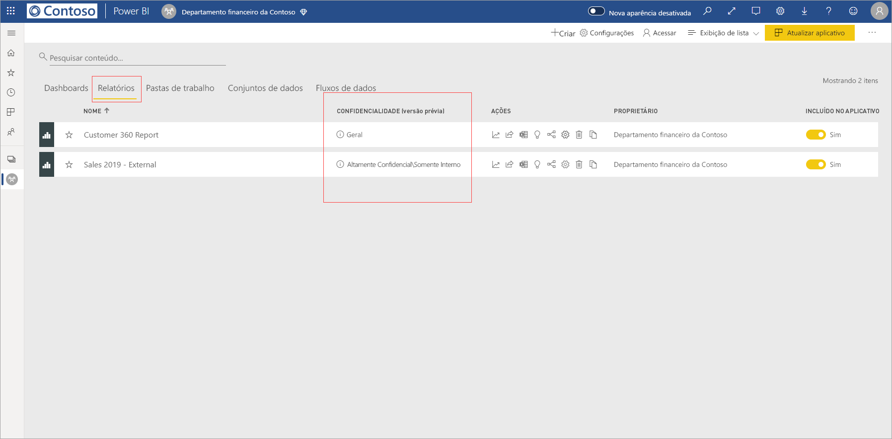
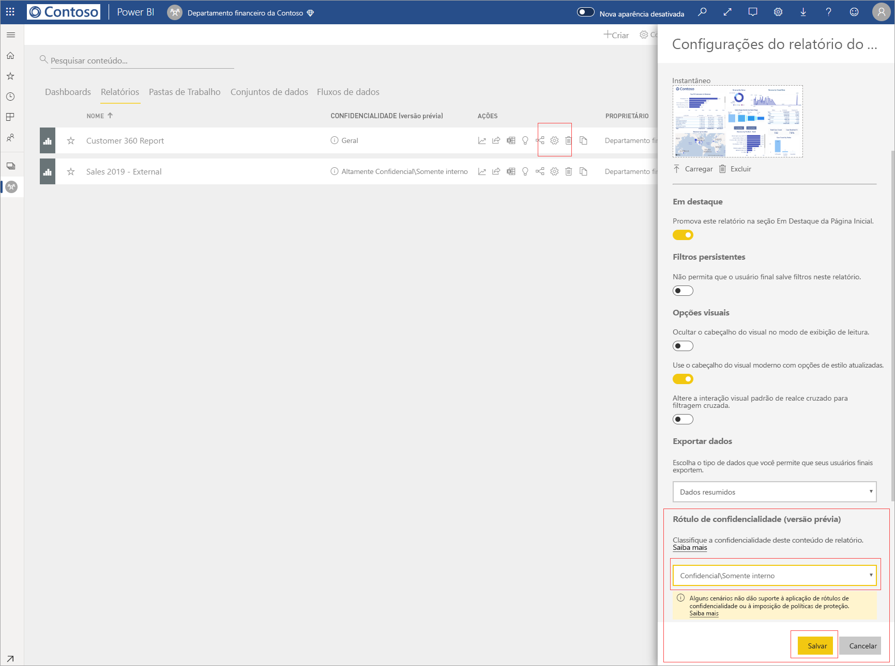
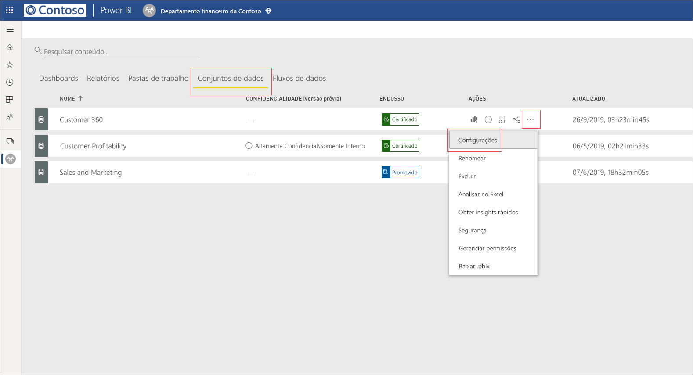
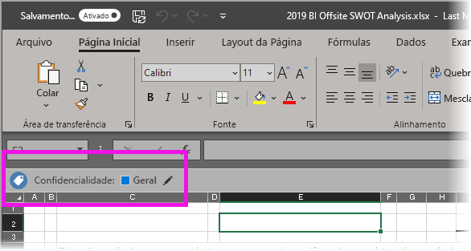

# Aplicar rótulos de confidencialidade de dados no Power BI

Os rótulos de confidencialidade da Proteção de Informações da Microsoft para os seus relatórios, dashboards, conjuntos de dados e fluxos de dados podem proteger o seu conteúdo confidencial contra acesso a dados não autorizado e vazamentos. Rotular seus dados corretamente usando rótulos de confidencialidade de dados garante que apenas pessoas autorizadas possam acessar seus dados. Este artigo mostra como aplicar rótulos de confidencialidade ao seu conteúdo.

Para ser capaz de aplicar rótulos de confidencialidade no Power BI:
* Você precisa ter uma licença do Power BI Pro e permissões de edição no conteúdo que deseja rotular.
* Você precisa pertencer a um grupo de segurança que tenha permissões para aplicar rótulos de confidencialidade de dados, conforme descrito no artigo intitulado [Habilitar rótulos de confidencialidade de dados no Power BI](../admin/service-security-enable-data-sensitivity-labels.md#enable-data-sensitivity-labels).
* Todos os [pré-requisitos](../admin/service-security-data-protection-overview.md#requirements-for-using-sensitivity-labels-in-power-bi) e [requisitos de licenciamento](../admin/service-security-data-protection-overview.md#licensing) precisam ter sido atingidos.

Para obter mais informações sobre rótulos de confidencialidade de dados no Power BI, consulte [Visão geral da proteção de dados no Power BI](../admin/service-security-data-protection-overview.md).

## Aplicar rótulos de confidencialidade

Quando a proteção de dados está habilitada no seu locatário, os rótulos de confidencialidade aparecem na coluna de confidencialidade na exibição de lista dos dashboards, relatórios, conjuntos de dados e fluxos de dados.

**Para aplicar ou alterar um rótulo de confidencialidade em um relatório ou dashboard**
1. Clique em **Mais opções (...)** .
1. Selecione **Configurações**.
1. No painel lateral de configurações, escolha o rótulo de confidencialidade apropriado.
1. Salve as configurações.

A imagem a seguir ilustra essas etapas em um relatório

**Para aplicar ou alterar um rótulo de confidencialidade em um conjunto de dados ou fluxo de dados**

1. Clique em **Mais opções (...)** .
1. Selecione **Configurações**.
1. No painel lateral de configurações, escolha o rótulo de confidencialidade apropriado.
1. Aplique as configurações.

As duas imagens a seguir ilustram essas etapas em um conjunto de dados.

Escolha **Mais opções (...)** e, em seguida, **Configurações**.

Na página de configurações, abra a seção do rótulo de confidencialidade, escolha o rótulo de confidencialidade desejado e clique em **Aplicar**.

## Como remover rótulos de confidencialidade
Para remover um rótulo de confidencialidade de um relatório, um dashboard, um conjunto de dados ou um fluxo de dados, siga o [mesmo procedimento usado para aplicar rótulos](#applying-sensitivity-labels), mas escolha **(Nenhum)** quando precisar classificar a confidencialidade dos dados. 

## Proteção de dados em arquivos exportados

A proteção de dados associada aos rótulos de confidencialidade só é aplicada aos dados quando eles são arquivos do Excel, do PowerPoint e PDF exportados. Isso não tem suporte para Analisar no Excel, exportar para .csv, downloads de conjunto de dados (.pbix), Live Connect do Serviço do Power BI ou em qualquer outro formato de exportação. As opções de exportação de dados são controladas pelas [configurações de exportação](../service-admin-portal.md#export-and-sharing-settings) do administrador de locatários do Power BI.

Quando você [exporta dados de um relatório](https://docs.microsoft.com/power-bi/consumer/end-user-export) que tem um rótulo de confidencialidade para um arquivo do Excel, do PowerPoint ou PDF, o rótulo de confidencialidade é herdado pelo arquivo gerado. O rótulo de confidencialidade ficará visível no arquivo e o acesso ao arquivo será restrito àqueles que têm permissões suficientes.

## Considerações e limitações

A lista a seguir fornece algumas limitações dos rótulos de confidencialidade no Power BI:

**Geral**
* Os rótulos de confidencialidade podem ser aplicados apenas a dashboards, relatórios, conjuntos de dados e fluxos de dados. Atualmente, eles não estão disponíveis para [relatórios paginados](../paginated-reports/report-builder-power-bi.md) e pastas de trabalho.
* Os rótulos de confidencialidade em ativos do Power BI ficam visíveis apenas na lista do workspace, nas exibições de linhagem, favoritos, recentes e de aplicativos. Atualmente, os rótulos não estão visíveis na exibição “compartilhado comigo”. Observe, no entanto, que um rótulo aplicado a um ativo do Power BI, mesmo que não esteja visível, sempre persistirá em dados exportados para arquivos do Excel, do PowerPoint e PDF.
* Os rótulos de confidencialidade têm suporte apenas para locatários na nuvem global (pública). Os rótulos de confidencialidade não têm suporte para locatários em outras nuvens.
* Os rótulos de confidencialidade de dados não são compatíveis com os aplicativos de modelo. Os rótulos de confidencialidade definidos pelo criador do aplicativo de modelo são removidos quando o aplicativo é extraído e instalado, e os rótulos de confidencialidade adicionados aos artefatos em um aplicativo de modelo instalado pelo consumidor do aplicativo são perdidos (redefinidos para nothing) quando o aplicativo é atualizado.
* O Power BI não é compatível com os rótulos de confidencialidade dos tipos de proteção [Não Encaminhar](https://docs.microsoft.com/microsoft-365/compliance/encryption-sensitivity-labels?view=o365-worldwide#let-users-assign-permissions) e [definido pelo usuário](https://docs.microsoft.com/microsoft-365/compliance/encryption-sensitivity-labels?view=o365-worldwide#let-users-assign-permissions) e [HYOK](https://docs.microsoft.com/azure/information-protection/configure-adrms-restrictions). Os tipos de proteção Não Encaminhar e definidos pelo usuário referem-se aos rótulos definidos no [Centro de segurança do Microsoft 365](https://security.microsoft.com/) ou no [Centro de conformidade do Microsoft 365](https://compliance.microsoft.com/).

**Exportar**
* Os controles de rótulo e de proteção serão aplicados somente quando os dados forem exportados para arquivos do Excel, do PowerPoint e PDF. O rótulo e a proteção não serão aplicados quando os dados forem exportados para arquivos .csv ou .pbix, Analisar no Excel ou qualquer outro caminho de exportação.
* A aplicação de um rótulo de confidencialidade e a proteção para um arquivo exportado não adiciona a marcação de conteúdo ao arquivo. No entanto, se o rótulo estiver configurado para aplicar marcações de conteúdo, elas serão automaticamente aplicadas pelo cliente de rotulagem unificado da Proteção de Informações do Azure quando o arquivo for aberto em aplicativos da área de trabalho do Office. As marcações de conteúdo não são aplicadas automaticamente quando você usa rotulagem interna para aplicativos Web, de área de trabalho ou de dispositivos móveis. Consulte [Quando os aplicativos do Office aplicam criptografia e marcação de conteúdo](https://docs.microsoft.com/microsoft-365/compliance/sensitivity-labels-office-apps?view=o365-worldwide#when-office-apps-apply-content-marking-and-encryption) para obter mais detalhes.
* Um usuário que exporta um arquivo do Power BI tem permissões para acessar e editar esse arquivo de acordo com as configurações do rótulo de confidencialidade. O usuário que exporta os dados não obtém permissões de proprietário para o arquivo.
* A exportação falhará se um rótulo não puder ser aplicado quando os dados forem exportados para um arquivo. Para verificar se a exportação falhou porque o rótulo não pôde ser aplicado, clique no nome do dashboard ou do relatório no centro da barra de título e veja se ele diz "O rótulo de confidencialidade não pode ser carregado" no menu suspenso de informações que é aberto. Isso poderá acontecer se o rótulo aplicado não tiver sido publicado ou tiver sido excluído pelo administrador de segurança ou como resultado de um problema do sistema temporário.

## Próximas etapas

Este artigo descreveu como aplicar rótulos de confidencialidade de dados no Power BI. Os artigos a seguir fornecem mais detalhes sobre a proteção de dados no Power BI. 

* [Visão geral da proteção de dados no Power BI](../admin/service-security-data-protection-overview.md)
* [Habilitar rótulos de confidencialidade de dados no Power BI](../admin/service-security-enable-data-sensitivity-labels.md)
* [Usando controles do Microsoft Cloud App Security no Power BI](../admin/service-security-using-microsoft-cloud-app-security-controls.md)