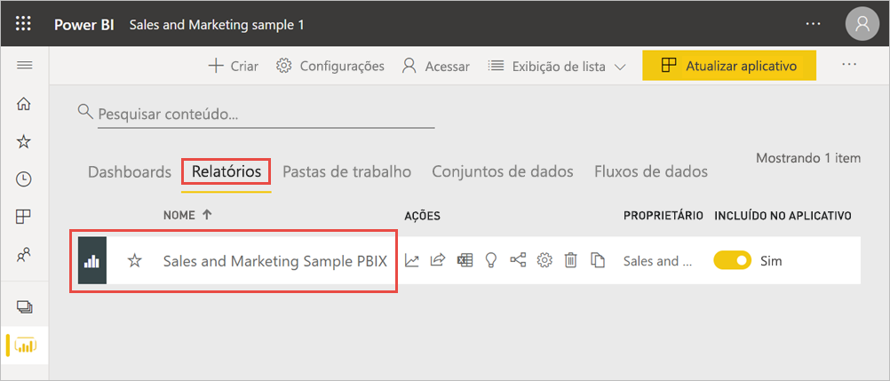
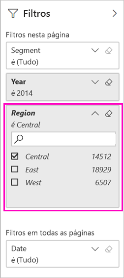
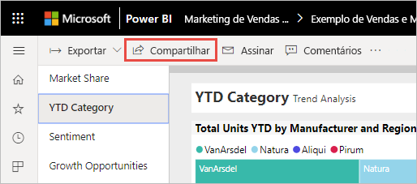
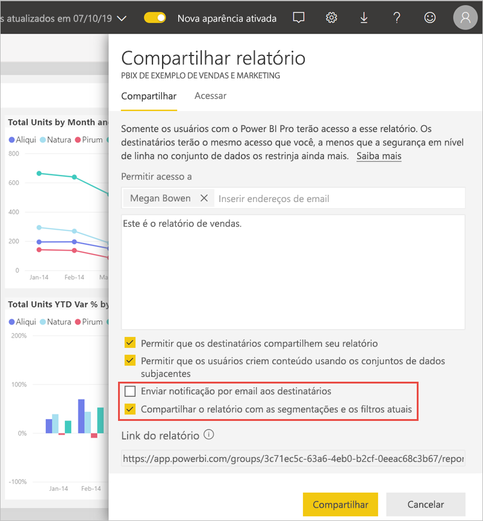
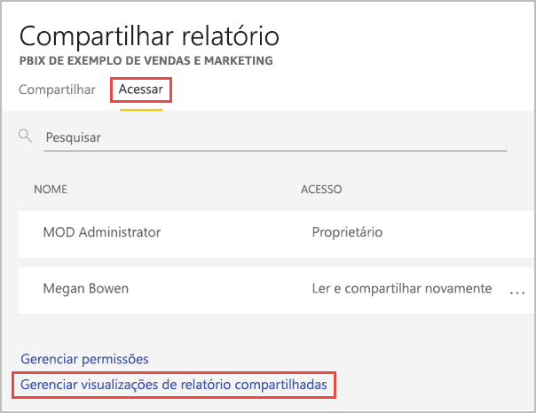

# Filtrar e compartilhar um relatório do Power BI
O *compartilhamento* é uma boa maneira de conceder acesso a algumas pessoas aos dashboards e relatórios. Se você deseja compartilhar uma versão filtrada de um relatório? Talvez você queira que o relatório mostre apenas dados de uma cidade, vendedor ou ano específico. Este artigo explica como filtrar um relatório e compartilhar a versão filtrada dele. Você também pode [adicionar parâmetros de consulta à URL do relatório](service-url-filters.md) para compartilhar o relatório filtrado. Nos dois casos, o relatório será filtrado quando os destinatários o abrirem pela primeira vez. Eles poderão desmarcar as seleções de filtro no relatório.

O Power BI também oferece [outras maneiras para colaborar e distribuir seus relatórios](service-how-to-collaborate-distribute-dashboards-reports.md). Com o compartilhamento, você e os destinatários precisarão de uma [licença do Power BI Pro](../fundamentals/service-features-license-type.md) ou então o conteúdo precisará estar em uma [capacidade Premium](../admin/service-premium-what-is.md). 

## Acompanhar dados de exemplo

Este artigo usa o aplicativo de modelo de exemplo de Marketing e Vendas. Quer testá-lo? 

1. Instale o [aplicativo de modelo de exemplo de Marketing e Vendas](https://appsource.microsoft.com/product/power-bi/microsoft-retail-analysis-sample.salesandmarketingsample?tab=Overview).
2. Selecione o aplicativo e clique em **Explorar aplicativo**.

   

3. Selecione o ícone de lápis para abrir o workspace instalado com o aplicativo.

    

4. Na lista de conteúdo do workspace, selecione **Relatórios** e **PBIX de Exemplo de Marketing e Vendas**.

    

    Agora você está pronto para acompanhar.

## Definir um filtro no relatório

Abra um relatório no [Modo de exibição de edição](../consumer/end-user-reading-view.md) e aplique um filtro.

Neste exemplo, estamos filtrando a página Categoria de Acumulado no Ano do aplicativo de modelo Exemplo de vendas e marketing para mostrar apenas valores onde **Região** igual a **Central**. 
 

Salve o relatório.

## Compartilhar o relatório filtrado

1. Selecione **Compartilhar**.

   

2. Para enviar um link filtrado, desmarque a opção **Enviar notificação por email aos destinatários**, selecione **Compartilhar relatório com filtros e segmentações de dados atuais** e clique em **Compartilhar**.

    

4. Selecione **Compartilhar** novamente.

   

5. Selecione a guia de **Acesso** e escolha **Gerenciar visualizações de relatório compartilhadas**.

    

6. Clique com o botão direito do mouse na URL desejada e selecione **Copiar link**.

    

7. Quando você compartilhar esse link, os destinatários poderão ver seu relatório filtrado. 

## Limitações e considerações
O que lembrar a respeito do compartilhamento de relatórios:

* Quando você compartilha um conjunto de dados gerenciando permissões, compartilhando relatórios ou dashboards, ou publicando um aplicativo, você está permitindo o acesso a todo o conjunto de dados, a menos que a [RLS (segurança em nível de linha)](../admin/service-admin-rls.md) limite o acesso. Os autores de relatório podem usar funcionalidades que personalizam experiências do usuário ao exibir ou interagir com relatórios, por exemplo, ocultar colunas, limitar as ações em visuais e outras. Essa experiência de usuário personalizada não restringe quais dados os usuários podem acessar no conjunto de dados. Use a [RLS (segurança em nível de linha)](../admin/service-admin-rls.md) no conjunto de dados para que as credenciais de cada pessoa determinem quais dados elas podem acessar.

## Próximas etapas
* [Maneiras de compartilhar seu trabalho no Power BI](service-how-to-collaborate-distribute-dashboards-reports.md)
* [Compartilhar um dashboard](service-share-dashboards.md)
* Mais perguntas? [Experimente a Comunidade do Power BI](https://community.powerbi.com/).
* Tem comentários? Vá para o [site da comunidade do Power BI](https://community.powerbi.com/) para fazer sugestões.
