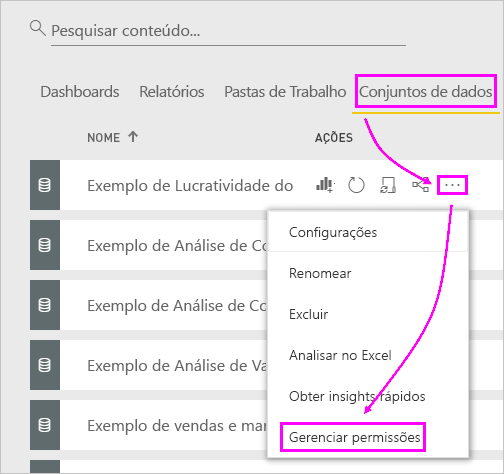
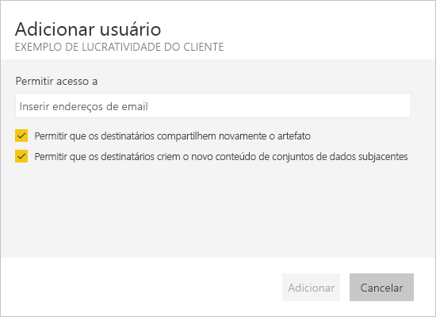

# Solucionar problemas de compartilhamento de dashboards e relatórios

Aqui estão alguns problemas comuns que poderão surgir quando você estiver compartilhando um dashboard ou relatório ou quando outra pessoa estiver compartilhando com você. 

## Os destinatários do dashboard veem um ícone de cadeado em um bloco

As pessoas com as quais você compartilha poderão ver um bloco bloqueado em um painel ou uma mensagem "Permissão necessária" ao tentarem exibir um relatório.

Nesse caso, você precisa conceder a permissão para o conjunto de dados subjacente.

1. Vá para a guia **Conjuntos de dados** na sua lista de conteúdo.

1. Selecione as reticências ( **...** ) ao lado do conjunto de dados e, em seguida, selecione **Gerenciar permissões**.

    

1. Selecione **Adicionar usuário**.

    

1. Insira os endereços de email completos dos indivíduos, grupos de distribuição ou grupos de segurança. Você não pode compartilhar com listas de distribuição dinâmicas.

    

1. Selecione **Adicionar**.

## Não consigo compartilhar um painel ou relatório como favorito

Para compartilhar um dashboard ou relatório, você precisa de permissão para compartilhar novamente o conteúdo subjacente, ou seja, todos os relatórios e conjuntos de dados relacionados. Se você vir uma mensagem informando que não é possível compartilhar, peça ao autor do relatório para dar a você permissão para compartilhar novamente os relatórios e conjuntos de dados.

## Não tenho acesso a um dashboard ou relatório

Caso você veja a mensagem "Solicitar acesso" ao selecionar o link para um relatório ou dashboard, isso significa que você não tem permissão para exibi-lo. Você precisa [solicitar acesso a ele](service-request-access.md).

## Próximas etapas

- [Compartilhar relatórios e dashboards do Power BI com colegas e outras pessoas](service-share-dashboards.md)
- [Como devo colaborar e compartilhar relatórios e dashboards?](service-how-to-collaborate-distribute-dashboards-reports.md)
-  [Compartilhar um relatório do Power BI filtrado](service-share-reports.md)
- Dúvidas? [Experimente a Comunidade do Power BI](https://community.powerbi.com/)
