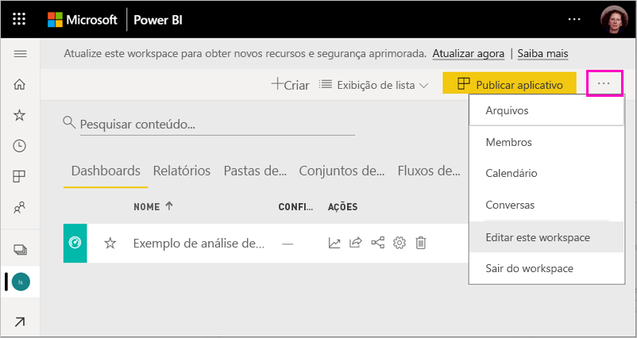
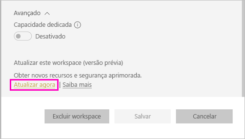
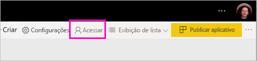
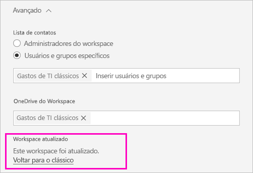
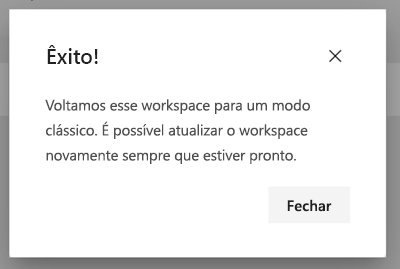

# Atualizar workspaces clássicos para os novos workspaces no Power BI

Este artigo explica como atualizar ou *migrar* um workspace clássico para a nova experiência de workspace. É possível atualizar qualquer workspace clássico. Os novos workspaces têm funções de workspace mais granulares para que você possa gerenciar melhor o acesso ao conteúdo. Você também tem mais flexibilidade para gerenciar os workspaces atualizados porque eles estão conectados mais livremente ao grupo original do Microsoft 365. Saiba mais sobre a [nova experiência de workspace](service-new-workspaces.md).

>[!NOTE]
>A atualização do workspace está disponível como uma Versão Prévia Pública. 

No entanto, pode haver alterações em seu workspace que você precisa conhecer e para as quais você precisa se planejar. Por exemplo, não há suporte para pacotes de conteúdo na nova experiências de workspace. Confira a seção [Considerações e limitações da atualização](#upgrade-considerations-and-limitations), mais adiante neste artigo.

## Tarefas a serem realizadas após a atualização

Há várias tarefas que devem ser realizadas *depois* da atualização. É melhor planejá-las *antes* de fazer a atualização:
- Examine a lista de acesso e compreenda as [permissões após a atualização](#permissions-after-upgrade).
- Examine a [lista de contatos](#modify-the-contact-list) e verifique se ela está configurada como desejado.
- Caso ainda não tenha feito isto, confira mais informações sobre a [nova experiência de workspace](service-new-workspaces.md).

## Atualizar um workspace clássico

Qualquer administrador de workspace pode atualizá-lo. Para ser administrador do workspace, no caso dos clássicos, você precisará ser proprietário do grupo subjacente do Microsoft 365. Para atualizar um workspace, siga estas etapas.

1. Na lista conteúdo do workspace, selecione **Mais opções** ( **...** ) > **Editar este workspace**.

    

1. Expanda **Avançado** e selecione **Atualizar agora**.

    

1. Examine as informações da caixa de diálogo. Você verá avisos caso tenha publicado ou instalado pacotes de conteúdo no workspace. Quando estiver tudo pronto, marque a caixa **Estou pronto para atualizar este workspace** e, em seguida, selecione **Atualizar**.

    

2. Durante a atualização, você verá a mensagem **Atualizando**. Geralmente, leva menos de um minuto para atualizar o workspace.

1. Após a conclusão da atualização, você verá a caixa de diálogo **Êxito**. Recomendamos ler as informações sobre como [organizar o trabalho nos novos workspaces no Power BI](service-new-workspaces.md) para que você se familiarize com as diferenças entre os workspaces clássicos e os novos.

### Impacto nos outros usuários do workspace

Recomendamos fazer a atualização fora do horário de trabalho, quando poucos usuários estiverem visualizando ou editando itens de forma mais ativa no workspace.

Os usuários que estiverem usando ativamente o workspace serão solicitados a atualizar o navegador. Os usuários que estiverem editando um relatório terão a opção de salvar antes de atualizarem.

## Considerações e limitações da atualização

- As URLs e IDs de seu workspace, o conteúdo que ele contém e o aplicativo publicado a partir do workspace não são alterados. O conteúdo dos pacotes de conteúdo instalados em seu workspace é tratado separadamente. Confira a seção [Pacotes de conteúdo durante a atualização](#content-packs-during-upgrade), neste artigo, para obter detalhes.
- Não há suporte para pacotes de conteúdo na nova experiência do workspace. Leia as seções sobre os [pacotes de conteúdo publicados](#published-content-packs) ou [pacotes de conteúdo instalados](#installed-content-packs) para saber mais sobre como eles são tratados durante a atualização. Recomendamos excluir os pacotes de conteúdo instalados ou publicados em seu workspace antes de fazer a atualização.
- O grupo do Microsoft 365 de seu workspace clássico não é afetado pela atualização de workspace no Power BI. Todas as equipes, os sites do SharePoint, as caixas de correio ou outros recursos gerenciados pelo Microsoft 365 não são alterados. Eles permanecem intactos depois da atualização do workspace no Power BI. O grupo do Microsoft 365 continuará existindo como antes.
- Há alterações em relação à proteção de seu workspace após a atualização. Confira a seção [Permissões do workspace após a atualização](#permissions-after-upgrade) para obter detalhes.
- Existe a opção de **reverter para o workspace clássico**, caso necessário. No entanto, ela não restaura totalmente alguns aspectos do workspace como estavam antes da atualização. Se você começar a usar os recursos que funcionam apenas na nova experiência de workspace, não será possível reverter. A opção de reversão fica disponível por 30 dias após a atualização.

## Permissões após a atualização

Selecione **Acesso** na barra de menus na parte superior da lista de conteúdo do workspace para examinar as permissões após a atualização.

Cada proprietário de grupo do Microsoft 365 é adicionado individualmente à função de administrador do workspace atualizado. O grupo do Microsoft 365 é adicionado a uma função de workspace. A função à qual ele é adicionado dependerá se o workspace clássico é *somente leitura* ou *leitura/gravação*:

- Quando o workspace é definido como **Membros podem editar o conteúdo do Power BI**, após a atualização, o grupo do Microsoft 365 é adicionado à lista de acesso do workspace com a função de **Membro**.
- Quando o workspace é definido como **Os membros só podem ler o conteúdo do Power BI**, após a atualização, o grupo do Microsoft 365 é adicionado à lista de acesso do workspace com a função **Visualizador**.

Como o grupo do Microsoft 365 recebe uma função no workspaces, qualquer usuário adicionado ao grupo do Microsoft 365 após a atualização tem essa função no workspace. No entanto, se você adicionar novos proprietários ao grupo do Microsoft 365 após a atualização, eles não terão a função de administrador do workspace.

### Diferenças nas funções antes e depois da atualização

As funções do workspace são diferentes nos workspaces clássicos e novos. A nova experiência de workspace permite que você forneça funções de workspace a grupos, grupos de segurança ou listas de distribuição do Microsoft 365.

- Os **membros** podem compartilhar itens individuais e conceder acesso a todo o workspace por meio das funções Membro, Colaborador ou Visualizador
- Os **visualizadores** só podem ver o conteúdo e não podem exportar ou analisar no Excel os dados subjacentes de nenhum conjunto de dados do workspace, a menos que tenham a permissão de Build.

Todos os usuários que tenham acesso aos itens no workspace por meio da permissão de compartilhamento ou de aplicativo continuarão a ter acesso a esses itens. Qualquer pessoa com acesso ao workspace também tem acesso ao aplicativo publicado a partir do workspace. Esses usuários não constam na lista de acesso do aplicativo.

Recomendamos avaliar se a nova função de Colaborador deve ser usada. Após a atualização, você poderá alterar o grupo do Microsoft 365 para ter a função de colaborador no painel de acesso.

Após a atualização, considere criar um grupo de segurança ou do Microsoft 365 ou ainda uma lista de distribuição dos administradores de workspace, em vez de gerenciar o acesso por meio de atribuições de função a usuários individuais.

Leia mais sobre as [funções nos novos workspaces](service-new-workspaces.md#roles-in-the-new-workspaces).

## Licenciamento após a atualização

Os usuários nas funções de Administrador, Membro ou Colaborador do workspace precisam de uma licença Power BI Pro para acessar o workspace.

Se o workspace estiver na capacidade compartilhada, os usuários que estiverem com a função de Visualizador do workspace também precisarão de uma licença Power BI Pro para acessá-lo. No entanto, se o workspace estiver em uma capacidade Premium, os usuários com a função de Visualizador não precisarão da licença Pro para acessar o workspace.

## Outros novos recursos do workspace

A nova experiência do workspace tem recursos que os workspaces clássicos não têm. Uma diferença é a capacidade de definir uma lista de contatos diferente dos administradores ou proprietários do workspace. Uma semelhança é que ele ainda está conectado à biblioteca de documentos do SharePoint do grupo do Microsoft 365.

### Modificar a lista de contatos

1. Selecione **Configurações** na barra de menu na parte superior da lista de conteúdo do workspace para acessar as configurações do workspace.

    

2. Em **Avançado**, a **Lista de contatos** do workspace está configurada para ser o grupo do Microsoft 365 do qual o workspace foi atualizado. Você pode adicionar mais usuários ou grupos à lista de contatos ou alterá-la para torná-los administradores do workspace.

    

### O OneDrive do workspace 

Após a atualização, o **OneDrive** do workspace estará conectado à biblioteca de documentos do SharePoint do grupo do Microsoft 365. Essa biblioteca de documentos mostra a opção **OneDrive** na experiência **Obter dados > Arquivos**. Lembre-se de que é possível que nem todos os usuários do workspace tenham permissão para essa biblioteca de documentos, caso não estejam no grupo do Microsoft 365.

## Pacotes de conteúdo durante a atualização

A nova experiência do workspace não oferece suporte a pacotes de conteúdo. Em vez disso, use aplicativos e conjuntos de dados compartilhados para distribuir o conteúdo no workspace. Recomendamos remover do workspace os pacotes de conteúdo publicados ou instalados antes da atualização. No entanto, se houver pacotes de conteúdo publicados ou instalados quando você fizer a atualização, o processo de atualização tentará preservar o conteúdo, conforme descrito abaixo.  Não é possível restaurar o pacote de conteúdo ou a associação do conteúdo ao pacote de conteúdo após a atualização.

### Pacotes de conteúdo publicados

Os pacotes de conteúdo publicados no workspace são removidos durante a atualização. Você não poderá publicá-los ou atualizá-los após a atualização, mesmo que reverta para o workspace clássico. Se outras pessoas tiverem instalado o seu pacote de conteúdo nos próprios workspaces, após a atualização, elas verão uma cópia do conteúdo do pacote no workspaces delas. Confira a seção **Pacotes de conteúdo instalados** para obter detalhes.

### Pacotes de conteúdo instalados

Quando você atualiza seu workspace ou quando o workspace do qual o pacote de conteúdo é publicado é atualizado, alterações importantes ocorrem nos pacotes de conteúdo instalados. Após a atualização, seu workspace conterá uma cópia do conteúdo do pacote de conteúdo. Ela está conectada ao conjunto de dados do workspace original.

Porém, há alterações importantes:

- O conteúdo não será mais atualizado se o pacote de conteúdo for atualizado.
- As URLs e os identificadores de item são alterados e exigem que os indicadores ou links que você tenha compartilhado com outras pessoas sejam atualizados.
- Todas as personalizações de usuário no pacote de conteúdo original em seu workspace são perdidas. As personalizações incluem assinaturas, alertas, indicadores pessoais, filtros persistentes e favoritos.
- É possível que os novos usuários não tenham acesso aos conjuntos de dados que estavam no pacote de conteúdo. Você precisa trabalhar em conjunto com o proprietário do conjunto de dados para garantir que os usuários do workspace tenham acesso aos dados.

## Reverter para o workspace clássico

Como parte da experiência de atualização, você tem a opção de reverter para o workspace clássico em até 30 dias após a atualização. Esse recurso restaura a associação do conteúdo do workspace com o grupo original do Microsoft 365. Ele está disponível caso a sua organização encontre problemas sérios ao usar a nova experiência de workspace. Porém, há limitações. Primeiro, leia as [Considerações para reverter para o workspace clássico](#considerations-for-switching-back-to-classic) neste artigo.

Para reverter, você precisa ser proprietário do grupo do Microsoft 365 ao qual o workspace foi associado antes de ser atualizado. Siga estas etapas.

1. Na lista conteúdo do workspace, selecione **Mais opções** ( **...** ) > **Configurações do workspace**.

    

1. Expanda **Avançado** e selecione **Reverter para o clássico**. Se essa opção não estiver disponível para você, confira as [Considerações para reverter para o workspace clássico](#considerations-for-switching-back-to-classic) neste artigo.

    

1. Quando estiver tudo pronto, marque a caixa **Estou pronto para reverter para o clássico** e selecione **Alternar para o clássico**. Você poderá ver avisos ou bloqueadores nessa caixa de diálogo. Leia as [considerações para reverter](#considerations-for-switching-back-to-classic), neste artigo, se você encontrar esses problemas.

    

1. Quando a opção de reversão for concluída, você verá uma caixa de diálogo com a confirmação.

    

### Considerações para reverter para o workspace clássico

A reversão não será possível se qualquer uma das seguintes afirmações sobre seu workspace for verdadeira:

- O grupo do Microsoft 365 foi excluído.
- Faz mais de 30 dias que você fez a atualização.
- Os conjuntos de dados no workspace são usados por relatórios ou painéis em outros workspaces. Como isso acontece? Digamos que você publicou um pacote de conteúdo no workspace antes da atualização e alguém instalou o pacote de conteúdo em outro workspace. Logo após a atualização, os conjuntos de dados são usados pelos relatórios e painéis naquele pacote de conteúdo.
- O workspace faz parte de um pipeline de gerenciamento de ciclo de vida do aplicativo.
- O workspace é usado para aplicativos modelo.
- O workspace usa o recurso de modelos grandes.
- O workspace usa o novo recurso de métricas de uso.

Ao reverter para o workspace clássico, você não estará restaurando uma cópia exata do workspace original. As seguintes alterações ocorrem:

- As permissões para o workspace são definidas pelo grupo do Microsoft 365 ao qual o workspace atualizado foi originalmente conectado.
  - Todos os administradores do grupo do Microsoft 365 se tornam administradores do workspace clássico.
  - Todos os membros do grupo do Microsoft 365 se tornam membros do workspace clássico. Se o workspace clássico foi definido como **Membros só podem ler o conteúdo do Power BI**, essa configuração é restaurada.
  - Todos os usuários ou grupos de usuários adicionados ao workspace após a atualização ser concluída (fora do grupo do Microsoft 365) perdem o acesso ao workspace. Adicione-os ao grupo do Microsoft 365 para conceder acesso a eles. Observe que os grupos do Microsoft 365 não permitem aninhar grupos de distribuição ou de segurança na associação.
  - Os usuários que receberam acesso ao aplicativo para o workspace continuam a ter acesso ao aplicativo.
  - Os usuários que receberam acesso a itens no workspace continuam a ter acesso a eles.
- Os pacotes de conteúdo publicados a partir de workspaces clássicos antes da atualização não são restaurados.
- Os pacotes de conteúdo instalados nos workspaces clássicos antes da atualização não são restaurados.
- As assinaturas criadas por usuários no workspace após a atualização são removidas. As assinaturas que existiam antes da atualização continuam a funcionar conforme o esperado.
- Os alertas de dados não são preservados. Eles são removidos.
- Se você tiver renomeado o workspace após a atualização, o nome do workspace será restaurado para corresponder ao nome do grupo do Microsoft 365.
- As operações em andamento, como atualizações, não são afetadas pela atualização do workspace.

## Gerenciar a migração para os novos workspaces de seu locatário 

Algumas organizações querem mover muitos ou todos os workspaces para a nova experiência de workspace. As ferramentas de atualização do workspace permitem que os administradores de workspace façam a atualização. As organizações que desejam gerenciar esse processo podem executar as etapas a seguir.

1. A lista de workspaces no portal de administração do Power BI e a API correspondente fornecem uma lista de todos os workspace no Power BI. Os workspaces clássicos são mostrados como Grupo de tipos na lista.
2. Trabalhe em conjunto com os proprietários individuais de grupo ou com seu administrador no Microsoft 365 para que eles façam a atualização dos workspaces. Se você quiser fazer a atualização do workspace, precisará se tornar proprietário do grupo.

A funcionalidade de atualização do workspace não fornece ferramentas para a atualização em massa ou programática. Além disso, os novos grupos do Microsoft 365 criados em sua organização continuarão a aparecer no Power BI.
   
   
## Problemas conhecidos

Há vários problemas conhecidos que você pode encontrar:
- Após a atualização, os usuários poderão ver uma caixa de diálogo de aviso "Falha em carregar o modelo". Essa mensagem é mostrada erroneamente e pode ser ignorada. 
- Após a atualização, alguns nomes de workspace estarão diferentes do que eram antes da atualização. Quando isso ocorrer, o nome do workspace será revertido para um nome anterior para o workspace ou o nome do workspace ficará em branco. Para resolver esse problema, renomeie o workspace para o nome desejado.
- Após atualizar um workspace que tinha um pacote de conteúdo instalado, você poderá ver dashboards adicionais no workspace que não estavam visíveis antes da atualização. Isso ocorre em alguns casos em que um pacote de conteúdo não foi atualizado recentemente. Você pode remover com segurança esses dashboards.

## Próximas etapas

* [Organizar o trabalho nas novas experiências de workspace](service-new-workspaces.md)
* [Criar os novos workspaces](service-create-the-new-workspaces.md)
* [Criar espaços de trabalho clássicos](service-create-workspaces.md)
* Dúvidas? [Experimente perguntar à Comunidade do Power BI](https://community.powerbi.com/)
