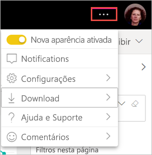

# Optar por usar a nova aparência para workspaces (versão prévia)

Os workspaces têm uma nova aparência que corresponde à [nova aparência](../service-new-look.md) do serviço do Power BI. Qualquer pessoa usando o serviço do Power BI (app.powerbi.com) pode optar por usá-la. Quando você ativa a **Nova aparência** na barra de cabeçalho preta, você opta pela nova aparência de relatórios e workspaces. Todos os workspaces, tanto clássicos quanto novos, podem se beneficiar da nova aparência.

Procurando informações sobre a nova aparência no **Power BI Desktop**? Confira [Usar a faixa de opções atualizada no Power BI Desktop](../desktop-ribbon.md).

## Recursos da nova aparência

:::image type="content" source="media/service-workspaces-new-look/power-bi-workspace-new-look-numbered.png" alt-text="A nova aparência dos workspaces, com números de balão para obtenção de explicações":::

|Número  |Como funciona |
|---------|---------|
|    | **Obter Dados**: é mais fácil adicionar conteúdo ao seu workspace. Selecione o botão **+ New** para conectar-se aos dados, abrir arquivos e criar relatórios, dashboards e muito mais.  |
|   | **Seletor de exibição**: para ver as conexões entre os fluxos de dados, os conjuntos de dados, os relatórios e os dashboards e também as conexões deles com outras fontes de dados, alterne entre a exibição de **Lista** e a exibição de **Linhagem**. |
|  | **Pesquisar dentro de um workspace**: pesquise todo o conteúdo em um workspace na caixa nova pesquisa.  |
|   | **Lista e guias**: Todo o conteúdo em um workspace está em uma lista simples de dashboards, relatórios, conjuntos de valores, etc, como o SharePoint. Você já não passa pela situação de abrir um workspace para uma guia **Dashboards** possivelmente vazia e se perguntar onde está o conteúdo. Aqui está a nova ordem das guias:  **Tudo**: mostra todo o conteúdo (dashboards, relatórios, pastas de trabalho, relatórios paginados, conjuntos de gráficos e fluxos de dados) no workspace.  **Conteúdo**: coleta todo o conteúdo criado para consumo (dashboards, relatórios, pastas de trabalho e relatórios paginados) no workspace.  **Conjuntos de dados + fluxos de dados**: reúne todos os conjuntos de dados e fluxos de dados no workspace a fim de facilitar o gerenciamento de dados. |
|  | **Filtros**: Para workspaces com centenas de artefatos, você pode filtrar o conteúdo no painel Filtros. Quando um filtro é aplicado, você vê o filtro na parte superior da lista de conteúdo. |

**Ações rápidas**: ao passar o mouse sobre o conteúdo na lista, você vê as ações mais comuns para o item sob o cursor do mouse, além de outras ações disponíveis no menu **Mais opções** (...).

:::image type="content" source="media/service-workspaces-new-look/power-bi-workspace-new-look-quick-actions.png" alt-text="Ações rápidas no novo workspace":::

## Aceitar a nova aparência

Qualquer usuário serviço do Power BI pode optar por usar a nova aparência. Basta deslizar **Nova aparência desativada** para **Nova aparência ativada**.

Se você precisar retornar à aparência antiga, deslize o controle deslizante **Nova aparência** de volta para . Se você não visualizar essa opção, selecione o menu de reticências no canto superior direito.

## Próximas etapas

- [Usar a faixa de opções atualizada no Power BI Desktop](../desktop-ribbon.md)
- [A "nova aparência"' do serviço do Power BI](../service-new-look.md)
- Dúvidas? [Experimente a Comunidade do Power BI](https://community.powerbi.com/)

