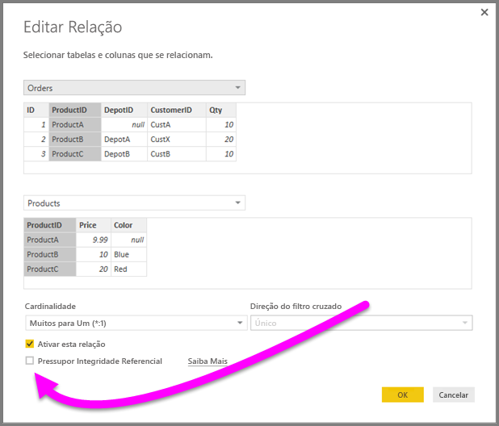
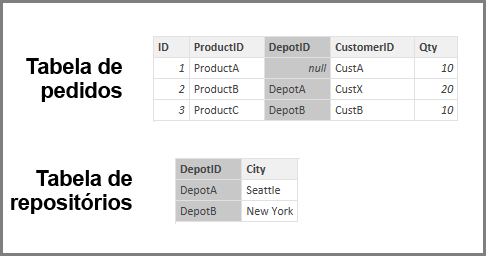
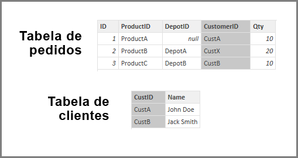

# Aplicar a configuração Pressupor Integridade Referencial no Power BI Desktop
Ao se conectar a uma fonte de dados usando o **DirectQuery**, você pode usar a seleção **Pressupor integridade referencial** para habilitar a execução de consultas mais eficientes em relação a sua fonte de dados. Esse recurso tem alguns requisitos dos dados subjacentes e só está disponível ao usar o **DirectQuery**.

A configuração **Pressupor integridade referencial** permite que as consultas na fonte de dados usem as instruções **INNER JOIN** em vez de **OUTER JOIN**, o que melhora a eficiência da consulta.

## Requisitos para usar Pressupor integridade referencial
Essa é uma configuração avançada habilitada apenas ao se conectar a dados usando o **DirectQuery**. Os requisitos a seguir são necessários para que **Pressupor integridade referencial** funcione corretamente:

* Dados na coluna **From** na relação nunca são *nulos* ou *em branco*
* Para cada valor na coluna **From**, há um valor correspondente na coluna **To**

Nesse contexto, a coluna **From** é *muitos* em uma relação *um-para-muitos*, ou é a coluna da primeira tabela em uma relação *um-para-um*.

## Exemplo de uso de Pressuposição de integridade referencial
O exemplo a seguir demonstra como **Pressupor integridade referencial** se comporta quando usado em conexões de dados. O exemplo conecta-se a uma fonte de dados que inclui uma tabela **Orders**, uma tabela **Products** e uma tabela **Depots**.

1. Na imagem a seguir, que mostra a tabela **Orders** e a tabela **Products**, observe que a integridade referencial existe entre **Orders[ProductID]** e **Products[ProductID]** . A coluna **[ProductID]** na tabela **Orders** nunca é *nula* e cada valor aparece também na tabela **Products**. Como tal, **Pressupor integridade referencial** deve ser definido para obter consultas mais eficientes (usar essa configuração não altera os valores mostrados em elementos visuais).
   
   
2. Na próxima imagem, observe que nenhuma integridade referencial existe entre **Orders [DepotID]** e **Depots[DepotID]** , pois o **DepotID** é *nulo* para alguns *Orders*. Como tal, **Pressupor integridade referencial** não*deve* ser definido.
   
   
3. Por fim, não há integridade referencial entre **Orders[CustomerID]** e **Customers[CustID]** nas tabelas a seguir; o **CustomerID** contém alguns valores (nesse caso, *CustX*) que não existem na tabela *Customers*. Como tal, **Pressupor integridade referencial** não*deve* ser definido.
   
   

## Configuração Pressupor integridade referencial
Para habilitar esse recurso, marque a caixa de seleção próxima a **Pressupor integridade referencial**, conforme mostrado na imagem a seguir.

Quando selecionada, a configuração é validada em relação aos dados para garantir que não haja nenhum *nulo* ou linhas incompatíveis. *No entanto*, para casos com um número muito grande de valores, a validação não é garantia de que não haja nenhum problema de integridade referencial.

Além disso, a validação ocorre no momento da edição da relação e *não* reflete nenhuma alteração subsequente nos dados.

## O que acontece se você configurar incorretamente Pressupor integridade referencial?
Se você definir **Pressupor Integridade Referencial** quando houver problemas de integridade referencial nos dados, isso não resultará em erros. No entanto, resultará em aparentes inconsistências nos dados. Por exemplo, no caso da relação com a tabela **Depots** descrita acima, resultaria no seguinte:

* Um visual mostrando o total *Order Qty* mostra um valor de 40
* Um visual mostrando o total *Order Qty by Depot City* mostraria um valor total de apenas *30*, pois não incluiria a ID de pedido 1, onde **DepotID** é *nulo*.

## Próximas etapas
Saiba mais sobre o [DirectQuery](desktop-use-directquery.md)

Obter mais informações sobre [Relações no Power BI](../transform-model/desktop-create-and-manage-relationships.md)

Saiba mais sobre a [Exibição de Relações no Power BI Desktop](../transform-model/desktop-relationship-view.md).
