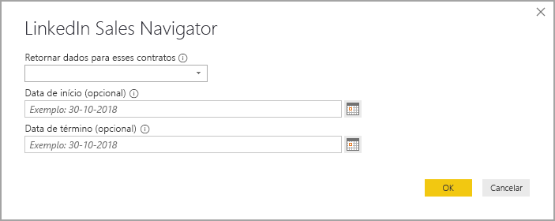
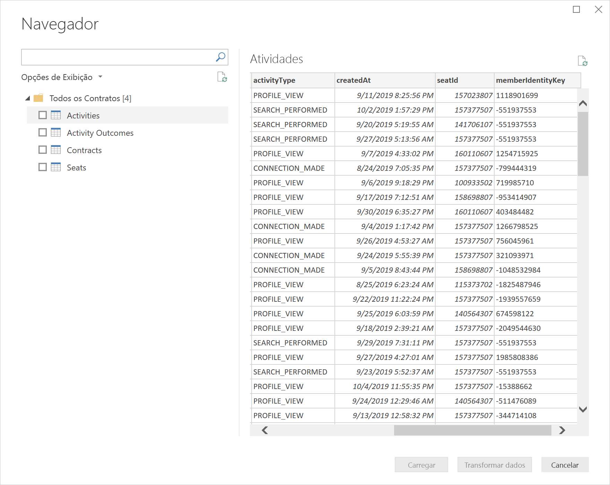
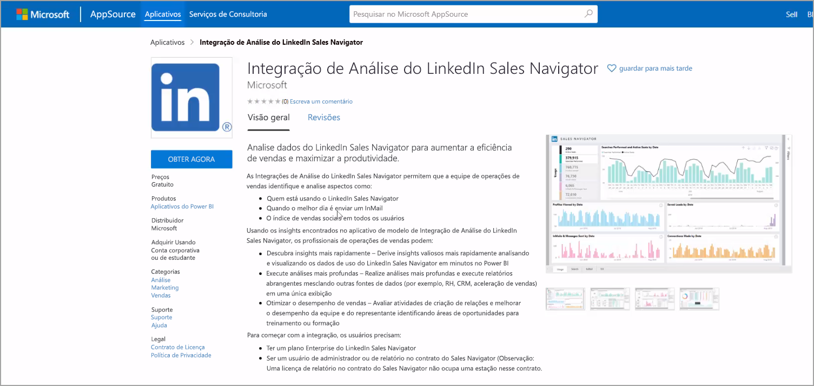
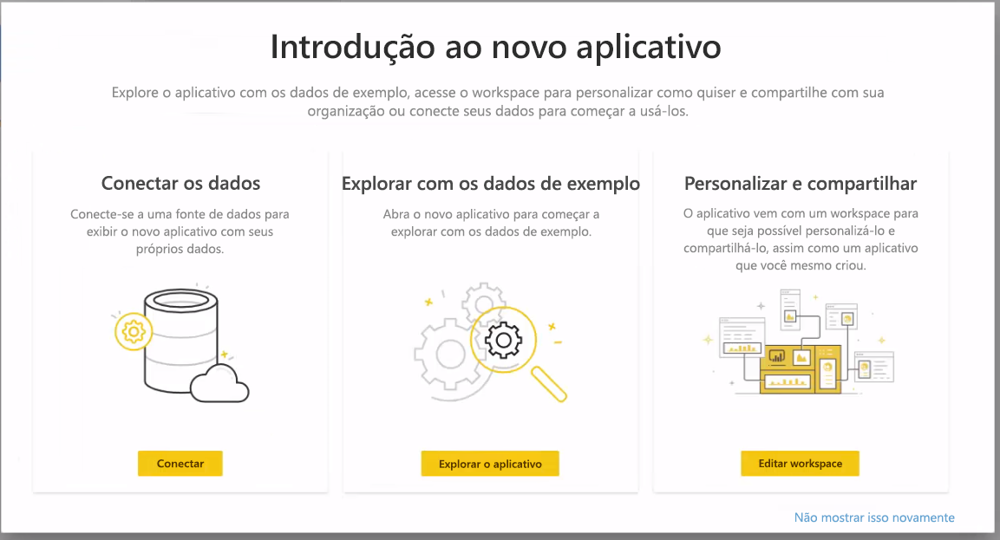
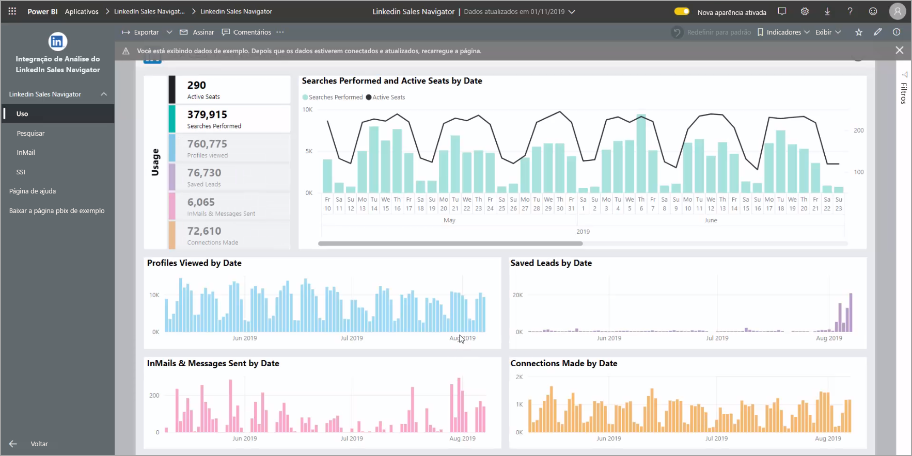
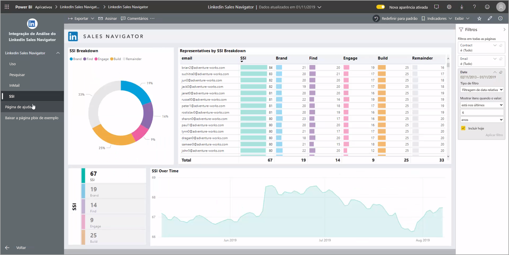

# Conectar-se ao LinkedIn Sales Navigator no Power BI Desktop

No **Power BI Desktop**, você pode se conectar ao **LinkedIn Sales Navigator** para ajudar a encontrar e criar relacionamentos da mesma forma que faz em qualquer outra fonte de dados no Power BI Desktop, bem como criar relatórios prontos sobre o seu progresso.

Para se conectar aos dados do LinkedIn usando o  **LinkedIn Sales Navigator**, é necessário ter um plano do LinkedIn Sales Navigator Enterprise e ser um administrador ou usuário de Relatórios no contrato do Sales Navigator.

O vídeo a seguir fornece um tour rápido e um tutorial sobre como usar o aplicativo de modelo do **LinkedIn Sales Navigator**, descrito em detalhes [posteriormente neste artigo](#using-the-linkedin-sales-navigator-template-app). 

> [!VIDEO https://www.youtube.com/embed/ZqhmaiORLw0]

## Conectar-se ao LinkedIn Sales Navigator

Para se conectar aos dados do **LinkedIn Sales Navigator**, selecione **Obter Dados**, na faixa de opções **Início** do Power BI Desktop. Selecione **Serviços Online** nas categorias à esquerda e, em seguida, percorra a página até encontrar **LinkedIn Sales Navigator (Beta)** .

Você será avisado de que está se conectando a um conector de terceiros ainda em desenvolvimento. 

Ao selecionar **Continuar**, você será solicitado a especificar quais dados deseja ver.

Na janela **LinkedIn Sales Navigator** exibida, selecione os dados que você deseja ver no primeiro menu suspenso de seleção, de *Todos os contatos* ou *Contatos selecionados*. A seguir, você poderá especificar as datas de início e término para restringir os dados recebidos a um período determinado.

Depois que você fornecer essas informações, o Power BI Desktop se conectará aos dados associados ao seu contrato do LinkedIn Sales Navigator. Escolha o mesmo endereço de email usado para entrar no LinkedIn Sales Navigator por meio do site. 

Quando você se conecta com êxito, é solicitado que selecione os dados do seu contrato do LinkedIn Sales Navigator na janela do **Navigator**.

Você pode criar quantos relatórios quiser com os dados do LinkedIn Sales Navigator. Para facilitar, você também pode baixar um arquivo .PBIX sobre o LinkedIn Sales Navigator com dados de exemplo já fornecidos para se familiarizar com os dados e relatórios sem precisar começar do zero.

Você pode baixar o arquivo PBIX no seguinte local:
* [PBIX do LinkedIn Sales Navigator](service-template-apps-samples.md)

Além do arquivo PBIX, você também pode baixar e usar o aplicativo de modelo do LinkedIn Sales Navigator. A próxima seção descreve o aplicativo de modelo em detalhes.

## Usar o aplicativo de modelo do LinkedIn Sales Navigator

Para facilitar ainda mais a familiarização com o **LinkedIn Sales Navigator**, você pode usar o [aplicativo de modelo](service-template-apps-overview.md) para criar automaticamente um relatório pronto a partir dos dados do LinkedIn Sales Navigator.

Ao baixar o aplicativo, você pode selecionar se deseja se conectar aos seus dados ou explorar o aplicativo com dados de exemplo. Caso você tenha escolhido explorar os dados de exemplo, pode voltar e optar por se conectar a seus próprios dados do LinkedIn Sales Navigator quando quiser. 

Você pode baixar o aplicativo de modelo do **LinkedIn Sales Navigator** no seguinte link:
* [Aplicativo de modelo do LinkedIn Sales Navigator](https://appsource.microsoft.com/en-us/product/power-bi/pbi-contentpacks.linkedin_navigator)

O aplicativo de modelo fornece quatro guias para ajudar a analisar e compartilhar suas informações:

* Uso
* Pesquisar
* InMail
* SSI

A guia de **Uso** mostra os dados gerais do LinkedIn Sales Navigator.

A guia de **Pesquisa** permite que você faça uma busca detalhada nos resultados da pesquisa:

O **InMail** fornece informações sobre o uso do InMail, incluindo o número de mensagens de InMail enviadas, taxas de aceitação e outras informações úteis:

A guia **SSI** fornece detalhes adicionais sobre seu SSI (índice de vendas sociais):

Para usar seus próprios dados depois de analisar os dados de exemplo, selecione **editar aplicativo** no canto superior direito (ícone de lápis) e escolha **Conectar seus dados** na tela exibida.

A partir daí, você pode conectar seus próprios dados e selecionar quantos dias de dados carregar. Você pode carregar até 365 dias de dados. Você precisará fazer login novamente usando o mesmo endereço de email usado para entrar no LinkedIn Sales Navigator por meio do site. 

o aplicativo modelo atualiza os dados no aplicativo com seus dados. Você também pode configurar uma atualização agendada para que os dados em seu aplicativo sejam atuais em relação à frequência de atualização especificada. 

Depois que os dados forem atualizados, você poderá ver seus próprios dados preenchidos no aplicativo.

## Obtendo ajuda

Se você tiver problemas ao se conectar aos seus dados, entre em contato com o suporte do LinkedIn Sales Navigator em https://www.linkedin.com/help/sales-navigator. 

## Próximas etapas
Há todos os tipos de dados aos quais você pode se conectar usando o Power BI Desktop. Para obter mais informações sobre fontes de dados, confira os seguintes recursos:

* [O que é o Power BI Desktop?](../fundamentals/desktop-what-is-desktop.md)
* [Fontes de dados no Power BI Desktop](desktop-data-sources.md)
* [Formatar e combinar dados com o Power BI Desktop](desktop-shape-and-combine-data.md)
* [Conectar-se a pastas de trabalho do Excel no Power BI Desktop](desktop-connect-excel.md)   
* [Inserir dados diretamente no Power BI Desktop](desktop-enter-data-directly-into-desktop.md)   
