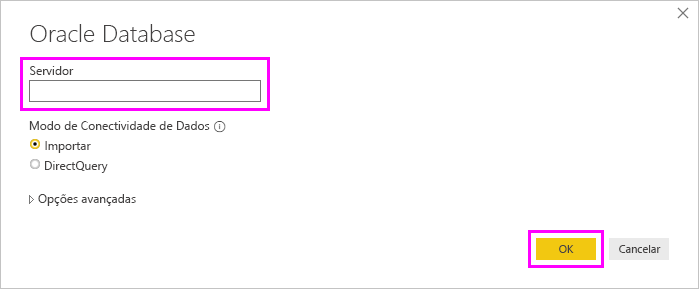

# Conectar-se a um banco de dados Oracle
Para se conectar a um banco de dados Oracle com o Power BI Desktop, o software cliente Oracle correto precisa estar instalado no computador que executa o Power BI Desktop. O software cliente Oracle usado depende da versão instalada do Power BI Desktop: 32 bits ou 64 bits.

Versões do Oracle com suporte: 
- Oracle 9 e versões posteriores
- Software cliente do Oracle 8.1.7 e posteriores

> [!NOTE]
> Se você estiver configurando o Oracle Database para Power BI Desktop, o Gateway de dados local ou o Servidor de Relatórios do Power BI, confira as informações do artigo [Tipo de conexão Oracle](https://docs.microsoft.com/sql/reporting-services/report-data/oracle-connection-type-ssrs?view=sql-server-ver15). 

## Determinando qual versão do Power BI Desktop está instalada
Para determinar qual versão do Power BI Desktop está instalada, selecione **Arquivo** > **Ajuda** > **Sobre** e, em seguida, verifique a linha **Versão**. Na imagem a seguir, uma versão de 64 bits do Power BI Desktop está é instalada:

## Instalando o cliente Oracle
- Para a versão de 32 bits do Power BI Desktop, [baixe e instale o cliente Oracle de 32 bits](https://www.oracle.com/technetwork/topics/dotnet/utilsoft-086879.html).

- Para a versão de 64 bits do Power BI Desktop, [baixe e instale o cliente Oracle de 64 bits](https://www.oracle.com/database/technologies/odac-downloads.html).

> [!NOTE]
> Durante a instalação do cliente Oracle, habilite a opção *Configurar os provedores ODP.NET e/ou Oracle para ASP.NET em nível de computador* marcando a caixa de seleção correspondente durante o assistente de instalação. Algumas versões do assistente de cliente Oracle marcam a caixa de seleção por padrão, outras não. Verifique se a caixa de seleção está selecionada para que Power BI possa se conectar ao seu banco de dados Oracle.

## Conectar-se a um banco de dados Oracle
Depois de instalar o driver do cliente Oracle correspondente, você poderá se conectar a um banco de dados Oracle. Para fazer a conexão, execute as seguintes etapas:

1. Na guia **Página Inicial**, selecione **Obter Dados**. 

2. Na janela **Obter Dados** exibida, selecione **Mais** (se necessário), **Banco de Dados** > **Oracle Database** e, em seguida, **Conectar**.
   
   
2. Na caixa de diálogo **Oracle Database** exibida, forneça o nome do **Servidor** e selecione **OK**. Se um SID for necessário, especifique-o usando o formato: *Nome_do_Servidor/SID*, em que *SID* é o nome exclusivo do banco de dados. Se o formato *Nome_do_Servidor/SID* não funcionar, use *Nome_do_Servidor/Nome_do_Serviço*, em que *Nome_do_Serviço* é o alias usado na conexão.

   

   > [!TIP]
   > Caso esteja tendo problemas para se conectar nesta etapa, tente usar o seguinte formato no campo **Servidor**: *(DESCRIPTION=(ADDRESS=(PROTOCOL=TCP)(HOST=nome_do_host)(PORT=número_da_porta))(CONNECT_DATA=(SERVICE_NAME=nome_do_serviço)))*
   
3. Caso deseje importar dados usando uma consulta de banco de dados nativa, coloque a consulta na caixa **Instrução SQL**, exibida ao expandir a seção **Opções avançadas** da caixa de diálogo **Oracle Database**.
   
   
4. Depois de inserir as informações do Oracle Database na caixa de diálogo **Oracle Database** (incluindo informações opcionais, como um SID ou uma consulta de banco de dados nativa), selecione **OK** para se conectar.
5. Se o banco de dados Oracle exigir credenciais de usuário do banco de dados, insira as credenciais na caixa de diálogo quando solicitado.

## Solução de problemas

Se você baixou o Power BI Desktop da Microsoft Store, talvez não possa se conectar aos bancos de dados Oracle devido a um problema de driver do Oracle. Se esse problema ocorrer, a mensagem de erro retornada será: *Referência de objeto não definida*. Para resolver o problema, siga uma destas etapas:

* Baixe o Power BI Desktop no [Centro de Download](https://www.microsoft.com/download/details.aspx?id=58494) em vez da Microsoft Store.

* Caso deseje usar a versão da Microsoft Store: no computador local, copie oraons.dll de _12.X.X\client_X_ para _12.X.X\client_X\bin_, em que _X_ representa os números de versão e diretório.

Se a mensagem de erro *Referência de objeto não definida* for exibida, no Power BI Gateway, quando você se conectar a um banco de dados Oracle, siga as instruções descritas em [Gerenciar sua fonte de dados: Oracle](service-gateway-onprem-manage-oracle.md).

Se você estiver usando o Servidor de Relatórios do Power BI, confira as diretrizes do artigo [Tipo de conexão Oracle](https://docs.microsoft.com/sql/reporting-services/report-data/oracle-connection-type-ssrs?view=sql-server-ver15).
