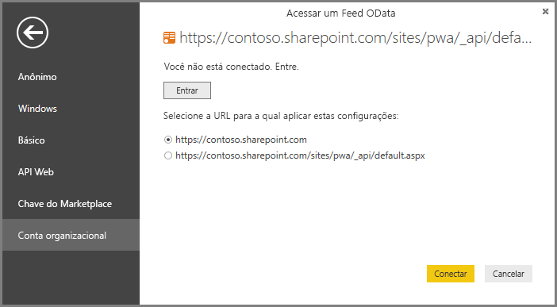

# Conectar-se aos dados do Project Online por meio do Power BI Desktop
Você pode conectar-se a dados no Project Online por meio do Power BI Desktop.

## Etapa 1: Baixar o Power BI Desktop
1. [Baixar o Power BI Desktop](https://go.microsoft.com/fwlink/?LinkID=521662) e, em seguida, execute o instalador para obter o **Power BI Desktop** em seu computador.

## Etapa 2: Conectar-se ao Project Online com o OData
1. Abra o **Power BI Desktop**.
2. Na tela de *Boas-vindas*, selecione **Obter dados**.
3. Escolha **feed OData** e selecione **Conectar**.
4. Insira o endereço para o feed OData na caixa URL e, em seguida, clique em OK.
   
   Se o endereço do seu site do Project Web App for semelhante a *https://\<nomedolocatário\>.sharepoint.com/sites/pwa*, o endereço que você inserirá para o Feed OData será *https://\<nomedolocatário\>.sharepoint.com/sites/pwa/\_api/Projectdata*.
   
   Para nosso exemplo, estamos usando:

    `https://contoso.sharepoint.com/sites/pwa/default.aspx`

5. O Power BI Desktop solicitará que você se autentique com sua conta do Office 365. Selecione Conta organizacional e, em seguida, insira suas credenciais.
   
   

A conta usada para se conectar ao feed OData deve ter pelo menos o acesso do Visualizador do portfólio para o site do Project Web App. 

Aqui, você pode escolher a quais tabelas deseja se conectar e criar uma consulta.  Quer uma ideia de como começar?  A postagem de blog a seguir mostra como criar um Gráfico de Burndown com base em seus dados do Project Online.  A postagem de blog refere-se ao uso do Power Query para se conectar ao Project Online, mas isso se aplica também ao Power BI Desktop.

[Criação de Gráficos de Burndown para o Project usando o Power Pivot e o Power Query](https://blogs.office.com/2014/03/24/creating-burndown-charts-for-project-using-power-pivot-and-power-query/)

