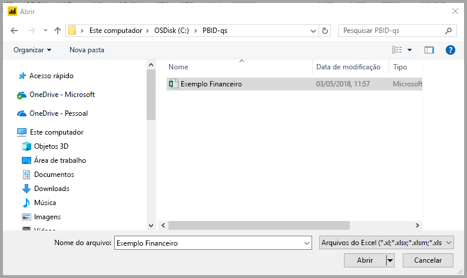
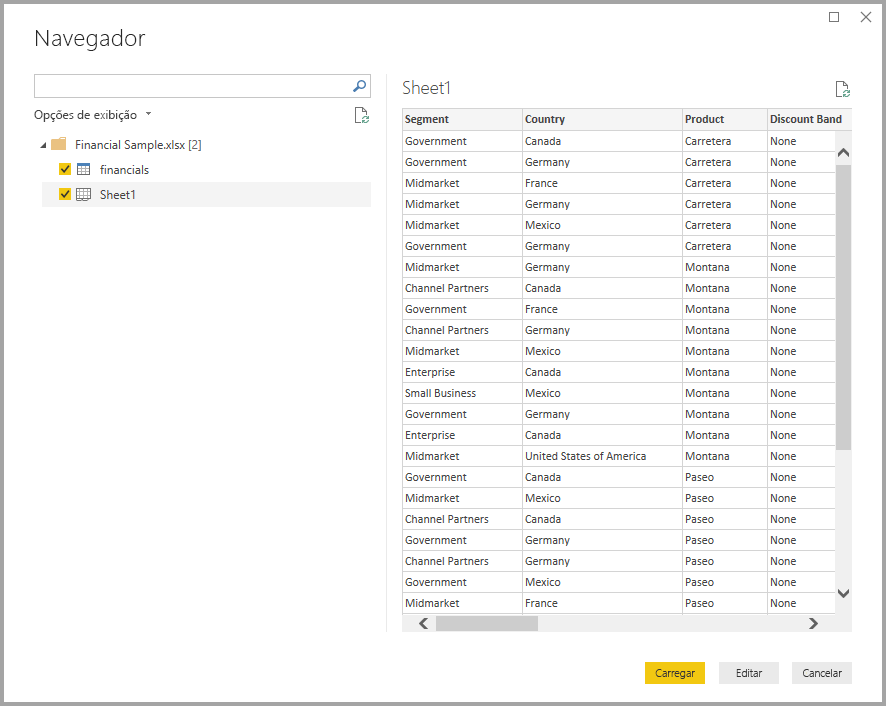

# Início Rápido: Conectar-se a dados no Power BI Desktop

Neste início rápido, você se conecta a dados usando o Power BI Desktop, que é a primeira etapa para a criação de modelos de dados e da criação de relatórios.

Se você não estiver inscrito no Power BI, [inscreva-se para uma avaliação gratuita](https://app.powerbi.com/signupredirect?pbi_source=web) antes de começar.

## Pré-requisitos

Para concluir as etapas neste artigo, você precisa dos seguintes recursos:

* Baixar e instalar o Power BI Desktop, que é um aplicativo gratuito executado no computador local. Você pode [baixar o Power BI Desktop](https://powerbi.microsoft.com/desktop) diretamente ou obtê-lo na [Microsoft Store](https://aka.ms/pbidesktopstore).
* [Baixe esta pasta de trabalho do Excel de exemplo](https://go.microsoft.com/fwlink/?LinkID=521962) e crie uma pasta chamada *C:\PBID-qs*, na qual você pode armazenar o arquivo do Excel. As etapas posteriores neste início rápido pressupõem que esse é o local do arquivo da pasta de trabalho do Excel baixada.
* Para muitos conectores de dados no Power BI Desktop, o Internet Explorer 10 (ou mais recente) é necessário para autenticação.

## Inicie o Power BI Desktop

Depois de instalar o Power BI Desktop, inicie o aplicativo para que ele esteja em execução no computador local. Você verá um tutorial do Power BI. Siga o tutorial ou feche a caixa de diálogo para começar com uma tela em branco. A tela é onde você cria visuais e relatórios com seus dados.

## Conectar-se a dados

Com o Power BI Desktop, você pode se conectar a muitos tipos de dados diferentes. Essas fontes incluem fontes de dados básicas, como um arquivo do Microsoft Excel. Você pode se conectar a serviços online que contêm todo tipo de dados, como o Salesforce, o Microsoft Dynamics, o Armazenamento de Blobs do Azure e muito mais.

Para se conectar a dados, selecione **Obter Dados** na faixa de opções **Início**.

A janela **Obter Dados** é exibida. Você pode escolher entre as várias fontes de dados diferentes às quais o Power BI Desktop pode se conectar. Neste início rápido, use a pasta de trabalho do Excel que você baixou em [Pré-requisitos](#prerequisites).

Como essa fonte de dados é um arquivo do Excel, selecione **Excel** na janela **Obter Dados** e depois selecione o botão **Conectar**.

O Power BI pede que você forneça o local do arquivo do Excel ao qual se conectar. O arquivo baixado é chamado de *Exemplo Financeiro*. Selecione esse arquivo e, em seguida, selecione **Abrir**.

Em seguida, o Power BI Desktop carrega a pasta de trabalho, lê seu conteúdo e mostra os dados disponíveis no arquivo usando a janela **Navegador**. Nessa janela, você pode escolher os dados que deseja carregar no Power BI Desktop. Selecione as tabelas marcando as caixas de seleção ao lado de cada uma que deseja importar. Importe ambas as tabelas disponíveis.

Depois de fazer suas seleções, selecione **Carregar** para importar os dados no Power BI Desktop.

## Exibir dados no painel Campos

Depois que você carregar as tabelas, o painel **Campos** mostrará os dados. Você pode expandir cada tabela selecionando a seta ao lado de seu nome. Na imagem a seguir, a tabela *financials* é expandida, mostrando cada um de seus campos.

E isso é tudo! Você se conectou a dados no Power BI Desktop, carregou esses dados e, agora, pode ver todos os campos disponíveis nessas tabelas.

## Próximas etapas

Há inúmeras coisas que você pode fazer com o Power BI Desktop depois de se conectar aos dados. Você pode criar visuais e relatórios. Veja o recurso a seguir para prosseguir:

* [Introdução ao Power BI Desktop](../fundamentals/desktop-getting-started.md)
