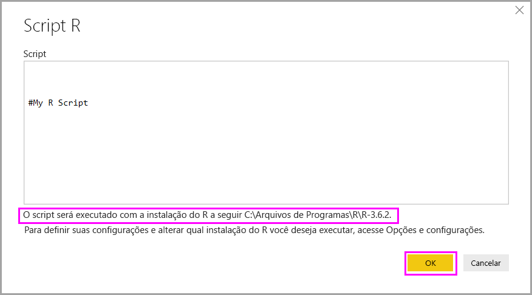

# Executar scripts do R no Power BI Desktop

É possível executar scripts do R diretamente no Power BI Desktop e importar os conjuntos de dados resultantes em um modelo de dados do Power BI Desktop.

## Instalar o R

Para executar scripts do R no Power BI Desktop, você precisa instalar o R em seu computador local. É possível baixar e instalar o R gratuitamente de vários locais, incluindo o [Microsoft R Application Network](https://mran.revolutionanalytics.com/download/) e o [Repositório CRAN](https://cran.r-project.org/bin/windows/base/). A versão atual dá suporte a caracteres Unicode e espaços (caracteres vazios) no caminho de instalação.

## Executar scripts do R

Usando apenas algumas etapas no Power BI Desktop, você pode executar scripts do R e criar um modelo de dados. Com o modelo de dados, você pode criar relatórios e compartilhá-los no serviço do Power BI. O script R no Power BI Desktop agora dá suporte a formatos de número que contêm decimais (.) e vírgulas (,).

### Preparar um script do R

Para executar um script do R no Power BI Desktop, crie o script em seu ambiente de desenvolvimento local do R e certifique-se de que ele é executado com êxito.

Para executar o script no Power BI Desktop, verifique se o script é executado com êxito em um workspace novo e modificado. Esse pré-requisito significa que todos os pacotes e dependências devem ser explicitamente carregados e executados. Você pode usar `source()` para executar scripts dependentes.

A preparação e execução de um script do R no Power BI Desktop sofre algumas limitações:

* Como apenas os quadros de dados são importados, lembre-se de representar os dados que você quer no Power BI em um quadro de dados.
* Colunas tipadas como Complexas e Vetoriais não são importadas e são substituídas por valores de erro na tabela criada.
* Valores `N/A` são convertidos em valores `NULL` no Power BI Desktop.
* Após uma execução de 30 minutos, o script do R expira.
* Chamadas interativas no script do R, como aguardar a entrada do usuário, interrompem a execução do script.
* Ao definir o diretório de trabalho dentro do script R, é *necessário* definir um caminho completo para o diretório de trabalho, em vez de um caminho relativo.

### Executar o script do R e importar dados

Agora você pode executar o script do R para importar dados no Power BI Desktop:

1. No Power BI Desktop, selecione **Obter Dados**, escolha **Outros** > **Script do R** e, em seguida, selecione **Conectar**:

    

2. Se o R estiver instalado em seu computador local, basta copiar o script na janela de script e selecionar **OK**. A versão mais recente instalada será exibida como seu mecanismo de R.

    

3. Selecione **OK** para executar o script do R. Quando o script é executado com êxito, você pode escolher os quadros de dados resultantes para adicionar ao modelo do Power BI.

Você pode controlar qual instalação do R usar para executar o script. Para especificar as configurações da sua instalação do R, escolha **Arquivo** > **Opções e configurações** > **Opções** e, em seguida, selecione **Script R**. Em **Opções de script do R**, a lista suspensa **Diretórios base do R detectados** mostra as opções de instalação atuais do R. Se a instalação do R que você quiser não estiver listada, escolha **Outros** e, em seguida, procure ou informe a pasta de instalação do R preferida em **Definir um diretório base do R**.

### Refresh

É possível atualizar um script do R no Power BI Desktop. Quando você atualiza um script do R, o Power BI Desktop o executa novamente no ambiente do Power BI Desktop.

## Próximas etapas

Analise as informações adicionais a seguir sobre o R no Power BI.

* [Criar elementos visuais do Power BI usando o R](../create-reports/desktop-r-visuals.md)
* [Usar um IDE R externo com o Power BI](desktop-r-ide.md)
