# <a name="tutorial-shape-and-combine-data-in-power-bi-desktop"></a>Tutorial: Formatar e combinar dados no Power BI Desktop

Com o Power BI Desktop, você pode se conectar a muitos tipos diferentes de fontes de dados e, em seguida, formatar esses dados de acordo com suas necessidades, possibilitando a criação de relatórios visuais para compartilhar com outras pessoas. *Formatar* dados significa transformá-los: renomear colunas ou tabelas, converter texto em números, remover linhas, definir a primeira linha como títulos etc. *Combinar* dados significa conectar-se a duas ou mais fontes de dados, formatá-las conforme necessário e, em seguida, consolidá-las em uma consulta útil.

Neste tutorial, você aprenderá a:

* Formatar dados usando o Editor de Consultas.
* Conectar-se a diferentes fontes de dados.
* Combinar essas fontes de dados e criar um modelo de dados a ser usado em relatórios.

Este tutorial demonstra como formatar uma consulta usando o Power BI Desktop, destacando as tarefas mais comuns. A consulta usada aqui é descrita mais detalhadamente, incluindo como criar a consulta do zero, em [Introdução ao Power BI Desktop](../fundamentals/desktop-getting-started.md).

O Editor de Consultas no Power BI Desktop faz uso abundante de menus de atalho, bem como da faixa de opções **Transformar**. A maioria das opções que você pode selecionar na faixa de opções também está disponível com um clique do botão direito do mouse em um item, como uma coluna, e com a seleção de uma opção no menu que é exibido.

## <a name="shape-data"></a>Formatar dados
Ao formatar dados no Editor de Consultas, você fornece instruções passo a passo para que o Editor de Consultas realize o ajuste dos dados conforme eles são carregados, apresentando-os. A fonte de dados original não é afetada; apenas essa exibição específica dos dados é ajustada ou *formatada*.

As etapas especificadas (como renomear uma tabela, transformar um tipo de dados ou excluir uma coluna) são registradas pelo Editor de Consultas. Toda vez que essa consulta se conecta à fonte de dados, o Editor de Consultas executa essas etapas para que os dados sempre sejam formatados da maneira que você especificar. Esse processo ocorre sempre que você usa o Editor de Consultas ou para qualquer pessoa que usa sua consulta compartilhada, como no serviço do Power BI. Essas etapas são capturadas sequencialmente no painel **Configurações de Consulta**, em **Etapas Aplicadas**. Veremos cada uma dessas etapas nos próximos parágrafos.

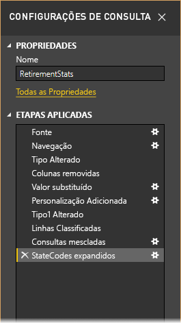

Em [Introdução ao Power BI Desktop](../fundamentals/desktop-getting-started.md), vamos usar os dados de aposentadoria, que encontramos ao nos conectarmos a uma fonte de dados da Web, para formatá-los de acordo com nossas necessidades. Adicionaremos uma coluna personalizada para calcular a classificação com base em todos os dados sendo fatores iguais e compararemos essa coluna com a coluna existente, **Classificação**.  

1. Na faixa de opções **Adicionar Coluna**, selecione **Coluna Personalizada**, que permite adicionar uma coluna personalizada.

    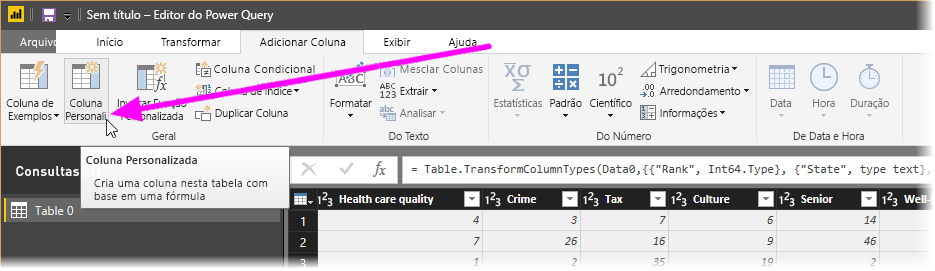

1. Na janela **Coluna Personalizada**, em **Nome da nova coluna**, insira _Nova Classificação_. Em **Fórmula de coluna personalizada**, insira os seguintes dados:

    ```
    ([Cost of living] + [Weather] + [Health care quality] + [Crime] + [Tax] + [Culture] + [Senior] + [#"Well-being"]) / 8
    ```
 
1. Verifique se a mensagem de status indica *Nenhum erro de sintaxe foi detectado* e selecione **OK**.

    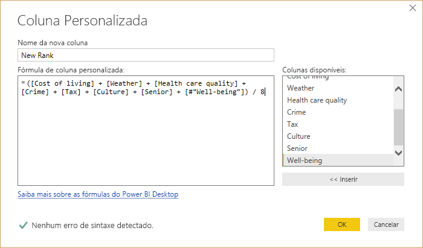

1. Para manter os dados da coluna consistentes, transforme os valores da nova coluna em números inteiros. Para alterá-los, clique com o botão direito do mouse no título da coluna e, em seguida, selecione **Alterar Tipo \> Número Inteiro**. 

    Caso precise escolher mais de uma coluna, selecione uma coluna, mantenha pressionada a tecla **SHIFT**, selecione colunas adjacentes adicionais e, em seguida, clique com o botão direito do mouse em um título de coluna. Você também pode usar a tecla **CTRL** para escolher colunas não adjacentes.

    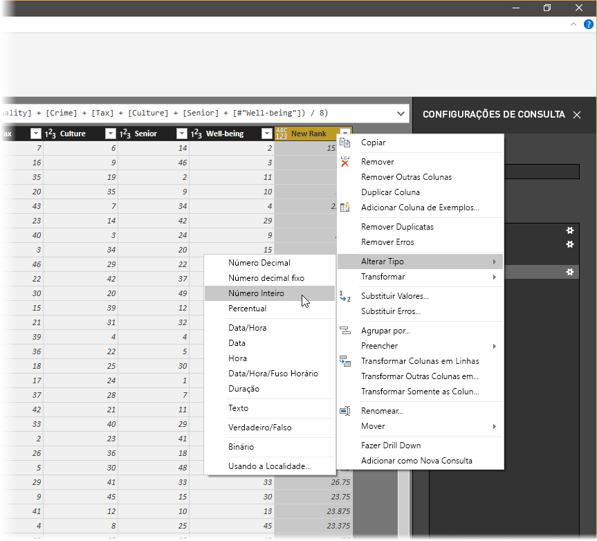

1. Para *transformar* tipos de dados de coluna, nos quais você transforma o tipo de dados atual em outro, selecione **Tipo de Dados Texto** na faixa de opções **Transformar**. 

   

1. Em **Configurações de Consulta**, a lista **Etapas Aplicadas** reflete todas as etapas de formatação aplicadas aos dados. Para remover uma etapa do processo de formatação, selecione o **X** à esquerda da etapa. 

    Na seguinte imagem, a lista **Etapas Aplicadas** reflete as etapas adicionadas até o momento: 
     - **Fonte**: Conexão ao site.
     - **Navegação**: Seleção da tabela. 
     - **Tipo Alterado**: Alteração das colunas de número baseadas em texto de *Texto* para *Número Inteiro*. 
     - **Personalização Adicionada**: Adição de uma coluna personalizada.
     - **Tipo Alterado1**: A última etapa aplicada.

       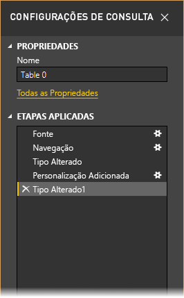

## <a name="adjust-data"></a>Ajustar os dados

Antes de trabalharmos com essa consulta, precisamos fazer algumas alterações para ajustar os dados:

   - Ajustar as classificações removendo uma coluna.

       Decidimos que o **Custo de vida** é um não fator em nossos resultados. Depois de remover essa coluna, descobrimos que os dados permanecem inalterados. 

   - Corrigir alguns erros.

       Como removemos uma coluna, precisamos reajustar nossos cálculos na coluna **Nova Classificação**, que envolve a alteração de uma fórmula.

   - Classificar os dados.

       Classifique os dados com base nas colunas **Nova Classificação** e **Classificação**.
 
   - Substituir os dados.

       Destacaremos como substituir um valor específico e a necessidade de inserir uma **Etapa Aplicada**.

   - Alterar o nome da tabela. 

       Como a **Tabela 0** não é um descritor útil para a tabela, alteraremos o nome dela.

1. Para remover a coluna **Custo de vida**, selecione a coluna, escolha a guia **Página Inicial** na faixa de opções e, em seguida, selecione **Remover Colunas**.

    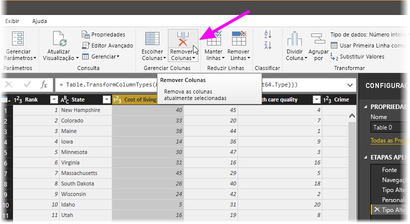

   Observe que os valores de **Nova Classificação** não foram alterados devido à ordenação das etapas. Como o Editor de Consultas registra as etapas sequencialmente, porém, de modo independente uma da outra, você pode mover cada **Etapa Aplicada** na sequência, para cima ou para baixo. 

1. Clicar com o botão direito do mouse em uma etapa. O Editor de Consultas fornece um menu que permite executar as seguintes tarefas: 
   - **Renomear**: renomeie a etapa.
   - **Excluir**: Exclua a etapa.
   - **Excluir** **Até o Fim**: Remova a etapa atual e todas as etapas seguintes.
   - **Mover para Cima**: Mova a etapa para cima na lista.
   - **Mover para Baixo**: Mova a etapa para baixo na lista.

1. Mova a última etapa, **Colunas Removidas**, para logo cima da etapa **Personalização Adicionada**.

   

1. Selecione a etapa **Personalização Adicionada**. 

   Observe que agora os dados mostram _Erro_, o qual precisaremos resolver.

   

   Existem algumas maneiras de obter mais informações sobre cada erro. Se você selecionar a célula sem clicar na palavra *Erro*, o Editor de Consultas exibirá as informações de erro na parte inferior da janela.

   

   Se você selecionar a palavra *Erro* diretamente, o Editor de Consultas criará uma **Etapa Aplicada** no painel **Configurações de Consulta** e exibirá informações sobre o erro. 

1. Como não precisamos exibir informações sobre os erros, selecione **Cancelar**.

1. Para corrigir os erros, selecione a coluna **Nova Classificação** e, em seguida, exiba a fórmula de dados da coluna selecionando a caixa de seleção **Barra de Fórmulas** na guia **Exibir**. 

   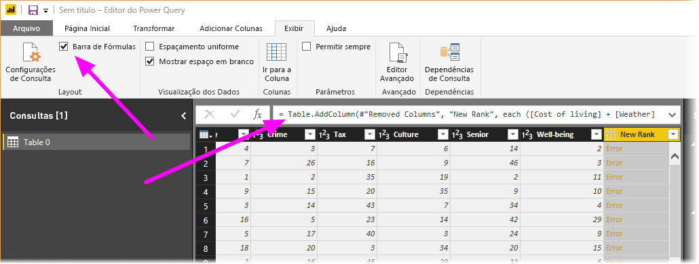

1. Remova o parâmetro _Custo de vida_ e diminuir o divisor alterando a fórmula da seguinte maneira: 
   ```
    Table.AddColumn(#"Removed Columns", "New Rank", each ([Weather] + [Health care quality] + [Crime] + [Tax] + [Culture] + [Senior] + [#"Well-being"]) / 7)
   ```

1. Marque a marca de seleção verde à esquerda da caixa da fórmula ou pressione **Enter**.

  O Editor de Consultas substitui os dados pelos valores revisados e a etapa **Personalização Adicionada** é concluída sem erros.

   > [!NOTE]
   > Selecione também **Remover Erros** usando a faixa de opções ou o menu de atalho, que remove as linhas com erros. No entanto, não queremos fazer isso neste tutorial porque queríamos preservar os dados na tabela.

1. Classifique os dados com base na coluna **Nova Classificação**. Primeiro, selecione a última etapa aplicada, **Tipo Alterado1**, para exibir os dados mais recentes. Em seguida, selecione a lista suspensa localizada ao lado do cabeçalho de coluna **Nova Classificação** e selecione **Classificar em Ordem Crescente**.

   

   Agora os dados estão classificados de acordo com a **Nova Classificação**. No entanto, se você examinar a coluna **Classificação**, perceberá que os dados não estão classificados corretamente em casos nos quais o valor de **Nova Classificação** é um empate. Corrigiremos isso na próxima etapa.

1. Para corrigir o problema de classificação de dados, selecione a coluna **Nova Classificação** e altere a fórmula na **Barra de Fórmulas** para a seguinte fórmula:

   ```
    = Table.Sort(#"Changed Type1",{{"New Rank", Order.Ascending},{"Rank", Order.Ascending}})
   ```

1. Marque a marca de seleção verde à esquerda da caixa da fórmula ou pressione **Enter**. 

   Agora as linhas estão ordenadas de acordo com as colunas **Nova Classificação** e **Classificação**. Além disso, é possível selecionar uma **Etapa Aplicada** em qualquer lugar na lista e continuar formatando os dados nesse ponto na sequência. O Editor de Consultas insere de maneira automática uma nova etapa diretamente após a **Etapa Aplicada** selecionada no momento. 

1. Em **Etapa Aplicada**, selecione a etapa que precede a coluna personalizada, que é a etapa **Colunas Removidas**. Aqui, substituiremos o valor da classificação **Clima** no Arizona. Clique com o botão direito na célula apropriada que contém a classificação **Clima** do Arizona e, em seguida, selecione **Substituir Valores**. Observe qual **Etapa Aplicada** está selecionada no momento.

   

1. Selecione **Inserir**.

    Como estamos inserindo uma etapa, o Editor de Consultas nos alerta sobre o perigo de fazer isso; as etapas seguintes podem causar uma fragmentação da consulta. 

    

1. Altere o valor dos dados para _51_. 

   O Editor de Consultas substitui os dados para o Arizona. Quando você cria uma **Etapa Aplicada**, o Editor de Consultas a nomeia com base na ação; nesse caso, **Valor Substituído**. Se você tiver mais de uma etapa com o mesmo nome na consulta, o Editor de Consultas adicionará um número (em sequência) a cada **Etapa Aplicada** seguinte, para diferenciá-las.

1. Selecione a última **Etapa Aplicada**, **Linhas Classificadas**. 

   Observe que os dados foram alterados em relação à nova classificação do Arizona. Essa alteração ocorre porque inserimos a etapa **Valor Substituído** na localização correta, antes da etapa **Personalização Adicionada**.

1. Por fim, desejamos alterar o nome dessa tabela para algo descritivo. No painel **Configurações de Consulta**, em **Propriedades**, insira o novo nome da tabela e, em seguida, selecione **Enter**. Nomeie essa tabela *RetirementStats*.

   

   Quando começamos a criar relatórios, é útil ter nomes de tabelas descritivos, especialmente quando nos conectamos a várias fontes de dados, que estão listadas no painel **Campos** da exibição **Relatório**.

   Agora formatamos nossos dados na medida necessária. Em seguida, vamos nos conectar a outra fonte de dados e combinar dados.

## <a name="combine-data"></a>Combinar dados
Os dados sobre vários estados são interessantes e serão úteis para a criação de consultas e esforços de análise adicionais. Mas há um problema: a maioria dos dados usam uma abreviação de duas letras para códigos de estado, em vez de utilizar o nome completo do estado. Precisamos de uma maneira de associar os nomes de estados às respectivas abreviações.

Estamos com sorte: há outra fonte de dados pública que faz exatamente isso, mas ela precisa de uma quantidade razoável de formatação antes que possamos conectá-la à nossa tabela de aposentadoria. Para formatar os dados, siga estas etapas:

1. Na faixa de opções **Página Inicial** no Editor de Consultas, selecione **Nova Fonte \> Web**. 

2. Insira o endereço do site de abreviações de estados, *https://en.wikipedia.org/wiki/List_of_U.S._state_abbreviations* , e, em seguida, selecione **Conectar**.

   O Navegador exibirá o conteúdo do site.

    

1. Selecione **Códigos e abreviações**. 

   > [!TIP]
   > Será necessário um pouco de formatação para reduzir os dados dessa tabela até o que desejamos. Há uma maneira mais rápida ou mais fácil de realizar as etapas abaixo? Sim, podemos criar uma *relação* entre as duas tabelas e formatar os dados com base nessa relação. As etapas a seguir ainda são úteis para aprender a trabalhar com tabelas; no entanto, as relações podem ajudar você rapidamente a usar os dados de várias tabelas.
> 
> 

Para colocar os dados em forma, siga estas etapas:

1. Remova a linha superior. Como ela é o resultado do modo como a tabela da página Web foi criada, não precisamos dela. Na faixa de opções **Página Inicial**, selecione **Reduzir Linhas\> Remover Linhas \> Remover Primeiras Linhas**.

    

    A janela **Remover Primeiras Linhas** é exibida, permitindo que você especifique o número de linhas que deseja remover.

    > [!NOTE]
    > Se, acidentalmente, o Power BI importar os cabeçalhos de tabela como uma linha em sua tabela de dados, você pode selecionar **Usar Primeira Linha como Cabeçalho** da guia **Página Inicial**, ou na guia **Transformar** na faixa de opções, para corrigir a tabela.

1. Remova as últimas 26 linhas. Essas linhas são territórios dos EUA, que não precisamos incluir. Na faixa de opções **Página Inicial**, selecione **Reduzir Linhas \> Remover Linhas \> Remover Últimas Linhas**.

    

1. Como a tabela RetirementStats não contém informações de Washington D.C., precisamos filtrá-la de nossa lista. Selecione a lista suspensa **Status da Região** e, em seguida, desmarque a caixa de seleção ao lado de **Distrito federal**.

    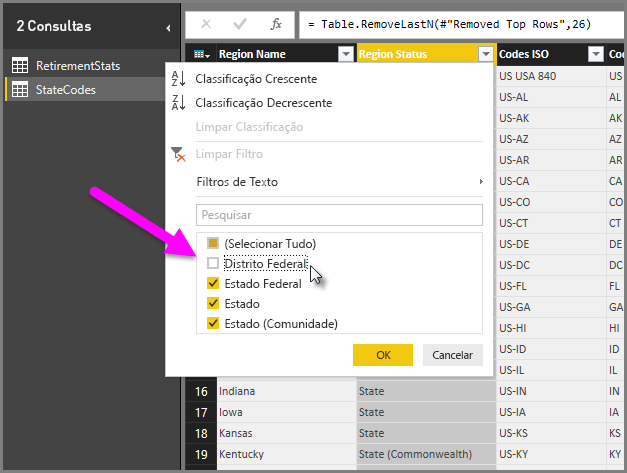

1. Remova algumas colunas desnecessárias. Como precisamos apenas do mapeamento de cada estado para a respectiva abreviação oficial de duas letras, podemos remover as seguintes colunas: **Column1**, **Column3**, **Column4** e **Column6** até **Column11**. Primeiro, selecione **Column1**, em seguida, mantenha pressionada a tecla **CTRL** e selecione cada uma das outras colunas a serem removidas. Na guia **Página Inicial** da faixa de opções, selecione **Remover Colunas \> Remover Colunas**.

   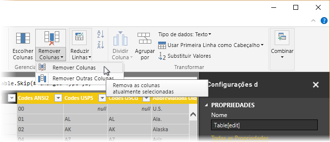

   > [!NOTE]
   > Esse é um bom momento para destacar que a *sequência* de etapas aplicadas no Editor de Consultas é importante e pode afetar o modo de formatação dos dados. Também é importante considerar como uma etapa pode afetar outra etapa subsequente; se você remover uma etapa das Etapas Aplicadas, as etapas subsequentes podem não se comportar como pretendido originalmente, devido ao impacto da sequência de etapas da consulta.

   > [!NOTE]
   > Ao redimensionar a janela do Editor de Consultas para diminuir a largura, alguns itens de faixa de opções são condensados para fazer o melhor uso do espaço visível. Ao aumentar a largura da janela do Editor de Consultas, os itens da faixa de opções são expandidos para fazer o melhor uso da área aumentada da faixa de opções.

1. Renomeie as colunas e a tabela. Há algumas maneiras de renomear uma coluna: Primeiro, selecione a coluna e, em seguida, selecione **Renomear** na guia **Transformar** na faixa de opções ou clique com o botão direito do mouse e selecione **Renomear**. A imagem a seguir tem setas apontando para ambas as opções; você precisa escolher apenas uma.

   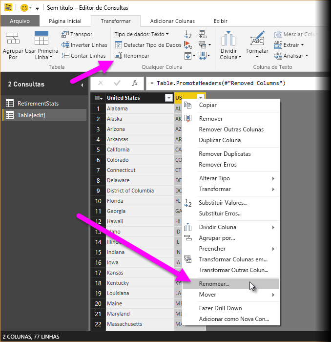

1. Renomeie as colunas para *State Name* e *State Code*. Para renomear a tabela, insira o **Nome** no painel **Configurações de Consulta**. Nomeie essa tabela *StateCodes*.

## <a name="combine-queries"></a>Combinar consultas

Agora que formatamos a tabela StateCodes da maneira que desejamos, vamos combinar essas duas tabelas, ou consultas, em uma só. Como as tabelas que temos agora são o resultado das consultas que aplicamos aos dados, elas são geralmente chamadas de *consultas*.

Há duas maneiras principais de combinar consultas: *mesclagem* e *acréscimo*.

- Quando você tem uma ou mais colunas que deseja adicionar a outra consulta, você *mescla* as consultas. 
- Quando você tem linhas adicionais de dados que deseja adicionar a uma consulta existente, você *acrescenta* a consulta.

Nesse caso, desejamos mesclar as consultas. Para fazer isso, siga estas etapas:
 
1. No painel esquerdo do Editor de Consultas, selecione a consulta *com a qual* deseja mesclar a outra consulta. Nesse caso, **RetirementStats**. 

1. Selecione **Combinar \> Mesclar Consultas** na guia **Página Inicial** da faixa de opções.

   

   Talvez você precise definir os níveis de privacidade, a fim de garantir que os dados sejam combinados sem incluir nem transferir dados que você não deseja transferir.

   A janela **Mesclar** será exibida. Ela solicita a seleção da tabela que você deseja mesclar com a tabela selecionada e as colunas correspondentes a serem usadas para a mesclagem. 

1. Selecione **State** na tabela RetirementStats e, em seguida, a consulta **StateCodes**. 

   Quando você seleciona as colunas correspondentes corretas, o botão **OK** é habilitado.

   

1. Selecione **OK**.

   O Editor de Consultas cria uma coluna **NewColumn** ao final da consulta, que consiste no conteúdo da tabela (consulta) que foi mesclada com a consulta existente. Todas as colunas da consulta mesclada são condensadas na coluna **NewColumn**, mas você pode **Expandir** a tabela e incluir as colunas desejadas.

   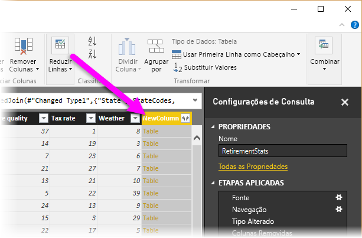

1. Para expandir a tabela mesclada e selecionar as colunas a serem incluídas, selecione o ícone de expansão (). 

   A janela **Expandir** é exibida.

   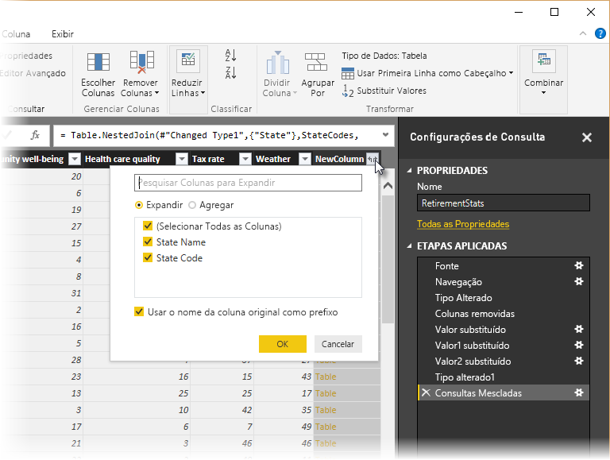

1. Nesse caso, queremos apenas a coluna **State Code**. Selecione essa coluna, desmarque **Usar nome da coluna original como prefixo** e, em seguida, selecione **OK**.

   Se tivéssemos deixado a caixa de seleção marcada para **Usar o nome da coluna original como prefixo**, a coluna mesclada seria nomeada **NewColumn.State Code**.

   > [!NOTE]
   > Deseja explorar como inserir a tabela NewColumn? Você pode experimentar um pouco e, se não gostar dos resultados, basta excluir essa etapa da lista **Etapas Aplicadas** no painel **Configurações de Consulta** ; sua consulta retornará ao estado anterior à aplicação dessa etapa **Expandir** . Você pode fazer isso quantas vezes quiser, até que o processo de expansão tenha a aparência desejada.

   Agora temos uma única consulta (tabela) que combina duas fontes de dados, cada uma das quais foi formatada de acordo com nossas necessidades. Essa consulta pode servir como base para muitas conexões de dados adicionais e interessantes, como estatísticas de custo de moradia, dados demográficos ou oportunidades de trabalho em qualquer estado.

1. Para aplicar as alterações e fechar o Editor de Consultas, selecione **Fechar e Aplicar** na guia de faixa de opções **Página Inicial**. 

   O conjunto de dados transformado aparece no Power BI Desktop, pronto para ser usado para a criação de relatórios.

   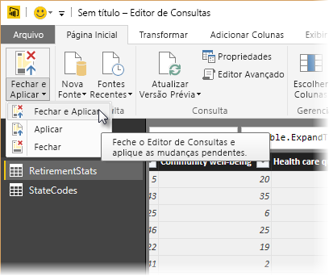

## <a name="next-steps"></a>Próximas etapas
Para obter mais informações sobre o Power BI Desktop e as funcionalidades dele, confira os seguintes recursos:

* [O que é o Power BI Desktop?](../fundamentals/desktop-what-is-desktop.md)
* [Visão geral da Consulta no Power BI Desktop](../transform-model/desktop-query-overview.md)
* [Fontes de dados no Power BI Desktop](desktop-data-sources.md)
* [Conectar-se a dados no Power BI Desktop](desktop-connect-to-data.md)
* [Tarefas comuns de consulta no Power BI Desktop](../transform-model/desktop-common-query-tasks.md)   
