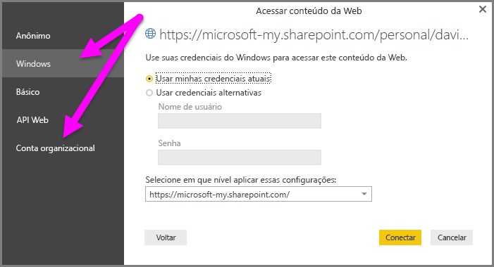

# Usar os links do OneDrive for Business no Power BI Desktop
Muitas pessoas têm pastas de trabalho do Excel armazenadas no OneDrive for Business que seriam ótimas para uso com o Power BI Desktop. Com o Power BI Desktop, você pode usar links online para arquivos do Excel armazenados no OneDrive for Business para criar relatórios e visuais. Você pode usar uma conta de grupo do OneDrive for Business ou sua conta individual do OneDrive for Business.

Obter um link online do OneDrive for Business requer algumas etapas específicas. As seções a seguir explicam essas etapas, que permitem que você compartilhe o link do arquivo entre grupos, diferentes computadores e com seus colegas de trabalho.

## Obter um link do Excel
1. Navegue até o local do seu OneDrive for Business usando um navegador. Clique no arquivo que você deseja usar e selecione **Abrir no Excel**.
   
   > [!NOTE]
   > A interface do navegador pode não ser exatamente igual à imagem a seguir. Há várias maneiras de selecionar **Abrir no Excel** para arquivos em sua interface de navegador do OneDrive for Business. Você pode usar qualquer opção que permite abrir o arquivo no Excel.
   
   

2. No Excel, selecione **Arquivo** > **Informações** e selecione o botão **Copiar caminho**, conforme mostrado na imagem a seguir.
   
   

## Usar o link Power BI Desktop
No Power BI Desktop, você pode usar o link que acabou de copiar para a área de transferência. Realize as seguintes etapas:

1. No Power BI Desktop, selecione **Obter Dados** > **Web**.
   
   
2. Com a opção **Básico** selecionada, cole o link na caixa de diálogo **Da Web**.
3. Remova a cadeia de caracteres *?web=1* no final do link para que o Power BI Desktop possa navegar corretamente até o arquivo e, em seguida, selecione **OK**.
   
     
4. Se o Power BI Desktop solicitar suas credenciais, escolha **Windows** (para sites locais do SharePoint) ou **Conta Organizacional** (para sites do Microsoft 365 ou do OneDrive for Business).
   
   

   Uma caixa de diálogo do **Navegador** é exibida, permitindo que você selecione na lista de tabelas, planilhas e intervalos encontrados na pasta de trabalho do Excel. De lá, você pode usar o arquivo do OneDrive for Business da mesma forma que qualquer outro arquivo do Excel. Você pode criar relatórios e usá-los em conjuntos de dados como faria com qualquer outra fonte de dados.

> [!NOTE]
> Para usar um arquivo do OneDrive for Business como fonte de dados no serviço do Power BI, com **Atualização de Serviço** habilitada para esse arquivo, selecione **OAuth2** como o **Método de autenticação** ao configurar as definições de atualização. Caso contrário, você pode encontrar um erro (como *Falha ao atualizar as credenciais de fonte de dados*) ao tentar se conectar ou atualizar. Selecionar **OAuth2** como método de autenticação resolve esse erro de credenciais.
> 
> 

