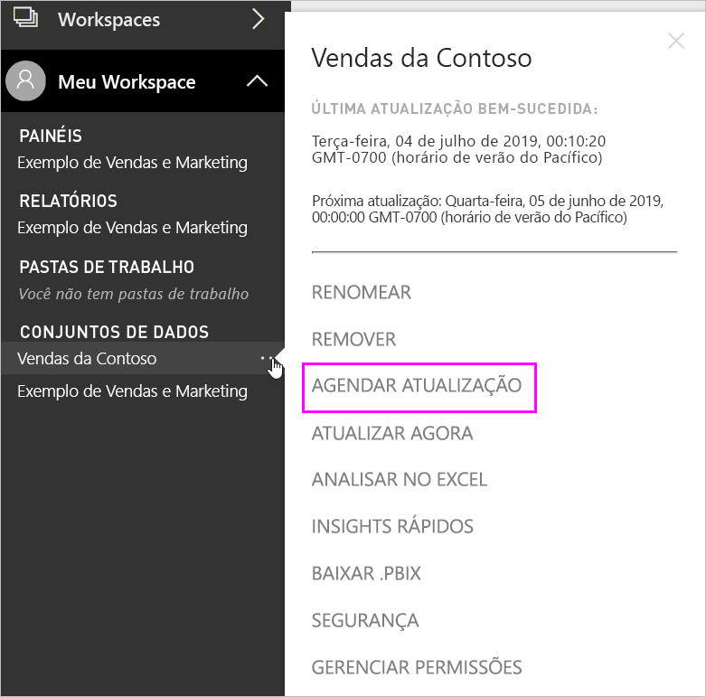

# Configurar a atualização agendada

>[!NOTE]
>Depois de dois meses de inatividade, a atualização agendada do conjunto de dados é pausada. Para obter mais informações, confira [*Atualização agendada*](#scheduled-refresh) mais adiante neste artigo.

Este artigo descreve as opções disponíveis para a atualização agendada no [Gateway de dados local (modo pessoal)](service-gateway-personal-mode.md) e no [Gateway de dados local](service-gateway-onprem.md). Especifique as opções de atualização nas seguintes áreas do serviço do Power BI: **Conexão do gateway**, **Credenciais da fonte de dados** e **Atualização agendada**. Vamos examinar cada uma delas. Para obter mais informações sobre a atualização de dados, incluindo as limitações das agendas de atualização, confira [Atualização de dados](refresh-data.md#data-refresh).

Para acessar a tela da **Atualização agendada**:

1. No painel de navegação, em **Conjuntos de dados**, selecione **Mais opções** (...) ao lado de um conjunto de dados listado.
2. Selecione **Agendar Atualização**.

    

## Conexão do gateway

Você verá diferentes opções aqui dependendo do tipo de gateway (pessoal ou corporativo) que tem online e disponível.

Se nenhum gateway estiver disponível, você verá a **Conexão do gateway** desabilitada. Você também verá uma mensagem indicando como instalar o gateway pessoal.

Se você tiver um gateway pessoal configurado, ele estará disponível para seleção caso esteja online. Ele aparecerá como offline se não estiver disponível.

Você também pode selecionar o gateway corporativo, se houver um disponível. Você só verá um gateway corporativo disponível se a conta estiver listada na guia **Usuários** da fonte de dados configurada para um determinado gateway.

## Credenciais da fonte de dados

### Gateway do Power BI - Pessoal

Se estiver usando o gateway pessoal para atualizar os dados, você deverá fornecer as credenciais para se conectar à fonte de dados de back-end. Se você estiver conectado a um pacote de conteúdo de um serviço online, as credenciais inseridas para se conectar serão transferidas para a atualização agendada.

Você só precisa entrar em uma fonte de dados na primeira vez que usar a atualização nesse conjunto de dados. Uma vez inseridas, essas credenciais são mantidas com o conjunto de dados.

> [!NOTE]
> Para alguns métodos de autenticação, se a senha usada para entrar em uma fonte de dados expirar ou se for alterada, você também precisará alterá-la na fonte de dados em **Credenciais da fonte de dados**.

Quando as coisas dão errado, o problema geralmente tem algo a ver com o gateway estar offline porque não foi possível entrar no Windows e iniciar o serviço ou Power BI não conseguiu se conectar às fontes de dados para consultar dados atualizados. Se a atualização falhar, verifique as configurações do conjunto de dados. Se o serviço de gateway estiver offline, você verá o erro em **Status**. Se o Power BI não conseguir se conectar às fontes de dados, você verá um erro em Credenciais da Fonte de Dados.

### Gateway de dados local

Se você estiver usando o Gateway de dados local para atualizar dados, não será necessário fornecer credenciais, pois elas são definidas para a fonte de dados pelo administrador do gateway.

> [!NOTE]
> Ao se conectar ao SharePoint local para atualização de dados, o Power BI dá suporte apenas a mecanismos de autenticação *Anônima*, *Básica* e *Windows (Kerberos/NTLM)* . O Power BI não dá suporte a *ADFS* ou a nenhum mecanismo de *Autenticação Baseada em Formulários* para atualização de dados de fontes de dados locais do SharePoint.

## Atualização agendada

A seção sobre **Atualização agendada** é o local em que você define a frequência e os slots de tempo para atualizar o conjunto de dados. Algumas fontes de dados não exigem um gateway para serem configuráveis para a atualização. Outras fontes de dados exigem um gateway.

Defina o controle deslizante **Manter seus dados atualizados** como **Ativar** para definir as configurações.

> [!NOTE]
> O objetivo é iniciar a atualização dentro de 15 minutos do slot de horário agendado, mas um atraso de até uma hora poderá ocorrer se o serviço não puder alocar os recursos necessários mais cedo.

> [!NOTE]
> Depois de dois meses de inatividade, a atualização agendada do conjunto de dados é pausada. Um conjunto de dados será considerado inativo quando nenhum usuário tiver visitado qualquer dashboard ou relatório criado no conjunto de dados. Nesse momento, o proprietário do conjunto de dados recebe um email indicando que a atualização agendada está em pausa. O agendamento de atualizações do conjunto de dados é exibido como **desabilitado**. Para continuar com a atualização agendada, simplesmente acesse novamente o dashboard ou o relatório criado no conjunto de dados.

## Há suporte para quê?

> [!NOTE]
> A atualização agendada também será desabilitada automaticamente após quatro erros consecutivos.

Para alguns conjuntos de dados, há suporte para a atualização agendada em gateways diferentes. Aqui está uma referência para entender o que está disponível.

### Gateway do Power BI - Pessoal

**Power BI Desktop**

* Todas as fontes de dados online mostradas em **Obter Dados** e no Editor de Consultas no Power BI Desktop.
* Todas as fontes de dados locais mostradas em **Obter Dados** e no Editor de Consultas no Power BI Desktop, exceto o Arquivo do Hadoop (HDFS) e o Microsoft Exchange.

**Excel**

* Todas as fontes de dados online mostradas no Power Query.
* Todas as fontes de dados locais mostradas no Power Query, exceto o arquivo do Hadoop (HDFS) e o Microsoft Exchange.
* Todas as fontes de dados online mostradas no Power Pivot.
* Todas as fontes de dados locais mostradas no Power Pivot, exceto o arquivo do Hadoop (HDFS) e o Microsoft Exchange.

> [!NOTE]
> No Excel 2016 e posteriores, o Power Query agora é listado na seção **Dados** da faixa de opções, em **Obter e Transformar Dados**.

### Power BI Gateway

Para obter informações sobre as fontes de dados com suporte, consulte [Fontes de dados do Power BI](power-bi-data-sources.md).

## Solução de problemas
Às vezes, a atualização de dados pode não ocorrer da maneira esperada. Normalmente, isso será um problema relacionado a um gateway. Examine os artigos de solução de problemas do gateway para ver ferramentas e problemas conhecidos.

- [Solução de problemas do gateway de dados local](service-gateway-onprem-tshoot.md)
- [Solução de problemas do Gateway do Power BI – Pessoal](service-admin-troubleshooting-power-bi-personal-gateway.md)

## Próximas etapas

- [Atualizar dados no Power BI](refresh-data.md)  
- [Gateway do Power BI – Pessoal](service-gateway-personal-mode.md)  
- [Gateway de dados local (modo pessoal)](service-gateway-onprem.md)  
- [Solução de problemas do gateway de dados local](service-gateway-onprem-tshoot.md)  
- [Solução de problemas do Gateway do Power BI – Pessoal](service-admin-troubleshooting-power-bi-personal-gateway.md)  

Mais perguntas? [Experimente perguntar à Comunidade do Power BI](https://community.powerbi.com/)