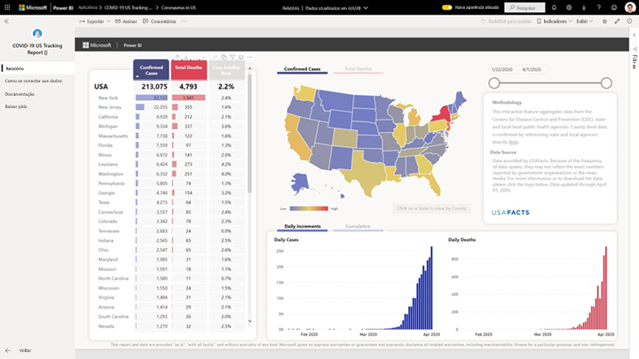
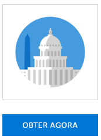
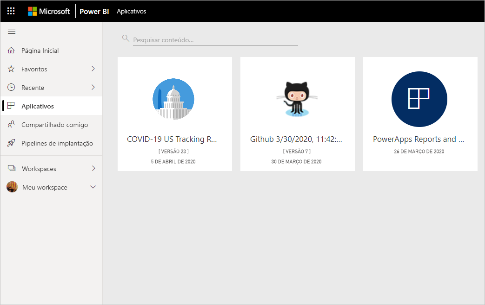
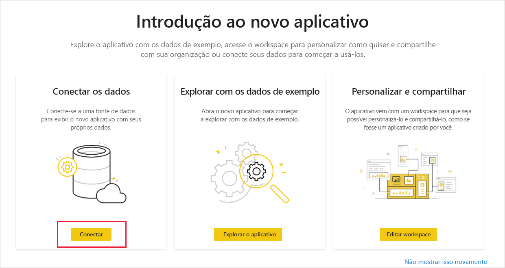
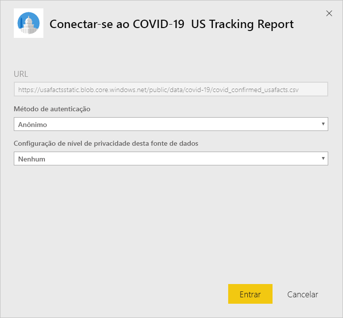
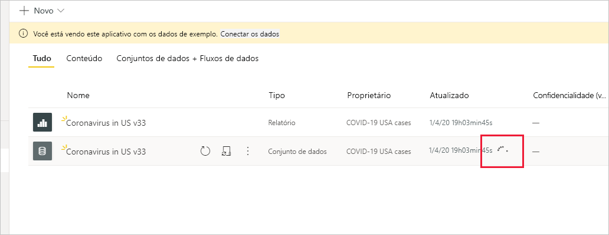

# Conectar-se ao relatório de acompanhamento da COVID-19 nos EUA
Este artigo mostra como instalar o aplicativo de modelo para o relatório de acompanhamento da COVID-19 e como se conectar às fontes de dados.

Para obter informações detalhadas sobre o próprio relatório, incluindo avisos de isenção de responsabilidade e informações sobre os dados, confira [Amostra de acompanhamento da COVID-19 para os governos locais e estaduais dos EUA](../create-reports/sample-covid-19-us.md).

Depois de instalar o aplicativo de modelo e se conectar às fontes de dados, você poderá personalizar o relatório de acordo com as suas necessidades. Em seguida, poderá distribuí-lo como um aplicativo para os colegas da sua organização.

## Instalar o aplicativo

1. Clique no seguinte link para acessar o aplicativo: [Aplicativo de modelo Relatório de Acompanhamento da COVID-19 nos EUA](https://appsource.microsoft.com/en-us/product/power-bi/pbi-contentpacks.covid19ms)

1. Quando você estiver na página AppSource do aplicativo, clique em [**OBTER AGORA**](https://appsource.microsoft.com/en-us/product/power-bi/pbi-contentpacks.covid19ms).

    

1. Se solicitado, clique em **Instalar**. Depois que o aplicativo for instalado, você o verá na página Aplicativos.

   

## Conectar-se a fontes de dados

1. Clique no ícone da página Aplicativos para abrir o aplicativo.

1. Na tela inicial exibida, escolha **Conectar**.

   

1. Duas caixas de diálogo de entrada serão exibidas, uma após a outra. Nas duas, defina o nível de privacidade como Público.

   

   O relatório se conectará às fontes de dados e será preenchido com os dados atualizados. Durante esse período, o monitor de atividade é ativado.

   

## Agendar atualização do relatório

Quando a atualização de dados for concluída, você estará no workspace associado ao aplicativo. [Configure um agendamento de atualização](../refresh-scheduled-refresh.md) para manter os dados do relatório atualizados.

## Personalizar e compartilhar

Confira [Personalizar e compartilhar o aplicativo](../service-template-apps-install-distribute.md#customize-and-share-the-app) para obter detalhes. Examine os [avisos de isenção de responsabilidade do relatório](../create-reports/sample-covid-19-us.md#disclaimers) antes de publicar ou distribuir o aplicativo.

## Próximas etapas
* [Amostra de acompanhamento da COVID-19 para os governos locais e estaduais dos EUA](../create-reports/sample-covid-19-us.md)
* Dúvidas? [Experimente perguntar à Comunidade do Power BI](https://community.powerbi.com/)
* [O que são os aplicativos de modelo do Power BI?](../service-template-apps-overview.md)
* [Instalar e distribuir aplicativos de modelo na sua organização](../service-template-apps-install-distribute.md)
