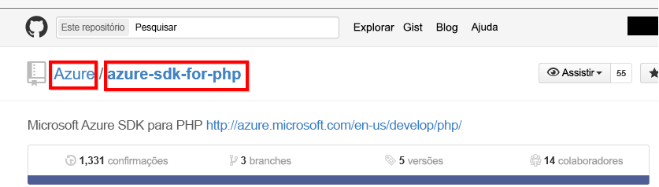

# Conectar-se ao GitHub com o Power BI
Este artigo explica como extrair seus dados da sua conta do GitHub com um aplicativo de modelo do Power BI. O aplicativo de modelo gera um workspace com um dashboard, um conjunto de relatórios e um conjunto de dados para permitir que você explore seus dados do GitHub. O aplicativo do GitHub para o Power BI mostra insights de seu repositório do GitHub, também conhecido como repositório, contendo dados sobre contribuições, problemas, solicitações pull e usuários ativos.

Depois de instalar o aplicativo de modelo, você pode alterar o dashboard e o relatório. Em seguida, pode distribuí-lo como um aplicativo para os colegas de sua organização.

Conecte-se ao [aplicativo de modelo do GitHub](https://app.powerbi.com/groups/me/getapps/services/pbi-contentpacks.pbiapps-github) ou leia mais sobre a [Integração do GitHub](https://powerbi.microsoft.com/integrations/github) com o Power BI.

Você também pode experimentar o [tutorial do GitHub](service-tutorial-connect-to-github.md). Ele instala dados reais do GitHub sobre o repositório público para a documentação de Power BI.

>[!NOTE]
>Este aplicativo de modelo exige que a conta do GitHub tenha acesso ao repositório. Mais detalhes sobre os requisitos abaixo.
>
>Este aplicativo de modelo não dá suporte ao GitHub Enterprise.

## Instalar o aplicativo

1. Clique no seguinte link para acessar o aplicativo: [Aplicativo de modelo do GitHub](https://app.powerbi.com/groups/me/getapps/services/pbi-contentpacks.pbiapps-github)

1. Na página do aplicativo no AppSource, selecione [**OBTER AGORA**](https://app.powerbi.com/groups/me/getapps/services/pbi-contentpacks.pbiapps-github).

    

1. Selecione **Instalar**. 

    

    Depois que o aplicativo for instalado, você o verá na página Aplicativos.

   

## Conectar-se às fontes de dados

1. Selecione o ícone da página Aplicativos para abrir o aplicativo.

1. Na tela inicial, selecione **Explorar aplicativo**.

   

   O aplicativo é aberto, mostrando os dados de exemplo.

1. Selecione o link **Conectar seus dados** na barra de notificação na parte superior da página.

   

1. Na caixa de diálogo, que aparece, insira o nome do repositório e também o seu proprietário. Veja detalhes sobre [como encontrar esses parâmetros](#FindingParams) abaixo. Quando terminar, clique em **Avançar**.

   

1. Na próxima caixa de diálogo exibida, defina o método de autenticação como **OAuth2**. Você não precisará fazer nada na configuração de privacidade. Quando estiver pronto, clique em **Entrar**.

   

1. Insira suas credenciais do GitHub e siga o processo de autenticação GitHub (essa etapa poderá ser ignorada se você já tiver entrado com seu navegador).

   

Depois que você se conectar, o relatório se conectará às fontes de dados e será preenchido com os dados atualizados. Durante esse período, o monitor de atividade é ativado.

Os dados de relatório serão atualizados automaticamente uma vez por dia, a menos que você tenha desabilitado isso durante o processo de entrada. Você também poderá [configurar sua agenda de atualização](./refresh-scheduled-refresh.md) para manter os dados do relatório atualizados, se assim desejar.

## Personalizar e compartilhar

Para personalizar e compartilhar seu aplicativo, selecione o ícone de lápis no canto superior direito da página.

Para obter informações sobre como editar artefatos no workspace, confira
* [Visão geral do editor de relatório no Power BI](../create-reports/service-the-report-editor-take-a-tour.md)
* [Conceitos básicos para designers no serviço do Power BI](../fundamentals/service-basic-concepts.md)

Quando terminar de fazer as alterações desejadas nos artefatos no workspace, você estará pronto para publicar e compartilhar o aplicativo. Confira [Publicar seu aplicativo](../collaborate-share/service-create-distribute-apps.md#publish-your-app) para saber como fazer isso.

## O que está incluído no aplicativo
Os dados a seguir estão disponíveis no GitHub no Power BI:     

| Nome da tabela | Descrição |
| --- | --- |
| Contribuições |A tabela de contribuições apresenta o total de adições, exclusões e confirmações criadas pelo colaborador agregadas por semana. Os 100 principais colaboradores são incluídos. |
| Problemas |Lista todos os problemas do repositório selecionado e contém cálculos como os tempos total e médio para encerramento de um problema, Total de problemas em aberto e Total de problemas encerrados. Esta tabela estará vazia quando não houver nenhum problema no repositório. |
| Solicitações pull |Esta tabela contém todas as Solicitações Pull para o repositório e quem realizou a solicitação. Ela também contém cálculos de quantas solicitações pull abertas, fechadas e totais existem, quanto tempo demorou para efetuar o pull das solicitações e quanto tempo levou cada solicitação pull em média. Esta tabela estará vazia quando não houver nenhum problema no repositório. |
| Usuários |Esta tabela fornece uma lista de colaboradores ou usuários do GitHub que fizeram contribuições, arquivaram problemas ou resolveram Solicitações pull para o repositório selecionado. |
| Marcos |Contém todas as Etapas para o repositório selecionado. |
| DateTable |Esta tabela contém datas do presente e de anos no passado, que permitem a você analisar seus dados GitHub por data. |
| ContributionPunchCard |Essa tabela pode ser usada como um cartão perfurado de colaborações para o repositório selecionado. Ele mostra as confirmações por dia da semana e horas do dia. Esta tabela não está conectada a outras tabelas presentes no modelo. |
| RepoDetails |Esta tabela fornece detalhes sobre o repositório selecionado. |

## Requisitos do sistema
* A conta do GitHub que tem acesso ao repositório.  
* Permissão concedida ao Power BI para o aplicativo GitHub durante o primeiro logon. Confira os detalhes abaixo para revogar o acesso.  
* Chamadas à API suficientes disponíveis para extrair e atualizar os dados.
>[!NOTE]
>Este aplicativo de modelo não dá suporte ao GitHub Enterprise.

### Desautorizar Power BI
Para desautorizar a conexão do Power BI ao seu repositório do GitHub, você pode revogar o acesso no GitHub. Veja esse tópico de [Ajuda do GitHub](https://help.github.com/articles/keeping-your-ssh-keys-and-application-access-tokens-safe/#reviewing-your-authorized-applications-oauth) para detalhes.

## Localizando parâmetros
Você pode determinar o proprietário e o repositório consultando o repositório no próprio GitHub:

A primeira parte, "Azure", é o proprietário, enquanto a segunda parte, "azure-sdk-for-php", é o repositório em si.  Você vê esses mesmos dois itens na URL do repositório:

    <https://github.com/Azure/azure-sdk-for-php> .

## Solução de problemas
Se necessário, é possível verificar suas credenciais do GitHub.  

1. Em outra janela do navegador, vá para o site do GitHub e entre no GitHub. Você pode ver, no canto superior direito do site do GitHub, que você está conectado.    
2. No GitHub, navegue até a URL do repositório que você planeja acessar no Power BI. Por exemplo: https://github.com/dotnet/corefx.  
3. No Power BI, tente se conectar ao GitHub. Na caixa de diálogo Configurar o GitHub, use os nomes e o proprietário desse mesmo repositório.  

## Próximas etapas

* [Tutorial: Conectar-se a um repositório do GitHub com o Power BI](service-tutorial-connect-to-github.md)
* [Criar novos workspaces no Power BI](../collaborate-share/service-create-the-new-workspaces.md)
* [Instalar e usar aplicativos no Power BI](../consumer/end-user-apps.md)
* [Conectar-se a aplicativos do Power BI para serviços externos](service-connect-to-services.md)
* Perguntas? [Experimente perguntar para a Comunidade do Power BI](https://community.powerbi.com/)
