# Conectar-se ao Dashboard de Suporte a Decisões de Resposta a Emergências Hospitalares
O aplicativo de modelo do Dashboard de Suporte a Decisões de Resposta a Emergências Hospitalares é o componente de relatório da [solução do Microsoft Power Platform para a resposta de emergência de serviços de saúde](https://powerapps.microsoft.com/blog/emergency-response-solution-a-microsoft-power-platform-solution-for-healthcare-emergency-response/). O dashboard mostra aos gestores de emergência os dados agregados no sistema de saúde para ajudá-los a tomar decisões corretas e em tempo hábil.

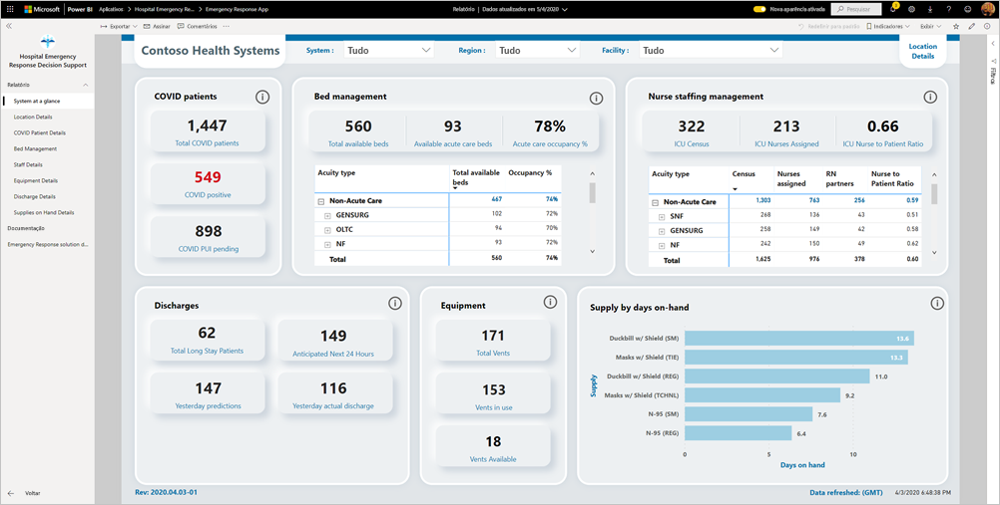

Este artigo mostra como instalar o aplicativo e como se conectar às fontes de dados. Para saber como usar o relatório que você verá com esse aplicativo, confira a [documentação do Dashboard de Suporte a Decisões de Resposta a Emergências Hospitalares](https://docs.microsoft.com/powerapps/sample-apps/emergency-response/deploy-configure#view-the-power-bi-dashboard).

Depois de instalar o aplicativo de modelo e se conectar às fontes de dados, você poderá personalizar o relatório de acordo com as suas necessidades. Em seguida, poderá distribuí-lo como um aplicativo para os colegas da sua organização.

## Pré-requisitos

Antes de instalar este aplicativo de modelo, primeiro, você precisará instalar e configurar a [solução do Power Platform de Resposta a Emergências Hospitalares](https://docs.microsoft.com/powerapps/sample-apps/emergency-response/deploy-configure). A instalação dessa solução cria as referências de fonte de dados necessárias para preencher o aplicativo com os dados.

Ao instalar a solução do Power Platform de Resposta a Emergências Hospitalares, anote a [URL da instância de ambiente do Common Data Service](https://docs.microsoft.com/powerapps/sample-apps/emergency-response/deploy-configure#publish-the-power-bi-dashboard). Você precisará dela para conectar o aplicativo de modelo aos dados.

## Instalar o aplicativo

1. Clique no seguinte link para acessar o aplicativo: [Aplicativo de modelo Dashboard de Suporte a Decisões de Resposta a Emergências Hospitalares](https://appsource.microsoft.com/en-us/product/power-bi/pbi-contentpacks.powerapps_healthcare)

1. Na página do aplicativo no AppSource, selecione [**OBTER AGORA**](https://appsource.microsoft.com/en-us/product/power-bi/pbi-contentpacks.powerapps_healthcare).

    [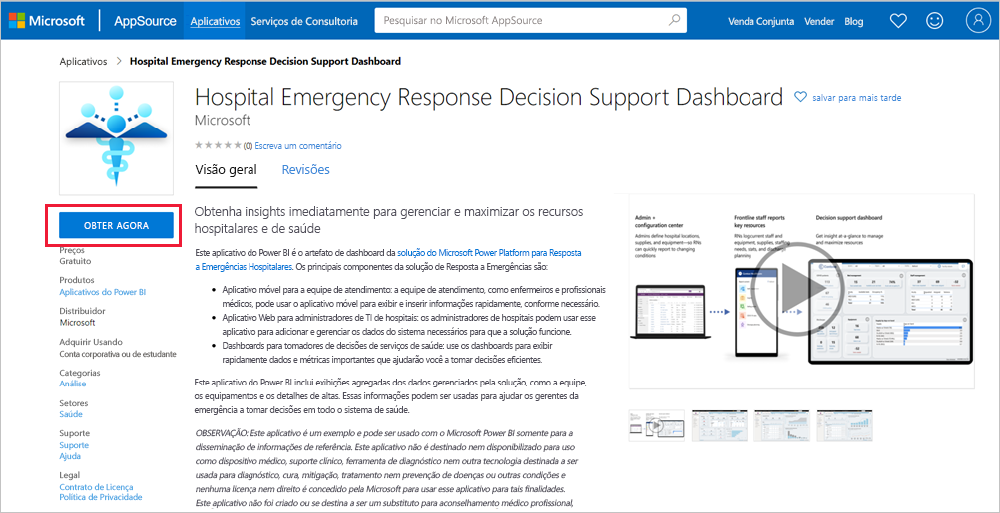](https://appsource.microsoft.com/en-us/product/power-bi/pbi-contentpacks.powerapps_healthcare)

1. Leia as informações em **Mais uma coisa** e selecione **Continuar**.

    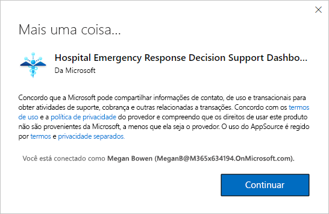

1. Selecione **Instalar**. 

    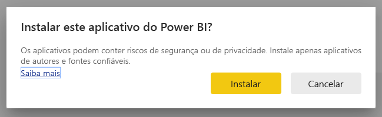

    Depois que o aplicativo for instalado, você o verá na página Aplicativos.

   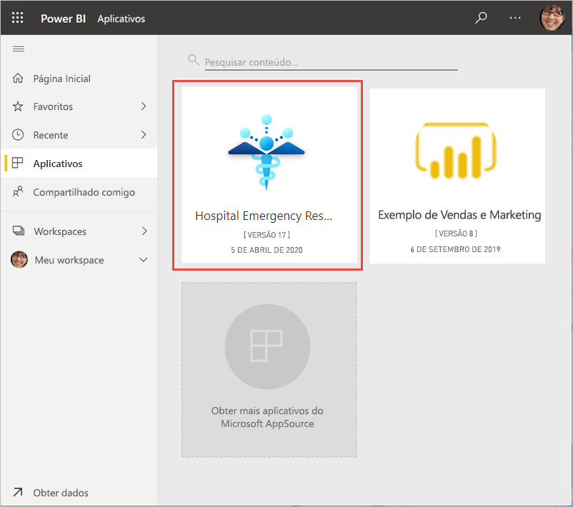

## Conectar-se a fontes de dados

1. Selecione o ícone da página Aplicativos para abrir o aplicativo.

1. Na tela inicial, selecione **Explorar**.

   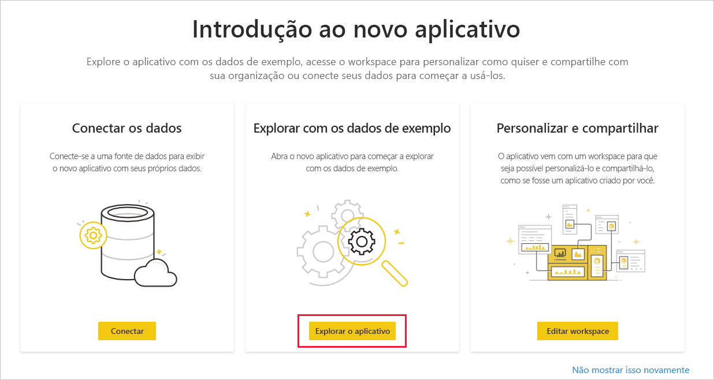

   O aplicativo é aberto, mostrando os dados de exemplo.

1. Selecione o link **Conectar seus dados** na barra de notificação na parte superior da página.

   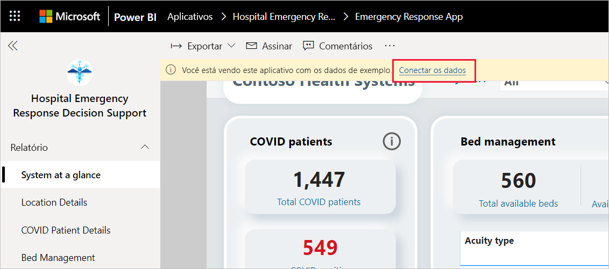

1. Na caixa de diálogo:
   1. No campo Nome da organização, insira o nome da sua organização, por exemplo, "Contoso Health Systems". Esse campo é opcional. Esse nome é exibido no lado superior esquerdo do dashboard.
   1. No campo CDS_base_solution, digite a [URL da sua instância de ambiente do Common Data Service](https://docs.microsoft.com/powerapps/sample-apps/emergency-response/deploy-configure#publish-the-power-bi-dashboard). Por exemplo: https://[meuambiente].crm.dynamics.com. Quando terminar, clique em **Avançar**.

   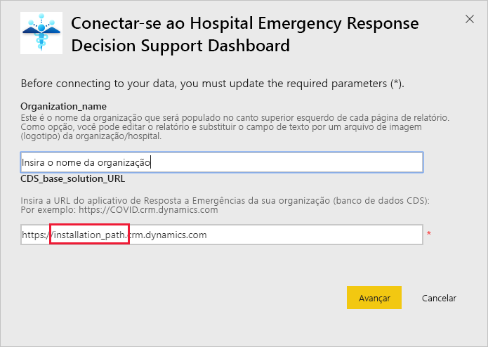

1. Na próxima caixa de diálogo exibida, defina o método de autenticação como **OAuth2**. Você não precisará fazer nada na configuração de nível de privacidade.

   Selecione **Entrar**.

   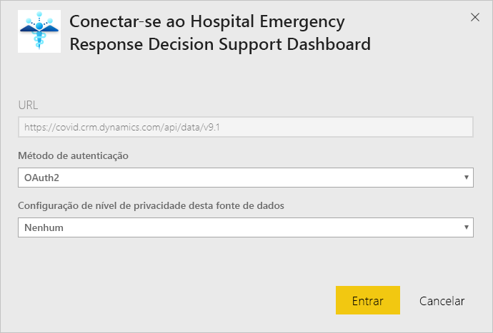

1. Na tela de entrada da Microsoft, entre no Power BI.

   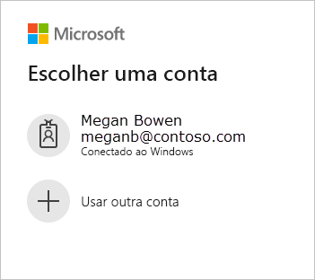

   Depois que você se conectar, o relatório se conectará às fontes de dados e será preenchido com os dados atualizados. Durante esse período, o monitor de atividade é ativado.

   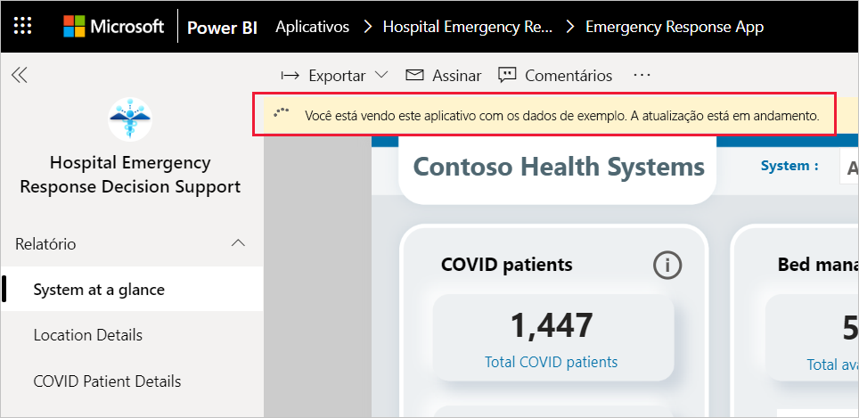

## Agendar atualização do relatório

Quando a atualização de dados for concluída, [configure um agendamento de atualização](../connect-data/refresh-scheduled-refresh.md) para manter os dados do relatório atualizados.

1. Na barra de cabeçalho superior, selecione **Power BI**.

   

1. No painel de navegação à esquerda, procure o workspace do Dashboard de Suporte a Decisões de Resposta a Emergências Hospitalares em **Workspaces** e siga as instruções descritas no artigo [Configurar a atualização agendada](../connect-data/refresh-scheduled-refresh.md).

## Personalizar e compartilhar

Confira [Personalizar e compartilhar o aplicativo](../connect-data/service-template-apps-install-distribute.md#customize-and-share-the-app) para obter detalhes. Examine os [avisos de isenção de responsabilidade do relatório](../create-reports/sample-covid-19-us.md#disclaimers) antes de publicar ou distribuir o aplicativo.

## Próximas etapas
* [Noções básicas sobre o relatório de Resposta a Emergências Hospitalares](https://docs.microsoft.com/powerapps/sample-apps/emergency-response/deploy-configure#view-the-power-bi-dashboard)
* [Configurar o modelo de exemplo de Comunicação de Crise e aprender sobre ele no Power Apps](https://docs.microsoft.com/powerapps/maker/canvas-apps/sample-crisis-communication-app)
* Dúvidas? [Experimente perguntar à Comunidade do Power BI](https://community.powerbi.com/)
* [O que são os aplicativos de modelo do Power BI?](../connect-data/service-template-apps-overview.md)
* [Instalar e distribuir aplicativos de modelo na sua organização](../connect-data/service-template-apps-install-distribute.md)
