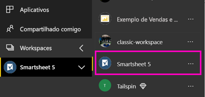

# Conectar-se ao Smartsheet com o Power BI
Este artigo explica como extrair seus dados da sua conta do Smarsheet com um aplicativo de modelo do Power BI. O Smartsheet oferece uma plataforma fácil para colaboração e compartilhamento de arquivos. O aplicativo de modelo Smartsheet para Power BI fornece um painel, relatórios e o conjunto de dados que mostra uma visão geral da sua conta de Smartsheet. Também é possível usar o [Power BI Desktop](desktop-connect-to-data.md) para se conectar diretamente às planilhas individuais em sua conta. 

Depois de instalar o aplicativo de modelo, você pode alterar o dashboard e o relatório. Em seguida, pode distribuí-lo como um aplicativo para os colegas de sua organização.

Conectar-se ao [aplicativo de modelo Smartsheet](https://app.powerbi.com/groups/me/getapps/services/pbi-contentpacks.pbiapps-smartsheet) para Power BI.

>[!NOTE]
>É preferível uma conta de administrador Smartsheet para conectar e carregar o aplicativo de modelo do Power BI, pois o acesso é adicional.

## Como se conectar

[!INCLUDE [powerbi-service-apps-get-more-apps](../includes/powerbi-service-apps-get-more-apps.md)]

3. Selecione **Smartsheet** \> **Obter Agora**.
4. Em **Instalar este aplicativo do Power BI?** selecione **Instalar**.
4. No painel **Aplicativos**, selecione o bloco **Smartsheet**.

    

6. Em **Introdução a seu novo aplicativo**, selecione **Conectar**.

    

4. Para o Método de Autenticação, selecione **oAuth2 \> Entrar**.
   
   Quando solicitado, insira suas credenciais do Smartsheet e siga o processo de autenticação.
   
   
   
   

5. Depois que o Power BI importa os dados, o painel do Smartsheet é aberto.
   
   

## Modificar e distribuir seu aplicativo

Você instalou o aplicativo de modelo do Smartsheet. Isso significa que você também criou o workspace do Smartsheet. No workspace, você pode alterar o relatório e o dashboard e, em seguida, distribuí-lo como um *aplicativo* para os colegas em sua organização. 

1. Para exibir todo o conteúdo do seu novo workspace do Smartsheet, no painel de navegação, selecione **Workspaces** > **Smartsheet**. 

    

    Esta exibição é a lista de conteúdo do workspace. No canto superior direito, você verá **Atualizar aplicativo**. Quando você estiver pronto para distribuir seu aplicativo para seus colegas, é aí que você começará. 

    

2. Selecione **Relatórios** e **Conjunto de dados** para ver os outros elementos no workspace.

    Leia sobre [como distribuir aplicativos](../collaborate-share/service-create-distribute-apps.md) para seus colegas.

## O que está incluído
O aplicativo de modelo do Smartsheet para o Power BI inclui uma visão geral de sua conta do Smartsheet, tais como o número de workspaces, os relatórios e as planilhas existentes, informações sobre a data em que são modificados etc. Os usuários administradores também veem algumas informações sobre os usuários em seu sistema, como os principais criadores de planilhas.  

Para se conectar diretamente a planilhas individuais em sua conta, é possível usar o conector do Smartsheet no [Power BI Desktop](desktop-connect-to-data.md).  

## Próximas etapas

* [Criar novos workspaces no Power BI](../collaborate-share/service-create-the-new-workspaces.md)
* [Instalar e usar aplicativos no Power BI](../consumer/end-user-apps.md)
* [Conectar-se a aplicativos do Power BI para serviços externos](service-connect-to-services.md)
* Dúvidas? [Experimente perguntar à Comunidade do Power BI](https://community.powerbi.com/)