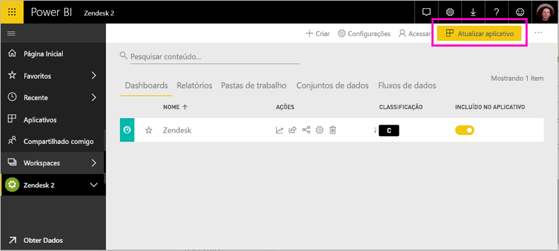

# Conectar-se ao Zendesk com o Power BI

Este artigo explica como extrair seus dados da sua conta do Zendesk com um aplicativo de modelo do Power BI. O aplicativo Zendesk oferece um dashboard e um conjunto de relatórios do Power BI que fornecem informações sobre os volumes de tíquetes e o desempenho do agente. Os dados são atualizados automaticamente uma vez por dia. 

Depois de instalar o aplicativo de modelo, você pode personalizar o dashboard e o relatório para realçar as informações mais importantes para você. Em seguida, pode distribuí-lo como um aplicativo para os colegas de sua organização.

Conecte-se ao [aplicativo de modelo do Zendesk](https://app.powerbi.com/getdata/services/zendesk) ou leia mais sobre a [integração do Zendesk](https://powerbi.microsoft.com/integrations/zendesk) com o Power BI.

Depois de instalar o aplicativo de modelo, você pode alterar o dashboard e o relatório. Em seguida, pode distribuí-lo como um aplicativo para os colegas de sua organização.

>[!NOTE]
>Você precisa de uma conta de administrador do Zendesk para se conectar. Mais detalhes sobre os [requisitos](#system-requirements) abaixo.

>[!WARNING]
>Antes de 15 de outubro de 2019, a API de Pesquisa de Suporte do Zendesk permitia o recebimento de um total de 200 mil resultados por meio da paginação de consultas grandes. Para alinhar o uso da pesquisa com seu escopo pretendido, o Zendesk agora limita o número máximo de resultados retornados a um total de 1 mil, com até 100 resultados por página. No entanto, o conector atual do Zendesk do Power BI ainda pode criar chamadas à API que excedam esses novos limites, resultando em possíveis resultados enganosos.

## Como se conectar

[!INCLUDE [powerbi-service-apps-get-more-apps](../includes/powerbi-service-apps-get-more-apps.md)]

3. Selecione **Zendesk** \> **Obter agora**.
4. Em **Instalar este aplicativo do Power BI?** selecione **Instalar**.
4. No painel **Aplicativos**, selecione o bloco **Zendesk**.

    

6. Em **Introdução a seu novo aplicativo**, selecione **Conectar**.

    

4. Forneça a URL associada à sua conta. A URL tem o formato **https://company.zendesk.com** . Veja detalhes sobre [como encontrar esses parâmetros](#finding-parameters) abaixo.
   
   

5. Quando solicitado, insira suas credenciais do Zendesk.  Selecione **oAuth 2** como o Mecanismo de Autenticação e clique em **Entrar**. Siga o fluxo de autenticação do Zendesk. (Caso você já tenha entrado no Zendesk em seu navegador, talvez suas credenciais não sejam solicitadas.)
   
   > [!NOTE]
   > Esse aplicativo de modelo requer que você se conecte com uma conta de administrador do Zendesk. 
   > 
   
   
6. Clique em **Permitir** para permitir que o Power BI acesse seus dados do Zendesk.
   
   
7. Clique em **Conectar** para iniciar o processo de importação. 
8. Após o Power BI importar os dados, você verá a lista de conteúdo do seu aplicativo Zendesk: um novo dashboard, relatório e conjunto de dados.
9. Selecione o dashboard do Zendesk para iniciar o processo de exploração.

    
   
## Modificar e distribuir seu aplicativo

Você instalou o aplicativo de modelo do Zendesk. Isso significa que você também criou o workspace do Zendesk. No workspace, você pode alterar o relatório e o dashboard e, em seguida, distribuí-lo como um *aplicativo* para os colegas em sua organização. 

1. Para exibir todo o conteúdo do seu novo workspace do Zendesk, no painel de navegação, selecione **Workspaces** > **Zendesk**. 

    

    Esta exibição é a lista de conteúdo do workspace. No canto superior direito, você verá **Atualizar aplicativo**. Quando você estiver pronto para distribuir seu aplicativo para seus colegas, é aí que você começará. 

    

2. Selecione **Relatórios** e **Conjunto de dados** para ver os outros elementos no workspace.

    Leia sobre [como distribuir aplicativos](../collaborate-share/service-create-distribute-apps.md) para seus colegas.

## Requisitos do sistema
Uma conta de administrador do Zendesk é necessária para acessar o aplicativo de modelo do Zendesk. Se você for um agente ou um usuário final e estiver interessado em ver seus dados no Zendesk, adicione uma sugestão e examine o conector do Zendesk no [Power BI Desktop](desktop-connect-to-data.md).

## Localizando parâmetros
A URL do Zendesk será igual à URL que você usa para se conectar em sua conta do Zendesk. Se você não lembrar da URL do Zendesk, use a [ajuda de logon](https://www.zendesk.com/login/) do Zendesk.

## Solução de problemas
Se você estiver com problemas para se conectar, verifique a URL do Zendesk e confirme que está usando uma conta de administrador do Zendesk.

## Próximas etapas

* [Criar novos workspaces no Power BI](../collaborate-share/service-create-the-new-workspaces.md)
* [Instalar e usar aplicativos no Power BI](../consumer/end-user-apps.md)
* [Conectar-se a aplicativos do Power BI para serviços externos](service-connect-to-services.md)
* Dúvidas? [Experimente perguntar à Comunidade do Power BI](https://community.powerbi.com/)
