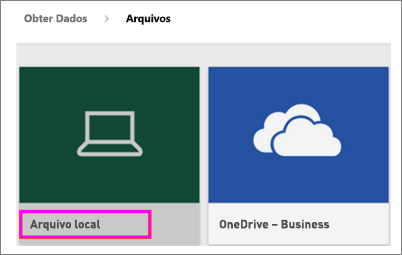
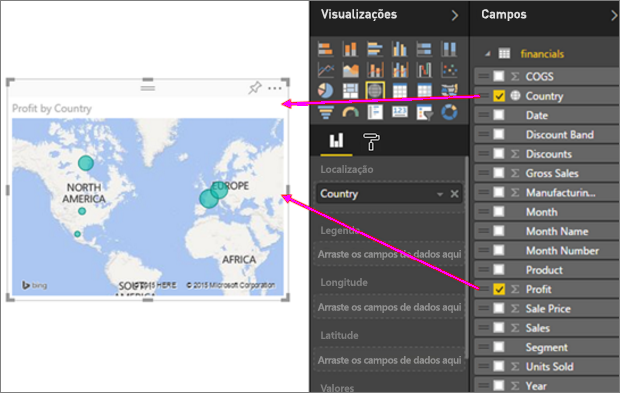

# Da pasta de trabalho do Excel para um relatório incrível no serviço do Power BI
Sua gerente deseja ver um relatório sobre os números de vendas mais recentes combinado com as impressões da última campanha no final do dia. Porém, os dados mais recentes residem em vários sistemas de terceiros e em arquivos em seu laptop. No passado, levava várias horas para criar visuais e formatar um relatório e você começava a se sentir ansioso.

Não se preocupe. Com o Power BI, é possível criar um relatório impressionante em pouco tempo.

Neste exemplo, carregaremos um arquivo do Excel de um sistema local, criaremos um relatório e o compartilharemos com colegas, tudo de dentro do Power BI.

## Preparar seus dados
Vamos tomar um arquivo simples do Excel como exemplo. 

1. Antes de carregar o arquivo do Excel no Power BI, você deve organizar seus dados em uma tabela simples. Em uma tabela simples, cada coluna contém o mesmo tipo de dados, por exemplo, texto, data, número ou moeda. Sua tabela deve ter uma linha de cabeçalho, mas não colunas ou linhas que exibam totais.

   

2. Em seguida, formate os dados como uma tabela. No Excel, na guia **Página Inicial**, no grupo **Estilos**, selecione **Formatar como tabela**. 

3. Selecione um estilo de tabela para aplicar à sua planilha. 

   Sua planilha do Excel agora está pronta para ser carregada no Power BI.

   

## Carregar arquivo do Excel para o serviço do Power BI
O serviço do Power BI se conecta a várias fontes de dados, incluindo arquivos do Excel que residem em seu computador. 

 > [!NOTE] 
 > Para acompanhar o restante deste tutorial, use a [Pasta de trabalho de exemplo Financeiro](../create-reports/sample-financial-download.md).

1. Para começar, entre no serviço do Power BI. Se você ainda não se inscreveu, [poderá fazê-lo gratuitamente](https://powerbi.com).

2. Você deseja criar um novo painel. Abra **Meu workspace** e selecione o ícone **Criar**.

   

3. Selecione **Dashboard**, insira um nome e selecione **Criar**. 

   O novo dashboard é exibido, sem dados.

   

4. Na parte inferior do painel de navegação, selecione **Obter dados**. 

5. Na página **Obter Dados**, na caixa **Arquivos** em **Criar conta**, selecione **Obter**.

   

6. Na página **Arquivos**, selecione **Arquivo Local**. Navegue até o arquivo da pasta de trabalho do Excel em seu computador e selecione **Abrir** para carregá-lo no serviço do Power BI. 

   

7. Na página **Arquivo Local**, selecione **Importar**.

## Criar seu relatório
Depois que o serviço do Power BI importar seu arquivo do Excel, você começará a criar seu relatório. 

1. Quando a mensagem **Seu conjunto de dados está pronto** for exibida, selecione **Exibir conjunto de dados**.  

   O Power BI abre no Modo de exibição de edição e exibe a tela do relatório. No lado direito estão os painéis **Visualizações**, **Filtros** e **Campos**. Observe que os dados de tabela da pasta de trabalho do Excel são exibidos no painel **Campos**. Abaixo do nome da tabela, o Power BI lista os cabeçalhos de coluna como campos individuais.

   

2. Agora você pode começar a criar visualizações. Digamos que seu gerente quer ver o lucro ao longo do tempo. No painel **Campos**, arraste **Lucro** para a tela do relatório. 

   Por padrão, o Power BI exibe um gráfico de barras. 

3. Arraste **Data** à tela de relatório. 

   O Power BI atualiza o gráfico de barras para mostrar o lucro por data.

   

   > [!TIP]
   > Se seu gráfico não tiver a aparência esperada, verifique suas agregações. Por exemplo, em **Valor**, clique com o botão direito do mouse no campo que você acabou de adicionar e verifique se os dados estão sendo agregados da maneira desejada. Neste exemplo, estamos usando **Soma**.
   > 

Sua gerente deseja saber quais países são os mais lucrativos. Impressione-a com uma visualização de mapa. 

1. Selecione uma área em branco na tela do seu relatório. 

2. No painel **Campos**, arraste os campos **País** e **Lucro** para a tela do seu relatório.

   O Power BI cria um visual de mapa com bolhas que representam o lucro relativo de cada local.

   

Que tal exibir um visual mostrando as vendas por produto e segmento de mercado? Isso é fácil. 

1. No painel **Campos**, selecione os campos **Vendas**, **Produto** e **Segmento**. 
   
   O Power BI cria um gráfico de barras instantaneamente. 

2. Altere o tipo de gráfico escolhendo um dos ícones no menu **Visualizações**. Por exemplo, altere-o para um **Gráfico de colunas empilhadas**. 

3. Para classificar o gráfico, selecione **Mais opções** (...) > **Classificar por**.

   

Fixe todos os seus visuais no seu dashboard. Agora você está pronto para compartilhá-lo com seus colegas.

   

## Compartilhar seu painel
Digamos que você deseja compartilhar seu dashboard com sua gerente. Você pode compartilhar seu painel e o relatório subjacente com colegas que têm uma conta do Power BI. Eles podem interagir com seu relatório, mas não podem salvar alterações.

1. Para compartilhar seu relatório, na parte superior do painel, selecione **Compartilhar**.

   

   O Power BI exibe a página **Compartilhar dashboard**. 

2. Insira os endereços de email dos destinatários na caixa **Inserir endereços de email** e adicione uma mensagem na caixa embaixo dela. 

3. Para permitir que os destinatários compartilhem seu painel com outras pessoas, selecione **Permitir que os destinatários compartilhem seu painel**. Selecione **Compartilhar**.

   

## Próximas etapas

* [Introdução ao serviço do Power BI](../fundamentals/service-get-started.md)
* [Introdução ao Power BI Desktop](../fundamentals/desktop-getting-started.md)
* [Conceitos básicos para designers no serviço do Power BI](../fundamentals/service-basic-concepts.md)

Mais perguntas? [Experimente a Comunidade do Power BI](https://community.powerbi.com/).
