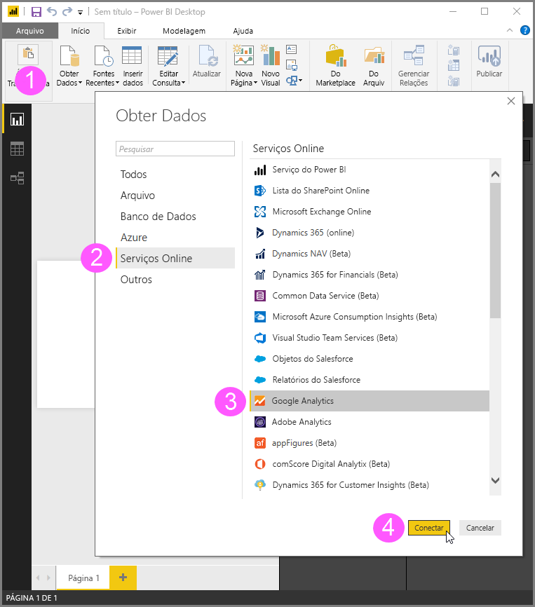
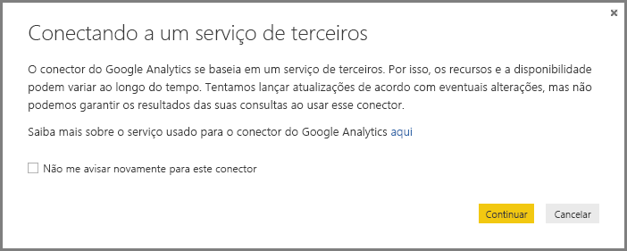
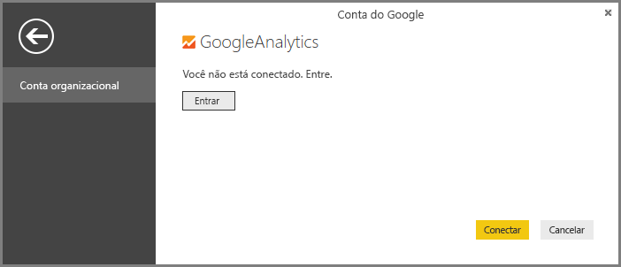
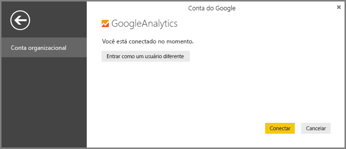

# Usar o conector do Google Analytics para o Power BI Desktop
> [!NOTE]
> O pacote de conteúdo do Google Analytics e o conector no Power BI Desktop dependem da API do Google Analytics Core Reporting. Por isso, os recursos e a disponibilidade podem variar ao longo do tempo.

É possível se conectar aos dados do Google Analytics usando o conector do **Google Analytics**. Para se conectar, siga essas etapas:

1. No **Power BI Desktop**, selecione **Obter Dados** na guia de faixa de opções **Página Inicial**.
2. Na janela **Obter Dados** janela, selecione **Serviços Online** das categorias no painel esquerdo.
3. Selecione **Google Analytics** com as seleções no painel à direita.
4. Na parte inferior da janela, selecione **Conectar**.  
   

Você verá um diálogo que explica que o conector é um Serviço de Terceiro e que avisa sobre como os recursos e a disponibilidade podem ser alterados com o tempo, bem como outros esclarecimentos.  

Ao selecionar **Continuar**, você será solicitado a entrar no Google Analytics.  

Ao digitar suas credenciais, você será notifica que o Power BI gostaria de ter acesso offline. É assim como você usa o **Power BI Desktop** para acessar seus dados do Google Analytics.  

Depois de aceitar, o **Power BI Desktop** mostra que você está conectado no momento.  

Selecione **Conectar** para que os dados do Google Analytics sejam conectados ao **Power BI Desktop** e carregados.  

## Alterações no API
Podemos tentar lançar atualizações de acordo com as alterações, o API pode ser alterado de forma que afeta os resultados das consultas que gerarmos. Em alguns casos, determinadas consultas podem não ter mais suporte. Devido a essa dependência não podemos garantir os resultados de suas consultas ao usar esse conector.

Mais detalhes sobre as alterações na API do Google Analytics podem ser encontrados em seus [log de alterações](https://developers.google.com/analytics/devguides/changelog).

