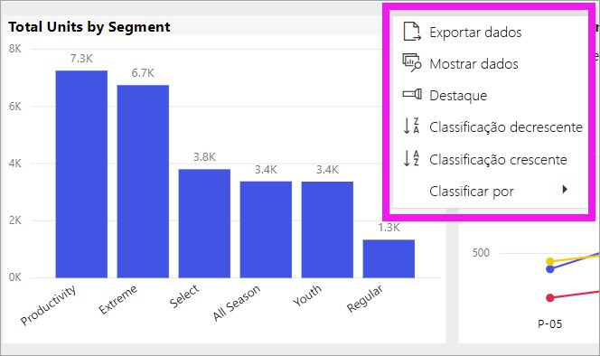
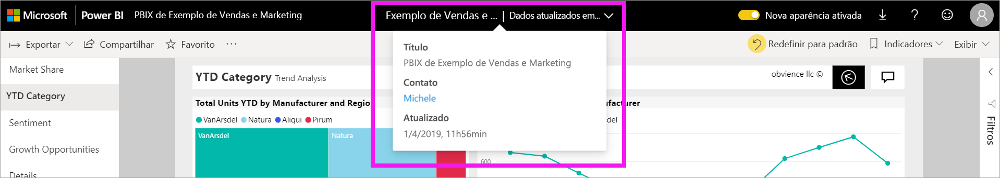

# Altere como um gráfico é classificado em um relatório do Power BI

[!INCLUDE[consumer-appliesto-ynny](../includes/consumer-appliesto-ynny.md)]

> [!IMPORTANT]
> **Este artigo é destinado a usuários do Power BI que não têm permissões de edição no relatório ou no conjunto de dados e que trabalham apenas na versão online do Power BI (o serviço do Power BI). Se você é um *designer* de relatórios, *administrador* ou *proprietário*, este artigo pode não ter todas as informações de que você precisa. Como alternativa, leia [Classificar por coluna no Power BI Desktop](../create-reports/desktop-sort-by-column.md)** .

No serviço do Power BI, é possível alterar a aparência de um visual classificando-o por diferentes campos de dados. Ao alterar a maneira como você classifica um visual, é possível realçar as informações que você deseja transmitir. Se estiver usando dados numéricos (como valores de vendas) ou dados de texto (como nomes de estado), você pode classificar suas visualizações da forma que quiser. O Power BI oferece muita flexibilidade para a classificação e menus rápidos para você usar. 

Visuais em um dashboard não podem ser classificados, mas em um relatório do Power BI, você pode classificar a maioria das visualizações 

## Introdução

Para começar, abra um relatório que foi compartilhado com você. Selecione um visual (que pode ser classificado) e escolha **Mais ações** (...).  Há três opções de classificação: **Classificação decrescente**, **Classificação crescente** e **Classificar por**. 
    

### Classificar em ordem alfabética ou numericamente

Os visuais podem ser classificados em ordem alfabética, segundo os nomes textuais das categorias no visual, ou pelos valores numéricos de cada categoria. Por exemplo, este gráfico é classificado alfabeticamente pela categoria **Nome** da loja no eixo X.

É fácil alterar a classificação de uma categoria (nome do repositório) para um valor (vendas por pés quadrados). Selecione **Mais ações** (...) e escolha **Classificar por**. Selecione um valor numérico usado no visual.  Neste exemplo, selecionamos **Vendas por pé quadrado**.

Se necessário, altere a ordem de classificação entre crescente e decrescente.  Selecione **Mais ações** (...) novamente e escolha **Classificação decrescente** ou **Classificação crescente**. O campo usado para classificar ficará em negrito e terá uma barra amarela.

   

> [!NOTE]
> Nem todos os visuais podem ser classificados. Por exemplo, os seguintes visuais não podem ser classificados: mapa de árvore, mapa, mapa coroplético, dispersão, medidor, cartão e cascata.

## Salvar as alterações feitas na ordem de classificação
Os relatórios do Power BI retêm os filtros, as segmentações, as classificações e outras alterações de exibição de dados que você faz – mesmo que você esteja trabalhando na [Exibição de leitura](end-user-reading-view.md). Portanto, se você sair de um relatório e retornar mais tarde, suas alterações de classificação serão salvas.  Se você quiser reverter as alterações para as configurações do *designer* do relatório, selecione **Redefinir para padrão** na barra de menus superior. 

No entanto, se o botão **Redefinir para padrão** estiver esmaecido, significará que o *designer* do relatório desabilitou a funcionalidade de salvar (persistir) as alterações.

## Considerações e solução de problemas

### Classificando o uso de outros critérios
Às vezes, você deseja classificar o visual usando um campo diferente (não incluído no visual) ou outros critérios.  Por exemplo, talvez você queira classificar por mês em ordem sequencial (e não em ordem alfabética) ou talvez queira classificar por números inteiros em vez de por dígitos (exemplo, 0, 1, 9, 20 e não 0, 1, 20, 9).  

Somente a pessoa que projetou o relatório pode fazer essas alterações para você. As informações de contato do *designer* podem ser encontradas ao selecionar o nome do relatório na barra de cabeçalho.

Se você é um *designer* e tem permissões de edição de conteúdo, leia [Classificar por coluna no Power BI Desktop](../create-reports/desktop-sort-by-column.md) para saber como atualizar o conjunto de dados e habilitar esse tipo de classificação.

## Próximas etapas
Mais sobre [Visualizações nos relatórios do Power BI](end-user-visualizations.md).

[Power BI – conceitos básicos](end-user-basic-concepts.md)
