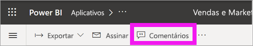
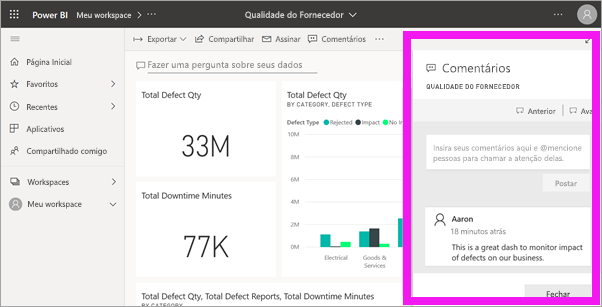
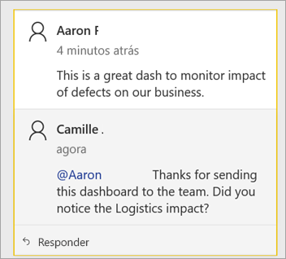
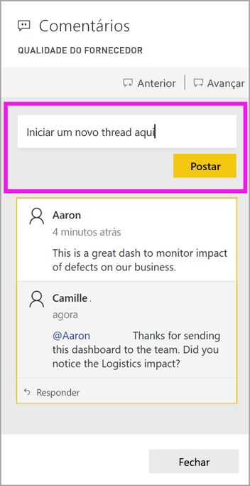
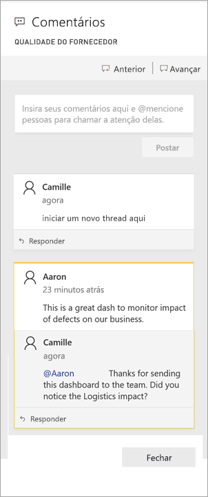
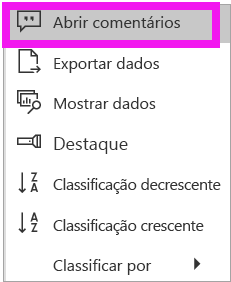
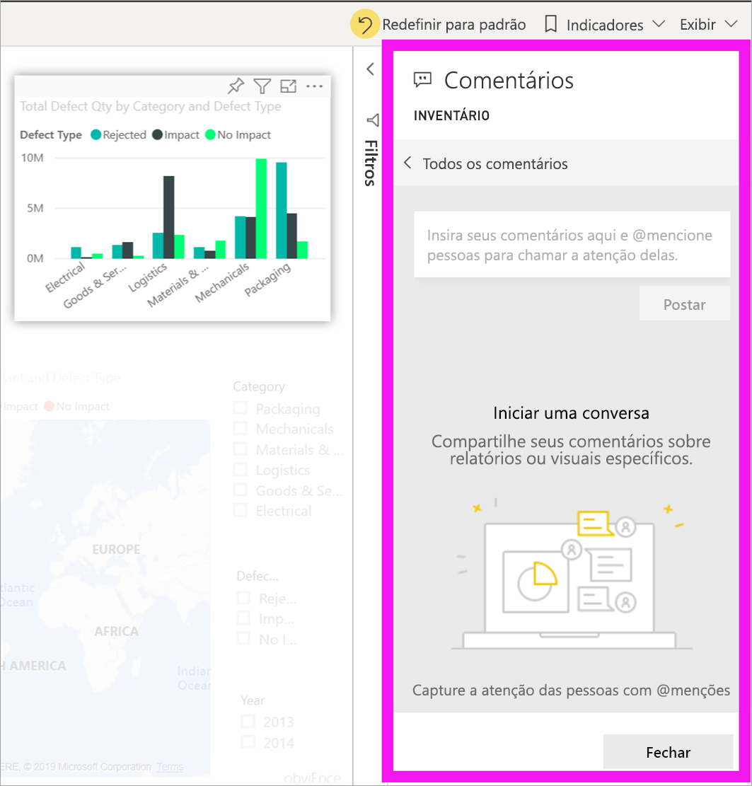
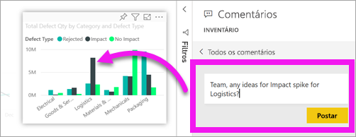
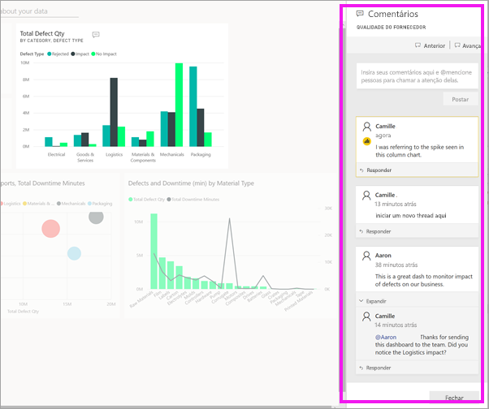

# Adicionar comentários a um dashboard ou relatório

[!INCLUDE[consumer-appliesto-ynny](../includes/consumer-appliesto-ynny.md)]

[!INCLUDE [power-bi-service-new-look-include](../includes/power-bi-service-new-look-include.md)]

Adicione um comentário pessoal ou inicie uma conversa sobre um dashboard ou relatório com seus colegas. O recurso **comentário** é apenas uma das maneiras como um *consumidor* pode colaborar com outras pessoas. 

> [!NOTE]
> A colaboração com outras pessoas, incluindo a adição de comentários a relatórios compartilhados, exige uma licença Power BI Pro ou Premium. [Qual tipo de licença eu tenho?](end-user-license.md)

## Como usar o recurso Comentários
É possível adicionar comentários a um dashboard inteiro, a visuais individuais em um dashboard, a uma página de relatório, a um relatório paginado e a visuais individuais em uma página de relatório. Adicione um comentário geral ou um comentário direcionado a colegas específicos.  

Quando você adiciona um comentário a um relatório, o Power BI captura o filtro atual e os valores de segmentação. Isso significa que, quando você seleciona ou responde a um comentário, a página de relatório ou o visual de relatório podem ser alterados para mostrar as seleções de filtro e segmentação que estavam ativas quando o comentário foi adicionado pela primeira vez.  

Por que isso é importante? Digamos que um colega aplicou um filtro que revelou um insight interessante e quer compartilhá-lo com a equipe. Sem esse filtro selecionado, o comentário pode não fazer sentido.

Se estiver usando um relatório paginado, você só poderá deixar um comentário geral sobre o relatório.  O suporte para deixar comentários em visuais de relatórios paginados individuais não está disponível.

### Adicionar um comentário geral a um dashboard ou relatório
Os processos para adicionar comentários a um painel ou relatório são semelhantes.  Neste exemplo, estamos usando um dashboard. 

1. Abra um dashboard ou relatório do Power BI e selecione o ícone **Comentários**. Isso abre a caixa de diálogo Comentários.

    

    Aqui podemos ver que o criador do dashboard já adicionou um comentário geral.  Qualquer pessoa com acesso a esse dashboard pode ver este comentário.

    

2. Para responder, selecione **Responder**, digite sua resposta e selecione **Postar**.  

    

    Por padrão, o Power BI direciona sua resposta ao colega que iniciou o thread de comentários, neste caso, Alberto R. 

    

 3. Se você quiser adicionar um comentário que não faça parte de um thread existente, digite-o no campo de texto superior.

    

    Os comentários a esse dashboard agora têm esta aparência.

    

### Adicionar um comentário a um visual de dashboard ou relatório específico
Além de adicionar comentários a um dashboard inteiro ou a uma página de relatório inteira, você pode adicionar comentários a blocos individuais do dashboard e visuais individuais de relatório. Os processos são semelhantes e, neste exemplo, estamos usando um relatório.

1. Passe o mouse sobre o visual e selecione **Mais opções** (...).    
2. No menu suspenso, selecione **Abrir os comentários**.

      

3.  A caixa de diálogo **Comentários** será aberta e os outros visuais da página ficam acinzentados. Esse visual ainda não tem nenhum comentário. 

      

4. Digite seu comentário e selecione **Postar**.

      

    - Em uma página de relatório, selecionar um comentário feito em um visual realça esse visual (veja acima).

    - Em um painel, o ícone de gráfico  informa que o comentário está vinculado a um visual específico. Os comentários que se aplicam a todo o dashboard não têm um ícone especial. A seleção do ícone de gráfico realça o visual relacionado no dashboard.
    

    

5. Selecione **Fechar** para voltar para o dashboard ou relatório.

### Consiga a atenção de seus colegas usando o sinal @
Se você estiver criando comentários de dashboard, relatório, bloco ou visual, chame a atenção de seus colegas usando o símbolo "\@".  Quando você digita o símbolo "\@", o Power BI abre uma lista suspensa na qual você pode procurar e selecionar pessoas de sua organização. Qualquer nome verificado precedido pelo símbolo "\@" aparece em fonte azul. 

Esta é uma conversa que estou tendo com o *designer* da visualização. Ele usa o símbolo @ para garantir que eu veja o comentário. Eu sei que esse comentário é para mim. Ao abrir o dashboard do aplicativo no Power BI, eu seleciono **Comentários** no cabeçalho. O painel **Comentários** exibe nossa conversa.

  

## Próximas etapas
Voltar para as [visualizações para consumidores](end-user-visualizations.md)    
<!--[Select a visualization to open a report](end-user-open-report.md)-->
