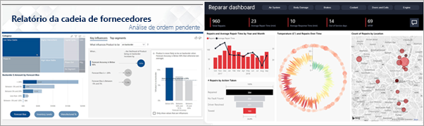

# O serviço do Power BI para consumidores

[!INCLUDE[consumer-appliesto-ynny](../includes/consumer-appliesto-ynny.md)]

Nós vivemos em uma cultura de dados, na qual as decisões de negócios são baseadas em fatos, não em opiniões. É necessário dispor de dados para tomar essas decisões e seus colegas de trabalho não deixam por menos.     
 
Eles enviam todos os tipos de relatórios, planilhas, emails com gráficos e até mesmo materiais informativos impressos. À medida que os dados se acumulam, torna-se cada vez mais difícil encontrar o que precisa de forma rápida e surge a preocupação de que talvez você não esteja usando as informações mais recentes.  
 

## Serviço do Power BI para *consumidores*

O Power BI torna seu trabalho mais fácil e, ao mesmo tempo, mais impactante. Todos esses dados recebidos se transformam em gráficos e grafos que facilitam a visualização para você. Em vez de longas listas ou tabelas de números e palavras, os insights de dados são representados por meio de visuais ***belos***, coloridos e atraentes que contam histórias sobre os insights contidos em seus dados. 

 
Basta abrir o Serviço do Power BI em um navegador ou em um dispositivo móvel. Você e seus colegas trabalham nos mesmos dashboards e relatórios confiáveis, que são atualizados automaticamente para que todos trabalhem sempre com o conteúdo mais recente.   

Como o conteúdo não é estático, você pode se aprofundar buscando tendências, insights e outros aspectos de business intelligence. Explore cada parte do conteúdo e até mesmo faça perguntas usando suas próprias palavras. Ou apenas relaxe e deixe que seus dados descubram insights interessantes para você, emitam alertas quando os dados forem alterados e enviem relatórios por email com base em um agendamento prévio definido por você. Todos os seus dados, a qualquer momento, na nuvem ou no local, por meio de qualquer dispositivo. Isso é apenas o começo do que o Power BI pode fazer. 

## Eu sou um *consumidor* do Power BI?

A maneira como você interage com o Power BI dependerá da sua função de trabalho. Como um usuário final ou *consumidor*, você é a pessoa que recebe o conteúdo (dashboards, relatórios e aplicativos) de seus colegas. Você trabalha na versão online ou móvel do Power BI, que é chamada de Serviço do Power BI, revisando e interagindo com o conteúdo a fim de tomar decisões de negócios. 
   
Como um consumidor, você não terá acesso a todos os recursos do Power BI, e não tem problema, porque o seu trabalho não é criar dashboards e relatórios. Você usará o Serviço do Power BI para análise, monitoramento, exploração e tomada de decisões. 

Sem dúvida alguma você ouvirá muito o termo "Power BI Desktop" – ou simplesmente "Desktop" – em referência a uma ferramenta autônoma usada pelos *designers* que criam e compartilham relatórios e dashboards contigo.  É importante saber que há outras ferramentas do Power BI disponíveis, mas se você for um consumidor, trabalhará apenas com o Serviço do Power BI. 

Como você está trabalhando com um conteúdo *compartilhado*, uma licença **gratuita** será suficiente, pois você trabalha em uma organização que usa a capacidade **Premium**. [Qual licença eu tenho?](end-user-license.md)

## Interagir com o conteúdo de modo seguro 
Ao filtrar, segmentar, assinar e exportar conteúdo, não se preocupe – seu trabalho não estará afetando o conjunto de dados subjacente nem o conteúdo original compartilhado (dashboards, relatórios e aplicativos).  

Suas ações jamais prejudicam os seus dados.  O Power BI é a ferramenta ideal para explorar e experimentar, e você não precisa se preocupar com o risco de "prejudicar" algo.  
 
Isso não significa que você não é possível salvar suas alterações – você pode fazê-lo. Mas essas alterações afetam apenas a sua exibição do conteúdo. E reverter para o modo de exibição padrão original é tão fácil quanto clicar em um botão.  

## Próximas etapas

[Faça um tour pelo Serviço do Power BI para consumidores](end-user-reading-view.md)    
[Treinamento do Serviço do Power BI para consumidores](https://docs.microsoft.com/learn/paths/consume-data-with-power-bi/)    
[Terminologia e conceitos para os *consumidores* do Power BI](end-user-basic-concepts.md)    

