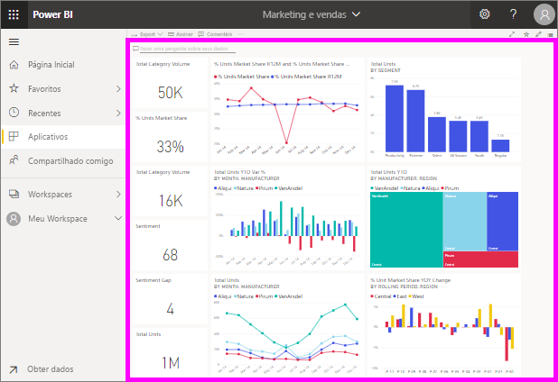

# Exibir um dashboard

[!INCLUDE [power-bi-service-new-look-include](../includes/power-bi-service-new-look-include.md)]

Os *consumidores* do Power BI gastam muito tempo exibindo dashboards. Os dashboards são projetados para realçar as informações específicas de relatórios e conjuntos de dados subjacentes. E os consumidores de Power BI usam essas informações para acompanhamento, monitoramento, responder perguntas, testes e muito mais para tomar decisões de negócios controladas por dados.

O Power BI Pro é necessário para compartilhar dashboards e para exibir dashboards compartilhados.

## Abra um dashboard

|              |         |
|------------|--------------------------------|
|      |Os dashboards podem ser abertos em várias localizações no serviço do Power BI.   Basta procurar esse ícone do painel. Depois de identificar um  painel, será simples abri-lo. Basta selecioná-lo, e o painel preenche  sua tela do Power BI. |
|                    |          |

Você pode encontrar dashboards em todos os contêineres no painel de navegação. 

- **Página Inicial** 
- **Favoritos** – se tiver [definido um dashboard como favorito](end-user-favorite.md)
- **Recente** – se tiver visitado um dashboard recentemente
- **Aplicativos** – a maioria dos aplicativos contém dashboards e relatórios
- **Compartilhado comigo** – se um colega [compartilhou um dashboard com você](end-user-shared-with-me.md)
- **Meu workspace** – se tiver baixado algum [exemplo do Power BI](../sample-datasets.md)

## Próximas etapas
* Fique à vontade com os dashboards fazendo um tour em um dos nossos [dashboards de exemplo](../sample-tutorial-connect-to-the-samples.md).
* Saiba mais sobre [blocos de dashboard](end-user-tiles.md) e o que acontece quando você seleciona um.