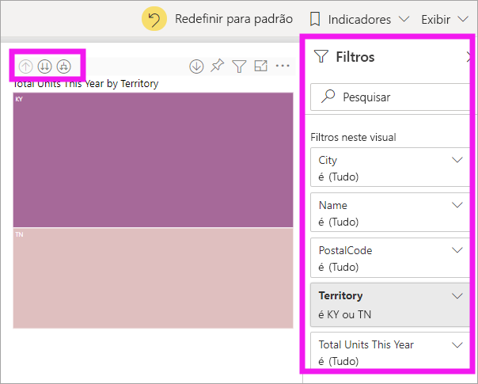
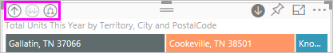
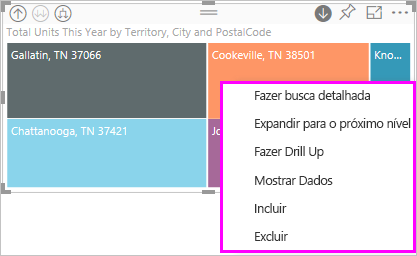
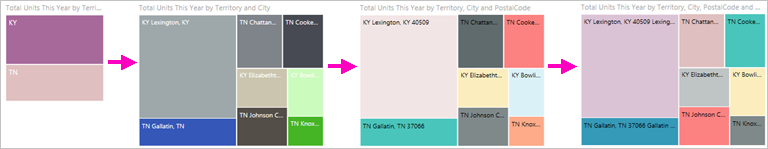
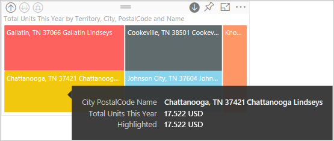

# Modo de análise em um visual no Power BI

[!INCLUDE [power-bi-service-new-look-include](../includes/power-bi-service-new-look-include.md)]

Este artigo mostra como fazer drill down em um visual no serviço do Microsoft Power BI. Usando análise detalhada em seus pontos de dados, você pode explorar seus dados com ainda mais profundidade. 

## Uma análise exige uma hierarquia

Quando um visual tem uma hierarquia, você pode fazer drill down para revelar detalhes adicionais. Por exemplo, você pode ter um visual que examina a contagem de medalhas olímpicas por uma hierarquia composta por esporte, disciplina e evento. Por padrão, o visual mostra a contagem de medalhas por esporte: ginástica, esqui, esportes aquáticos e assim por diante. Porém, como ele tem uma hierarquia, a seleção de um dos elementos visuais (como uma barra, uma linha ou uma bolha) exibe uma imagem cada vez mais detalhada. A seleção do elemento **esportes aquáticos** mostra dados de natação, mergulho e polo aquático.  A seleção do elemento **mergulho** mostra detalhes de trampolim, plataforma e eventos de mergulho sincronizado.

As datas são um tipo exclusivo de hierarquia.  Os designers de relatórios geralmente adicionam hierarquias de datas a visuais. Uma hierarquia de data comum é aquela que contém ano, trimestre, mês e dia. 

## Descobrir quais visuais podem ser analisados
Não sabe quais visuais do Power BI contém uma hierarquia? Focalize um visual. Se você vir uma combinação destes controles de análise na parte superior, o visual terá uma hierarquia.

  

## Aprender a fazer drill down e drill up

Neste exemplo, estamos usando um mapa de árvore que tem uma hierarquia composta por território, cidade, CEP e nome da loja. O mapa de árvore, antes do drilling, examina o total de unidades vendidas neste ano por território. 

  

### Duas maneiras de acessar os recursos de análise

Há duas opções para acessar os recursos de drill down, drill up e expansão nos visuais que têm hierarquias. Experimente as duas e use aquela que mais gostar.

- Primeira maneira: focalize um visual para ver e usar os ícones.  

    

- Segunda maneira: clique com o botão direito do mouse em um visual para revelar e usar o menu.

    

## Caminhos de análise

### Fazer drill down de todos os campos de uma vez

Existem diversas maneiras de analisar o visual. A seleção do ícone de drill down leva você até o próximo nível na hierarquia. Se estiver examinando o nível **Território** de Kentucky e Tennessee, faça drill down até o nível de cidade para ambos os Estados, em seguida, até o nível de CEP para ambos os Estados e, por fim, até o nível do nome da loja para ambos os Estados. Cada etapa do caminho mostra novas informações.

Selecionar o ícone de drill up  até voltar para "Total de unidades deste ano por território".

### Expandir todos os campos de uma vez

**Expandir** adiciona outro nível de hierarquia à exibição atual. Portanto, se você está analisando o nível **Território**, é possível expandir e adicionar detalhes de cidade, CEP e nome ao mapa de árvore. Cada etapa do caminho mostra as mesmas informações e adiciona um nível de novas informações.

Opte também por fazer drill down ou uma expansão de um campo por vez.

### Fazer drill down de um campo de cada vez

1. Selecionar o ícone de drill down para ativá-lo .

    Agora você tem a opção de fazer drill down ou uma expansão de **um campo por vez**, selecionando um elemento visual. Exemplos de elementos visuais são: barra, bolha e folha.

    

    Se você não ativar o drill down, a seleção de um elemento visual (como uma barra, uma bolha ou uma folha) não fará drill down. Em vez disso, ele fará uma filtragem cruzada de outros gráficos na página do relatório.

1. Selecione a folha para **TN**. Agora, o mapa de árvore mostra todas as cidades e todos os territórios no Tennessee que têm uma loja.

    

1. Neste ponto, você pode:

    1. Continuar fazendo uma busca detalhada para Tennessee.

    1. Fazer busca detalhada para uma cidade específica no Tennessee.

    1. Em vez disso, expanda-a.

    Vamos continuar fazendo drill down de um campo de cada vez.  Selecione **Knoxville, TN**. O mapa de árvore agora mostra o CEP da loja em Knoxville.

    

    Observe que o título se altera conforme você faz drill down e drill up novamente.

### Expandir tudo e expandir um campo de cada vez

Ter um mapa de árvore que mostra apenas um CEP não é informativo.  Portanto, vamos *expandir* para um nível abaixo na hierarquia.  

1. Com o mapa de árvore ativo, clique no ícone *expandir para baixo* . Agora, o mapa de árvore mostra dois níveis de hierarquia: CEP e nome da loja.

    

1. Para ver todos os quatro níveis de hierarquia dos dados para o Tennessee, selecione a seta de drill up até chegar ao segundo nível do mapa de árvore, **Total de unidades deste ano por território e cidade**.

    

1. Verifique se a análise ainda está ativada,  e selecione o ícone *expandir para baixo* . Agora, o mapa de árvore mostra o mesmo número de folhas (caixas), mas cada folha tem detalhes adicionais. Em vez de exibir apenas a cidade e o estado, ele também mostra o CEP.

    

1. Selecione o ícone *expandir para baixo* mais uma vez para exibir todos os quatro níveis de hierarquia de detalhes para o Tennessee no mapa de árvore. Passe o mouse sobre uma folha para ver ainda mais detalhes.

    

## Mostrar os dados durante a análise
Use **Mostrar dados** para obter uma visão dos bastidores. Sempre que você analisa ou expande os dados, a opção **Mostrar dados** exibe os dados usados para criar o visual. Isso pode ajudar você a entender como as hierarquias, a análise e a expansão funcionam em conjunto para criar visuais. 

No canto superior direito, selecione **Mais opções** (...) e **Mostrar Dados**. 

A tabela a seguir mostra os resultados de fazer drill down de todos os campos de uma vez, do território ao nome da loja.  

Observe que os totais são os mesmos para **City**, **PostalCode** e **Name**. Esse não será sempre o caso.  Mas, para esses dados, há apenas uma loja em cada CEP e em cada cidade.  

## Considerações e limitações
Por padrão, a análise não filtra outros visuais em um relatório. No entanto, o designer de relatórios pode alterar esse comportamento padrão. Durante a análise, procure ver se os outros visuais na página são uma filtragem cruzada ou um realce cruzado.

## Próximas etapas

[Visuais nos relatórios do Power BI](../visuals/power-bi-report-visualizations.md)

[Relatórios do Power BI](end-user-reports.md)

[Power BI – conceitos básicos](end-user-basic-concepts.md)

Mais perguntas? [Experimente a Comunidade do Power BI](http://community.powerbi.com/)
