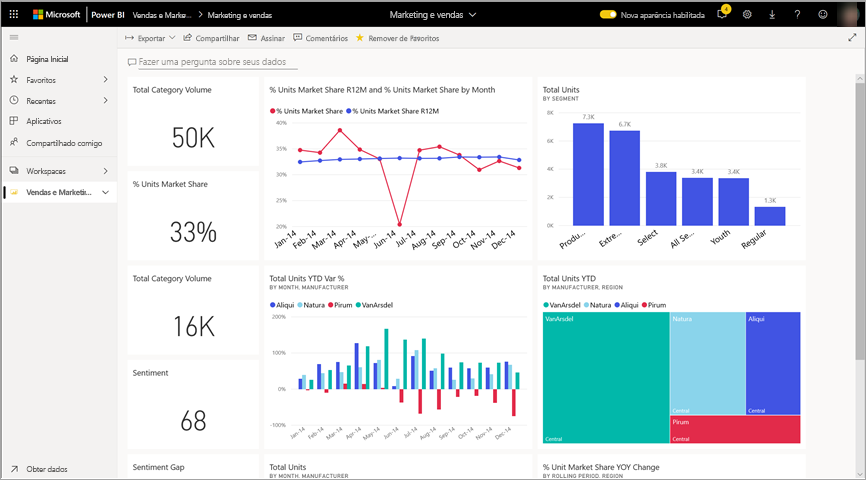
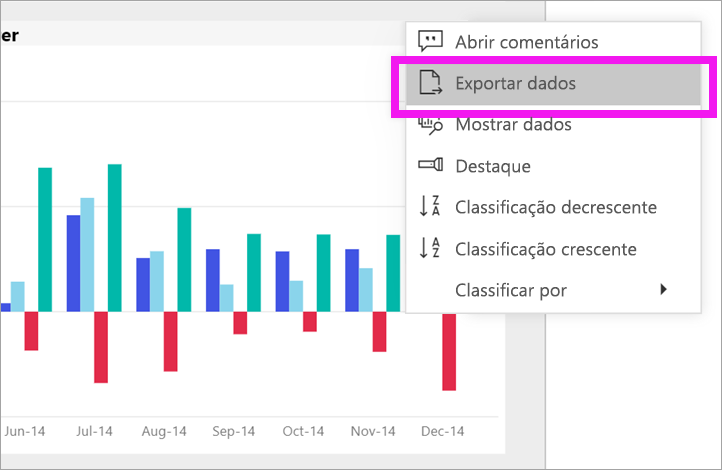
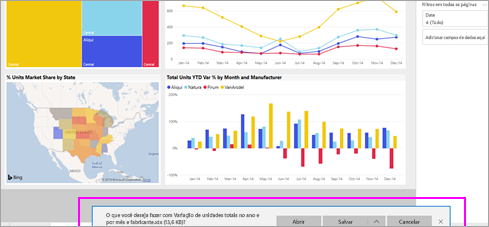

# Exportar dados de um visual

[!INCLUDE[consumer-appliesto-yyny](../includes/consumer-appliesto-yyny.md)]

[!INCLUDE [power-bi-service-new-look-include](../includes/power-bi-service-new-look-include.md)]

Se desejar ver os dados usados para criar um visual, [você poderá exibi-los no Power BI](end-user-show-data.md) ou exportá-los para o Excel. A opção de exportação de dados requer um determinado tipo de licença e permissões de edição ao conteúdo. Se não for possível exportar, verifique com o administrador do Power BI. A exportação de dados exige uma licença do Power BI Pro, uma licença de usuário Pro, ou uma licença de usuário Pro, nas organizações que tenham licença com a capacidade Premium. Normalmente, esse tipo de licença é usado por *designers*, mas não por *consumidores* de relatórios. Para saber mais, veja o tópico [Qual licença eu tenho?](end-user-license.md)

## A partir de um visual em um painel do Power BI

1. Comece em um painel do Power BI. Aqui estamos usando o painel do aplicativo ***Exemplo de Vendas e marketing***. Você pode [baixar esse aplicativo em AppSource.com](https://appsource.microsoft.com/en-us/product/power-bi/microsoft-retail-analysis-sample.salesandmarketingsample
).

    

2. Passe o mouse sobre um visual para revelar **Mais opções** (...) e clique para exibir o menu de ação.

    

3. Selecione **Exportar para .csv**.

4. O que acontece em seguida depende do navegador que você está usando. Você pode ser solicitado a salvar o arquivo ou pode ver um link para o arquivo exportado na parte inferior do navegador. 

    

5. Abra o arquivo no Excel. 

    > [!NOTE]
    > Caso você não tenha permissões nos dados, não poderá exportá-los nem os abrir no Excel.  

    

## A partir de um visual em um relatório
Você pode exportar dados de um visual em um relatório como formato .csv ou .xlsx (Excel). 

1. Em um painel, selecione um bloco para abrir o relatório subjacente.  Neste exemplo, estamos selecionando o mesmo visual mostrado acima, *% da Variação Acumulada do Total de Unidades*. 

    

    Como esse bloco foi criado no relatório *Exemplo de Vendas e marketing*, esse é o relatório aberto. E ele é aberto na página que contém o visual do bloco selecionado. 

2. Selecione o visual no relatório. Observe o painel **Filtros** à direita. Esse visual tem filtros aplicados. Para saber mais sobre filtros, confira [Usar filtros em um relatório](end-user-report-filter.md).

    

3. Selecione **Mais opções (...)** no canto superior direito da visualização. Escolha **Exportar dados**.

    

4. Você verá opções para exportar Dados resumidos ou Dados subjacentes. Se você estiver usando o aplicativo *Exemplo de vendas e marketing*, **Dados subjacentes** será desabilitada. Mas você pode encontrar relatórios onde ambas as opções estão habilitadas. Veja a seguir uma explicação da diferença.

    **Dados resumidos**: selecione essa opção se quiser exportar dados do que você vê atualmente no visual.  Esse tipo de exportação mostra somente os dados que foram usados para criar o estado atual do visual. Se o visual tiver filtros aplicados, os dados exportados também serão filtrados. Por exemplo, para esse visual, sua exportação incluirá apenas dados de 2014 e da região central, e apenas dados para quatro dos fabricantes: VanArsdel, Natura, Aliqui e Pirum. Se o visual tiver agregações (soma, média etc.), a exportação também será agregada. 
  

    **Dados subjacentes**: selecione essa opção se quiser exportar dados para o que você vê no visual **mais** dados adicionais do conjunto de dados subjacente.  Isso pode incluir dados contidos no conjunto de dados, mas não usados no visual. Se o visual tiver filtros aplicados, os dados exportados também serão filtrados.  Se o visual tiver agregações (soma, média etc.), a exportação removerá a agregação, essencialmente, nivelando os dados. 

    

5. O que acontece em seguida depende do navegador que você está usando. Você pode ser solicitado a salvar o arquivo ou pode ver um link para o arquivo exportado na parte inferior do navegador. 

    

    > [!NOTE]
    > Caso você não tenha permissões nos dados, não poderá exportá-los nem os abrir no Excel.  

6. Abra o arquivo no Excel. Compare a quantidade de dados exportados com os dados que exportamos do mesmo visual no painel. A diferença é que essa exportação inclui **Dados subjacentes**. 

    

## Próximas etapas

[Exibir os dados usados para criar um visual](end-user-show-data.md)