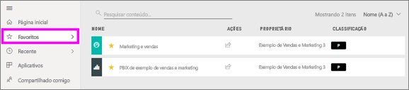
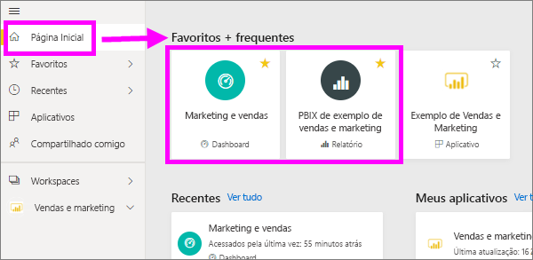
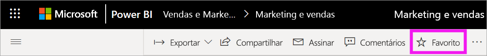
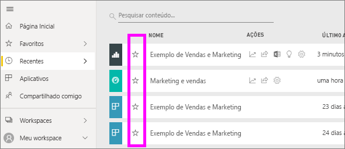
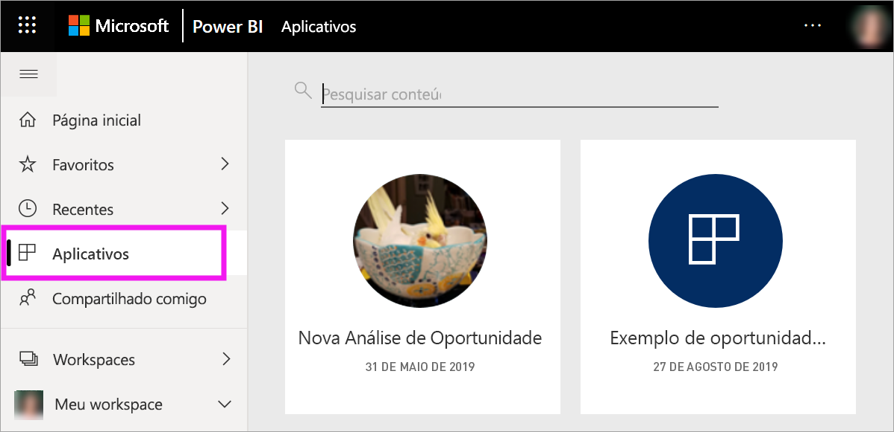
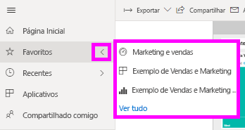
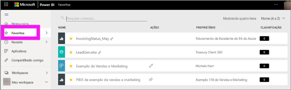
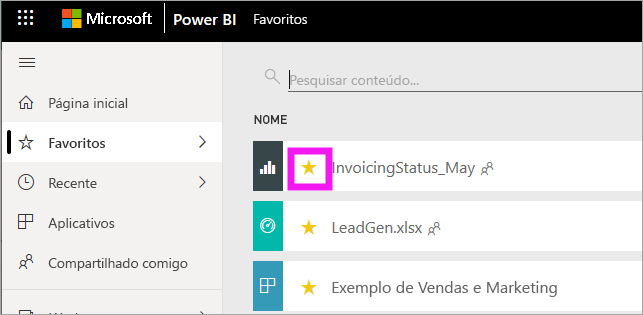

# Adicionar painéis, relatórios e aplicativos aos favoritos no serviço do Power BI
Ao tornar o conteúdo um *favorito*, você poderá acessá-lo rapidamente na lista de conteúdo de **Favoritos** e em **Página Inicial do Power BI** > **Favoritos e frequentes**.  Os Favoritos normalmente representam o conteúdo que você visita com mais frequência e são identificados com uma estrela amarela.

   

   

Você também pode selecionar um único dashboard como um [dashboard em destaque](end-user-featured.md) no serviço do Power BI.

## Adicionar um painel ou relatório como um *favorito*

1. Abra um painel ou relatório que você usa com frequência. Até mesmo o conteúdo que foi compartilhado com você pode ser um *favorito*.

2. Na barra do menu superior do serviço do Power BI, selecione **Favorito** ou o ícone de estrela .
   
   
   
   Você também pode adicionar um dashboard ou um relatório como um favorito em qualquer lugar em que veja o ícone de estrela, como Página Inicial, Recente, Aplicativos e Compartilhado comigo. 
   
   

## Adicionar um aplicativo como *favorito*

1. No painel de navegação, selecione **Aplicativos**.

   

2. Passe o mouse sobre um aplicativo para exibir mais detalhes.  Selecione o ícone de   estrela para definir como um favorito.
   
   

## Trabalhando com *favoritos*
1. Para acessar os favoritos, selecione a seta do submenu à direita de **Favoritos**.  Deste local, você pode selecionar um favorito para abri-lo. Até cinco favoritos são listados (em ordem alfabética). Se você tiver mais de cinco, selecione **Ver todos** para abrir a lista de conteúdo dos favoritos (confira o item 2 abaixo). 
   
   
2. Para ver **todo** o conteúdo que você adicionou como favoritos, no painel de navegação, selecione **Favoritos** ou o ícone de Favoritos .  
   
    
   
   Aqui, você pode executar uma ação: abrir, identificar os proprietários e, até, compartilhar com seus colegas.

## Remover conteúdo dos favoritos
Você não usa mais um relatório com tanta frequência como costumava?  É possível removê-los de Favoritos. Quando você remove um conteúdo dos favoritos, ele é removido de sua lista de Favoritos, mas não do Power BI.

1. No painel de navegação esquerdo, selecione **Favoritos** para abrir a tela **Favoritos**.
   
   
2. Selecione a estrela amarela ao lado do conteúdo para removê-lo dos favoritos.

> [!NOTE]
> Também pode remover um painel, um relatório ou o próprio aplicativo dos favoritos. Basta abrir e desmarcar o ícone amarelo.   
> 
> 
## Limitações e considerações
Atualmente, você pode adicionar um aplicativo como favorito, e isso adiciona automaticamente todos os relatórios e dashboards como favoritos nesse aplicativo. Não é possível adicionar relatórios ou dashboards de aplicativo individuais como favoritos. 

## Próximas etapas
[Power BI – conceitos básicos](end-user-basic-concepts.md)

Mais perguntas? [Experimente a Comunidade do Power BI](http://community.powerbi.com/)

