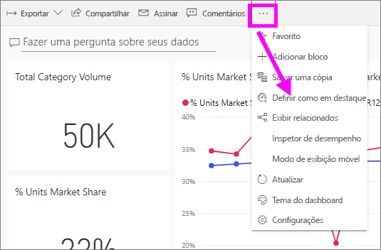
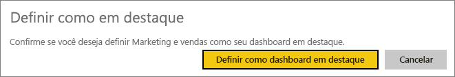
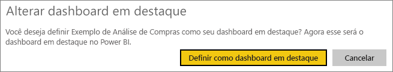
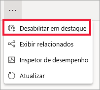

# Painéis em destaque no serviço do Power BI

[!INCLUDE [power-bi-service-new-look-include](../includes/power-bi-service-new-look-include.md)]

Muitos de nós temos um painel que é visitado mais do que qualquer outro. Pode ser o dashboard que usamos para administrar nossos negócios. Ou talvez um que contenha uma agregação de blocos de vários dashboards e relatórios diferentes.

## Criar um painel em destaque
Ao selecionar um dashboard como *em destaque*, sempre que você abrir o serviço do Power BI, ele será aberto com esse dashboard exibido. 

Você também pode selecionar alguns painéis e defini-los como favoritos. Veja [Dashboards favoritos](end-user-favorite.md).

Caso você não tenha definido um dashboard como em destaque, o Power BI será aberto no último dashboard usado ou na **Página Inicial** do Power BI. 

### Definir um dashboard como em destaque

1. Abra o dashboard que você deseja definir como em destaque. 
2. Na barra de menus superior, selecione **Mais opções** (...) e **Definir como em destaque**. 
   
    
3. Confirme a seleção.
   
    

## Alterar o painel em destaque
Se mudar de ideia mais tarde, você poderá definir um novo dashboard como o dashboard em destaque.

1. Siga as etapas 1 e 2 anteriores.
   
2. Selecione **Definir como dashboard em destaque**. Remover o destaque de um dashboard não o remove do Power BI. 
   
    

## Remover o painel em destaque
Se você decidir que não deseja nenhum dashboard definido como em destaque, aqui está como remover a definição em destaque de um dashboard.

1. Abra o dashboard em destaque no momento.
2. Na barra de menus superior, selecione **Mais opções** (...) e **Desabilitar em destaque**.

    
   
## Próximas etapas
- [Adicionar um dashboard como favorito](end-user-favorite.md)    
- Mais perguntas? Experimente a [Comunidade do Power BI](https://community.powerbi.com/).

