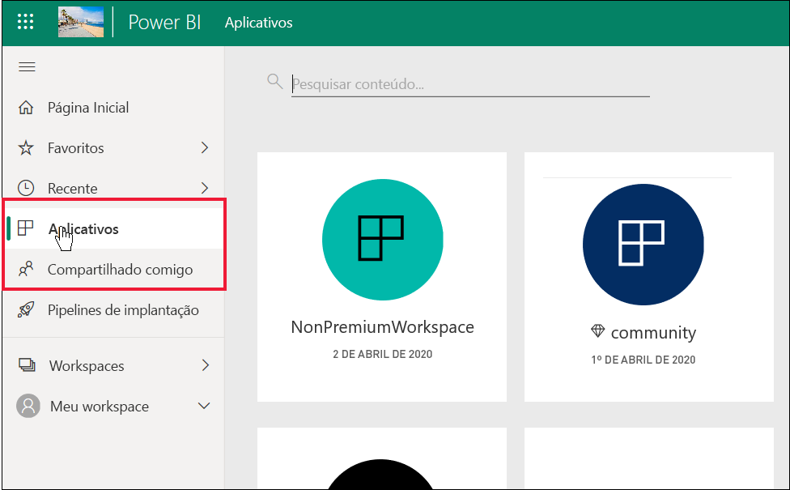
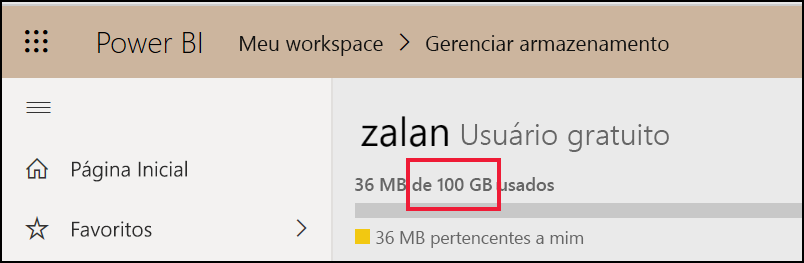
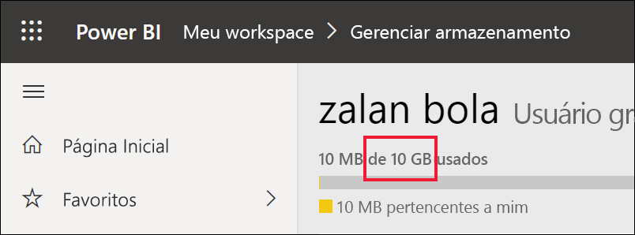

# Lista de recursos do Power BI para *consumidores* e outros com licenças gratuitas

[!INCLUDE[consumer-appliesto-ynnn](../includes/consumer-appliesto-ynnn.md)]

Como *consumidor*, você usa o serviço do Power BI para explorar relatórios e dashboards a fim de tomar decisões de negócios. Esses relatórios e esses dashboards são criados por *designers* que têm licenças *Pro* do Power BI. Os usuários Pro podem compartilhar o conteúdo com os colegas e controlar o que eles podem ou não fazer com esse conteúdo. Às vezes, os designers compartilham o conteúdo enviando links para você e, às vezes, o conteúdo é instalado automaticamente e é exibido no Power BI em **Aplicativos** ou **Compartilhado comigo**.

Há muitas maneiras diferentes que os designers podem escolher para compartilhar o conteúdo. Porém, este artigo destina-se aos *consumidores* do Power BI e, portanto, descreve apenas como os consumidores recebem o conteúdo e interagem com ele. Para obter mais informações sobre outras maneiras de compartilhar o conteúdo, confira [Maneiras de compartilhar seu trabalho no Power BI](../service-how-to-collaborate-distribute-dashboards-reports.md).

No [artigo anterior](end-user-license.md), você aprendeu que o que pode fazer com dashboards, relatórios e aplicativos (conteúdo) no serviço do Power BI depende de três coisas: suas licenças, suas funções e permissões e o local em que o conteúdo está armazenado.

Este artigo lista quais recursos do serviço do Power BI estão disponíveis para *consumidores* como você. Por definição, *consumidores* usam uma licença gratuita para trabalhar no serviço do Power BI (não no Power BI Desktop) e são membros de organizações que têm capacidade Premium.

<art>

## Revisão rápida da terminologia
Vamos examinar alguns conceitos do Power BI antes de passarmos à lista. Esta será uma revisão rápida e, se você precisar de mais detalhes, acesse [Licenças para consumidores](end-user-license.md) ou [Conceitos básicos do Power BI](end-user-basic-concepts.md).

### Workspaces e funções
Há dois tipos de workspaces: **Meu workspace** e workspaces de aplicativo. Apenas você tem acesso ao seu próprio **Meu workspace**. A colaboração e o compartilhamento exigem que os *designers* de conteúdo, que têm licenças Pro, usem um workspace de aplicativo. 

Em workspaces de aplicativo, *funções* são atribuídas pelos designers para gerenciar quem pode fazer o que nesse workspace. Os *consumidores* recebem a função **Espectador**. 

### Capacidade Premium
Quando uma organização tem uma assinatura na capacidade Premium, os administradores e os usuários Pro podem atribuir workspaces à *capacidade dedicada*. Um workspace em uma capacidade dedicada é um espaço em que os usuários Pro podem compartilhar o conteúdo e colaborar com usuários gratuitos, sem o requisito de que esses usuários tenham licenças Pro. Nesses workspaces, os usuários gratuitos têm permissões elevadas (veja a lista abaixo). 

### Licenças 
Cada usuário do serviço do Power BI tem uma licença gratuita ou uma licença Pro. Os *consumidores* têm licenças gratuitas.

- **Licença gratuita**: normalmente atribuídas aos *consumidores* de uma organização (veja a primeira imagem abaixo). Também atribuída a qualquer pessoa que se inscreva no serviço do Power BI como um indivíduo e deseje experimentar o [serviço do Power BI no modo autônomo](../service-self-service-signup-for-power-bi.md) (veja a segunda imagem abaixo). 

    

    Para os usuários gratuitos, ser membro de uma organização que tenha uma capacidade Premium é o que dá a eles superpoderes. Desde que os seus colegas Pro usem workspaces na capacidade Premium para compartilhar o conteúdo, os usuários gratuitos poderão ver o conteúdo e colaborar com eles.  **Dessa forma, o usuário gratuito torna-se um *consumidor* do Power BI, com a capacidade de receber e compartilhar o conteúdo para tomar decisões de negócios.** 
 
    

   

## Lista de recursos do Power BI para *consumidores* e usuários gratuitos
O gráfico a seguir identifica quais tarefas podem ser executadas por um *consumidor* interagindo com conteúdo na capacidade Premium e na capacidade compartilhada.    

A primeira coluna representa um usuário gratuito que trabalha com o conteúdo em **Meu workspace**. Esse usuário não pode colaborar com os colegas no serviço do Power BI. Os colegas não podem compartilhar diretamente o conteúdo com esse usuário, e esse usuário não pode compartilhar o conteúdo por meio de **Meu workspace**. 

A segunda coluna representa um *consumidor*.  Um consumidor:

- tem uma licença de usuário gratuito
- faz parte de uma organização que tem uma assinatura na capacidade Premium
- obtém o conteúdo (aplicativos, dashboards, relatórios) de usuários Pro que compartilham esse conteúdo usando workspaces de aplicativo na capacidade dedicada.
- recebeu a função **Espectador** nos workspaces de aplicativo. 

### Legenda
 o recurso está disponível no cenário atual    
 o recurso não está disponível no cenário atual    
 **** a disponibilidade do recurso é limitada ao **Meu workspace**. O conteúdo de **Meu workspace** destina-se ao uso pessoal do proprietário e não pode ser compartilhado nem visto por outras pessoas no Power BI.    
 \* o acesso a esse recurso pode ser ativado ou desativado por um usuário Pro ou um administrador.    
   

### Lista de recursos

|Recursos   | Cenário 1: o usuário gratuito do Power BI que não tem acesso ao conteúdo hospedado na capacidade dedicada.    | Cenário 2: o usuário gratuito do Power BI com permissões de **Espectador** no conteúdo armazenado na capacidade dedicada. Essa pessoa é um *consumidor* do Power BI. |
|---|---|---|
|**Aplicativos** 
|Instalação automática |  | *| 
|Abrir |  |   | 
|Favorito |  |   |
 |Editar, atualizar, compartilhar novamente, republicar |  |   |
 |Criar novo aplicativo |  |   |
 |AppSource: baixar e abrir |   | | 
|Loja da organização: baixar e abrir|  |  |
 |**Workspaces de aplicativo**
| Criar, editar ou excluir o workspace ou o conteúdo  |   | |
|Adicionar endossos |   | | 
|Abrir e ver  |   |    | 
| Ler dados armazenados em fluxo de trabalho do workspace | ||
|**Dashboards**
|Receber, ver e interagir com dashboards dos colegas |  |    | 
| Adicionar alertas aos blocos  |   |    | 
| Ver os comentários de outras pessoas e responder a eles: adicionar os próprios comentários  |   |  *  | 
| Salvar uma cópia |  | | 
|Copiar o visual como uma imagem? | ||
|Criar, editar, atualizar, excluir |  | | 
|Exportar um bloco para o Excel | | |
|Favorito || |
|Recurso | ||
|Modos de tela inteira e de foco | | |
|Pesquisa global |* |* |
|Insights sobre blocos |     | *|
|  P e R: usá-la no dashboard  |* |* |
|P e R: adicionar as perguntas em destaque e salvas |   | |
|P e R: examinar as perguntas feitas |   | |  
|Inspetor de desempenho |  | |
|Fixar blocos de R e R ou relatórios |  | | 
|Imprimir |* |* |
|Atualizar |  | | 
|Compartilhar novamente |   | | 
|Criar uma assinatura para você mesmo |* |*  |
|Criar uma assinatura para outras pessoas |   | | 
|**Conjunto de dados**
|  Adicionar, excluir, editar  |    |   |   
| Criar um relatório em outro workspace com base em um conjunto de dados nesse workspace |   | |  
|  Insights sobre conjuntos de dados  |   || 
|Agendar atualização |  || 
|**Relatórios**
|Receber relatórios de colegas |  |    | 
| Colaborar com os colegas na mesma versão de um relatório | |    | 
| Analisar um relatório no Excel  |*  |*  | 
| Ver os indicadores criados por outras pessoas e adicionar os próprios indicadores  | |  |
| Ver os comentários de outras pessoas e responder a eles: adicionar novos comentários  | |  |
|Alterar as dimensões da exibição   |  |   | 
| Salvar uma cópia | |*  
|Copiar o visual como uma imagem* |
| Aplicar realce cruzado e filtro cruzado nos visuais do relatório   | |  |
|  Drill   |  |  |
| Detalhamento |* |* |
|  Inserir (Publicar na Web, público) | * | |  
|  Exportar dados resumidos de visuais do relatório*  | | |
|Exportar dados subjacentes de visuais do relatório* |  |  | 
|  Adicionar o relatório a Favoritos  | | |
|  Filtros: alterar tipos  |* |* |
|  Filtros: interagir   || |
|  Filtros: persistentes  |* |* |
| Pesquisar um item no painel de filtro |* |* |
| Modos de tela inteira e de foco   | | |
|  Insights sobre relatórios1  |   || 
| Exibição de linhagem  | | |
|PDF: criar um com base nas páginas do relatório | |  |
|Inspetor de desempenho || |
| PowerPoint: criar um com base nas páginas do relatório*   | | |
|  Promover o conteúdo para a Página Inicial  |   | | 
| Imprimir páginas do relatório* | | |
|Interagir com um visual da P e R | | |
|Código QR | | |
|  Atualizar  | | |
|  Compartilhar conteúdo com usuários externos  |   | | 
| Compartilhar: permitir que outras pessoas compartilhem itens novamente |   | | 
|Mostrar como tabela (mostrar dados)| | |
|  Segmentações: adicionar ou excluir  | | |
| Interagir com segmentações | | |
|  Classificar os visuais do relatório  | | |
|  Assinar relatórios* | | |
|  Criar uma assinatura de relatórios para outras pessoas  |   | | 
|  Exibir relacionados | | |
|  Visuais: alterar tipos em relatórios  |* |* |
|  Alterar as interações dos visuais  |  | |
|  Visuais: adicionar novo  |  | |
|  Visuais: adicionar novos campos  |   | |
|Visuais: alterar tipo |  | |
| Visuais: posicionar o cursor neles para revelar detalhes e dicas de ferramenta  |  | |

1. Somente disponível na exibição de conteúdo **Compartilhado comigo**. 

## Próximas etapas
[Power BI para *consumidores*](end-user-consumer.md)    
