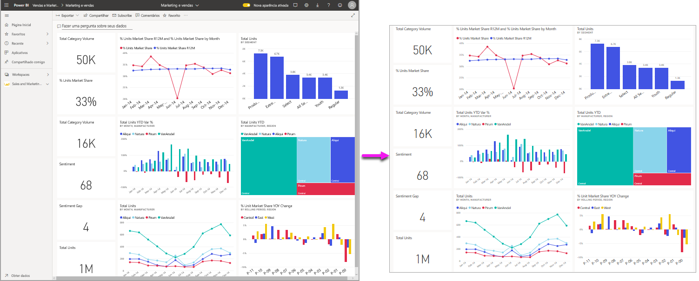
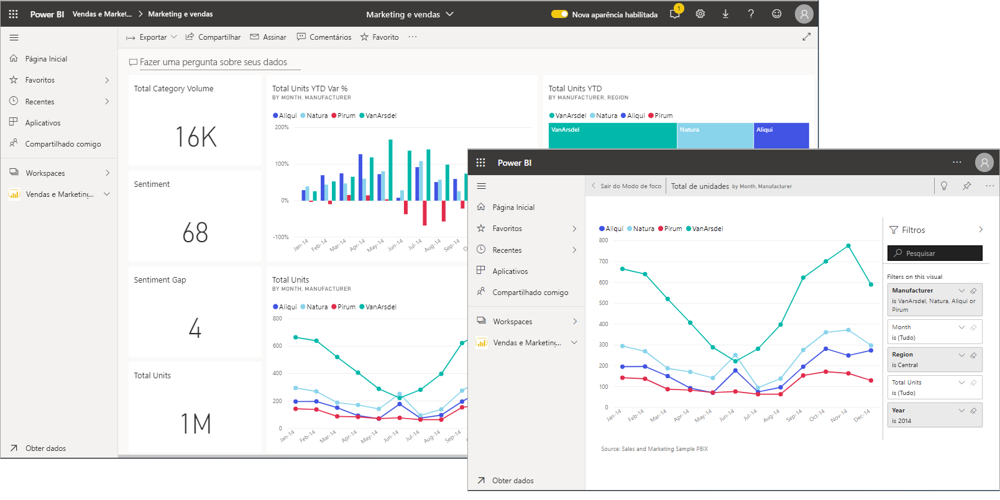
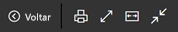
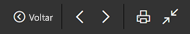
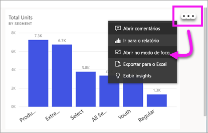
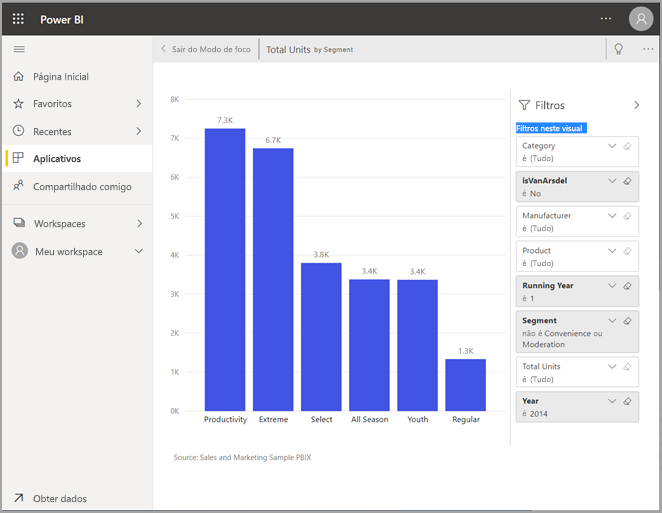
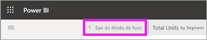
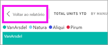

# Exibir o conteúdo em mais detalhes: modo de foco e modo de tela inteira

[!INCLUDE [consumer-appliesto-yynn](../includes/consumer-appliesto-yynn.md)]

[!INCLUDE [power-bi-service-new-look-include](../includes/power-bi-service-new-look-include.md)]    

<iframe width="560" height="315" src="https://www.youtube.com/embed/dtdLul6otYE" frameborder="0" allowfullscreen></iframe>

O modo de foco e modo de tela inteira são duas maneiras diferentes de ver mais detalhes em seus elementos visuais, relatórios e painéis.  A principal diferença é que a tela inteira remove todos os painéis que cercam seu conteúdo, enquanto o modo de foco permite que você ainda interaja com seus recursos visuais. Vamos dar uma olhada mais de perto nas semelhanças e diferenças.  

|Conteúdo    | Modo de foco  |Modo de tela inteira  |
|---------|---------|----------------------|
|Dashboard     |   Impossível     | sim |
|Página de relatório   | Impossível  | sim|
|Visual do relatório | sim    | sim |
|Bloco do painel | sim    | Impossível |
|Windows 10 Mobile | Impossível | Sim |

## O que é o modo de tela inteira?

Veja o conteúdo do serviço do Power BI (dashboards, páginas de relatório e visuais) sem a distração de menus e painéis de navegação.  Você obtém uma visão completa e não adulterada do seu conteúdo instantaneamente, o tempo todo. Isso, às vezes, é chamado de Modo de TV.   

Se você estiver usando o Power BI móvel, a [tela inteira estará disponível para aplicativos móveis do Windows 10](./mobile/mobile-windows-10-app-presentation-mode.md). 

Alguns usos para o modo de tela inteira são:

* apresentar o dashboard, o visual ou o relatório em uma reunião ou uma conferência
* exibi-lo em um escritório, em uma tela grande ou um projetor dedicado
* exibi-lo em uma tela pequena
* examinar no modo de bloqueio – você pode tocar na tela ou focalizar os blocos sem abrir o relatório ou dashboard subjacente

## O que é o modo de foco?

O modo de ***foco*** permite expandir (destacar) um visual ou bloco para ver mais detalhes.  Talvez você tenha um painel ou um relatório que seja um pouco cheio e queira ampliar apenas um visual.  Esse é um uso perfeito do modo de foco.  

Enquanto no modo de foco, um *consumidor* do Power BI pode interagir com qualquer filtro que tenha sido aplicado quando esse visual foi criado.  No serviço do Power BI, você pode usar o modo de foco em um bloco do painel ou visual do relatório.

## Trabalhar no modo de tela inteira

O modo de tela inteira está disponível para dashboards, páginas de relatório e visuais de relatório. 

- Para abrir um dashboard no modo de tela inteira, selecione o ícone de tela inteira  na barra de menus superior. 

- Para abrir uma página de relatório no modo de tela inteira, selecione **Exibir** > **Tela inteira**.

    

- Para ver um visual no modo de tela inteira, primeiro abra-o no modo de foco e, em seguida, selecione **Exibir** > **Tela inteira**.  

Seu conteúdo selecionado preenche a tela inteira.    Quando você estiver no modo de tela inteira, mover o mouse ou o cursor revela um menu contextual. Como a tela inteira está disponível para uma variedade tão ampla de conteúdo, as opções no menu contextual são um pouco diferentes, mas bastante autoexplicativas.  Basta passar o mouse sobre um ícone para uma definição.

Menu de dashboards    
    

Menu das páginas de relatório e dos visuais de relatório    
    

  *     
  Use o botão **Voltar** para navegar para a página anterior no navegador. Se a página anterior era uma página do Power BI, ela também será exibida no modo de tela inteira.  O modo de tela inteira será mantido até você sair.

  *     
  Use esse botão para imprimir o painel ou a página de relatório em modo de tela inteira.

  *     
    Use o botão **Ajustar à Tela** para exibir o dashboard no maior tamanho possível sem usar barras de rolagem.  

    

  *        
    Às vezes, você não liga para as barras de rolagem, mas quer que o dashboard preencha toda a largura do espaço disponível. Selecione o botão **Ajustar à largura**.    

    

  *        
    Em relatórios em tela inteira, use essas setas para se mover entre as páginas do relatório.    
  *      
  Para sair do modo de tela inteira, selecione o ícone **Sair da tela inteira**.

      

## Trabalhar no modo de foco

O modo de foco está disponível para blocos de dashboard e visuais de relatório. 

- Para abrir um bloco de dashboard no modo de foco, posicione o cursor sobre um bloco de dashboard ou um visual do relatório, selecione **Mais opções** (...) e **Abrir no modo de foco**.

    . 

- Para abrir um visual de relatório no modo de foco, posicione o cursor sobre o visual e selecione o ícone do **modo de foco** .  

   

O visual é aberto e preenche a tela inteira. Observe que você ainda tem um painel **Filtros** que pode ser usado para interagir com o visual. O painel **Filtros** e o painel de navegação podem ser recolhidos.

   

     

Explore mais [modificando os filtros](end-user-report-filter.md) e procurando descobertas interessantes em seus dados.  

Examine os dados em busca de novos insights e respostas a perguntas. Como um *consumidor*, você não pode adicionar novos filtros, alterar os campos que estão sendo usados nos visuais nem criar novos visuais.  No entanto, você pode interagir com os filtros existentes. 

Para um bloco de dashboard, as alterações não podem ser salvas. Para um visual de relatório, todas as modificações feitas nos filtros existentes são salvas quando você sai do Power BI. Se você não quiser que o Power BI se lembre de suas modificações, selecione **Redefinir para padrão**.   

Saia do modo de foco e retorne ao dashboard selecionando **Sair do modo de foco** ou **Voltar ao relatório** (no canto superior esquerdo do visual).

    

  

## Considerações e solução de problemas

* Ao usar o modo de foco com um visual em um relatório, é possível exibir e interagir com todos os filtros: nível de Visual, nível de Página, Detalhamento e nível de Relatório.    
* Ao usar o modo de foco com um visual em um dashboard, é possível exibir e interagir apenas com o filtro nível de visual.

## Próximas etapas

[Visualizar configurações para relatórios](end-user-report-view.md)