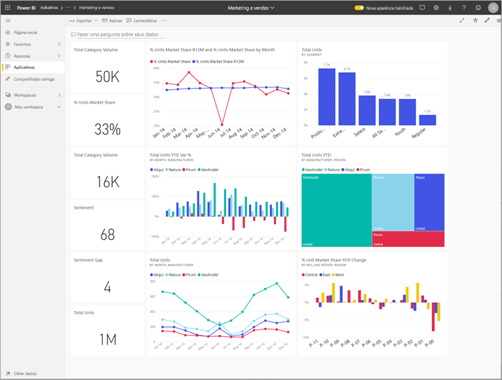
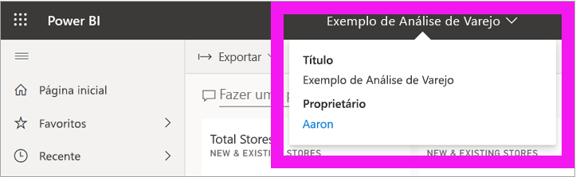
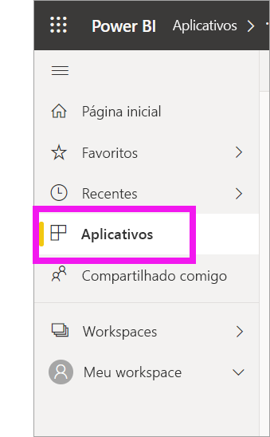
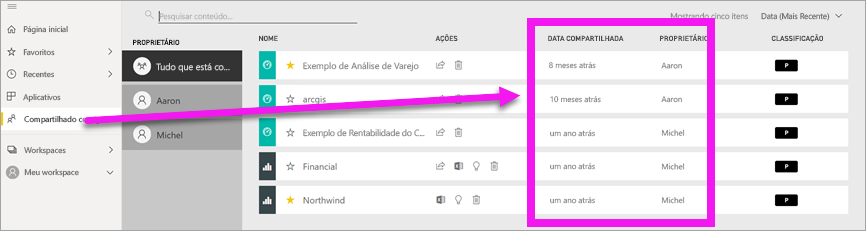
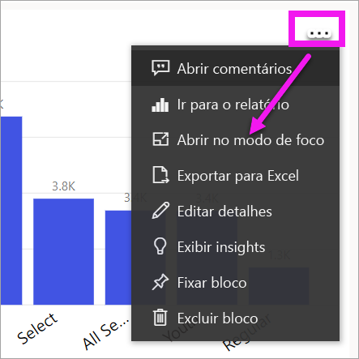
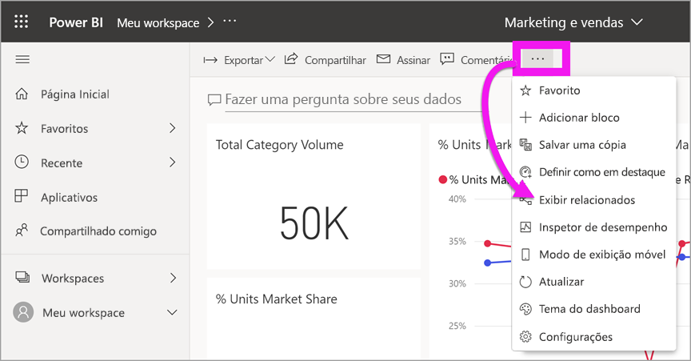
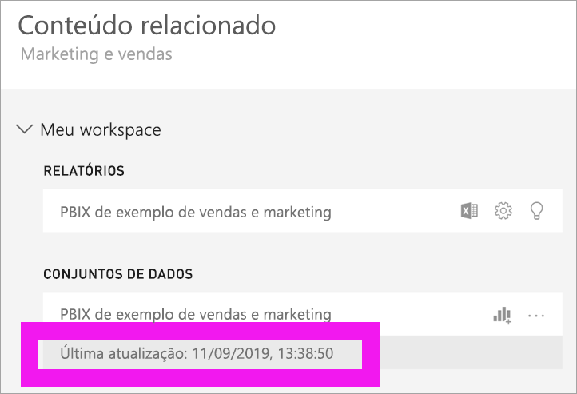

# O conteúdo está atualizado

[!INCLUDE[consumer-appliesto-ynny](../includes/consumer-appliesto-ynny.md)]

[!INCLUDE [power-bi-service-new-look-include](../includes/power-bi-service-new-look-include.md)]

Como *consumidor*, você interage com o conteúdo que é criado por *designers* e compartilhado com você. Talvez você se pergunte se o conteúdo está atualizado ou talvez só queira saber quando esse conteúdo foi atualizado pela última vez. Saber que você está trabalhando com o conteúdo mais atualizado proporciona confiança.  
 

Para tomar as decisões corretas, é fundamental ter certeza de que você está usando os dados mais recentes. O que você pode fazer para garantir que está usando o conteúdo mais recente? Em muitos casos, você não precisa fazer absolutamente nada. Os aplicativos que foram compartilhados com você são atualizados automaticamente de acordo com um agendamento definido pelo designer de aplicativo. O mesmo vale para dashboards e relatórios que foram compartilhados com você – o designer garante que o conteúdo está atualizado, manualmente ou usando um agendamento de atualização automatizado.  

Em caso de dúvidas sobre a atualização dos dados, contate o designer.

## Como localizar o nome do designer ou proprietário

### Painel ou relatório

O nome do proprietário está disponível na barra de título dos painéis e relatórios. Selecione o nome do relatório ou painel para revelar detalhes adicionais, incluindo o **Proprietário**.

### Aplicativos

A tela do aplicativo mostra o nome do designer e a data da última atualização do aplicativo.  

1. No painel de navegação, selecione **Aplicativos**.

    

2. Passe o mouse sobre o aplicativo para exibir o título, a data de atualização e o nome do designer. 

    

### Compartilhado comigo
A tela **Compartilhado comigo** mostra o nome do proprietário do conteúdo e a data em que o conteúdo foi compartilhado com você pela última vez.

 

## Como pesquisar a data da última atualização
Caso tenha interesse, você poderá pesquisar a data da última atualização da maior parte do conteúdo. 

### Blocos de dashboard
Para blocos do dashboard, exiba o bloco no modo de foco para ver o carimbo de data/hora da Última atualização.

1. Em um bloco do dashboard, selecione **Mais opções** (...) e **Abrir no modo de foco**.

    

2. A data da última atualização será exibida no canto superior direito. Se ela não estiver visível, expanda o navegador para ampliá-lo. 

    

### Painéis e relatórios
Outra maneira de pesquisar uma data de última atualização é usando a **Exibição relacionada**.  A **Exibição relacionada** está disponível selecionando **Mais opções** (...) na barra de menus superior do Power BI.

O painel **Conteúdo relacionado** exibe as informações da última atualização para o conjunto de dados subjacente do dashboard ou do relatório.

## O que acontece se um aplicativo é excluído pelo designer

Se um designer exclui um aplicativo, os dashboards e os relatórios associados a esse aplicativo são automaticamente removidos de seu workspace do Power BI. Eles não ficam mais disponíveis, e o aplicativo não é exibido no contêiner de aplicativos ou em outro lugar do painel de navegação.

## Assinar um relatório ou um dashboard para ver as alterações
Outra maneira de se manter atualizado é assinar um relatório ou um dashboard. Em vez de precisar fazer logon e abrir um relatório ou um dashboard, você instrui o Power BI a enviar um instantâneo para você de acordo com um agendamento definido.  Para obter mais informações, confira [Assinar dashboards e relatórios](end-user-subscribe.md).

## Definir alertas de dados
Deseja ser notificado caso os dados sejam alterados além de um limite definido? [Criar um alerta de dados](end-user-alerts.md).  É fácil manter-se atualizado usando alertas de dados. Com os alertas de dados, você instrui o Power BI a lhe enviar um email se um valor em um relatório passar de um limite específico.  Por exemplo, se o estoque ficar com menos de 25 unidades ou se as vendas excederem as metas.  

## Próximas etapas
[Criar um alerta de dados](end-user-alerts.md)    
[Inscrever-se em painéis e relatórios](end-user-subscribe.md)    
[Exibir o conteúdo relacionado](end-user-related.md)    
